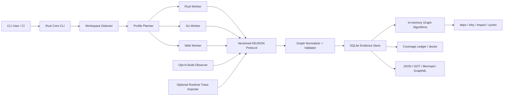

> 2026-08-01: Issue #278として、通常archiveとtarget別compiler packのversion、target、compatibilityをstable release gateで直接結合した。
> Immutableな`v0.4.0` baselineを維持したまま、pack付き`v0.4.0-rc.N`を同一workflow sourceから公開できる。
> `doctor --compiler-pack-requirement`は現在hostのpackをclosed-tree検証し、未指定、欠損、target不一致、改ざんを`unsupported-no-fallback`診断として返す。
> 診断にはasset名と取得、checksum、展開の手順を含め、READMEと`v0.4.0-rc.2` release noteにも取得からresolveまでの手順を記載した。

# アーキテクチャ設計: Semantic Dependency Graph CLI

## 実装ステータス

| Compatibility unit | Version |
| --- | --- |
| Product / Rust / Go / Web adapter | `0.4.0` |
| NDJSON protocol / graph schema | `1.0` |
| SQLite store / scan cache / impact query cache | `13` / `2` / `1` |
| Snapshot diff / policy / runtime trace / GraphML | `1.0` |
| Incremental plan / daemon status | `incremental-plan-v1` / `daemon-status-v1` |
| Worker incremental request / delta | `worker-delta-request-v1` / `worker-delta-v1` |
| Rust / Cargo baseline | `1.93.1` |
| Rust sysroot source data-tree | `rust-src-data-tree-v1` / rustc `01f6ddf7588f42ae2d7eb0a2f21d44e8e96674cf` |
| Go baseline | `1.26.1` |
| Node.js / pnpm baseline | `24.18.0` / `10.33.0` |
| Bundled TypeScript compiler | `7.0.2` |

2026-07-22 時点で Milestone 0〜1 の MVP に加え、Milestone 2 の Go semantic vertical sliceを実装済みである。Go workerは制限付き`go/packages`、`go/types`、serial SSAからsymbol/type/generic instance、`declares`、`extends`、`implements`、`instantiates`、`type_uses`、value `references`、exact `calls`、RTA/CHA candidate `may_call`と明示profileのVTA refinementをprotocol semantic graphとして出力する。reflection、unsafe、go:linkname、assembly、plugin、cgo/native callbackは専用reason・source span・profileを持つcall-graph boundary siteと相関diagnosticへ保持し、exact/candidate targetを捏造しない。これらはSQLite evidence storeへ保存され、symbol/type selector、deps/dependents/why/cycles/unresolved、JSON/DOT/Mermaid exportの対象となる。

Milestone 2のrelease candidateは`v0.2.0-rc.1`とする。5 targetのnative package gateに加え、公開直前に全archive/checksumを再取得してmanifest、SBOM、project/third-party license、worker/runtime attestationを集約検証し、結果を`release-verification.json`としてGitHub prereleaseへ添付する。機能範囲、安全境界、完全性条件、既知制約は[release note](../releases/v0.2.0-rc.1.md)をcanonicalな配布時説明とする。

Milestone 4のrelease candidateは`v0.4.0-rc.1`とする。protocol / graph schemaは`1.0`、SQLite storeは`11`、scan cache / impact query cache contractは`1`を維持し、公式`v0.2.0-rc.1`が生成したstore schema `5`からcompleted snapshotを失わずに移行する。全5 targetのnative package gateはsnapshot/diff/impact、watcher/incremental、architecture policyとGitHub annotation、packaged `runtime-collector-v1`による実fixture trace生成、runtime trace validate/import/query、GraphML stdout/atomic file exportを検証する。manifestにはcollectorを含むversioned compatibility unitと`milestone4-packaged-smoke-v1`を固定し、aggregate verifierはchecksum、archive、manifest、SBOM、project/third-party license、attestationと同じclosureで再検証する。性能結果、安全境界、migration / rollback、既知制約は[release note](../releases/v0.4.0-rc.1.md)をcanonicalな配布時説明とする。

Milestone 4のstable releaseは`v0.4.0`とする。`stable-release-gate-v1`は公式`v0.4.0-rc.1` packageが生成したschema `11` store fixtureをstable packageでschema `13`へtransactional migrationし、completed graphのintegrity、node / site / edge / evidence、immutable ID、snapshot nameの書込み、rollback backup非変更を検証する。tag workflowは`quality`、versioned 10,000-file `benchmark`、全5 target `package`、aggregate `verify-assets`の成功をdirect dependencyとし、release identity、protocol / store / cache、RC upgrade、performance、safety、framework / collector、license / SBOM / attestation closureを`stable-release-gate.json`へ`allow`または`reject`として出力する。`allow`以外ではpublish jobへ到達しない。0.4.xの互換性promise、GA exit criteria、support matrix、rollback、既知制約の更新規則は[stable release note](../releases/v0.4.0.md)をcanonical contractとする。

Issue #176でgreen確認済みのmain commit `d5ca92bae4b4fdbbedb2f3cabd4aa3ef731e7c9f`を`release-baseline-v1`として固定し、初期`release/0.4` maintenance refと`v0.4.0` tag sourceを同じexact commitへ結び付けた。canonical baseline digest、tree、再現手順、main-first cherry-pick / stable-first forward-portの観測可能な変更フロー、force-push / wholesale merge禁止は[stable release note](../releases/v0.4.0.md)に定める。mainの次版機能は既存defaultへ影響する間default無効または明示opt-inとし、breaking defaultはminor releaseとmigration contractを要求する。baseline sourceはimmutableで新しい自己検証を含められないため、default branchの`workflow_run(requested)` guardが`Release` runのtag / source SHAを照合し、mismatch時はrunをcancelしてinvalid tagを削除する。

Issue #177で`bounded-graph-query-v1`の最初の実装sliceとして、64 KiB / 4,096 token / 512 AST nodeを上限とするlexer/parserとcanonical untyped ASTを追加した。ASCII case-insensitive keyword、JSON string、canonical unsigned integer、単一linear MATCH、WHERE expression / quantifier、RETURN / ORDER BY、必須LIMIT以外を受理せず、depth、nesting、existential、list、projection上限をparse完了前にfail closedとする。query file readerはcaller-selected repository root内のUTF-8 regular fileだけをidentity / size / modified metadataのpre/post照合付きで読む。Unixではcanonical rootのdirectory descriptorから`openat / O_NOFOLLOW`で各componentを開き、Windowsではroot / parent handleをdelete-shareなしで保持してreparse pointを拒否することで、parent交換とopenのTOCTOUを閉じる。literalは`release-redaction-shapes-v1`のcredential shapeをstore access前に拒否し、全diagnosticはraw query、literal、absolute pathをechoしない。

Issue #178で`bounded-query-types-v1`のclosed type checkerを追加した。top-levelのNode / Path / Nodeと、`EVERY edge` / `SOME site` / `SOME evidence`が導入するlexical bindingを分離し、shadow / capture / unknown bindingを実行前に拒否する。34 fieldのregistryはNode / Path / Edge / Site / Evidenceのstring / unsigned integer / Boolean / nullable stringだけを公開し、arbitrary property、evidence detail、dynamic fieldを持たない。fieldとliteralのscalar/list型、operator compatibility、projection、`ORDER BY`のRETURN containment、`Path.id`のWHERE禁止を検証する。canonical typed ASTはcommutative expression、kind set、IN listを入力順に依存しない形へ固定し、contractを含むcanonical JSONから`typed-query-ast:sha256` digestを生成する。executor、public CLIは後続sliceの責務として未接続である。

Issue #179で`bounded-query-statistics-v1`、`bounded-query-plan-v1`、`bounded-query-limits-v1`を追加した。completed snapshotのclosed Node / Edge / Site / Evidenceから、全体およびkind / profile / phase別cardinality、owner別evidence上限、closed field byte上限をcanonical化し、SQLite row order、checkout path、timestamp、arbitrary property、evidence detailをgraph / metadata digest入力から除外する。typed ASTとこの検証済み統計だけからfixed operator、forward / reverse方向、endpoint pair、existential bitset / used-edge-set product state、edge / site / evidence test、serialized output、memory、exact deterministic costを上限計算する。`LIMIT`はrow / byte上限だけへ適用し、探索workを低く見積もらない。explainはnode / relationship kindを含む全string literalをbyte length / digestへredactし、全hard limit、operator別worst case、stable rejection / remediation、executionへ渡す`bounded-query-plan:sha256` digestをcanonical JSONへ固定する。executor、public CLIは後続sliceの責務として未接続である。

Issue #180で`bounded-query-result-v1`のstaged executorを追加した。admitted planとtyped AST、snapshot / graph / plan digestを再照合してから、forward / reverseのcanonical adjacencyをedge ID・next node ID順に辿る。partial stateはcurrent node / depth / existential bitset / used-edge setをdominance keyとし、同一keyだけをedge ID列・node ID列の辞書順で置換するため、異なる`SOME site/evidence`充足状態やfuture edge可用性を失わない。endpoint pairごとに最初のeligible depthからcanonical witnessを高々1件確定し、closed Node / Path / Edge / Site / Evidenceだけをprojectionする。rowはcanonical JSONまたは明示ORDER BYのUTF-8 byte順・null firstでbounded top-K stagingし、DISTINCTとLIMITを適用しても探索workを省略しない。complete resultはself-fieldを空にしたcanonical payloadから`bounded-query-result` digestを生成する。source/state/edge/site/evidence/row/output/memory、monotonic deadline、cancellationを全探索・staging・最終commit境界で検査し、超過時はpartial rowを返さない。public CLI / read-only store wiringは後続sliceの責務として未接続である。

Issue #181でpublic `depgraph query`を追加した。`--query` / `--file`をclapで排他的かつ必須にし、`--file`はcurrent repository boundary内のbounded regular file readerだけを通す。parse / credential policy / closed type checkをstore access前に完了してから、global `--store` / `--scan-id`でcurrentまたはscan由来のimmutable completed snapshot IDを解決し、storeをread-onlyで開く。`--explain`はexecutorを呼ばず同じadmission / plan digestをcanonical JSONまたはredacted human summaryへ出力する。execute JSONは`bounded-query-result-v1`そのものをcanonical key orderで出力し、humanはsnapshot / graph / plan / result digest、projection label、closed row / path / evidence、deterministic metricsを表示する。syntax / type / binding / limitはexit `2`、plan / runtime resource exhaustionはexit `1`、store / integrity failureはexit `3`、unsafe file / credential inputはexit `4`とし、zero rowはcomplete exit `0`を保つ。query / explainはwriter lock、cache、attempt row、worker、project processを使用しない。

Issue #182で`bounded-query-release-smoke-v1`を追加した。parser / type checker / planner / executorを決定論的byte mutation corpusへ通し、malformed / deep / wide / alternate-path入力がpanic、hang、prefix acceptance、partial resultを起こさないことを固定する。10,000-file benchmarkはexact-sourceのadmitted plan / canonical executionと、同じgraphに対するdepth 8 hostile planの事前拒否を計測し、plan bounds、runtime metrics、result digestを`depgraph-benchmark-report-v6`へ記録する。全5 native packageはmanifestに同一query fixtureとlanguage / type / statistics / plan / limit / result versionを固定し、SBOMとlicense inventoryへfirst-party contractとして含める。各native packageがcheckout-equivalent storeでquery / explainの同一canonical bytesを実行し、target別sidecarのplan / result / output digestをrelease asset集約とstable gateで一致検証する。fixture missing / tamper、capability version drift、sidecar output driftはfail closedである。

Issue #153として`public-readiness-v1`を採用し、repository visibilityの現行判断を`private / reject`へ固定した。public OSS化は、exact candidate commitと全ref、GitHub surface、governance tree、release closureへ結び付くsecret/history、legal/provenance、security/disclosure、governance/community、repository control、release/support、migration rehearsal、incident readinessの全gateが独立承認され、TamaT-LLC organization ownerが明示的に`allow`した場合だけ候補となる。`stable-release-gate-v1`は必要条件だがpublic readinessの十分条件ではない。visibility変更はADRやreadiness recordから自動実行せず、別途明示承認されたchange windowでのみ行う。

safe scanではcanonical root外へのsymlink readを拒否し、相対PATH・repository内toolchain・Node実行hookを除外する。Goは制限付き`go/packages`からparser fallbackへ移行する。Cargo metadataはpath-bearing inputのpreflight後、admitted manifest、lockfile、target discovery layoutだけを持つworker-owned confined mirrorに対してneutral cwdから`--frozen --offline --no-deps`で実行し、返却されたtemporary pathをinventory IDへ戻す。配布物はmanifest、MIT / Apache-2.0のproject license全文、core、schema、全worker/runtime artifact/component、backend attestationを検証し、欠損・変更・symlink・checked treeへの追加時にworker起動前にfail closedとする。project licenseはrelease manifestで個別にchecksum attestし、依存componentの権利情報を列挙する`THIRD_PARTY_LICENSES.txt`とは明確に分離する。

Rust は rust-analyzer `0.0.330`、upstream revision `8954b66d43225e62c92e8bbcc8500191b5cceb1e`、Salsa `0.26.1` のexact pin、neutral toolchain probe、Cargo read-confinement、safe multi-file project model、HIR definition / import / re-export / type-use / exact・candidate call graphを実装済みである。Issue #146 / #147ではRust `1.93.1` / rustc commit `01f6ddf7588f42ae2d7eb0a2f21d44e8e96674cf`の`rust-src`をlicensed data-treeとしてpackageし、coreがwhole-tree検証したrootだけをworkerへ渡す。workerはpinned source identityとbounded inventoryを再検証し、repository VFSとは別のlibrary SourceRootと`core` / `alloc` / `std` crate graphを構築する。standard-library definitionはattested source locationを持つcanonical `symbol` / `type`へ昇格し、`use` / `extern crate` / type-use / direct-callを`resolved / exact` site / edgeへする。project / system `rust-src`、registry source、build output、proc macro、project configはload・実行しない。

compatibleなexact toolchain / target、confined Cargo DTO、attested sysrootでは、semantic deltaをstrict validation後にsyntax graphへatomicにunionする。dependency siteは`resolved`・`candidates`・`external`・`unresolved`へ分類し、rust-analyzerのsemantic evidenceをprimary、syntax occurrenceをsupporting evidenceとして保持する。静的に一意なcallだけをexact、完全かつ有限なclosed trait / immutable local function-pointer集合だけをcandidateとし、open / incomplete dispatch、external call、macro-generated境界を過剰にexactへ昇格しない。`semantic-complete`は`syntax-complete`、exact compatible HIR、`confined-cargo-metadata`、attested 3-crate sysroot、`ready` / `import-type-call-graph-emitted`、semantic issue `0`、skipped / unsupported / candidates / external / unresolved `0`をすべて満たすprofileだけに付与する。development、sysroot mismatch / missing、unsupported targetはsyntax/local HIRを保持するが昇格しない。coreがarchive、artifact/component、backend、sysrootをattestしたarchiveだけが`release-gate-verified`をworkerへ注入する。TypeScriptはbundled-only isolated TypeScript `7.0.2`とframework completeness ledgerを用い、Web / build / runtime / snapshot / diff / impact / cache / policy各sliceは後続節のcontractに従う。

Issue #72でsnapshot create / list / show CLIとimmutable name schema v9、Issue #73でcompleted snapshot間のcanonical graph diff engine、Issue #74でfile / symbol / type / routeのrename detection、Issue #75でhuman / JSON diff CLIとfilter、Issue #76でread-only Git changed-setとbounded reverse impact query、Issue #77でsyntax / semantic / build cache keyとschema v10 storage、Issue #78でincremental invalidation plannerとtransactional replacement、Issue #79でwatcher / daemon frontendまで実装済みである。

2026-07-23のIssue #80〜#82でarchitecture policy contract、snapshot-local evaluator、public API / runtime boundary、CI annotationまで実装済みとなった。Issue #83でruntime trace v1のformat、redaction、bounded validation、snapshot matching、read-only CLI、Issue #84で永続store unionとruntime phase query/exportを実装した。

Issue #47ではTypeScript call sliceを`definition-import-type-call-graph-v2`へ進め、完全に追跡できるimmutable local `const` function-value/alias/conditional flowと、zero-argument `new Class()`だけからなるclosed finite flow（direct expressionまたはconditional）で初期化した`const` receiver flowだけを`candidates / overapprox`の`call` siteと候補ごとの`may_call` edgeへ昇格した。fresh-instanceでは各classがnon-inheriting plain class declarationであり、decorator、constructor、field、accessor、static block、other non-method memberを持たず、選択methodがdirect own methodであること、receiverのnon-declaration useが解析対象のnonoptional direct method/tag invocationの1回だけであることを証明する。candidate targetはcanonical sortし、siteとedgeのprimary evidenceへ`typescript-closed-local-call-flow-v1`または`typescript-closed-local-fresh-instance-flow-v1`を記録する。singleton candidateはexactへ昇格せず、mutable/partial flow、parameter、field、return、candidate-receiver constructor/argument、inheritance、receiver alias/property read/write/argument/return/capture/escape/second use、open/interface/overload dispatchは引き続きreason付き`unresolved`へfail closedする。

Issue #48ではpure TypeScript/JavaScript profileの最終fallback / coverage matrixを実装し、Issue #54で同じgateをframework profileへ拡張した。bundled-only isolated TypeScript `7.0.2`、worker-owned ready project model、emitted `definition-import-type-call-graph-v2`、`project_code_executed=false`、skipped / unsupported / unresolved / semantic issue / total・emitted compiler diagnosticがすべて`0`で、検出frameworkのcompleteness ledgerが全件completeの場合だけ昇格する。`candidates` / `external`は許容し、未検出frameworkのcapabilityは要求しない。compiler crash / timeout / cancelはfailed profile・exit `3`、typed late failureはsemantic deltaをatomicに破棄してsyntax graphを保持し、framework profileはbounded reason付きincompleteに留める。Issue #55ではこのWeb semantic compatibility unitをrelease manifestとworker handshakeへ固定し、抽出archiveの各framework scan/query/export、別checkout決定性、runtime fail-closed、SBOM/license closureをpackage gateへ追加した。

## 1. 目的

Rust、Go、Next.js、Astro、TanStack Router、TanStack Start のコードベースから、package、module、file、symbol、type、call、route、component、server function、asset、content、build dependency を共通の依存グラフとして抽出する CLI を設計する。

本ツールの中心価値は、単なる依存関係の可視化ではない。依存箇所ごとに、成立条件、解析根拠、解決精度、解析 profile、source span、未解決理由を保持し、変更影響や循環、アーキテクチャ違反を説明可能にする。

## 2. 背景と課題

既存ツールは、次のいずれか一層に特化することが多い。

- Cargo、Go Modules、npm workspace などの package graph
- JavaScript / TypeScript の import graph
- 特定言語の call graph
- framework 固有の route / bundle graph
- build 後に観測された artifact graph

一方、実際の変更影響はこれらの層を横断する。例えば、Next.js の route は Server Component、Client Component、Server Function、asset、environment variable に依存し、Rust の crate は feature、target、build script、proc macro によって形が変わる。単一の無条件グラフへ潰すと、依存の欠落または誤った確定が発生する。

## 3. スコープ

### 3.1 対象

- Rust
  - Cargo workspace / package / target / crate instance
  - module / import / re-export / item / type / trait / impl / call
  - feature / `cfg` / target / build dependency / build script / proc macro
- Go
  - module / workspace / package variant / file / import / symbol / type / call
  - build tags / GOOS / GOARCH / tests / generated files / cgo
- TypeScript / JavaScript
  - workspace / package locator / file / import / export / symbol / type / call
  - ESM / CommonJS / dynamic import / alias / package exports / type-only dependency
- Next.js
  - App Router / Pages Router / route handlers / metadata routes
  - layout / template / loading / error / proxy / instrumentation
  - Server / Client / Edge 境界、Server Function、route 別 asset
- Astro
  - `.astro` frontmatter / template component / island directive
  - filesystem route / endpoint / content collection / asset / integration
- TanStack Router
  - file-based / code-based / virtual route
  - generated route tree / lazy route / loader / beforeLoad / context / route mask
- TanStack Start
  - server function / client RPC stub / server route / middleware
  - client / SSR / server build environment

### 3.2 初期非対象

- 任意文字列から推測する HTTP API 間依存の自動確定
- 完全な data-flow / taint analysis
- 実行時依存の静的な完全確定
- IDE 本体や常駐 SaaS の提供
- Neo4j 等の外部 graph database を必須とする構成
- 対象 repository の build script や設定コードを無断で実行すること

OpenAPI、Protocol Buffers、GraphQL、HTTP trace、FFIを用いたcross-language
edgeは`cross-language-contract-v1`の共通identity / evidence / completeness
規約に従い、この順で後続adapterとして追加する。名称一致だけではexact edgeへ
昇格せず、generated provenance、descriptor/source map、build/runtime evidenceを
要求する。規範的な境界と1〜3日粒度の導入計画は
[`PROJ-ARC-001-ADR-003`](adr-cross-language-adapter-contract.md)に定める。

## 4. 完全性の定義

### 4.1 保証するもの

解析対象として認識したすべての dependency site を、次の `resolution_status` のいずれかへ必ず分類する。

| Status | 意味 |
| --- | --- |
| `resolved` | profile 内で単一の依存先へ解決できた |
| `candidates` | 依存先候補を有限集合または条件式で表現できた |
| `external` | repository 外部への依存であり、外部 node へ正規化した |
| `unresolved` | 依存箇所は検出したが依存先を確定または列挙できなかった |

ファイル、構文、adapter、profile のスキップも coverage ledger へ記録する。未解決 edge を除外したまま成功扱いにはしない。

### 4.2 精度の表現

`resolution_status` と別に、edge の導出精度を `precision` として持つ。

| Precision | 意味 |
| --- | --- |
| `exact` | toolchain または型解決器が当該 profile で確定した |
| `overapprox` | false negative を減らすため候補を保守的に過大近似した |
| `heuristic` | framework convention、文字列、命名等から推定した |
| `observed` | build または runtime trace で実際に観測した |

`observed` は `exact` の代替ではない。ある profile / 入力で観測されなかったことは、依存が存在しないことを意味しない。

### 4.3 完全性レベル

- `syntax-complete`: 対象構文をすべて分類した
- `semantic-complete`: 選択 profile で意味解決を完了した
- `build-observed`: 選択 profile の build graph を統合した
- `runtime-observed`: 指定 trace を統合した

CLI は scan 結果にレベルと未達理由を出力する。

## 5. 設計原則

1. **Toolchain semantics first**
   package manifest や構文を独自再実装するより、Cargo、Go toolchain、TypeScript compiler、framework 公式 hook を優先する。
2. **No silent drops**
   解決不能な dependency site も node / diagnostic / ledger として残す。
3. **Profile-preserving graph**
   feature、target、build tag、environment が異なる instance を無条件に同一 node へ潰さない。
4. **Layered evidence**
   source、semantic、build、runtime の結果を上書きせず、別 evidence layer として統合する。
5. **Safe by default**
   デフォルト scan は対象 repository の任意コードを実行しない。
6. **Explainability**
   すべての edge から、抽出器、source span、condition、profile、導出根拠を辿れるようにする。
7. **Versioned boundaries**
   言語解析器を worker として分離し、変化の速い compiler API を core から隔離する。

## 6. 全体アーキテクチャ



### 6.1 Rust Core CLI

責務は次のとおり。

- repository root と workspace の検出
- toolchain と framework version の検出
- scan profile の計画
- worker lifecycle、timeout、cancel、stdout / stderr 分離
- protocol validation と stable ID 正規化
- graph storage、query、export、snapshot、diff
- coverage ledger と exit code の決定

core は各言語の詳細な AST / HIR 型を直接保持しない。

### 6.2 Language Worker

worker は独立 process とし、versioned NDJSON を stdout へ返す。ログは stderr へ出す。

- `depgraph-rust-worker`
- `depgraph-go-worker`
- `depgraph-web-worker`

worker の crash、timeout、部分失敗は diagnostic と ledger に記録し、他 worker が生成した graph を破棄しない。

### 6.3 Adapter Protocol

初期 protocol event は次を想定する。

- `scan_started`
- `profile_declared`
- `node_upsert`
- `edge_upsert`
- `dependency_site`
- `diagnostic`
- `file_completed`
- `profile_completed`
- `scan_completed`

各 event は `protocol_version`、`scan_id`、`adapter`、`adapter_version` を必須とする。未知の optional field は無視できるが、未知の event type と必須 field 欠落は protocol error とする。

### 6.4 Worker Incremental Delta Contract

`worker-delta-v1` は protocol `1.0` の repository-complete stream と独立した
opt-in contractである。coreとworkerの双方がversion handshakeで
`worker-delta-v1`をadvertiseした場合だけdelta modeを選択し、片側が
legacy、未知version、またはcapability欠落の場合は既存のfull snapshotへ
fail closedでfallbackする。profile declarationを変更するworkspace replanも
delta v1の対象外とし、full snapshotで置換する。

delta streamは`delta_started`、以下のcanonical mutation、`delta_completed`
から成る。

- `evidence_delete`
- `edge_delete`
- `site_delete`
- `node_delete`
- `delta_node_upsert`
- `site_upsert`
- `delta_edge_upsert`
- `evidence_upsert`
- `coverage_delete`
- `coverage_upsert`

mutationは上記event種別順、各種別内ではstable key順に一意かつ連続した
`seq`で出力する。同一entity keyを1 stream内で複数回変更しない。site / edge
payloadのevidenceは空にし、evidence storeの
`owner_type + owner_id + ordinal`を独立eventで交換する。coverage keyは
aggregate、profile、fileを区別する。scopeのrepository-relative path、
package locator、profile ID、artifact node ID、adapterはsorted uniqueとし、
1 worker streamはexactly one adapterを所有する。
各mutationはこのownership closureに属することを必須とする。nodeはpath、
package locator、profile association、またはartifact ID、site / edgeはscope内
node・profile・site・evidence path、evidenceはscope内ownerまたはpath、
file / profile coverageは対応するpath / profileで照合する。aggregate coverage
のみdelta全体のconservation更新として常に許可する。

`delta_started`はexactなcurrent completed `base_snapshot_id`、
base graph digest、canonical scope、`delta_id`を固定する。`delta_id`は
contract version、base identity、scope、routing metadata / `seq`を除いた
canonical mutation payloadから
`delta:sha256:<digest>`として再計算する。`delta_completed`は同じID、
mutation count、result graph digestを持つ。stable ID形式、base一致、
mutation ordering、node / site / edge endpoint、profile、evidence ownerと
contiguous ordinal、coverage conservationを全件検証する。coverageは各record
内だけでなく、aggregate / profileのsite status countと最終graph、aggregateの
profile count・completeness intersection・file count / skipped count、
profile最大値・project-code execution・blocking reasonを相互照合する。未知
event、不正ID、scope外path、dangling reference、coverage階層矛盾、途中で
途切れたstreamを拒否し、全検証が完了するまでstore transactionへ適用しない。
従来の
`protocol-v1.golden.ndjson`をfull fallback、
`protocol-v1.delta.golden.ndjson`をdelta互換性fixtureとする。

schema v12の`incremental_deltas`はvalidated deltaのscope / event stream、
base / result graph digest、mutation count、状態をscan attemptに紐づけてdurable
stagingする。stage時とapply時の両方でexactなcurrent completed snapshotとの
base binding、canonical event、node / site / edge / evidence / coverageの参照整合性、
result graph digestを再検証する。applyはgraph mutation、stored graph digest、
prospective completed snapshot stable ID、delta状態更新を単一SQLite transactionで
確定する。失敗時はgraph変更をrollbackしてdeltaだけを`failed`へ遷移し、
cancel / process crash recoveryでは`cancelled`へ遷移する。current pointerは
通常のscan validation / promotionが成功するまで旧completed snapshotを指し続け、
terminal attemptとdelta staging rowは既存GCでcascade削除する。1-file deltaでは
対象外node / site / edge / evidence / coverageのIDとraw payloadを変更しない。

## 7. 共通 Property Graph

### 7.1 Node 種別

| Node kind | 用途 |
| --- | --- |
| `workspace` | repository 内の workspace 境界 |
| `package_instance` | version、source、package manager locator を含む package |
| `build_unit` | Rust crate instance、Go package variant、Web build environment |
| `module` | 言語上の module / package namespace |
| `file` | source、generated、config、asset file |
| `symbol` | function、method、variable、export、item |
| `type` | named type、trait、interface、type alias |
| `component` | React / Astro component |
| `route` | framework route と URL pattern |
| `server_function` | RPC boundary を持つ server function |
| `middleware` | request / route / server function middleware |
| `content` | content collection、entry、remote source |
| `asset` | image、CSS、WASM、public file、build artifact |
| `env_key` | 値を保存しない環境変数 key |
| `native_library` | cgo、Rust native link、FFI library |
| `external_system` | repository 外部で詳細未解析の対象 |
| `unknown_target` | dependency site は存在するが終点が不明な sentinel |

### 7.2 Edge 種別

| Category | Edge kind |
| --- | --- |
| Structure | `contains`, `declares`, `generated_from` |
| Package | `depends_on`, `enables_feature`, `build_depends_on` |
| Module | `imports`, `reexports`, `lazy_imports`, `side_effect_imports` |
| Type | `type_uses`, `extends`, `implements`, `bounds`, `instantiates` |
| Value | `references` |
| Call | `calls`, `may_call`, `registers` |
| UI | `renders`, `hydrates`, `client_boundary`, `server_boundary` |
| Routing | `route_entry`, `parent_route`, `loads`, `before_load`, `navigates_to`, `masks_to` |
| RPC | `rpc_call`, `client_stub_for`, `handled_by`, `uses_middleware` |
| Build | `expands`, `generates`, `links`, `emits`, `bundles` |
| Resource | `reads_env`, `reads_content`, `consumes_asset` |

edge kind は追加可能とするが、既存 kind の意味を protocol version 内で変更しない。

### 7.3 必須 Property

すべての edge は次を保持する。

```json
{
  "id": "edge:sha256:...",
  "source": "symbol:sha256:...",
  "target": "route:sha256:...",
  "kind": "route_entry",
  "site_id": "site:sha256:...",
  "phase": "semantic",
  "environment": "server",
  "profile_id": "web:production:server",
  "condition": {
    "op": "all",
    "conditions": [
      { "op": "eq", "key": "mode", "value": "production" },
      { "op": "eq", "key": "runtime", "value": "server" }
    ]
  },
  "resolution_status": "resolved",
  "precision": "exact",
  "evidence": [
    {
      "kind": "semantic",
      "extractor": "next-static-adapter",
      "extractor_version": "0.1.0",
      "path": "src/app/products/[id]/page.tsx",
      "start_line": 1,
      "start_column": 1,
      "end_line": 1,
      "end_column": 42,
      "properties": {}
    }
  ],
  "generated": false
}
```

候補が複数ある場合は、dependency site と各候補 edge を同じ `site_id` で結び、候補集合を再構成できるようにする。

### 7.4 Stable ID

stable ID は表示名ではなく、言語 resolver が返す canonical identity と package instance を基にする。

- file: repository identity + normalized relative path
- Rust item: package ID + crate instance + canonical module path + item identity
- Go object: module path + version / replace + package path + object identity
- npm symbol: package manager locator + runtime file + export / symbol identity
- route: framework + router instance + canonical route pattern + environment

local variable、anonymous function、generated wrapper 等は source span と生成元 identity を用いる。ファイル移動をまたぐ完全な ID 安定性は保証せず、snapshot diff では rename detection を別途行う。

### 7.5 Semantic Graph Contract（protocol 1.0）

protocol 1.0 の node / edge kind は open vocabulary だが、Milestone 2 の worker は次の規約を共通 contract とする。`symbol` / `type` node は通常の必須 field に加え、`properties` に以下を必須とする。

後方互換性のため、protocol 1.0 の root Schema と通常の `validate_ndjson` / `validate_safe_ndjson` は kind の open vocabulary を維持する。Milestone 2 worker は Schema の `$defs.semantic_node` / `$defs.semantic_edge` / `$defs.semantic_site` と、Rust の `validate_semantic_ndjson` / `validate_safe_semantic_ndjson` を明示的に選び、この節の追加契約を検証する。

| Node kind | 必須 property | 意味 |
| --- | --- | --- |
| `symbol` | `language`, `package_locator`, `symbol_kind`, `canonical_identity` | resolver が返した function、method、variable、export、item 等の identity |
| `type` | `language`, `package_locator`, `type_kind`, `canonical_identity` | resolver が返した named type、trait、interface、type alias 等の identity |

`package_locator` は package manager / resolver が決めた package instance identity であり、version、source、replace、peer context 等を必要に応じて含める。`canonical_identity` は node ID の hash 入力そのものを JSON object で保持し、top-level の `language`、`package_locator`、`symbol_kind` / `type_kind` と同じ値を含める。symbol identity は `identity_kind` を `named / local / anonymous / generated` から必須で選ぶ。`named` は `resolver_identity` を必須とし、それ以外は `enclosing_symbol` または `generated_from`、normalized relative path、1-origin の source span を必須とする。`local_*` と `parameter`、`anonymous_*` と `closure / lambda`、`generated_*` の予約済み `symbol_kind` は、それぞれ同名の identity category と一致させる。set として扱う配列は producer が canonical sort し、generic argument 等の順序に意味がある配列は resolver order を保持する。

```text
symbol node ID = stable_id_from_value("symbol", canonical_identity)
type node ID   = stable_id_from_value("type", canonical_identity)
```

semantic dependency site と edge は次の規約に従う。

| Edge kind | source / target | 許可する resolution | 用途 |
| --- | --- | --- | --- |
| `imports` | source: Rust `module` / `symbol`、Web `file`; target: Rust `module`またはWeb `file`、`symbol`、`type`、sentinel | `resolved`, `candidates`, `external`, `unresolved` | HIR `use` leaf、またはTypeCheckerで意味解決したWeb import |
| `reexports` | source: Rust `module`、Web `file`; target: Rust `module`またはWeb `file`、`symbol`、`type`、sentinel | `resolved`, `candidates`, `external`, `unresolved` | HIR公開`use` leaf、またはTypeCheckerで意味解決したWeb re-export |
| `type_uses` | source: `symbol` / `type`、またはWeb fallbackに限る`file`; target: `type`またはsentinel | `resolved`, `candidates`, `external`, `unresolved` | signature、field、annotation、constraint 等からの型参照。`file` sourceはWebでenclosing declarationをcanonical化できない場合だけに限定し、Rust semantic contractでは許可しない |
| `references` | source: Go `symbol`; target: `symbol`またはsentinel | `resolved`, `external`, `unresolved` | `go/types.Info.Uses` / `Selections` で解決したvariable、constant、field、first-class function/method等のvalue参照 |
| `calls` | caller `symbol` / 単一 callee `symbol` または sentinel | `resolved`, `external`, `unresolved` | static direct call または認識済みだが未解決の direct call site |
| `may_call` | caller `symbol` / 候補 callee `symbol` | `candidates` のみ | interface dispatch 等の保守的 call graph |

resolution と precision、target は次の組み合わせに固定する。

- `resolved` は concrete target 1件を指し、`precision=exact` とする。Webの`namespace_import`、`side_effect_import`、`empty_import`、`import_equals`、`require_call`、`dynamic_import`、`import_type`、`namespace_reexport`、`empty_reexport`、`export_star`はmodule-level occurrenceとしてrepository `file`をtargetにし、それ以外のnamed bindingはTypeCheckerが返したcanonical `symbol` / `type`をtargetにしてcontaining fileへ弱めない。
- `candidates` は canonical sort した concrete target 1件以上を持ち、`precision=overapprox` とする。候補が1件でも動的dispatchの一意性が証明されていなければ `resolved` へ昇格しない。call site は候補ごとの `may_call` edge、type site は候補ごとの `type_uses` edgeを生成する。
- `external` は `external_system` node 1件を指す。worker が target locator を canonical external identity として確定した場合は `exact`、境界またはspecifierだけを特定した場合は `heuristic` と申告する。Webの既知Node.js builtinは`node:*`をcanonical locatorとして`external / exact`にする。明示形`node:fs`はそのまま保持し、有効なbare形`fs` / `fs/promises` / `path`は`node:fs` / `node:fs/promises` / `node:path`へ正規化する。未知の`node:*`はunresolvedへfail closedし、builtinを`npm:*@unknown`へ変換しない。共通 validator は sentinel kind と status / precision の組み合わせを検証し、locator の言語固有な正確性は各 worker の contract test で検証する。
- `unresolved` は `unknown_target` node 1件を指し、`precision=heuristic` と非空の `reason` を必須とする。

- edge は `phase=semantic` とする。edge と dependency site の `evidence[0]` は dependency occurrence を表す primary evidence とし、`kind=semantic`、extractor、extractor version、normalized relative path、完全な source span を必須とする。site ID は常にこの primary spanから作る。追加 evidence は primary の後で canonical JSON順に並べる。Rust HIR の`rust_use` / `rust_reexport` / `type_use` / `call` siteではrust-analyzer evidenceをprimary、Webの`web_import` / `web_reexport` / `type_use` siteではTypeChecker evidenceをprimaryとし、syntax collectorが記録した同一source occurrenceをsupporting evidenceとする。Web primary evidenceはboolean `properties.type_only`を必須とし、`type_use`と`import_type`は`true`、runtime-onlyなside-effect import / `require()` / dynamic importは`false`、named / default / namespace import、`import = require()`、re-exportはsyntax markerをそのまま保持する。さらにimport / re-export occurrenceは`properties.module_specifier`、named / default / namespace binding、`import = require()`、type-useは`properties.imported_name`を保持し、site specifierと相関させる。有効なquoted empty module/export nameはmissing/computed syntaxへ変換せず空文字のまま保持し、quoted `"*"` / `"="` はnamespace / import-equals sentinelではなく通常のnamed bindingとして保持する。module specifierの`binding:` prefixは予約しない。解決できないoccurrenceはreason付きunresolvedとする。TypeScriptの`resolution-mode` attributeは宣言唯一のattributeかつ宣言全体がtype-onlyの場合（JSDoc importを含む）だけmodule provenance付きの`properties.resolution_mode=import|require`として保持する。`import = require()` の暗黙CommonJS phaseは内部resolver状態に限定し、public `resolution_mode`へは出力しない。pinned compilerがTS2880を報告するlegacy `assert` syntaxは`syntax_invalid`として保持し、workerとcoreが独立にshapeをattestする。
- 例外として、Rust collectorが認識したもののHIR deltaへ昇格できない`type_use`は、source evidenceをprimaryとする`phase=source`のfallback site / edgeとして保持できる。このfallbackは`precision=heuristic`に限定する。prelude / manifest依存は`external`、condition-compatibleな明示local型宣言・module-scope importはsource-backed `type` nodeへの`resolved / candidates`、それ以外はreason付き`unresolved`とする。`resolved / candidates` targetは必ず`type` nodeでなければならない。site / edgeのsource、condition、status、precision、primary evidence anchorを一致させ、semantic siteへのsource edgeまたはsource fallback siteへのsemantic edgeは拒否する。
- semantic `rust_use` / `web_import` siteは`imports` edge、semantic `rust_reexport` / `web_reexport` siteは`reexports` edge、`type_use` siteは`type_uses` edgeと1対1またはcandidate targetごとに結び、site / edgeのsourceとprimary evidence anchorを一致させる。Rust semantic siteとedgeのconditionは一致させる。Web source-phase runtime resolutionでconditional exportsが複数targetへ分岐する場合は、各edgeをそのtargetのbrowser / server等のbranch conditionへ絞り、site conditionを全target edge conditionのcanonical unionとする。一方、Web semantic refinementはpinned TypeScript Bundler resolverのneutral condition setだけを使い、profileのbrowser / server分岐をsemantic candidateへ持ち込まない。既存のsource phase import / re-export graphはprotocol 1.0の後方互換contractとして維持し、semantic graphで上書きしない。
- Goの`value_reference` siteは`references` edge 1件と結び、sourceは参照occurrenceを包含する`symbol`、resolved targetはrepository-owned `symbol`とする。repository外のcanonical objectは`external_system / exact`、identityを確定できないobjectはreason付き`unknown_target / heuristic`に分類する。call calleeは`call`、型名は`type_use`、package qualifierはsource import occurrenceが所有し、同一identifier occurrenceを`value_reference`へ二重計上しない。selection receiver内の独立したvalue occurrenceはこの除外対象に含めない。
- direct call は target 1件の dependency site と `calls` edge 1件で表す。
- candidate call は call site 1件につき dependency site 1件と候補ごとの `may_call` edge を生成する。全 candidate edge は同じ `site_id`、`resolution_status=candidates`、`precision=overapprox` を持つ。site と各 edge の primary evidence は、RTA、CHA、VTA 等の解析方式を非空の `evidence[0].properties.algorithm` に必須で記録する。
- Rustのfunction / associated function / inherent method / concrete trait method / generic instance / closure callは、callee identityが静的に一意な場合だけ`resolved / exact`の`calls`とする。dynamicであることを一意性の根拠に置き換えず、候補1件のclosed dispatchも`candidates / overapprox`のまま維持する。
- Rustのclosed trait dispatchは公開範囲が閉じ、全local impl targetを欠落なくcanonical化できる場合だけ`rust-analyzer-local-trait-impls-v1`候補とする。immutable local function pointerは初期化・分岐・aliasのflowを完全に追跡できる場合だけ`rust-immutable-fn-pointer-flow-v1`候補とする。open/public trait、mutable/parameter/field/return由来のfunction pointer、候補を1件でも写像できない集合は部分候補を出さず`unresolved`とする。
- declarative macro expansion内にcallがある場合は個々のgenerated callをsource callへup-mapせず、invocation spanにgeneratedな`unresolved` call boundaryを1件出力し、macro provenanceとgenerated call件数をevidenceへ保持する。callを含まないmacro invocationはcall siteを生成しない。
- site ID の canonical input は `source`、site `kind`、`profile_id`、canonical condition、normalized path、source span とする。候補 target 集合は候補増減で site identity を変えないため含めない。
- edge ID の canonical input は `site_id`、edge `kind`、`target` とする。これにより同じ site の候補を独立に追加・削除できる。
- worker は `stable_id_from_value("site", input)` と `stable_id_from_value("edge", input)` を使用する。candidate target ID は昇順にする。event は `scan_started`、`profile_declared`（ID順）、`node_upsert`（node ID順）、`dependency_site`（site ID順）、`edge_upsert`（edge ID順）、`diagnostic`（ID順）、`file_completed`（path順）、`profile_completed`（profile ID順）、`scan_completed` の順に出力する。

`crates/depgraph-protocol/tests/fixtures/protocol-v1.semantic.golden.ndjson` をこの contract の互換性 fixture とする。既存の source phase fixture は protocol 1.0 の後方互換 fixture として変更しない。

#### 7.5.1 Web framework semantic graph v1

Web framework semantic graph は protocol 1.0 の open vocabulary を狭めず、`framework-semantic-graph-v1` capability を宣言した Web profileだけがopt-inする。既存のsource-phase `route` node / `route_entry` edgeはcanonical identityを持たないlegacy vocabularyとして引き続き有効であり、semantic framework endpointとしては使用できない。

framework semantic nodeは`framework`（`next` / `astro` / `tanstack-router` / `tanstack-start`）、`package_locator`、`environment`、`profile_id`、kind固有property、`canonical_identity`を必須とする。top-level propertyはcanonical identity内の同名値と一致させる。

| Node kind | kind固有property | canonical identity追加field |
| --- | --- | --- |
| `component` | `component_kind` | `resolver_identity` |
| `route` | `route_kind` | `router_instance`, `/`から始まる`route_pattern` |
| `server_function` | `server_function_kind` | `resolver_identity` |
| `middleware` | `middleware_kind` | `resolver_identity`, `scope` |

node IDは`stable_id_from_value(node.kind, canonical_identity)`で作る。route identityはframework + package instance + router instance + canonical route pattern + environmentを含む。component / server function / middlewareは表示名やproduction RPC IDではなく、静的resolverが返したportable identityを用いる。

framework dependency siteとedgeは同じkindを使用し、semantic site 1件とtargetごとのsemantic edgeを同じ`site_id`で結ぶ。concrete endpointは次の行列に限定する。`external` / `unresolved` targetは共通contractどおり`external_system` / `unknown_target` sentinelに置き換える。

| Edge / site kind | concrete source | concrete target | `candidates` |
| --- | --- | --- | --- |
| `renders` | `component` / `route` | `component` | 可 |
| `hydrates`, `client_boundary`, `server_boundary` | `component` | `component` | 不可 |
| `route_entry` | `file` / `symbol` / `component` / `server_function` | `route` | 不可 |
| `parent_route` | `route` | `route` | 可 |
| `loads` | `component` / `route` | `file` / `symbol` / `server_function` | 可 |
| `before_load` | `route` | `symbol` / `server_function` | 可 |
| `navigates_to`, `masks_to` | `component` / `route` / `symbol` | `route` | 可 |
| `rpc_call` | `component` / `route` / `symbol` | `server_function` | 可 |
| `client_stub_for` | `symbol` | `server_function` | 不可 |
| `handled_by` | `route` / `server_function` | `symbol` | 可 |
| `uses_middleware` | `route` / `server_function` | `middleware` | 可 |

resolution / precisionは共通semantic contractと同じく、`resolved / exact`、`candidates / overapprox`、`external / exact|heuristic`、`unresolved / heuristic + reason`に固定する。candidateを許可するkindではprimary evidenceに非空の`algorithm`も必須とする。site target IDはuniqueな昇順とし、site IDはcanonical condition、kind、normalized path、profile ID、source ID、1-origin source span、edge IDはkind、site ID、target IDから作る。

primary evidenceは`kind=semantic`、完全なrelative source span、`properties.profile_id`、`framework`、`contract_version=framework-semantic-graph-v1`、`occurrence_kind`を必須とする。extractor/versionはframeworkごとに`next-static-adapter@0.1.0`、`astro-static-adapter@0.1.0`、`tanstack-router-static-adapter@0.1.0`、`tanstack-start-static-adapter@0.1.0`へ固定する。同じanchor、profile、framework、occurrence kindを持つsource supporting evidenceを最低1件付与し、それ以降のsupporting evidenceはcanonical JSON順にする。edge evidenceはsite evidenceと一致させる。

conditionは`environment`の`eq`または`in` predicateを含み、edgeのconcrete `environment`を許可しなければならない。framework siteと各edgeのconditionはcanonical化後に一致させる。異なるprofileまたはframeworkのcanonical node間をframework edgeで結ばない。

Web profileは以下を一組で宣言する。propertyの一部欠落、未知のcapability/status/extractor version、不整合なcountはcoreが拒否する。protocol 1.0の既存fixtureはsemantic capability 6 propertyすべてを省略するlegacy profileとして後方互換に扱う。

```json
{
  "web_framework_semantic_capability": "framework-semantic-graph-v1",
  "web_framework_semantic_status": "not-emitted | emitted | discarded",
  "web_framework_semantic_extractor_version": "0.1.0",
  "web_framework_semantic_node_count": "0",
  "web_framework_semantic_site_count": "0",
  "web_framework_semantic_edge_count": "0",
  "web_framework_completeness_capability": "framework-semantic-completeness-v1",
  "web_framework_completeness_status": "not-detected | complete | incomplete",
  "web_framework_completeness_issue_count": "0",
  "web_framework_completeness_ledger": "[]"
}
```

`web_framework_completeness_ledger`はcanonical JSON stringで、検出frameworkごとに`framework`、`required_capabilities`、`emitted_capabilities`、`status`、`reasons`を持つ。必須capabilityは共通の`framework-semantic-graph-v1`と`typescript-definition-import-type-call-graph-v2`に、Next.js=`next-route-component-boundary-v1`、Astro=`astro-component-render-hydration-v1`、TanStack Router=`tanstack-router-typed-route-v1`、TanStack Start=`tanstack-start-rpc-middleware-v1`を加えた3件とする。entryはframework UTF-8順、capabilityとreasonは重複なしのcanonical順とする。未検出frameworkはentryを持たず、featureなしは`not-detected`・issue count 0・空ledgerとする。検出frameworkがすべてrequired=emittedかつreasonなしの場合だけaggregate `complete`とし、それ以外は`incomplete`とする。

`not-emitted` / `discarded`は全countを0とする。workerはframeworkごとのdeltaをcloned map上で検証してからsyntax / TypeScript semantic graphへunionし、別frameworkの成功deltaを保持する。unresolved site、unsupported version、collector discard、TypeScript prerequisite failureはframework別のbounded reasonへ正規化する。coreもprofile authorization、strict protocol contract、observed count、feature/ledger一致を独立に検証する。framework deltaが失敗した場合はframework node/site/edge closureだけを破棄し、既存syntax graphとTypeScript definition/import/type/call graphを保持したうえでledgerを`core_framework_delta_discarded`付き`incomplete`へ更新する。`semantic-complete`にはaggregate `complete`に加えて従来のzero skipped / unsupported / unresolved / semantic issue / compiler diagnostic、safe execution、release gateをすべて要求するため、動的callやbuild-only boundaryはledgerがcompleteでもcoverage reasonで昇格を阻止できる。共通golden fixtureは`crates/depgraph-protocol/tests/fixtures/protocol-v1.framework-semantic.golden.ndjson`とする。

### 7.6 Cross-language Contract（将来 capability）

OpenAPI、Protocol Buffers、GraphQL、HTTP runtime correlation、FFIは
`cross-language-contract-v1`を共通contractとする。protocol 1.0のopen
vocabularyを利用できることだけではcapability成立とせず、各adapterが専用validator、
coverage ledger、golden fixture、query/store互換性を実装した場合だけ宣言できる。

共通node vocabularyは`service`、`schema`、`operation`、`message`、
`native_symbol`、relation vocabularyは`provides_operation`、
`accepts_message`、`returns_message`、`references_schema`、
`calls_operation`、`implemented_by`、`generated_from`、
`binds_native_symbol`、`provided_by_library`とする。stable identityはformat、
repository contract locator、format version、format固有canonical coordinateから
作る。operationId、language上の生成名、GraphQL executable-operation名、
demangled symbol、HTTP route label、content digestはalias/evidenceでありnode IDに
しない。

cross-language siteはtargetを確定できなくても必ず`resolved`、`candidates`、
`external`、`unresolved`へ分類する。static `exact` mappingにはdescriptor /
generator manifestまたはsource mapを必要とする。compiler/framework/linker
evidenceは`phase=build` / `precision=observed`、runtime correlationは
`phase=runtime` / `precision=observed`のまま保持し、独立したstatic proofなしに
exactへ昇格しない。
checked-in generated comment、同名、URL/path文字列、operationIdだけのmappingは
exactの根拠にしない。

safe scanはremote `$ref`、schema registry、GraphQL introspection、DNS/network、
`protoc` / generator / plugin、native library / binaryを実行・loadしない。
repository-local regular-file inputだけをbounded parserで処理し、remote inputは
redacted external identity、missing / ambiguous / dynamic targetはbounded reason付き
unresolvedとしてledgerへ残す。profileはcontract input digestと参加adapter profile
のsorted setから作り、無関係なprofileのCartesian productやbuild/runtime evidenceの
cross-profile昇格を行わない。詳細、format別capability boundary、優先順位、
security/release gateは
[`PROJ-ARC-001-ADR-003`](adr-cross-language-adapter-contract.md)を規範とする。

## 8. Profile と条件付き Graph

### 8.1 共通 Profile

profile は、解析結果を再現するための入力 snapshot である。

```yaml
id: rust:test:linux-x86_64:feature-set-a
toolchain: rustc 1.x
command: test
target: x86_64-unknown-linux-gnu
features:
  - feature-a
environment_allowlist:
  - CARGO_CFG_TARGET_OS
source_revision: <git-sha-or-worktree-hash>
```

### 8.2 Rust 条件

- Cargo command: check / build / test / bench / doc
- target triple
- feature set
- `cfg` expression
- normal / dev / build dependency
- lib / bin / example / test / bench / build-script / proc-macro target

`--all-features` は全構成の union ではなく一つの feature set として扱う。相互排他的 feature を含む可能性があるため、既定 matrix を自動的に「全組合せ」とはしない。

### 8.3 Go 条件

- module / workspace / replace 状態
- GOOS / GOARCH
- user build tags
- cgo enabled / disabled
- compiler / release tags
- normal / internal test / external test variant

build constraint は Boolean condition として保存し、単一 scan で非活性 file を削除しない。

### 8.4 Web 条件

- package manager と package locator
- development / production / test
- browser / server / edge / worker
- ESM / CommonJS と export conditions
- TypeScript `moduleResolution`
- bundler alias / virtual module / plugin
- framework version と framework config

TypeScript の `type_target` と runtime / bundler の `runtime_target` は別 edge として保持できるようにする。

### 8.5 Default profile selection（将来 planner）

default matrixは`default-profile-selection-v1`で計画する。safe inventory、
adapter/toolchain compatibility、attested Rust/Go host target、tracked profile
設定、planner limitをcanonical inputとし、absolute path、mtime、locale、iteration
order、CI/TTY、clock、過去のscanを選択入力にしない。同じinputの別checkoutは
candidate、rank、selected / omitted、reasonをbyte-identicalにする。

検出したRust / Go / Web familyのbaselineを先に1件ずつ確保し、自動候補はbaseline
からtarget、feature/tag、mode、environmentのいずれか1軸だけを変える。複数
non-default軸の組合せ、`--all-features`、cgo / VTA、build/runtime profileを自動生成
せず、明示selectionへ委ねる。cross-language capabilityはcompatibleなselected
profile setへattachし、root profile数を増やさない。

repository classとdefault total profile capは、relevant source / build unitが
ともに`tiny <= 1,000 / 25`なら`16`、`small <= 10,000 / 100`なら`10`、
`medium <= 50,000 / 500`なら`6`、それ以外の`large`は`4`とする。
selection hard capは`32`、candidate discoveryは言語ごと`256`・全体`512`である。
budgetはlower parser/worker/protocol/query limitを変更しない。

baseline後の候補はtracked declaration、未coverage dependency occurrence / file、
dimension、language、canonical profile IDの固定tupleでgreedyに選び、persisted
配列はprofile IDのUTF-8 byte順とする。budget omission、candidate overflow、
dynamic/unsupported axis、直積を作らないpolicyをcoverage / doctor / planへ固定reason
付きで残す。normal scanはselected-scope snapshotをwarning付きで完了できるが
aggregate `default_profile_matrix_complete=false`とし、`--strict`はexit `1`で
non-promotionとする。

将来`profiles plan` / `--profile-budget`はauto selectionを説明・調整し、
`--profiles-file`はstrict versioned JSONで全matrixを置換する。explicit requestは
truncate / baseline追加 / auto fallbackせず、invalid・unsupported・32件超過をworker
起動前のexit `2`とする。現行config schema v1はplanner実装まで従来の
one-selection-per-adapter契約を維持する。規範的なinput、budget、ranking、CLI、
failure、fixture、段階計画は
[`PROJ-ARC-001-ADR-004`](adr-default-profile-selection-budget.md)に定める。

## 9. Rust Adapter

### 9.1 現状と採用 backend

Milestone 1 の Rust worker は `syn` による syntax-only adapter である。path-bearing Cargo inputのpreflightとconfined mirror構築に成功し、`cargo metadata --format-version 1 --no-deps --frozen --offline` がmirrorに対して完了した場合は、inventory identityへremap済みのworkspace member、target、dependency declarationを利用する。preflight、mirror構築、command、DTO検証のいずれかが失敗した場合は、confinedなmanifest / lockfileの静的解析へfallbackする。`--no-deps` の出力は完全なresolve graphではなく、現在のfeature listもworkspace全体を決定的に近似した値である。この結果に`semantic-complete`を付与しない。

Cargoへ元repositoryのmanifest pathは渡さない。`members = ["../outside"]`、root外path dependency、ambiguous glob、symlink、未対応のpath-bearing field等をpreflightで一意にconfinedと証明できなければ、Cargoを起動しない。Cargoのraw DTOが含むmirror absolute pathと`path+file://` package IDはmetadata境界内だけで扱い、admitted inventory IDまたは元repository内のcanonical pathへ変換してからscannerへ渡す。temporary pathはprofile identity、node / site / edge、diagnostic、evidence、coverage ledgerへ残さない。このread-confinement gateとsafe HIRのmulti-file project modelは実装済みである。DTOは対応target・toolchain時にinventory source bytesと結合してanalysis databaseを構築し、HIR definition / import / re-export / type-use / call queryの結果をisolated semantic deltaとして検証・unionする。static manifest fallbackはcrate graph unavailableとしてledgerへ残し、semantic queryを実行しない。

Milestone 2 の HIR backend には、ADR-007 に従い、version を exact pin した rust-analyzer library 群を `depgraph-rust-worker` へ静的 link する方式を採用する。Rust worker 自体は core から独立 process として timeout、cancel、process-tree 停止、stdout / stderr 上限の管理下にあるため、library 統合でも core と HIR の障害境界は維持される。

2026-07-25 時点で rust-analyzer は `ra_ap_* = 0.0.330`、upstream revision `8954b66d43225e62c92e8bbcc8500191b5cceb1e`、Salsa dependency set `0.26.1` に exact pin 済みである。`0.0.331` は Rust `1.93.1` で `ra_ap_hir_ty` の unstable if-let guard をコンパイルできないため棄却した。worker には inventory 済み UTF-8 bytes を virtual `/lib.rs`、最小 `CrateGraph`、in-memory VFS へ投入する smoke scaffold、neutral toolchain probe、confined Cargo mirrorに加え、同じinventory-only境界をmulti-file VFS、workspace/path local `CrateGraph`、crate単位cfgへ拡張するsafe project modelを追加済みである。workspace discovery、repository fileのon-demand read、project / system sysroot source、project config、proc-macro library、build script、子processはload・実行しない。coreがwhole-tree検証したbundled sysrootだけを別のlibrary VFSへ投入し、`core` / `alloc` / `std`のattested crate graphを構築する。compatibleなmodelではdefinition / import / re-export / `extern crate` / type-use / call queryを実行し、localおよびbundled-sysrootのcanonical `symbol` / `type`、site-less `declares` / `extends` / `implements` / `instantiates`、canonical dependency siteとsemantic edgeをprotocol graphへ昇格する。成功profileは`analysis=syntax+hir-imports-types-calls`、`analysis_backend=static-syntax+rust-analyzer-hir`、`rust_hir_backend=rust-analyzer-hir`、`rust_hir_status=import-type-call-graph-emitted / import-type-call-graph-partial`、sysroot contract / component / layout / file・crate件数を記録する。`semantic-complete`はattested 3-crate sysroot、semantic issue `0`、skipped / unsupported / candidates / external / unresolved `0`を含むexact条件を満たすprofileに限る。source/development実行はsyntax/local HIRを保持するがsysrootをattestせず`semantic-complete`へ昇格しない。coreがarchive、backend、sysroot data-treeをattestしたpackaged実行だけは`release-gate-verified`となる。

### 9.2 方式比較

| 方式 | 安全性 / 決定性 | graph 抽出 interface | 配布 / 障害境界 | 判定 |
| --- | --- | --- | --- | --- |
| exact pin した rust-analyzer library を Rust worker へ link | worker が crate graph、`cfg`、VFS を所有し、project config 探索と子 process 起動を API 境界で排除できる | HIR / Semantics に直接アクセスし、node / site / edge と source span を同一 transaction で構築できる | 既存 Rust worker の process 隔離と checksum を再利用できる。internal API 変更に弱いため exact pin が必須 | **採用** |
| bundled `rust-analyzer` 外部 process、LSP / private command 利用 | config、Cargo、flycheck、proc-macro 起動を個別に無効化する必要がある | LSP に bulk HIR / type / call graph の安定 contract がなく、private request 依存が残る | OS / arch ごとの別 binary、checksum、handshake、子 process 監督が必要 | **棄却** |
| system / project-local `rust-analyzer` 外部 process | PATH、rustup shim、project-local binary、自動 update で version と実行コードが変化する | 入力ごとに API と挙動が変わる | release manifest で integrity を保証できない | **safe scan で禁止** |
| `syn` のみ | project code を実行せず broken source にも部分対応しやすい | compiler の name / type / trait resolution を再現できない | 現 worker 内で利用済み | **syntax inventory / fallback に限定** |

### 9.3 Safe crate graph、`cfg`、VFS 境界

HIR backend は rust-analyzer の workspace discovery、`load_cargo`、flycheck、proc-macro server、project config loader を呼び出さない。worker が次の safe input だけから analysis database を構築する。

単一file smoke scaffoldに加え、2026-07-17に以下のmulti-file project model、definition graph、import / re-export / type-use resolution、call graphのvertical sliceを実装済みである。呼出側が渡したinventory bytesだけをcanonical順のvirtual path / file IDへ登録し、confined Cargo DTOからworkspace targetとroot内path dependencyをlocal crateへ変換する。production scannerはcompatibleなmodelへdefinition / import / re-export / type-use / call queryを実行し、canonical `symbol` / `type` node、site-less `declares` / `extends` / `implements` / `instantiates` relation、canonical `rust_use` / `rust_reexport` / `type_use` / `call` siteと`imports` / `reexports` / `type_uses` / `calls` / `may_call` edgeをisolated deltaへ出力する。module-level `use` / `extern crate` alias、glob、re-export、cross-file `self` / `crate` / `super` path、declarationおよびbodyのnamed type reference、function / associated function / method / generic instance / closure / trait / function-pointer callを対象とする。statically unique targetだけをexactとし、closed traitとimmutable local function-pointerの完全な有限集合だけをcandidateにする。外部・open/incomplete dispatchはexternal/unresolved、call-bearing declarative macro expansionはinvocation spanのgenerated unresolved boundaryとして保持する。rust-analyzerによるsemantic evidenceをprimary、syntax occurrenceをsupporting evidenceとして保持し、siteを`resolved` / `candidates` / `external` / `unresolved`へ分類する。deltaはprotocol validatorを通過した場合のみnode / site / edgeとfile coverageをsyntax graphへatomicにunionし、typed failure時は全破棄してsyntax graphを保持する。Issue #263ではsemanticへ昇格できなかったtype occurrenceをsource-primary heuristic siteとして重複なく残し、prelude / manifest依存をexternal、condition-compatibleな明示local型宣言・module-scope importをsource-backed `type`へのresolved/candidates、それ以外をunresolvedへ分類する。block-local aliasはmodule indexへ漏らさない。

1. canonical scan root 内で inventory 済みの manifest、lockfile、Rust source bytes
2. Cargo がたどり得る workspace member、path dependency、`patch` / `replace` manifest path を起動前に静的検証し、すべて scan root 内の admitted file と証明できる場合に限り、worker-owned mirror、neutral cwd、`env_clear`、sanitized absolute `PATH`、`--frozen --offline --no-deps` で得てinventory identityへremapした Cargo metadata DTO
3. canonical sort / deduplicate 済みの profile target、crate ごとの edition、requested feature、worker-owned `cfg` table
4. worker が発行した VFS file ID と canonical relative path

crate graph には selected workspace target と scan root 内の path dependencyをlocal crateとして追加する。core-attested packaged profileでは、別のlibrary source rootに`core` / `alloc` / `std`を追加し、`alloc -> core`、`std -> alloc + core`をcanonical snapshotへ記録する。local crateのsysroot edgeは実効crate root属性に従い、通常crateは`std` / `core`、`#![no_std]`またはactiveな`cfg_attr(..., no_std)`は`core`、activeなroot-level `extern crate alloc/std/core`は該当crateだけを追加する。`#![no_core]`はlang item環境を安全に再構築できないためHIR modelをunsupportedとしてsyntax fallbackする。attested sysrootがない場合も同じ期待dependencyだけをexternal sentinelへ残す。registry / git dependencyとscan root外のpath dependencyもexternal sentinelとし、その定義が必要なresolutionは`external`または`unresolved`にする。HIR backendはsystem / projectのsysroot source、Cargo registry source、`target/` artifact、`rust-project.json`、`.cargo/config*`、custom target JSONをloadしない。current profileのworkspace-global feature展開をexact inputとせず、package / crateごとにfeature `cfg`を再構築する。

実装済みbuilderはeffective target edition、requested feature、dependency feature forwarding、target `required-features`、supported target table、selected scan modeとCargo target `test`状態をcrate単位のcfgへ変換する。`profiles.rust_mode`は`check`（既定）/ `build` / `test`を受け付け、testではCargoが有効化するworkspaceのlib/bin unit-test harnessを`cfg(test)`付き別crateとして追加し、dev dependencyは実際に選択されたworkspace test unitにだけ接続する。dependency-only packageのtest target/dev dependency、inactive optional/非選択target/build-only path packageはlocal crateへ昇格しない。現safe cfg profileは`debug_assertions`有効・`panic="unwind"`へ正規化し、cfgに影響するCargo `dev` / `test` custom profile overrideはtyped unsupported inputへ分類する。direct `cfg` / `cfg_attr`は`all` / `any` / 単項`not`のarityを含めて保守的に検証する。それ以外のbuilt-in attributeはshape・value・配置を属性固有に検証できるまで`unsupported_attribute`としてledger化し、generic `syn::Meta`としてparseできただけでは`semantic-complete`を許可しない。declarative/builtin/procedural macroは同名のlocal/imported macroでshadow可能なため、名前だけではbuiltinと確定しない。source inventoryは未証明のbang macroをgeneric `macro_expansion`、derive/custom attributeを`proc_macro_expansion`のunresolved境界へ残し、式として解析可能な入れ子の`include!` / `env!` / `OUT_DIR`も再帰的にledger化する。name resolutionまたは展開生成cfgを安全に完全分類できない境界はunsupported / unresolvedとして`semantic-complete`を阻止する。registry / git / root外またはmodel外path / build dependencyはdeterministic sidecar sentinelへ残し、sysroot要求はcore-attested packaged profileだけexact crateへ接続する。custom target、unsupported target kind、build script、proc-macro target、missing crate root、local dependency cycle、static manifest fallbackはtyped failureまたはdiagnostic / coverage ledgerへ分類する。VFSへ投入できるsource bytesはscannerがadmitしたrepository inventoryと、core検証済みrootからworkerがsource identity・symlink・file/byte上限・UTF-8を再検証したbundled sysroot inventoryだけである。

`rust_hir_project_model=ready`はatomicなVFS / crate graph / cfg inputの構築完了だけを意味する。definition / import / re-export / type-use / call graphの成否は`rust_hir_status=import-type-call-graph-emitted / import-type-call-graph-partial / failed`で別に表現する。Issue #29でfallback完全性判定を実装済みであり、`ready`だけでは`semantic-complete`にならない。missing module/includeはsyntax graphのunresolved siteとcoverage ledgerへ残り、完全性を阻止する。

Cargo read-confinement preflightとmirrorは実装済みである。preflightがglob、symlink、外部workspace member / path dependency、未知のCargo path-bearing keyを一意にconfinedと判定できない場合はCargo metadataを起動せず、静的manifest fallbackと`RUST_HIR_CRATE_GRAPH_UNAVAILABLE`を選ぶ。admitted manifest / lockfileとtarget auto-discoveryに必要なadmitted layoutまたはsafe placeholderだけをworker-owned temporary directoryへ複製し、Cargoにはmirror内のmanifest pathだけを渡す。既知のabsolute path-bearing fieldは対応するmirror pathへrewriteし、admitted inventoryへ一意に対応しない値はrejectする。standalone package rootにはmirror限定の空`[workspace]`境界を合成する。inventory rootにadmitted manifestがないmirrorではproject rootへvirtual guard workspaceを置き、nested workspace外のpath dependencyがCargoに拒否される場合も含め、temporary directory祖先のworkspace manifest探索をworker-owned inputで停止する。元projectの`.cargo/config*`、`rust-toolchain*`、build artifact、任意source contentsはCargo-visible inputへ追加しない。

Cargo commandはneutral cwdと`env_clear`を使用し、`HOME`、`USERPROFILE`、`CARGO_HOME`、temporary directory、`CARGO_TARGET_DIR`をworker-owned directoryへ固定する。`PATH`はscan root外のcanonical absolute directoryだけにsanitizationし、rustup proxyに必要な`RUSTUP_HOME`もscan root外のcanonical directoryに限定する。`RUSTUP_AUTO_INSTALL=0`、offline / frozen、空のcompiler wrapperを強制し、project / user Cargo config、project toolchain override、network download、project directoryへのwriteを入力へ含めない。

raw Cargo DTOはmetadata module外へ公開しない。`workspace_root`、package `manifest_path`、target `src_path`、dependency `path`はadmitted mapとの完全一致を検証してinventory IDまたは元repository内のcanonical pathへ戻す。mirror pathを含むpackage ID / workspace member IDはraw DTO内のmembership照合だけに使って破棄し、temporary `target_directory` / `build_directory`や任意metadata fieldをgraphへ伝播させない。未知、mirror外、未登録のDTO pathが1件でもあればDTO全体をrejectする。mirror directory名とabsolute pathはstable ID、profile、node / site / edge、diagnostic message / identity、evidence、file coverageの入力にしない。

rust-analyzer 側に arbitrary path を読む file loader を渡さない。`include!` 等は inventory 済みの confined file に解決できる場合だけ展開し、`OUT_DIR`、project environment、wrapper / compiler hook を注入しない。declarative macro と rust-analyzer 内の builtin macro は、追加 I/O や process を起動しない純粋な token 展開に限って利用できる。rust-analyzer / HIR phase から proc-macro dynamic library、proc-macro server、build script、Cargo check、project compilation、`RUSTC_WRAPPER`、`RUSTC_WORKSPACE_WRAPPER` を起動しない。外部 command は前段の制限済み Cargo metadata と、HIR enable gate 専用の `cargo --version --verbose` / `rustc --version --verbose` probe だけを許可する。どちらも `RUSTUP_AUTO_INSTALL=0` を必須とし、toolchain / component の download や user / project directory への write を許可しない。

`OUT_DIR` include、build script、proc macro、unverified macro expansion、unavailable external definitionはunresolvedまたはexternal dependency site、`RUST_HIR_OUT_DIR_UNAVAILABLE` / `BUILD_SCRIPT_NOT_EXECUTED` / `PROC_MACRO_NOT_EXECUTED` / `MACRO_EXPANSION_NOT_EVALUATED`等のdiagnostic、coverage reasonとして決定的にledgerへ残す。selected crate に未解決の生成出力またはmacro identityが必要な場合、HIR の一部を利用できても `semantic-complete` としない。safe scan の `project_code_executed=false` は profile / coverage / scan 全体で維持する。

### 9.4 Supported toolchain matrix

Rust の build baseline は repository、CI、doctor で固定済みの `1.93.1` とする。`Cargo.toml` の `rust-version=1.93` は MSRV declaration であり、HIR backend の exact compatibility pin の代替にはしない。rust-analyzer は必要な全 crate を同一 exact version / revision に固定し、`Cargo.lock`、worker handshake、profile metadata、release manifest へ記録する。semver range、複数 rust-analyzer revision の混在、runtime での自動選択は禁止する。

| 状態 | Rust / Cargo | edition | effective target | rust-analyzer pin | HIR 判定 |
| --- | --- | --- | --- | --- | --- |
| 現在（Issue #147 bundled sysroot exact resolution完了） | neutral probeで検証するbuild / doctor baseline `1.93.1`。project declarationもbaselineと整合し、packaged profileは同じrelease / rustc commitの`rust-src-data-tree-v1`をcoreがattest | `2015` / `2018` / `2021` / `2024` をsafe modelへ投入 | `x86_64-unknown-linux-gnu`、`aarch64-unknown-linux-gnu`、`x86_64-apple-darwin`、`aarch64-apple-darwin`、`x86_64-pc-windows-msvc` | `ra_ap_* = 0.0.330`、revision `8954b66d43225e62c92e8bbcc8500191b5cceb1e`、Salsa `0.26.1`、sysroot component `1.93.1+rustc.01f6ddf7588f42ae2d7eb0a2f21d44e8e96674cf` | confined Cargo metadataとsafe modelが成功し、`syntax-complete`、attested 3-crate sysroot、`ready` / `import-type-call-graph-emitted`、issue `0`、skipped / unsupported / candidates / external / unresolved `0`を満たす場合だけ`semantic-complete`。source/developmentは`release-gate-pending`かつsysroot unavailable、core-attested archiveだけ`release-gate-verified` |
| Package / release verifier（Issue #30、2026-07-19完了） | manifest、worker handshake、core attestationでexact compatibility unitを維持 | 同左 | 上記targetのTier 1 Linux/macOS archive E2EとWindows package smoke対象 | 現在のexact pin | 全artifact/component、backend version/revision、release-rootをsymlink含めfail closedに検証し、query/export/determinism、SBOM/license closure、benchmark gateを通過したarchiveだけをrelease-readyとする |
| 非対応 toolchain | observed version 不一致、unavailable、または project が別 version / `stable` / `beta` / `nightly` を pin | 任意 | 任意 | 選択しない | syntax-only fallback。対応を semver から推測しない |
| 非対応 input | baseline 一致 | 未対応 / malformed | custom target JSON、未検証 cross target | exact pin 済みでも選択しない | syntax-only fallback |
| crate model 不完全 | baseline 一致 | supported | supported | exact pin 済み | Cargo metadata fallback、manifest / lockfile 不正、crate-scoped feature / `cfg` 構築不能なら syntax-only fallback |

version probe は metadata と同じ system-command resolver、neutral cwd、`env_clear`、`RUSTUP_AUTO_INSTALL=0`、timeout / output 上限を使い、scan root、project `rust-toolchain*`、`.cargo/config*`、rustup override の影響を受けないことを armed fixture で証明する。Issue #262ではraw host-default observationとHIR effective toolchainを分離し、Rustupの外部toolchain storeに既に存在するexact `1.93.1` pairを`rustup which --toolchain 1.93.1`で明示解決する。選択されたrustc / Cargoは同一host・exact commit・実体SHA-256をprobe前後とconfined metadata前後で照合し、absolute pathを保存せずattestationとsemantic cache identityへ含める。fixture はnewer host、baseline未導入、mismatch、tamperの各場合にnetwork request、toolchain install、default switch、user / project directory writeが発生しないことを検証する。toolchain file はmetadataとして静的に読むだけとし、project channelのinstall / switch / downloadを依頼しない。floating channelが実行時に偶然`1.93.1`を指してもreproducible pinとみなさない。未導入時は`rustup toolchain install 1.93.1 --profile minimal --component rust-src`をdoctor / profile plan / resultへ提示する。`semantic-complete` は HIR enabled と同義ではない。`syntax-complete`、effective toolchain attestation、exact compatible HIR、`crate_graph_source=confined-cargo-metadata`、`rust_hir_project_model=ready`、`rust_hir_status=import-type-call-graph-emitted`、`rust_hir_sysroot_status=attested`、`rust_hir_sysroot_crate_count=3`、`rust_hir_semantic_issue_count=0`、`project_code_executed=false`、files skipped / unsupported syntax / candidates / external / unresolved sitesがすべて`0`の場合に限る。

### 9.5 Fallback、diagnostic、coverage

| 状態 | 挙動 | diagnostic / coverage | 終了 |
| --- | --- | --- | --- |
| Issue #147 bundled sysroot exact resolution対応 | compatibleなconfined Cargo DTOと`src` inventoryに加え、core-attested bundled sysrootだけからsafe project modelを構築し、definition / import / re-export / `extern crate` / type-use / call queryのvalidated deltaをnode / site / edge / file coverage単位でsyntax graphへatomicにunionする。static manifestまたはsysroot verification failureではexact sysroot graphを申告しない | 成功時は`analysis=syntax+hir-imports-types-calls`、`rust_hir_backend=rust-analyzer-hir`、`rust_hir_status=import-type-call-graph-emitted / import-type-call-graph-partial`、node / relation / site / call-site / issue件数、sysroot status / file / crate / contract / component / layoutを記録する。attested sysrootを含むexact完全性条件をすべて満たす場合だけ`semantic-complete`。source/developmentは`release-gate-pending`かつunattested、core-attested archiveは`release-gate-verified` | coverage / strict policyに従う。release-readyはverified archiveだけが申告する |
| toolchain / edition / target が matrix 外 | HIR を起動せず syntax graph を保持 | `RUST_HIR_TOOLCHAIN_UNSUPPORTED` または `RUST_HIR_INPUT_UNSUPPORTED`、reason `rust-hir-unsupported` | non-strict は継続。`semantic-complete` なし |
| Cargo preflight 非適合 / mirror構築失敗 / safe Cargo metadataまたはDTO remap失敗 / static manifest fallback | preflight非適合ではCargoを起動せず、それ以外もraw DTOを採用しない。HIR crate graphを作らず、static manifest inventory、syntax graph、file ledgerを保持 | `CARGO_METADATA_FALLBACK` + `RUST_HIR_CRATE_GRAPH_UNAVAILABLE`、reason `rust-hir-crate-graph-unavailable`。pathはinventory-relative、reasonはstable categoryとし、temporary pathやraw Cargo stderrを含めない | non-strictは継続。`semantic-complete`なし |
| external crate定義またはunattested sysrootが必要 | bundled sysrootがattestedなら`std` / `core` / `alloc`をexact nodeへ解決する。それ以外はsentinelで`external`またはunknown targetで`unresolved` | external dependencyは`RUST_HIR_EXTERNAL_DEFINITION_UNAVAILABLE`、sysroot failureは`RUST_HIR_SYSROOT_UNAVAILABLE`、該当siteとreasonをledgerへ記録 | syntax/local HIRは継続するが、candidate / external / unresolvedのいずれか、またはunattested sysrootがあれば`semantic-complete`なし |
| `OUT_DIR` / build script / proc macro 出力が必要 | 生成物を読まず、実行 / dynamic library loadをせず影響siteをunresolvedにする | `RUST_HIR_OUT_DIR_UNAVAILABLE` / `BUILD_SCRIPT_NOT_EXECUTED` / `PROC_MACRO_NOT_EXECUTED`、`project_code_executed=false`をledgerへ記録 | 継続。`semantic-complete`なし |
| macro/derive identityをbuiltin/non-proceduralと証明できない | name-only判定をせず、bang macroはgeneric expansion、derive/custom attributeはproc-macro候補のunresolved siteとして残す。解析可能なnested macro引数も再帰inventoryする | `MACRO_EXPANSION_NOT_EVALUATED` / `PROC_MACRO_EXPANSION_NOT_EXECUTED`、reason `macro-expansion-not-evaluated` / `proc-macro-expansion-not-executed` | 継続。`semantic-complete`なし |
| HIR が typed recoverable error を返す | そのprofileのsemantic node / site / edge / file-ledger deltaをatomicに全破棄し、syntax graphを保持 | `RUST_HIR_BACKEND_FAILURE`、reason `rust-hir-backend-failure` | strict policyは必ず違反しexit `1`。non-strictはsyntax graphを保持して継続 |
| HIR の panic / OOM、worker timeout / cancel、malformed protocol | 同一 process 内で syntax success へ格下げず Rust worker を失敗とする | core `worker-failure`、Rust profile incomplete。他 worker の graph は保持 | scan `partial`、exit `3` |
| packaged Rust worker が missing / checksum不一致 | development worker、system / project rust-analyzer、syntax-only へ fallback しない | 現行 core `security-policy` | `security_failed`、exit `4` |
| packaged Rust worker の protocol / adapter / backend version不一致、release-rootまたはartifact/component内symlink、executable-tree/data-tree不整合 | manifest、全artifact/component、Rust backend attestationをworker起動前に検証し、development/project/system backendまたはsysrootへfallbackしない | Issue #30 verifier/schema contract test | `security_failed`、exit `4` |

現在のprofileはoutcomeに応じてdefinition / import / re-export / `extern crate` / type-use / call backendの実行事実を記録する。成功時は`analysis=syntax+hir-imports-types-calls`、`analysis_backend=static-syntax+rust-analyzer-hir`、`rust_hir_backend=rust-analyzer-hir`、`rust_hir_status=import-type-call-graph-emitted / import-type-call-graph-partial`、`rust_hir_semantic_node_count`、`rust_hir_semantic_relation_count`、`rust_hir_semantic_site_count`、`rust_hir_semantic_call_site_count`、`rust_hir_semantic_issue_count`を記録する。toolchainはraw hostを`rust_toolchain_observed`、effective selectionを`rust_hir_toolchain_selection`、release / commit / host / digestを`rust_hir_toolchain_attestation`、不成立時のactionを`rust_hir_toolchain_remediation`へ分離する。sysrootは`rust_hir_sysroot_status`、file / crate count、`rust_hir_sysroot_contract_version=rust-src-data-tree-v1`、component version、source layoutを常に記録する。`rust_hir_enable_gate`はsource/development成功時に`release-gate-pending`、coreがpackaged manifest・artifact/component・backend・sysroot data-treeを検証して起動したworkerでは`release-gate-verified`となる。typed recoverable failure時はsemantic deltaをatomicに破棄し、`rust_hir_status=failed`、`rust_hir_enable_gate=semantic-backend-failure`、`RUST_HIR_BACKEND_FAILURE`を記録してsyntax graphを保持し、strict policyを必ず失敗させる。backendを起動しないfallbackでは`analysis=syntax`、`analysis_backend=static-syntax`、`rust_hir_backend=disabled`、`rust_hir_status=not-invoked`を維持する。

全経路で`rust_hir_scaffold=available`、`rust_hir_project_model=ready / unavailable / unsupported / not-invoked`、safe VFS / local crate / external sentinelの件数、`rust_mode=check / build / test`、`rust_hir_cfg_profile=debug-unwind`、`crate_graph_source=confined-cargo-metadata / static-manifest-fallback / none`、`rust_analyzer_version=0.0.330`、`rust_analyzer_revision=8954b66d43225e62c92e8bbcc8500191b5cceb1e`、`rust_analyzer_salsa_version=0.26.1`、`cargo_metadata_input=confined-mirror`、`crate_graph_source_policy=confined-cargo-metadata-or-static-manifest`、raw system probeの`rust_toolchain_probe_status`、project declarationを合成した`rust_hir_toolchain_status`、`rust_toolchain_declaration_status`、sanitizedな`rust_toolchain_observed`をmachine-readable propertyとして記録する。malformed、読取不能、scan root外へ解決する`rust-toolchain*`は`invalid`としてfail-closedに扱う。mirror root、mirror manifest path、temporary Cargo home / target directoryはprofile propertyまたはprofile IDへ含めない。

`semantic-complete` profileもexact pinを示す`rust_analyzer_revision`、`rust_toolchain_baseline=1.93.1`、`rust_toolchain_observed`、`crate_graph_source=confined-cargo-metadata`、attested sysroot identity、`proc_macro_expansion=disabled`、`build_scripts_executed=false`、`proc_macros_executed=false`を維持する。Issue #147で完全性条件をattested sysrootとcandidate / external `0`まで強化した。`release-gate-pending`はdevelopment claimに留まり、release-readyの宣言はcore attestation後の`release-gate-verified` profileに限る。

### 9.6 Version pin、更新、release 要件

rust-analyzer は internal API を安定 contract とみなさない。導入 / 更新は次の atomic 手順で行う。

現在の検証済み compatibility unit は Rust / Cargo `1.93.1`、`ra_ap_* = 0.0.330`、revision `8954b66d43225e62c92e8bbcc8500191b5cceb1e`、Salsa `0.26.1` である。`0.0.331` は baseline compiler で build できなかったため、この unit へ昇格していない。

1. Rust `1.93.1` で build できる rust-analyzer candidate を選び、利用する全 crate を exact `=` version または単一 commit revision に固定する。candidate の number / revision は検証開始時にはじめて設計書へ記録する。
2. `Cargo.lock`、backend constant、worker `--version` handshake、profile metadata、supported matrix を同一 PR で更新する。rust-analyzer crate の duplicate revision を CI で拒否する。
3. edition 2015 / 2018 / 2021 / 2024、feature / target-specific dependency、workspace / path dependency、broken / newer syntax、external dependency、build script、proc macro、malicious `.cargo/config` / wrapper、metadata fallback の golden / safety fixture を実行する。2回 scan の node / site / edge / coverage と source span の決定性も比較する。
4. Tier 1 の macOS / Linux、Tier 2 の Windows package matrix で build、test、worker handshake、benchmark を実行し、SBOM / third-party license inventory を再生成する。新しい組合せはすべての gate 通過後だけ supported へ追加する。
5. Rust baseline と rust-analyzer pin を独立に更新しない。regression 時は両者と lockfile / matrix を前回検証済みの組合せへ atomic rollback する。

library 群は Rust worker binary に静的 link するため、release archive へ別の rust-analyzer executable を同梱しない。release manifest の Rust worker SHA-256 が backend code も一緒に保護する。実装済みpackage gateはmanifestとworker handshakeに記録したbackend kind / version / revision、protocol / schema / targetをcore attestationと一致させ、Cargo dependency graphの完全な`ra_ap_*` / Salsa closureをSPDX SBOMとlicense inventoryへ含める。Web workerは同様にTypeScript `7.0.2`、全versioned semantic capability、`astro-parser-wasm@4.0.0`と`typescript-native-compiler@7.0.2`のruntime component identityをmanifestへ記録し、`--version` handshakeのTypeScript/capability unitと一致させる。全artifact/componentのmissing / added tree entry / tampering / symlink / version mismatchはworker起動前にfail closedとする。

Issue #146でRust `1.93.1` / rustc commit `01f6ddf7588f42ae2d7eb0a2f21d44e8e96674cf`の`rust-src` library treeを`rust-src-data-tree-v1`としてrelease同梱した。`rust-stdlib-source@1.93.1+rustc.01f6ddf7588f42ae2d7eb0a2f21d44e8e96674cf`を`libexec/rust-sysroot`へ正規化し、license expression、COPYRIGHT / license本文、source identity、SBOM package、canonical whole-tree SHA-256 `cc5465ef70b933d2a80c30472468abb9f8ab297fc767bd6433b2f6f554f4f0e7`をmanifestのcompatibility unitへ固定する。package時は同じrelease / commitを報告する`rustc`のrustup `rust-src`だけを受け入れ、manifest生成前にこの既知digestと照合し、欠落・ローカル変更時にdownloadやsystem / project source探索を行わない。全target archiveは同一tree digestをattestし、missing / added / tampering / symlink / toolchain mismatch時にworker起動前のexit `4`でfail closedする。

Issue #147でcoreが検証済みcomponent rootを`DEPGRAPH_RUST_SYSROOT_ROOT`としてverified Rust workerだけへ渡す実装を追加した。workerは`release-gate-verified`との組合せ以外を拒否し、`SOURCE.json`をtoolchain release / rustc commit / component / layout / licenseのexact compatibility unitへ再照合する。`library`、`core`、`alloc`、`std`以下のsymlink / special entry / non-UTF-8、4096 file / 64 MiB上限、必須crate rootを検証し、canonical順のinventoryをvirtual `/rust-sysroot/library/...`へ投入する。local inventoryとlibrary inventoryは別SourceRootとし、source snapshotにはstable file ID / path / SHA-256、crate snapshotには`core`、`alloc -> core`、`std -> alloc + core`およびcrate root属性に一致するlocal dependency edgeを残す。通常crate、`no_std`、activeな`cfg_attr`、明示`extern crate`を区別し、`no_core`はunsupportedとしてfail closedする。semantic extractorはattested source locationを持つstandard-library definitionだけを`bundled_sysroot=true`、`external=false`のcanonical symbol/typeへ昇格し、import / `extern crate` / type-use / direct-callを`resolved / exact` edgeへする。identity mismatch、missing tree、development実行、unsupported targetではsystem / project `rust-src`へfallbackせずsyntax/local HIRを保持し、sysroot status / reasonをcoverageへ残して`semantic-complete`へ昇格しない。

### 9.7 後続 HIR 実装の分割

| 後続 task | 期間 | 主な完了条件 | 前提 |
| --- | --- | --- | --- |
| RA pin と toolchain probe / in-memory VFS scaffold（2026-07-17 完了） | 1〜2日 | `0.0.330` / revision `8954b66d43225e62c92e8bbcc8500191b5cceb1e` / Salsa `0.26.1` の exact dependency、backend metadata / handshake、neutral version probe、inventory bytes だけを読む smoke test。HIR は graph に昇格しない | なし |
| Cargo read-confinement preflight / mirror（2026-07-17 完了） | 1〜2日 | 外部 member / path / symlink / glob / 未知fieldを起動前にrejectし、manifest / lockfile / target layoutのCargo-visible mirror、neutral environment、absolute path rewrite、raw DTOのinventory remap、temporary path非漏洩を検証する。HIRはgraphに昇格しない | なし |
| Safe crate graph / per-crate `cfg` builder（2026-07-17 完了） | 2〜3日 | inventory-only virtual VFS、workspace/path local crate、edition、crate-scoped feature、supported target、test cfgをanalysis databaseへ投入。external / sysrootはsidecar sentinel、custom target / build script / proc macro / static fallback / incomplete inputはdiagnostic・coverage ledgerへ分類。semantic query/eventは実行しない | RA scaffold + Cargo confinement |
| HIR definition graph vertical slice（Issue #26、2026-07-17 完了） | 2〜3日 | canonical `symbol` / `type`、semantic source evidence、site-less `declares` / `extends` / `implements` / `instantiates`をvalidated deltaとしてsyntax graphへatomic union。import / type-use / callは含めず`semantic-complete`なし | crate graph builder |
| HIR import / re-export / type-use resolution（Issue #27、2026-07-17 完了） | 2〜3日 | canonical `rust_use` / `rust_reexport` / `type_use` siteと`imports` / `reexports` / `type_uses` edge、declaration/body type reference、`resolved` / `candidates` / `external` / `unresolved`分類、semantic primary evidence + source supporting evidence、未refine occurrenceのsource fallback、validated deltaのatomic union | definition graph slice |
| HIR direct/candidate-call resolution（Issue #28、2026-07-17 完了） | 2〜3日 | function / associated function / method / generic instance / closureのexact `calls`、closed trait / immutable local function pointerのcandidate `may_call`、external / unresolved、macro provenance、canonical condition / evidence / ordering | import / type-use slice |
| Final fallback / coverage / semantic-complete matrix（Issue #29、2026-07-17 完了） | 1〜2日 | unsupported toolchain / input、metadata failure、broken source、`OUT_DIR` / proc macro / build script / external ledger、typed failureのatomic discardとstrict違反、worker failureのpartial exit `3`、反復scan / 別checkoutの決定性を検証。exact完全性条件を満たす場合だけ`semantic-complete` | import / type-use + call slice |
| Release schema / package E2E（Issue #30、2026-07-19完了） | 2〜3日 | worker/backend attestation、全artifact/componentとsymlinkのfail-closed、executable-tree/data-tree schema / verifier、抽出archiveのquery / export / determinism、Tier 1 Linux/macOSとWindows package、完全なSBOM / license closure、benchmark gateを検証。developmentは`release-gate-pending`、core-attested archiveだけ`release-gate-verified` | 上記すべて |
| Rust sysroot / rust-src data-tree package contract（Issue #146、2026-07-25完了） | 1〜2日 | Rust baseline / commitと一致するrustup `rust-src`のみを正規化し、license / SBOM / source identity / whole-tree digestをattest。全5 targetで同一treeを要求し、missing / added / tamper / symlink / toolchain mismatchをfail closedに検証 | Release schema / package E2E |
| Bundled sysroot exact resolution（Issue #147、2026-07-25完了） | 1〜2日 | core-verified treeだけをbounded inventory / separate library VFS / attested `core`・`alloc`・`std` crate graphへ投入し、standard-library symbol / type / import / `extern crate` / type-use / direct-callをexact化。mismatch / missing / unsupported targetはsyntax fallback、coverage reason、semantic-complete非昇格とし、2 scan / JSON / DOT / Mermaid determinismをpackaged E2Eで検証 | Rust sysroot data-tree package contract |
| Syntax fallback resolution / diagnostic aggregation（Issue #263、2026-07-30完了） | 1〜2日 | prelude / manifest依存をexternal/heuristic、condition-compatibleな明示local型宣言・module-scope importをsource-backed typeへのresolved/heuristicとして分類し、それ以外をHIR必須またはmacro実行必須として全site/span付きで保持する。同一原因warningは各siteの安定group参照、全site集合のcount/digest、bounded path count/digest、最大5件の代表ID/evidenceを持つ1 diagnosticへ集約し、human/JSON summaryとstrict失敗を維持する | Final fallback matrix |

### 9.8 Compiler-precise Scan

rust-analyzer HIR backend と compiler-precise backend は別の意思決定とする。HIR safe scan は project の compiler / build hook を実行しない。compiler-precise backendの規範的な脅威モデル、採用・却下案、compatibility unit、security review gate、段階実装とacceptance matrixは[`PROJ-ARC-001-ADR-002`](adr-rust-compiler-precise-backend.md)に定める。

採用contractは`compiler-precise-rust-v1`である。最初のcompatibility unitを`nightly-2026-07-17`、Rust / Cargo `1.99.0-nightly`、rustc commit `3d50c25bc66853bf0ad205529d0f305a1d841b5e`へexact pinする。通常archiveとは分離したtarget別compiler packに`cargo`、`rustc`、`rust-std`、`rust-src`、`rustc-dev`、`llvm-tools`、全unit用compiler wrapper、closed-tree manifest、checksum、SPDX SBOM、license inventoryを同梱し、coreがproject code起動前とprocess tree停止後に全treeをattestする。`rustup` download、rolling nightly、system / project toolchain、既存`rmeta` / `rlib` / incremental artifactへのfallbackは禁止する。

将来の明示selectorは`resolve --build PATH --allow-project-code --rust-compiler-precise`とし、既存の3条件をすべて同一呼出しで要求する。flag実装前の`resolve --build --allow-project-code`は現行build observationだけを行い、compiler queryを暗黙有効化しない。実行は既存supervisorのrun固有workspace、process tree、`env_clear`、timeout / cancel、network policy、bounded output、atomic attempt内に限定する。Cargo unit graph v1と実際のwrapper invocationを1対1で照合し、`rustc_public`を優先しつつ不足するmonomorphized queryだけをreview済みの最小`rustc_private` bridgeで取得する。compiler内部typeはchild内でboundedな`depgraph-rust-compiler-precise-v1` DTOへ変換し、core processへ持ち込まない。

build script / proc macroはcompiler processを侵害し得るため、wrapper outputもuntrustedとしてschema、path、count、digest、unit conservationをparentで再検証する。typed MIR / monomorphized item graphは`phase=build`、`precision=observed`の別profile evidenceとしてsafe HIR graphへatomic unionし、safe evidenceを上書きしない。pack mismatch、unit欠落、project wrapper注入、artifact escape、ICE / crash / timeout / cancel、unknown schema、coverage不一致はattempt全体を破棄し、直前completed snapshotを維持する。別toolchainへのretryやsafe graphをcompiler-precise成功として返すfallbackは行わない。

Issue #249で`compiler-pack-five-target-release-v1`を実装した。
Linux x86-64とARM64、macOS IntelとApple Silicon、Windows x86-64のnative jobは通常archiveと分離したcompiler packを構築し、archive展開、closed-tree、wrapper / query handshake、semantic fixture、別checkout決定性、resource budget、SBOM / license / provenance、tamper / rollbackを検証する。
aggregate verifierは五つのpackが同じcontract、toolchain、rustc commit、schema、query capability、no-fallback policyを持つことを要求し、stable release gateへ独立したreportを渡す。
release compatibilityとdoctorはtarget matrixと`separate-target-specific-first-party-archive`を公開するため、pack欠損またはunsupported targetを通常archiveや別backendで補完しない。

## 10. Go Adapter

### 10.1 Package / Type Scan（Go vertical slice実装済み）

1. worker runtimeのGo version、GOOS、GOARCH、強制された`CGO_ENABLED=0`、設定済みbuild tagsをprofileへ記録し、`go.mod` / `go.work`は静的にparseする。検証baselineはGo 1.26.1であり、差異はbest-effort diagnosticとする。
2. offline/read-only、telemetry/cgo/external driver無効、公式`x/mod`検証、repository symlink事前拒否の制約下で`go/packages.Load`を実行する。module全体のtyped loadが不完全な場合、そのmoduleのtyped結果を破棄し、parser inventoryを維持する。独立して成功したmoduleのsemantic結果は保持できる。
3. retained ASTと`go/types.Info`からnamed/local symbol、method、closure、package initializer、named type、generic function/type instanceを生成する。
4. semantic relationとして`declares`、`extends`、`implements`、`instantiates`、dependency siteを持つ`type_uses`を生成する。`go/types.Info.Uses` / `Selections`で解決したvalue occurrenceは`value_reference` site / `references` edgeとし、call/type-use/importとの所有規則で重複を除外する。
5. named objectはresolver identity、local objectはenclosing symbolとrepository-relative source spanをcanonical identityへ含める。absolute checkout rootはsemantic identityへ含めない。

### 10.2 Call Graph（Go vertical slice実装済み）

- `go/types`で静的に解決できるfunction、method、closure、generic instanceは`calls / resolved / exact`とする。
- builtinおよびworkspace外functionは`calls / external / exact`とする。
- type conversionはcall siteとして計上しない。
- interface dispatchとfunction-value dispatchは`InstantiateGenerics | BuildSerially`のSSAで解析する。
- completeなmain/test programでRTA到達可能なsiteはRTAを使用する。
- library、dependency bodyが不完全なprogram、RTAで到達しないsiteはCHAへfallbackする。
- candidate callはsiteを`candidates / overapprox`とし、候補ごとに`may_call` edgeを生成する。候補が1件でもexactへ昇格しない。
- `profiles.go_call_graph`は`rta-cha`（既定）または`vta`を受け付ける。VTAはworker-pinned `golang.org/x/tools/go/callgraph/vta@v0.48.0`を使い、明示profileでのみ、complete dependency body、`InstantiateGenerics`、serial SSAを前提としてsoundなCHA graphをrefineする。既定profile IDとcandidate topologyは維持し、VTA opt-inはprofile identityへ含める。
- VTA construction失敗、不完全program、site欠落、空candidate setは既存RTA/CHAへ明示fallbackする。canonical symbolへ写像できないcandidateが1件でもあれば部分集合を出さずunresolvedとする。profileはrequested/effective algorithm、prerequisite、status、fallback reason/countを、site/edge primary evidenceはrequested/effective algorithm、fallback reason、canonical candidate countを保持する。

`reflect.Value.Call` / `CallSlice`はそれぞれ専用の`reflection_call_target_boundary` / `reflection_call_slice_target_boundary` reasonを持つunresolved callとし、`MethodByName` / `FieldByName` / `MakeFunc`は既知APIへのexact external callを維持しつつruntime target境界をprimary evidenceへ注記する。`unsafe` / `plugin` import、`go:linkname`、bodyless Go declaration、Plan 9 assembly `TEXT` declaration、cgo import/directive/library/header、`//export` callbackもparser inventoryからboundary siteへ昇格する。unresolved境界は`unknown_target`だけを指し、native境界は`native-toolchain:` / `native-library:` / `native-header:` / `native-callback:` sentinelへ正規化する。各siteは同一profile・span・reason・`site_id`を持つ`go_callgraph_limit` diagnosticと1対1で相関し、profileの`go_callgraph_boundary_*` propertyがkind別件数と完全性policyを集約する。SSA build失敗、dependency body不足、repository symbolへ写像できないcandidateはdiagnosticを残し、exact/candidate targetを捏造しない。

### 10.3 Generated / cgo

- 標準 generated marker を検出する
- `go:generate` は generator invocation として記録するが、入出力対応を根拠なく確定しない
- cgo file、directive、native library、header reference を記録する
- C / C++ include graph や native call graph は将来の Clang adapter に委譲する

### 10.4 Completeness / Fallback / Determinism

parser inventoryはtyped loadの成否にかかわらず保持する。typed packageはmodule単位でatomicに採用し、失敗moduleのtyped packageだけを破棄する。profileの`go_packages_status`は`loaded / partial / fallback`のいずれかとする。

`semantic-complete`は、全moduleが`loaded`であり、semantic extractorと必要なSSA構築が失敗しなかった場合だけ付与する。これは全dynamic/native callの解決を意味しない。reflectionや宣言済みcall graph境界によるunresolved siteは`semantic-complete`と併存し得るため、`unresolved-sites`、diagnostic、dependency-site ledgerを別途確認する。この契約は`go_callgraph_boundary_completeness_policy=semantic-complete-allowed-with-explicit-boundaries`としてprofileへ記録する。

partial/fallback時は`go-packages-parser-fallback`、loaded後のextractor失敗時は`go-semantic-incomplete`をcoverage reasonへ記録する。safe scanでは全経路で`project_code_executed=false`を維持する。

stable IDはcanonical JSONから生成し、module/package、node/site/edge、diagnostic、file coverage、candidate target、conditionをcanonical sortする。SSAはserialにbuildする。同一source、Go toolchain、GOOS/GOARCH、build tags、およびoffline dependency snapshotを決定性の入力とする。Go profile ID v2は`go_dependency_snapshot_status`と`go_dependency_snapshot_fingerprint`を入力に含める。

offline dependency snapshotはADR-008に従う。canonical fingerprintへ含める入力は、module requirement / replace / workspace replaceのlocator、`go.sum` / `go.work.sum`のchecksum entry、存在する`vendor/modules.txt`のdigest、および実際にtyped loadが参照したdependency packageのactive / compiled / other / embed file contentである。dependency sourceはadmitted module-cache、repository内local replacement、またはmoduleごとの`vendor`配下だけを読む。module-cache / checkoutのabsolute prefixは、module path + version、`repo:`相対path、package import path、module root相対file pathへ正規化してからcanonical sortする。

標準library、build cache、temporary directory、VCS metadata、未参照のmodule-cache entry、ignored source、host absolute pathはfingerprint payloadへ含めない。読取はregular fileに限定し、symlink、admitted root外、欠損・非regular fileを拒否する。上限はdependency source 100,000 files、合計512 MiB、1 file 64 MiB、checksum/vendor manifest 1 file 8 MiBであり、上限超過を含む失敗理由は固定enumとしてprofileへ記録し、raw pathやerror textをfingerprint/profileへ保存しない。network、package manager、generator、project codeはfingerprint計算のために実行しない。

availability / fallback matrixは次のとおりとする。

| `go_dependency_snapshot_status` | 条件 | typed semantic outcome / cache規則 |
| --- | --- | --- |
| `not-applicable` | dependency declaration、checksum、vendor、参照dependency sourceがない | 空snapshotもschema付きfingerprintを持つ |
| `complete` | dependency入力をすべて安全に読み、全moduleのtyped loadが成功 | typed packageを採用し、fingerprint一致時だけ同一profileとして再利用可能 |
| `partial` | 一部moduleだけ成功、または安全に読めないsnapshot入力がある | 読取不能dependencyを観測したmoduleのtyped packageをatomicに破棄し、成功module/parser inventoryを保持する。status/reasonをfingerprintへ含める |
| `unavailable` | dependency入力はあるがtyped moduleを1件も採用できない | parser inventoryへfallbackし、availability reasonをfingerprintへ含める |

fingerprint payloadはschema、status、固定reason集合、sorted declaration、sorted observed package/file digestから生成する。同じdependency bytes / locator / availabilityならcheckoutやcacheの配置が異なっても同じfingerprintとなる。module content、checksum、vendor/replace状態、availability、fallback reasonのいずれかが変わればfingerprintとGo profile IDが変わるため、異なるcache stateを同じsemantic cache keyとして再利用しない。

## 11. Web Adapter

### 11.1 TypeScript / JavaScript Core

safe scan は、ADR-006 に従い、depgraph に同梱された checksum 検証済み TypeScript のみを解析器として使用する。現在の固定 version は `7.0.2` である。project-local TypeScript は `package.json` と lockfile から version metadata を検出するだけで、module、native compiler、標準 library を load / executeしない。Issue #39ではbundled lexical APIに加え、隔離されたnative compiler processへinventory済みsource、許可したstatic JSON/JSONCから正規化した`paths`、worker生成のneutral config、bundled stdlibだけを公開し、Program / TypeChecker smoke queryとbounded semantic diagnosticを実行するscaffoldを追加した。TypeScript 7の規則に合わせ、`paths`は宣言元config基準、子宣言は親option全体を置換し、廃止された`baseUrl`は適用しない。Issue #41ではrepository-owned declarationだけをcanonical `symbol` / `type` nodeとsite-less `declares` / `extends` / `implements` / `instantiates` relationへ昇格し、全delta検証後にsyntax graphへatomic unionするdefinition sliceを追加した。Issue #42では同じisolated Program / TypeCheckerからESM / CJS / type-only import、re-export、path alias、package exportsとsignature / field / annotation / generic constraintのnamed type occurrenceを収集し、`web_import` / `web_reexport` / `type_use` siteと`imports` / `reexports` / `type_uses` edgeを追加した。Issue #43では`CallExpression` / `NewExpression` / tagged templateを全件収集し、resolved signatureとcanonical declarationの一意性およびclosed dispatchを証明できるcallだけをexact `calls`へ昇格する。stdlib / workspace外はexternal sentinel、動的・open・overload・union・interface・broken callはreason付きunknown targetとしてledgerへ残す。既存source graphを残したままvalidated deltaをatomic unionし、candidate `may_call`と`semantic-complete`はまだ付与しない。

Issue #47ではこのcall sliceを`definition-import-type-call-graph-v2`へ更新した。immutable local `const`のdirect callable、alias、完全なconditional branchを漏れなくcanonical definitionへ写像できる場合だけ`typescript-closed-local-call-flow-v1`のcandidate `may_call`を出力する。`typescript-closed-local-fresh-instance-flow-v1`は、zero-argument `new Class()`だけのclosed finite flow（direct expressionまたはconditional）、non-inheriting plain class declaration、class上のdecorator/constructor/field/accessor/static block/non-method member不在、direct own method、解析対象のnonoptional direct method/tag invocationだけというreceiverの唯一のnon-declaration useをすべて証明できる場合だけ使う。いずれもcandidateが1件でも`resolved`へ昇格せず、partial/mutable flow、parameter、field、return、candidate-receiver constructor/argument、inheritance、receiver alias/property read/write/argument/return/capture/escape/second use、interface、open receiver、overload、broken callは部分候補を出さずunknown targetのreason付き`unresolved`に留める。`semantic-complete`は引き続き付与しない。

- import / export / re-export / type-only / `require` / literal dynamic import を抽出する
- template / computed import は有限候補または unresolved site とする
- workspace と lockfile から npm / pnpm / Yarn / Bun の package instance を生成する
- pnpm peer dependency や Yarn PnP は `name@version` ではなく locator 単位で識別する
- compiler へ渡す入力は inventory 済み source bytes、bundled stdlib、worker生成projectに限定する。projectは`moduleResolution=bundler`、`module=preserve`、`target=esnext`、`noEmit`、空の`plugins` / `types` / `typeRoots`を固定し、static JSON/JSONCの`paths`だけを宣言元config基準でvirtual-root相対mappingへ正規化する。子configが`paths`を宣言した場合は親のoption全体を置換し、TypeScript 7で廃止された`baseUrl`は適用しない。`noResolve`、`noLib`、`noCheck`は使用しない
- call sourceはenclosing callableのcanonical `symbol`、top-level occurrenceはsource `file`が宣言するdeterministicな`generated_module_initializer` symbolとする
- decorator式、class field / static block、definition graphで表現できないaccessor / computed callable bodyなど、実行時callerをcanonical `symbol`へ写像できないoccurrenceは`caller_definition_unavailable`付き`unresolved`とし、外側のcallableやmodule initializerへexact誤帰属させない

semantic import / re-exportはbinding occurrence単位でTypeCheckerのalias targetを解決し、repository-ownedなnamed bindingはcanonical `symbol` / `type`を指す。`namespace_import`、`side_effect_import`、`empty_import`、`import_equals`、`require_call`、`dynamic_import`、`import_type`、`namespace_reexport`、`empty_reexport`、`export_star`はmodule-level occurrenceとしてrepository `file`をtargetにし、それ以外のnamed bindingをcontaining fileへ弱めない。空のimport / re-export clauseもmodule-level occurrenceとして保持し、syntaxの`type_only` markerを失わない。#41のdefinition vocabularyに含まれないrepository exportをbindingとして表現できない場合は、exact symbol resolutionを捏造せずreason付きfallbackとしてledgerへ残す。

package `exports` / `imports` のcondition objectはmanifest宣言順のfirst-matchとして評価し、有効な`default`は後続keyをshadowする。semantic refinementではvalue / type-only occurrenceの双方でTypeScriptの`types`および適用可能な`types@`、occurrenceまたはresolution-modeが選ぶ`import` / `require`、`default`だけを有効化し、browser / node / node-addons / production / development / 任意custom conditionを有効化しない。source-phase runtime syntax edgeはprofileのbrowser / server分岐を維持する。type probeのmissing targetと解釈不能または非該当な`types@` rangeはpinned compilerと同様に後続branchへ継続できるが、runtime conditionでterminalとなるinvalid / blocked target、profileごとの部分解決、探索budget超過は部分候補を採用せずsite全体をunresolvedへfail closedする。

#### Compiler 選択と fallback

安全性と再現性のため、project repository に compiler の選択権を与えない。project-local compiler は project と同じ権限で読み込まれる JavaScript/native code であり、module 解決、package manager、PnP loader、plugin、config の初期化を通じて scan 時に任意コードを実行し得る。一方で bundled compiler は project 固有 version との差により新構文や意味解決の互換性が下がり得る。この差は project compiler への暗黙 fallback ではなく、diagnostic、coverage、version metadata で可視化する。

選択順序は次のとおりとする。

1. release archive では、core が release manifest に固定された component name、version、root、entrypoint、canonical whole-tree SHA-256を検証する。Web worker entryにはTypeScript version、sorted capability list、required runtime component identityも固定し、worker handshakeと照合する。欠損、追加、改変、symlink、root外escape、version/capability不一致のいずれかを検出したcomponentまたはworkerは起動しない。
2. Web worker は release-adjacent compiler のみを使用する。source checkout では build step が、worker 自身に pin された `typescript` と対応する `@typescript/typescript-{platform}-{arch}` の package identity / version を検証して `dist/typescript` へ copy する。source-mode test はその build artifact の固定 path だけを使用し、scan root、process cwd、ancestor の `node_modules` から compiler を探索しない。
3. project-local TypeScript は、bundled と同一 version でも、互換 version でも、未対応 version でも選択しない。検出した version と取得元だけを diagnostic に残す。
4. bundled compiler を使用できない場合、lexical-only、project-local compiler、system `tsc` へ fallback しない。Web profile を incomplete として非 0 で終了する。他 adapter の graph は保持できるが、Web scan または全体 scan を complete として扱わない。

| 状態 | 選択 / fallback | metadata | diagnostic と結果 |
| --- | --- | --- | --- |
| 検証済み bundled compiler が利用可能 | bundled `7.0.2`、fallback なし | 下表の固定値を記録 | 通常継続 |
| project-local TypeScript を検出（同一、互換、未対応 version を含む） | bundled のまま。project-local は metadata-only | 検出 version と manifest / lockfile の取得元を diagnostic message に記録 | `web.project_typescript_not_loaded`（info）。未対応 version でも暗黙に load せず、bundled parser が解釈できない構文は `web.unsupported_syntax` と coverage に記録 |
| source-mode の bundled JavaScript API が検証 baseline と異なる | worker-owned build artifact がある場合だけ継続。project への fallback なし | 実際の bundled version を記録 | `web.best_effort_typescript_version`（warning）。通常の build / release gate はこの状態を許可しない |
| executable / dynamic config、package-based config `extends`、plugin が必要 | 実行せず、静的に安全な literal だけを採用 | `project_code_executed=false` | `web.static_config_unresolved` または `web.static_config_runtime_ignored` と `web.executable_config_not_executed`。該当解釈を skipped / unresolved とする |
| release manifest / required component が missing、または component が version不一致、追加・改変・symlinkを含む | fallback なし、worker 起動前に拒否 | 信頼できないため Web compiler metadata を生成しない | core `security-policy`、scan `security_failed`、exit `4` |
| 開発実行で worker-local compiler が missing / identity不一致 | fallback なし、Web worker 失敗 | Web profile を complete にしない | core `worker-failure`、scan `partial`、exit `3` |
| compiler が crash、内部 30 秒 timeout、malformed response | fallback なし、当該 Web scan を破棄 | Web profile を complete にしない | core `worker-failure`、scan `partial`、exit `3` |
| core の worker timeout / cancel | process tree を停止し、fallback なし | Web profile を complete にしない | core `worker-failure`、scan `partial`、exit `3` |

Web profile は少なくとも次の properties を持つ。値は compiler 選択の監査入力であり、profile declaration と diagnostic から再現可能でなければならない。compiler version を cache key / profile identity へ組み込む変更は、cache contract と protocol compatibility を定義してから別途行う。

| Property | MVP value | 意味 |
| --- | --- | --- |
| `typescript_compiler_source` | `bundled` | project / system compiler を使用していない |
| `typescript_compiler_version` | `7.0.2` | 実際に使用した bundled compiler version |
| `typescript_compiler_selection` | `bundled-only` | project metadata によって選択を変更しない |
| `typescript_compiler_fallback` | `fail-closed` | compiler failureを別解析器の成功へ格下げしない |
| `typescript_analysis_mode` | `semantic-import-type-call-graph` | TypeCheckerの累積definition + import / re-export / type-use + exact/candidate-call sliceを出力する |
| `typescript_project_local_policy` | `metadata-only` | project-local compiler は version inventory の対象に限定する |
| `typescript_project_local_loaded` | `false` | project-local compiler module / binary / library を load していない |
| `typescript_typechecker_status` | `definition-import-type-call-graph-emitted / definition-import-type-call-graph-discarded` | 検証済み累積semantic deltaを出力、またはtyped late failureでdelta全体を破棄 |
| `typescript_definition_graph_status` | `ready / failed` | definition deltaの検証とatomic union結果 |
| `typescript_project_filesystem` | `isolated-virtual` | compiler に repository filesystem を直接公開していない |
| `project_code_executed` | `false` | project code、hook、plugin、script、executable config を実行していない |
| `typescript_project_model_status` | `ready / failed` | inventory rootとbundled stdlibだけのproject model結果 |
| `typescript_semantic_graph_emission` | `definition-import-type-call-graph-v2` | canonical definition/import/type-useに加えexact `call` / `calls`とclosed candidate `call` / `may_call`をcoreが許可する。framework profileではcompleteness ledgerの共通prerequisiteとなる |
| `typescript_semantic_node_count` | decimal string | semantic deltaが出力したrepository-owned `symbol` / `type` nodeの監査用件数。`external_system` / `unknown_target` sentinelは含めない |
| `typescript_semantic_relation_count` | decimal string | definition relationとdependency semantic edgeを合計した監査用件数 |
| `typescript_semantic_site_count` | decimal string | semantic-primaryなimport / re-export / type-use / call siteの監査用件数 |
| `typescript_semantic_call_site_count` | decimal string | 上記siteのうち`call` kindだけの監査用件数 |
| `typescript_semantic_issue_count` | decimal string | bounded semantic issueの監査用件数 |
| `typescript_release_gate` | `release-gate-pending / release-gate-verified` | verifiedはcoreがrelease whole-treeをattestしたarchive実行だけに注入する |

#### Safe scan の read / execute 境界

| 操作 | safe scan | 条件 |
| --- | --- | --- |
| canonical root 内の regular source file を読む | 許可 | inventory と realpath confinement を通過し、symlink 経由で root 外へ出ないこと |
| `package.json`、対応 lockfile、`.pnp.data.json`、`.git/config` を読む | 許可 | package / repository identity data として読み、package manager や loader を起動しないこと |
| root 内の installed-package manifest を読む | 許可 | package exports または TypeScript version metadata に限定し、module / binary を load しないこと |
| `tsconfig.json` / `jsconfig.json` と framework config source を読む | 許可 | JSON または既知 property の静的 literal だけを解釈すること。dynamic value は unresolved とする |
| project-local `node_modules/typescript/package.json` を読む | version metadata に限り許可 | compiler code、binary、standard library、package export を解決または load しないこと |
| 既存 generated file / build artifact を読む | 許可 | canonical root 内にあり、generated provenance を graph に残すこと |
| project module、project-local TypeScript、`.pnp.cjs` を `import` / `require` / `eval` する | 禁止 | 同一 version であっても禁止 |
| package manager、lifecycle script、framework / bundler command を起動する | 禁止 | `resolve --build --allow-project-code` の明示 opt-in が必要 |
| `tsconfig` plugin、custom transformer、framework integration、Vite / Webpack plugin、executable config を実行する | 禁止 | 静的 literal で表せない効果は skipped / unresolved と diagnostic に残す |

`scan_started`、profile、coverage の `project_code_executed=false` は単なる期待値ではなく safe scan の invariant である。この境界を証明できない入力や失敗を検出した場合、値を `false` のまま成功扱いせず fail closed とする。

#### TypeChecker semantic graph の昇格 gate

Milestone 2 のTypeCheckerもbundled-onlyを維持し、Issue #39で安全なproject modelとfailure / attestation contract、Issue #41でdefinition graph、Issue #42でimport / re-export / type-use graph、Issue #43でexact direct-call graph、Issue #47でclosed local candidate-call graph、Issue #54でframework completeness ledgerと最終昇格gateを実装した。以下のmatrixを継続して維持する。project-local compiler を opt-in で許可するには、compiler artifact identity と integrity、module/config/plugin 非実行、version compatibility、sandbox を扱う後続 ADR と security review を別途必須とする。

有効化済みsliceと後続sliceについて、少なくとも次の matrix を release fixture と CI で検証する。

| 軸 | 必須ケース | 期待結果 |
| --- | --- | --- |
| compiler metadata | project-localなし、bundledと同一、旧version、新version、範囲指定、壊れたmanifest | 常に bundled を選択し、検出 metadata と非load diagnostic が決定的 |
| release integrity | 正常、entrypoint欠損、file欠損、file追加、content改変、symlink、version不一致 | 正常系以外は worker 起動前に `security-policy` で fail closed |
| platform | Tier 1 の各 OS / arch と、対応 native package 不在 | 対応artifactだけが成功し、不在時にsystem/project compilerへfallbackしない |
| config / module boundary | static JSON/literal、dynamic JS/TS config、package `extends`、`.pnp.cjs`、plugin/custom transformer、悪意あるproject-local TypeScript | safe inputだけを読み、任意コードの副作用がなく、`project_code_executed=false` |
| semantic coverage | ESM/CJS、type-only、package exports、path alias、JSX、generics、direct function / method / constructor、closed local function/fresh-instance candidate、external / dynamic / open call、broken / newer syntax | import/type/call siteを `resolved / candidates / external / unresolved`へ分類し、candidate callは候補ごとの`may_call`、canonical target sort、flow algorithmを保持する。unsupported入力を黙って省略せず、singleton candidateをexactへ昇格しない |
| failure | compiler diagnostic、crash、内部timeout、core timeout、cancel、malformed output | crash/timeout系はsemantic-completeにせず非0。partial graph、ledger、diagnostic が再現可能 |
| determinism | 同一source、compiler、profileの反復scan | stable ID、edge/site、diagnostic、出力順、profile metadata が一致 |

TypeChecker backend の受け入れ条件は次のすべてを満たすこととする。

1. compiler 選択と実versionが上記 properties に記録され、semantic evidence に compiler / adapter version と profile が含まれる。
2. inventory 済み bytes と安全な static config だけから program を構築し、project module、plugin、config、package manager を load / execute しないことを副作用 fixture で検証する。
3. syntax-only graph を上書きせず semantic evidence として union し、すべての dependency site と skipped input を coverage ledger に残す。
4. missing、tampered、unsupported compiler、crash、timeout で project / system compiler または syntax-only success へ fallbackせず、該当 profile を incomplete にする。
5. `project_code_executed=false`、snapshot determinism、protocol backward compatibilityをTier 1 matrixで満たす。

### 11.2 Next.js

safe scan では、App / Pages Router の filesystem convention、special file、directive、literal config を解析する。Issue #50でNext.js sliceを実装済みであり、filesystem routeとbundled TypeScript TypeCheckerが返したcanonical definitionを、project codeを実行せず次のように相関する。

- App / Pages Routerのpage、layout、template、loading、error、special component、route handlerをcanonical `component` / `route`へ昇格する。route identityはframework、package locator、router instance、route kind、environment、canonical route patternに加え、存在するroute group、parallel slot、intercepting segmentを含める。dynamic / catch-all / optional catch-allはcanonical patternへ正規化する。
- TypeCheckerのmodule export proofとinventory AST上のexport declaration spanを照合し、表示名やファイル名だけではcomponent identityを作らない。component identityはTypeCheckerのportable resolver identityを使用する。
- `route_entry`、routeからcomponentへの`renders`、最深layoutへの`parent_route`をsemantic primary evidenceと同一anchorのsource supporting evidence付きで出力する。source-phase filesystem route graphは互換性のため別に保持する。
- source prologueの`use client` / `use server`だけをboundary evidenceとして採用し、静的importのTypeChecker targetとJSX useが一致したときだけcross-component `client_boundary` / `server_boundary`を生成する。directiveのない既定Server/Client境界を推測しない。`use cache`とliteral `runtime` exportは`next.cache` / `next.runtime` conditionへ保持する。
- `next/dynamic(() => import("literal"))`とstatic component importは既存TypeChecker import graphのcanonical targetへ相関する。完全かつ有限なtarget集合だけを`resolved`またはalgorithm付き`candidates`とし、computed specifier、unsupported callback shape、default exportを証明できないtargetはreason付き`unresolved`とdiagnosticへ残す。
- collector delta全体をframework semantic graph v1 validatorへ通してからsyntax / TypeScript graphへatomic unionし、profileのstatusとnode/site/edge countを実測値で申告する。失敗時はNext.js deltaだけを`discarded`とし、既存graphを保持する。

metadata / proxy / instrumentationはsource-phase filesystem graphで引き続き保持する。canonical framework componentへの昇格対象外のdata fileはfile-to-routeのsemantic `route_entry`を出力し、TypeChecker componentを捏造しない。

Issue #65のbuild observerはstableなNext `16.2.x`以降の16系を`next-adapter-api-16.2-v1`として許可し、prerelease、16.1以前、17以降をbuild開始前のcapability gateで拒否する。既存adapterは`name`とoptional hook shapeをpreflightで検証し、明示的にloadできる場合だけ`modifyConfig` / `onBuildComplete`を保持したcomposite adapterへchainする。load不能、hook不正、既存hook crashでは無断置換やobserver-only fallbackをせず、固定codeのbounded failureへ正規化する。

observerは既存`modifyConfig`後のfinal configから固定allowlistのboolean / enum / countだけを保持し、`onBuildComplete`のrouting phase、route、output type、runtime、artifact、asset / WASMをportable metadataへ変換する。build ID / output IDはdigest化し、config / environment / header value、route regex、host absolute path、raw errorを保存しない。artifactはrepository realpath内のregular fileだけを開いたhandleから上限付きでdigest化し、asset keyと実pathの不一致、symlink、escape、過大fileをrejectする。観測routeはsafe scanのcanonical Next routeへ相関し、output / assetと`emits` / `loads`、routing phaseと`routes_in_phase`の`phase=build`・`precision=observed` edgeへ変換する。未一致、複数一致、runtime差異は観測側を捏造・上書きせず`web.next_build_*` diagnosticと両evidenceへ残す。

### 11.3 Astro

Issue #51でAstroのsafe-scan sliceを実装済みである。`@astrojs/compiler` 4.0.0のASTとinventory済みbytesだけを使用し、project-local compiler、integration、configをload / executeせず次のgraphを生成する。

- `.astro` fileをcanonical server `component`へ昇格し、filesystem pageをcanonical `route`と双方向の`route_entry` / `renders`で結ぶ。`.ts` / `.js` endpointはbundled TypeScript TypeCheckerのmodule export proofからHTTP method symbolを選び、`handled_by`へ結ぶ。source-phase filesystem route graphは互換性のため別に保持する。
- frontmatter importは既存source import graphへ一度だけ保持する。template component tagはfrontmatterのdefault / named / namespace bindingと相関し、`.astro` / Markdown componentまたはTypeChecker-confirmed TS / JS exportをcanonical component targetにする。immutable `const`の静的なternary、`||`、`??`だけは有限な`candidates`としてalgorithm付きで保持し、open / missing / computed flowはreason付き`unresolved`とdiagnosticへ残す。
- `client:load`、`client:idle`、`client:visible`、`client:media`、`client:only`をbrowser condition付き`hydrates` / `client_boundary`として保持する。`client:only`のrender自体もbrowser environmentとし、`server:defer`はserver condition付き`server_boundary`にする。複数environment directiveや候補集合をexact hydrationへ昇格しない。
- static asset importをcomponent-to-file `loads`として保持する。`getCollection` / `getEntry`のliteral collection / entryを`src/content` inventoryへ結び、collectionは有限なfile candidate集合、entryはexact fileとする。非literal、unsafe path、missing entryはunknown targetとreasonを持つ`unresolved`にする。このためframework semantic graph v1の`loads`は`component` / `route` sourceと`file` / `symbol` / `server_function` targetを許可する。
- Astro compiler diagnostic、frontmatter parser failure、component resolution failureをcoverage / diagnostic ledgerから落とさない。collector delta全体をframework semantic graph v1 validatorへ通してからsource / TypeScript graphへatomic unionし、profileのnode / site / edge countはNext.jsを含む全emitted frameworkの実測合計を申告する。

build scan では observer integration と Vite plugin を用い、resolved config、injected route、client / SSR module graph、emitted asset を取得する。

### 11.4 TanStack Router

Issue #52でTanStack Routerのsafe-scan sliceを実装済みである。bundled TypeScript AST / TypeChecker definition graphとinventory済みbytesだけを使用し、project configやroute generatorを実行せず次のgraphを生成する。

- file-based route directoryとliteral configを解析し、`createRootRoute` / `createFileRoute` / `createLazyFileRoute`をcanonical `route`とTypeChecker-confirmed `component`へ相関する。source routeと`routeTree.gen.ts`の`fullPath`を同じroute identityのsource / generated根拠として扱い、片側だけのpatternは該当source span付き`web.tanstack_route_tree_drift`へ残す。
- code-based routeでは`createRootRoute` / `createRoute`宣言と`addChildren`登録を分離する。静的に閉じた登録から到達できるrouteだけをactual routeに昇格し、`getParentRoute`の宣言親と`addChildren`の実登録親を異なるcondition / occurrence evidenceを持つ`parent_route`として出力する。未登録宣言はroute nodeを作らずdiagnosticへ残す。
- immutableな配列要素とliteral conditionalだけをexact / finite `candidates`登録として扱う。loop、`.map`、runtime data由来のchildrenはrouteを捏造せず、unknown targetへのreason付き`unresolved parent_route`とdiagnosticへ残す。
- literal `virtualRouteConfig`をcanonical virtual root / child routeへ正規化し、configured fileを`loads`、階層を`parent_route`として保持する。config code、plugin、環境変数は実行しない。
- route optionの`component`、`loader`、`beforeLoad`、`context`をTypeChecker definitionへ相関し、`renders` / `loads` / `before_load`へ昇格する。lazy componentは専用component kindで保持する。
- `useNavigate`由来call、router `.navigate`、`Link` / `Navigate` JSX、navigation mask、`createRouteMask`のliteral targetを`navigates_to` / `masks_to`へ結ぶ。有限literal conditionalはcandidate、non-literalまたはmissing targetはreason付きunresolvedにする。
- collector delta全体をframework semantic graph v1 validatorへ通してからsource / TypeScript graphへatomic unionし、profileのnode / site / edge countはNext.js / Astroを含む全emitted frameworkの実測合計を申告する。

### 11.5 TanStack Start

Issue #53でTanStack Start v1のsafe-scan sliceを実装済みである。TanStack Router collectorをStart packageに限定して再利用し、bundled TypeScript AST / TypeChecker definition graphとinventory済みbytesだけから次のgraphを生成する。

- `createServerFn`のimmutable fluent chainをcanonical `server_function`へ正規化し、HTTP method、validator definition、handler definitionをpropertyへ保持する。handlerはserver condition付き`handled_by`、route loader / component / hook内のimport済みserver function callはbrowser condition付き`rpc_call`へ昇格し、`why`でclient componentからserver functionを経由してhandlerまで説明できる。
- `createMiddleware(...).server(...)`をcanonical `middleware`へ正規化する。server functionの`.middleware([...])`はhandler-level、route optionの`server.middleware`はroute-levelの`uses_middleware`として、それぞれ異なるcondition / occurrence evidenceを保持する。
- root route middlewareとpathless layout middlewareをdescendant routeへ継承する。`_authenticated_.public.tsx`のようなunderscore suffixによるbreak-outはsynthetic canonical middleware boundaryとして明示し、遮断されたpathless middlewareを継承させず、`tanstack.start.middleware_inheritance=break-out` conditionを持つ`uses_middleware`を残す。
- project-local declaration fileがなくTypeCheckerからframework APIの返却symbolを得られない場合でも、認識済みStart API import、immutable declaration、owner locator、source path、宣言名からcheckout非依存のstatic identityを作る。mutable declarationはdiagnosticへ残して昇格しない。handler / validator / callerは取得できたrepository TypeScript definitionと相関し、package外のsourceをcollectorへ混入させない。
- safe scanではproduction RPC ID、custom generator、collision suffix、internal virtual client stubを推測しない。server functionには`production_rpc_id=null`、`production_rpc_id_status=build-unobserved`、`tanstack_start_internal_virtual_module_unobserved` reasonを保持し、build-only境界を`web.tanstack_start_build_rpc_id_unobserved` diagnosticへ出力する。source symbolを安全に確定できる場合だけunknown targetへのreason付きunresolved `client_stub_for`を追加する。
- 対応versionはTanStack Start major v1に固定する。unsupported versionは`web.tanstack_start_version_unsupported`として明示し、server function / middlewareを捏造しない。collector delta全体をframework semantic graph v1 validatorへ通してからsource / TypeScript graphへatomic unionし、profileのnode / site / edge countはNext.js / Astro / TanStack Routerを含む全emitted frameworkの実測合計を申告する。

build scanではobserver integrationからclient / SSR / server module graphとinternal virtual moduleを取得し、build evidenceが検証できた場合だけproduction RPC IDとclient stubを確定する。

## 12. Scan Mode と Security

### 12.1 `scan`

デフォルト。対象 repository の任意コードを実行しない。

- manifest と source を読み取る
- 既存 generated file / build artifact は provenance 付きで参照可能
- executable config は静的に解析する
- 実行が必要な項目は unresolved / skipped reason として残す

### 12.2 `resolve --build`

明示 opt-in。対象 project の build tool、executable config、plugin、lifecycle script、Rust build script、proc macro、compiler / bundler extensionと、それらが起動するdescendantは任意のnative codeとして扱う。build modeはsafe scanの精度向上optionではなく、別の権限・実行・完全性境界を持つ観測modeである。

#### 12.2.1 脅威モデルと信頼境界

| Zone / input | Trust | 規範的な扱い |
| --- | --- | --- |
| `depgraph` parent、versioned protocol / schema | trusted product boundary | project moduleやdynamic libraryをparent processへloadしない |
| repository source、manifest、lockfile、config、plugin、script | untrusted input | parsing対象であると同時に、build modeでは攻撃者制御codeになり得る |
| selected system toolchain / package manager | conditionally trusted executable | canonical executable identityとversionをpreflightし、project-local wrapperやPATH shadowingを許可しない |
| supervised childと全descendant | untrusted process tree | process group / Windows Job Object相当へ閉じ、timeout / cancel / cleanupをtree全体へ適用する |
| staged build output、observer event、stdout / stderr | untrusted output | size / path / schema / identityを検証するまでgraphやstoreへ投入しない |
| SQLiteの直前completed snapshot | trusted committed state | build attemptの成否にかかわらずtransaction外で保持する |

攻撃面には、secret environmentの読取、repository / user directoryの改変、network exfiltration、descendantの残留、pipe保持、resource exhaustion、symlink / path traversal、observer event偽装、terminal escape、stdout / stderrへのsecret出力、toolchain / wrapper差し替えを含む。明示consentはこれらのriskを消去するsandbox guaranteeではない。何を制限でき、何を観測したかをauditへ残し、保証できない境界をcompleteとして申告しない。

#### 12.2.2 CLI consentと非対話UX

規範的な構文は次である。

```text
depgraph resolve --build [PATH] --allow-project-code
```

- `--build`はmode selectorであり必須。`resolve`だけ、または将来modeの暗黙選択はusage errorのexit `2`とする。
- `--allow-project-code`は呼出しごとの明示flagだけをconsent sourceとする。config、environment、`CI=true`、TTY有無、以前の同意、cache、storeから継承しない。
- flag欠落時はpathのcanonicalize、config読取、store作成、toolchain probe、child起動より先に拒否する。promptを出さず、stderrにriskと再実行方法を示しexit `4`とする。
- flagがあってもpreflight / supervisor / security policyを通過しなければ実行しない。consentは特定commandを必ず実行する指示でも、policy bypassでもない。
- safe `scan`からbuild modeへ自動昇格しない。`scan --strict`、unresolved build-only site、CI環境もimplicit executionの理由にならない。
- Issue #62時点ではconsent guardだけを有効化する。flagありでもsupervisor未実装をoperational exit `3`として返し、child / storeを作らない。Issue #63がこのfail-closed stubをsupervised executionへ置換する。

#### 12.2.3 Supervisor実行policy

Issue #63以降のsupervisorは次を満たさなければならない。

- shell文字列を評価せず、adapterがversioned planとして選んだcanonical programとargv配列だけを起動する。project-local wrapper、alias、relative PATH entryを拒否する。
- repository inventoryをrun固有のtemporary workspaceへstageし、original checkoutを観測output先にしない。build output、home、cache、temporary directoryもrun固有directoryへ向け、終了時にprocess treeを停止してからcleanupする。
- environmentは`env_clear`を基点に、adapter / toolchainごとのversioned allowlistだけを注入する。user / project environment、execution hook、credential helper、proxy、wrapper、telemetry、auto-installを暗黙継承しない。
- adapterごとのtimeoutを持ち、既定15分、hard cap 60分とする。cancelまたはtimeout時はgraceful terminationを最大5秒待ち、その後process treeを強制停止する。結果はexit `3`で、観測deltaを昇格しない。
- network policyの既定はoffline tool flag、proxy / credential除去、telemetry / download禁止を組み合わせた`deny`である。OS levelで遮断できた場合は`enforced`、platform上で保証できない場合は`best-effort`をauditする。後者をsandbox済みと表示してはならず、強制遮断が必要なCIはnetwork namespace / containerを外側の境界として要求する。
- staged outputはregular file、run root confinement、symlink不在、entry / byte上限、schema、content digest、producer identityを検証する。検証前output、raw stdout / stderr、terminal control sequenceをstoreへ入れない。

#### 12.2.4 Auditとsecret非保存

各attemptは成功 / failure / cancelのいずれでも次のmetadataをcanonical auditとして持つ。

| Field | Persisted value |
| --- | --- |
| run / adapter / profile | stable run ID、observer / adapter identityとversion、profile ID |
| command | canonical executable identity、redaction後argv、command-plan digest。shell-expanded stringは保存しない |
| cwd | staged workspace内のlogical cwdとsource-root digest。host absolute pathはportable graph identityへ入れない |
| toolchain | canonical executable digest、normalized version、target |
| environment | allowlisted non-secret key名をsortした集合とkey-set digest。valueは保存しない |
| limits / isolation | timeout、cancel outcome、network policyと`enforced` / `best-effort`、output limit |
| outcome | start / finish / duration、exit / signal / timeout / cancel、validated output digest |

environment valueはkey種別にかかわらず永続化しない。key名がcase-insensitiveで`TOKEN`、`SECRET`、`PASSWORD`、`PASSWD`、`API_KEY`、`PRIVATE_KEY`、`CREDENTIAL`、`AUTH`、`COOKIE`、`SESSION`を含む場合、そのkey自体も保存せず`redacted_secret_key_count`だけを記録する。argvの`--token` / `--password`等と、structured diagnostic propertyのsecret-like keyも同じ分類でredactする。raw stdout / stderrはboundedなephemeral bufferとしてfailure分類にだけ使い、store、graph、audit、通常JSON outputへ保存しない。observerがsecret-like propertyまたは非allowlist fieldを返した場合はevent全体を拒否する。

#### 12.2.5 Build evidence contract

validated build observationはsource / semantic graphを上書きせずunionする。build dependency siteとそれに対応するedgeは次を同時に満たす。

- edge `phase=build`
- site / edge `precision=observed`
- primary evidence `kind=build`、versioned observer / extractor identity、build run ID、profile ID、command-plan / toolchain / environment-key / output digestを持つ
- `resolved` targetはそのrunで実際にobserverが対応付けたcanonical targetだけ。観測していない候補、別profile、別toolchain、別revisionへ一般化しない
- generated outputにsource spanがないことは許容するが、producer、logical artifact path、digestを必須とする。source spanを持つsupporting evidenceがある場合もprimary build evidenceを置換しない
- `build-observed` completenessは計画した全observer、output validation、coverage conservationが成功したprofileだけへ付与する。`semantic-complete`とは独立で、build成功だけでsource / semanticのunresolvedを黙って消さない
- source / semanticと矛盾する観測は片方を削除せず、両edgeと相関diagnosticを保持する

Issue #140のdynamic framework共通契約は`framework-build-graph-v1`とする。Next.js、Astro、TanStack Router、TanStack Startは`route` / `component` / `server_function` / `middleware` / `module` / `symbol` / `file` / `unknown_target` nodeと、`renders` / `hydrates` / `emits` / `loads` / `imports` / `dynamic_imports` / route・RPC・middleware relationの同じbounded vocabularyを用いる。generated node identity、site identity、edge identityはcontract versionを含み、attempt IDを含めない。conditionは`mode=production`と実際のenvironmentを含むcanonical formとし、primary evidenceのframework、capability、observer/version、profile、audit digest、logical artifact path、artifact digestをTypeScript converterとRust coreの両方で再検証する。

safe base nodeはstable IDと全bytesが一致するときだけ再利用し、同じIDで内容が異なるdelta、重複site/edge、profile/frameworkを跨ぐrelationをatomicにrejectする。直前のcompleted build layerをbaseにする反復buildでは、同じgenerated identityのnodeは保存済みbytesをそのまま再利用し、既にpromotion済みのsite / edge / diagnostic IDを新deltaから除外する。同じstable siteが別targetを指す場合はdeduplicateせずconflictとしてrejectする。観測済みtargetだけを`resolved` / `precision=observed`へ昇格し、dynamic target不一致はversioned `unknown_target`への`unresolved` / `precision=observed` edgeと`framework_build_dynamic_target_unmatched` reasonで保持する。partial build、unsupported version、manifest/hook欠損、generated identity conflictはbounded coverage reasonとdiagnosticへ分類し、`build-observed`を付与せずattempt全体をdiscardする。観測完了したgraph内のexplicit unresolvedはcoverageの`unresolved`とreasonへ保存するが、exact targetを捏造しない。

Issue #141のNext build observerは、stable Next 16.2+ Adapter API capability `next-adapter-api-16.2-v1`の`routing`と`outputs`を`next-build-observation-v2`へallowlist projectionする。observationは`next-adapter-manifests-v1`のroute/build manifest digestとentry countを持ち、converterで再計算する。通常request、`.rsc`、`/_next/data/<buildId>` variantは同じcanonical routeへ統合し、dynamic manifest entryもstatic/semanticまたは同runのobserved routeへ相関する。PRERENDERはraw output IDでなくstable output identityを介してexact parentへ`parent_route`で接続する。APP_ROUTE / static metadata、route entry、server/client chunk、middleware、edge runtime entry、server / browser / edge / static conditionをbuild evidenceとして保持し、`STATIC_FILE`の一般assetをrouteへ捏造しない。

raw output ID、build ID、edge entry key、absolute checkout root、environment/config valueはgraphへ保存しない。build IDはdata/static pathname、regex digest、logical artifact pathでstable placeholderへ正規化するが、artifact confinementとdigest計算は正規化前の実pathで行う。別checkoutと異なるbuild IDで同じartifact bytesを得たobservationはbyte-identicalとなり、completed buildをbaseにした反復実行では共通契約のreconciliationによりidempotentとなる。unsupported version、route/build manifest collection欠損、必須file / parent / group、edge runtime metadata欠損、duplicate output ID、partial build、observation digest/count/tamperはbounded `web.next_build_*` failureとしてdelta全体を破棄する。

Issue #68のRust observerは、supervisorが選んだ`cargo build --frozen --offline --message-format=json-render-diagnostics`だけをtemporary workspace / target directoryで実行する。Cargo JSONの`compiler-artifact`、`build-script-executed`、`build-finished`を全件検証し、custom-build source、OUT_DIR内regular fileのportable logical path / digest / size、generated cfg keyと値digest、non-secret environment key、native libraryとsearch-path scope、proc-macro dynamic library identityをcanonical observationへ変換する。environment value、secret-like key、cfg raw value、host absolute path、artifact bytes、raw Cargo streamは永続化しない。OUT_DIRはsymlink / escape / non-regular entryを拒否し、全体256 MiB・250,000 entry上限を適用する。

build script run / OUT_DIR / generated artifact / cfg / environment / native link / proc-macro binaryはprovenance付きgenerated nodeとなり、safe sourceでledger済みの`OUT_DIR` occurrenceと一意なdirect proc-macro dependencyだけを`reads_build_output` / `expands_with_proc_macro`の`phase=build` evidenceへ相関する。safe nodeは完全一致upsertだけを許し、source / HIR siteを置換しない。Cargo failure、timeout、cancel、出力上限、missing / duplicate completion、source / output escape、不正cfg / environment / link、proc-macro binary欠損、protocol / store rejectionではattemptを`failed`または`security_failed`で閉じ、deltaを昇格しない。

Issue #70のWeb build planは`package.json`の`depgraph.build` objectに`adapter`（`next` / `astro` / `tanstack-router` / `tanstack-start`）、repository内のrelative regular-file `entrypoint`、framework `version`、optional timeoutを明示する。shellやproject-local executableを解決せずcanonical system Nodeでentrypointを起動し、checksum-attested `DEPGRAPH_OBSERVER`（Nextは同じ値を`NEXT_ADAPTER_PATH`にも設定する）を実framework lifecycleへ組み込む責務をentrypointに課す。observer artifactはsupervised outputへallowlist observationを1件だけ書き、project child終了後、別のchecksum-attested converterがsafe base graph、audit provenance、observationだけをNDJSONへ変換する。converterはproject moduleをloadせず、child buildとtrusted conversionを同一processに混在させない。

release manifestはNext adapter、Astro integration、TanStack Router plugin、TanStack Start plugin、Web build converterの5 build artifactをexact path / SHA-256でattestする。欠損、追加、manifest omission、byte tamperはbuild preflightで全artifactを検証してproject code起動前にexit `4`とする。抽出archive gateは全Web observerとRustを個別completed snapshotへpromotionし、static / semantic / build phase union、doctor、why、JSON export、audit digest、secret非漏洩、crash / timeout後のlast-completed graph保持をLinux / macOS / Windowsで検証する。

Issue #145のrelease gate contractは`dynamic-framework-evidence-release-gate-v1`とする。release compatibility unitはframework UTF-8順でNext.js、Astro、TanStack Router、TanStack Startのframework、observer identity / version、observation schema、必須dynamic capability、observer artifact path、共通converter artifact pathを固定する。Rust coreのtrusted converter validationはこのledgerとprofileのobserver / version / capabilityをexact照合し、自己整合するだけの未知capabilityを受理しない。共通polyglot fixtureは各frameworkのstatic / semantic graphをbaseにdynamic/build-only route、generated lazy route、production RPC manifestをbuild layerへunionし、build-filter付き`deps` / `dependents` / `why`、snapshot `diff`、`impact`、architecture `policy`、JSON / GraphML export、別checkout byte決定性、failed attempt rollbackを全native archiveで検証する。

4 observerとconverterはdependency-freeなfirst-party SPDX packageとして個別SHA-256、`MIT OR Apache-2.0`、rootからの`CONTAINS`を持つ。package manifestのruntime artifact digestとSBOM checksumは一致しなければならず、aggregate verifierは5 targetの各archiveでcapability ledgerと5 artifact closureを再計算し、target間でobserver / converter bytesが一致しない集合をrejectする。`release-verification.json` schema v2はgate contract、capability ledger、target別framework build artifact digestを保持する。

Issue #143のTanStack Router build observerは、TanStack Router v1 / Vite 6〜7と公式`tanstack:router-generator` pluginをcapability gateとし、generator後の`routeTree.gen`をrepository confinement下でregular-file / UTF-8 / size制約付きで読む。公式`FileRoutesByPath`、`Route.update`、generated lazy importからfile / virtual route、parent、canonical full pathを抽出し、client transformでcode route、`loader`、`beforeLoad`、route maskをallowlist metadataへ正規化する。generated source baseは同buildのVite module graphに存在するrepository pathへ一意に対応するときだけ採用し、module / chunk / assetのdigestとimport closureを併せて`tanstack-router-build-observation-v1`へ固定する。

converterはstatic / semantic routeとroute pattern・source pathが完全一致する場合だけ既存nodeを再利用し、generated / build-only routeを重複なくunionする。route entry、parent、lazy import、loader、before-load、mask、module import、output emit/loadを`framework-build-graph-v1`のobserved relationへ変換する。dynamic mask、lazy/source mismatch、static route mismatchはexact targetを捏造せず`unknown_target`への`unresolved` edgeと`framework_build_dynamic_target_unmatched` reasonで保持する。raw generated code、transformed code、artifact bytes、absolute checkout root、raw crash textは保存しない。unsupported version / Vite、generator欠損・順序違反、unsafe/tampered manifest、source mapping ambiguity、partial/failed build、sink timeoutはbounded `web.tanstack_router_build_*` failureとしてdelta全体を破棄する。

Issue #144のTanStack Start build observerは、TanStack Start v1 / Vite 7のcompiler-owned `createClientRpc` / `createSsrRpc` / `createServerRpc` transformとprovider environmentの`#tanstack-start-server-fn-resolver`を`tanstack-start-build-observation-v2`へ固定する。runtime helperは公式`@tanstack/{react,solid,vue}-start/{client-rpc,ssr-rpc,server-rpc}` importを伴う変換だけを採用し、production RPC ID、source/export、provider moduleを自前計算せず保存する。compiler出力は最終IDしか公開しないため、末尾がsuffix形式でも`collision_suffix=null` / `collision_suffix_status=not-separately-observed`とし、collision由来と推測しない。resolver manifestはRPC ID、handler export、dynamic provider importer、optional client-reference flagをallowlist projectionし、canonical entry count / digest、provider transform、client / SSR stubと1対1に閉じる場合だけ完了する。

converterはclient / SSR stub、server-function provider、resolverをenvironment別generated module roleとして保持し、stubからobserved server functionへの`client_stub_for`、safe definitionへの`observes_definition`、handlerへの`handled_by`、module / outputの`imports` / `dynamic_imports` / `emits` / `loads`を共通contractへ変換する。static server functionが欠損または曖昧な場合はexact相関を捏造せず`unknown_target`への`unresolved` `observes_definition`と`framework_build_dynamic_target_unmatched` reasonを残す。semantic `uses_middleware`はsourceとmiddlewareが同一または到達可能なemitted outputで相関したchainだけをobserved edgeへ昇格し、driftはdiagnosticに留める。unsupported Start / Vite、non-production mode、RPC ID collision、manifest / provider / stub不一致、virtual module / hook欠損、partial build、timeoutはbounded completion status / reasonへ分類してobservation全体を破棄する。transformed code、manifest bytes、artifact bytes、raw virtual ID、absolute checkout root、crash textは保存しない。

#### 12.2.6 Phase-cross profile matrix

static / semantic / build / runtimeの各layerは個別のprofileとevidenceを保持しつつ、同じeffective inputから得られた観測を1つのprofile matrix entryへまとめる。source / semanticのroot profileはprofile IDから`effective_input_id`を決定的に導出し、build / runtimeのchild profileは`profile_phase`、base snapshot内の`parent_profile_id`、parentから導出したcanonical `effective_input_id`を宣言する。childが自己申告した別identity、存在しないparent、異なるlanguage familyはstoreでrejectする。profile ID、effective profile ID、site / edge / correlation IDはattempt IDを含めず、同じeffective inputと同じ観測の反復buildで変化しない。

matrixは宣言済みまたは実際に観測したprofileだけをentryへ追加し、phase axisのCartesian productを生成しない。parentを共有するchildは同じentryへ集約し、選択理由を`direct-effective-input` / `parent-effective-input`として公開する。target、feature、phaseを除いたenvironmentなどのeffective axisがparentと矛盾する場合はprofileを消さず、`PROFILE_MATRIX_PROFILE_CONFLICT`と両provenanceを保持する。

dependency correlation keyはeffective profile、source、dependency kind、specifierから生成する。同じkeyについてstatic prediction、semantic refinement、build observation、runtime observationをphase別に保持し、conditionはcanonical化・sort・deduplicateしたlogical ORとしてunionする。build / runtimeとの比較にはsemanticが存在すればsemanticを、なければstaticを予測layerとして選ぶ。statusは次の固定集合とする。

| Status | 意味 |
| --- | --- |
| `matched` | observed target、condition、resolutionが選択した予測と一致 |
| `additional` | build / runtimeでのみ観測したdependency |
| `conflict` | target、condition、resolutionのいずれかが予測と不一致 |
| `unobserved` | static / semantic予測だけがあり、build / runtimeでは未観測 |

`conflict`は`BUILD_EVIDENCE_CONFLICT`として予測と観測のsite / edge、condition、target、difference reason、両evidenceを保持する。`unobserved`はbuild coverage外や未実行をabsenceとして断定せず、negative evidenceには昇格しない。matrixはSQLite schemaを複製する永続tableではなく、canonical snapshotとpromoted build deltaから決定的に再構築するsnapshot viewである。`doctor`はphase別site / edge / evidence / completenessとstatus件数を、deps / dependents / why / unresolvedはeffective profile、correlation status、difference reason、phase coverageを、JSON exportはmatrix全体を公開する。DOT / Mermaidは実観測を含む`matched / additional / conflict`のedgeへobserved statusを注記し、未実行をabsenceに見せないため`unobserved`はJSON matrixだけで公開する。

#### 12.2.7 Failure、snapshot、受け入れmatrix

build attemptは新しいstaging transactionへ書き、全observerとprotocol / store validationが完了するまで既存snapshotへunionしない。tool failure、timeout、cancel、malformed / forged event、output escape、secret policy違反ではbuild deltaをatomicに破棄し、auditとbounded diagnosticだけをfailed attemptへ残す。直前のcompleted / latest-successful snapshotとそのdefault query selectionを保持する。partial attemptを調査する場合は明示attempt IDを要求し、completed snapshotとして昇格しない。

| Scenario | Project code / child | Exit | Snapshot / audit |
| --- | --- | ---: | --- |
| flagなし、TTY / CIいずれも | 起動しない | `4` | storeを作らず、stderrに明示consent方法 |
| env / configだけで許可を主張 | 起動しない | `4` | implicit consentを無視 |
| flagあり、path / config usage不正 | 起動しない | `2` | completed snapshotを保持 |
| flagあり、supervisor / toolchain operational failure | 起動前または管理下で停止 | `3` | failed audit、build deltaなし |
| child非0、timeout、cancel、descendant残留 | tree全体を停止 | `3` | failed audit、直前completedを保持 |
| forged event、path escape、secret policy違反 | tree全体を停止 | `4` | unsafe outputを保存せずsecurity diagnostic |
| 全observer / validation成功 | 管理下で完了 | `0` | atomic union、build attemptをcompletedへ昇格 |

Issue #62のunit testはconsent / exit分類を、CLI integration / E2Eは通常環境・`CI=true`・implicit env・armed JavaScript / Rust fixture・supervisor未実装時のchild / store不在を検証する。Issue #63以降はprocess tree、timeout、cancel、environment、network audit、temporary output、secret redaction、成功 / failure snapshotのmatrixを実processで追加する。

### 12.3 Runtime Trace

外部collectorが生成した単一JSON documentを`depgraph-runtime-trace-v1`として取り込む。production collectorの手前側契約は[`runtime-collector-v1` ADR](adr-production-runtime-collector-v1.md)と`depgraph-runtime-collector-v1.schema.json`へ分離し、collector lifecycle、non-throwing record、bounded drop-newest buffer、immutable-prefix flush、byte-identical retry、contiguous acceptance sequence、UTC/monotonic clock、file/stdout/OTLP sink、pre-buffer redaction、size/rate limitを固定する。file/stdout/OTLPはいずれも同じtrace v1 JSONへcanonical変換し、transport metadataやvendor固有span/resource属性をcore contractへ持ち込まない。`schema_version=1.0`、repository、session、profile、environment、strictly increasing sequenceを持つevent配列がimport boundaryである。

repositoryはworkspace nodeのstable ID、locator、または`properties.repository_identity`と一致するidentityを宣言し、optional revisionはselected completed snapshotのsource revisionと双方に存在する場合にexact照合する。sessionはbounded ID、RFC 3339のstart/end、language/target/features/optional parent profile、environment name/runtime/regionを持つ。eventはsession内sequence、timestamp、dependency kind、source/target locator、positive count、optional durationを持ち、timestampはsession区間内でなければならない。

source/target locatorは次のいずれか1種類に限定する。

| Locator | Matching / fallback |
| --- | --- |
| `node` | selected snapshotのstable node IDとexact照合 |
| `graph_locator` | optional node kindを含めlocator一意照合 |
| `repository_path` | `/`区切りのcanonical repository-relative pathを`properties.path`またはfile locatorへ照合 |
| `external` | namespace/nameを保持し、repository nodeを捏造せず`external` |
| `unresolved` | fixed reasonを保持し、targetを捏造せず`unresolved` |

0件matchは`node_not_found`、複数matchは`node_ambiguous`としてunresolvedに残す。profileもexplicit parentまたはlanguage/target/featuresで一意にmatchし、0件/複数は`profile_not_found` / `profile_ambiguous`とする。repository identity/revision mismatchは別repositoryの観測を混ぜないためdocument全体をrejectする。canonical event IDはschema、repository、session、sequence、UTC-normalized timestamp、normalized input profile descriptor、normalized environment descriptor（name/runtime/region/environment key names）、dependency kind、raw locator descriptor、count/durationから`runtime-event:sha256:<digest>`として再現し、attempt ID、host root、input file pathを含めない。

untrusted input上限は16 MiB、100,000 events、1 string 4,096 Unicode scalar values、JSON depth 32である。UTF-8、exact supported version、strict field set、timestamp、sequence、path、item countをstore access前に検証する。absolute/drive/UNC/file absolute path、file URI host、path内のdrive-like colon、`.`/`..` segment、backslash、control character、unknown property、environment/header/secret value field、Bearer/Basic token、common token/private-key formをrejectし、errorへraw valueをechoしない。production collectorは`session.collector_contract_version=runtime-collector-v1`を出力し、このmarkerを持つtraceではraw HTTP(S) graph locatorとuserinfo/path/query/fragment/percent encodingを含むHTTP targetもrejectする。未marked trace v1は既存互換性を維持するがproduction redaction guaranteeを申告しない。HTTP(S) URLはcollectorでschemeと`host[:port]`へ縮約し、external namespace/nameへ変換する。environment variable、header、secretはsorted/deduplicatedなname配列とredacted countだけを許し、値用propertyはcontractに存在しない。matchingはsnapshot node indexを1回だけ構築し、eventごとの全node走査やlocator文字列生成を行わない。

`depgraph runtime validate <TRACE> [--json]`はselected completed snapshotへmatchingしたversioned resultとresolved/external/unresolved/redacted summaryを返すread-only commandであり、store mutationやruntime graph promotionを行わない。`depgraph runtime import <TRACE> [--json]`は同じpre-store validation後にruntime child profile、`phase=runtime` / `precision=observed` site/edge、per-session evidence、unmatched sentinel、diagnostic、coverageを1つのdeltaへ変換する。child profileはbase内の非runtime parentとcanonical effective inputを宣言し、runtime profile自身を次回parent候補へ混ぜない。

Issue #138でNode.js / TypeScript reference collectorを実装し、Issue #139で`depgraph-runtime-collector.mjs`を全native archiveのexact runtime artifact closureへ追加した。release compatibilityは`runtime_collector_contract_version=runtime-collector-v1`を固定し、build inventoryはcollector SHA-256、project license、dependency-free bundleを記録する。SPDX SBOMはfirst-party collector packageとrootからの`CONTAINS`関係を持ち、license inventoryはMIT / Apache-2.0のproject license適用とthird-party dependency追加なしを明示する。各native package gateは実アプリfixtureのpackaged graphをcollectorで観測し、secret-bearing URLがcanonical external targetへ縮約されることを含め、生成、validate、import、runtime query、GraphML exportを通す。artifactの欠損・変更、manifest contract version mismatch、secret出力はworker / project code起動前またはimport前にfail closedとなり、aggregate verifierは全targetで同一collector bytes、manifest checksum、SBOM checksum relation、module version handshakeを再検証する。

schema v11は`runtime_sessions`、`runtime_nodes`、`runtime_sites`、`runtime_edges`、`runtime_evidence`、`runtime_diagnostics`、`runtime_imports`を正規化し、completed snapshotへcanonical runtime session setとruntime import sourceを追加する。同じprofile/environment/source/target/kindのgraph IDはsession IDを含めず、複数sessionでnode/site/edgeをdeduplicateする。一方evidenceはinternal session IDとcollector session ID、environment name/runtime/region、event ID/sequence、count/duration、first/last timestamp、redaction countを保持し、query時に集約できる。external/unresolvedまたは一致不能locatorは`runtime_only=true`とreason/raw locator descriptorを持つsentinelとなり、repository nodeを捏造しない。profile/source/target mismatch、resolved/unmatched conflict、partial coverageは`RUNTIME_PROFILE_UNMATCHED`、`RUNTIME_SOURCE_UNMATCHED`、`RUNTIME_TARGET_UNMATCHED`、`RUNTIME_EVIDENCE_CONFLICT`診断へ残す。

session rows、runtime graph/evidence/diagnostic、runtime import、immutable completed snapshot、source mapping、current pointerは1つのSQLite transactionで保存・promotionする。途中errorは全rowをrollbackし、直前current snapshotを維持する。同じvalidated sessionの再importはsession setでidempotentにdeduplicateする。static/semantic/build profile/node/site/edgeはdelete/upsertせず、exact同一runtime graphだけをsession間で共有し、内容衝突はtransaction全体をrejectする。`deps` / `dependents` / `why` / `impact` / `export`はrepeatableなexact `--phase` / `--profile` / `--session` / `--environment`を適用し、runtime environmentはname/runtime/regionを照合する。session filter時は選択sessionのevidenceだけを返す。`diff --phase runtime`はruntime snapshot追加分をcanonicalに比較し、JSON/DOT/Mermaid/GraphMLと反復snapshot diffはstable orderでbyte-identicalとなる。golden/malformed/secret fixture、unsupported version/encoding/size/path、schema parity、v1 optional field backward compatibility、stable event identity、schema v1/v7/v8 migration、multi-session dedup/count/time range、promotion failure rollback、CLI import/query/export/diff repeatabilityでcontractを固定する。

## 13. Storage と Incremental Update

### 13.1 永続化

SQLite を canonical local store とする。

- schema migration が容易
- evidence と source span を正規化して検索できる
- recursive CTE で小規模 query を実行できる
- 単一ファイルで cache / artifact として扱える

graph algorithm は必要な subgraph を `petgraph` 等へロードして実行する。外部 graph DB は optional exporter とする。

### 13.2 Cache Key

cache は次を含む hash で識別する。

- file content
- manifest / lockfile / config content
- adapter と protocol version
- compiler / toolchain / framework version
- profile
- generated artifact fingerprint

同じ file でも profile が異なれば semantic result を共有できない場合があるため、profile-independent syntax cache と profile-dependent semantic cache を分ける。

Issue #77のcache contract v1は`cache:sha256:<digest>`をstable keyとし、key payloadをlayer、contract version、名前順のdimension mapから生成する。dimension valueはboundedなcanonical digestまたはversion identityであり、checkout root、store path、HOME、temporary directory、worker staging pathを直接含めない。

- `syntax`: repository-relative file path / content、scan contract、adapter / protocol artifact identity。profile、toolchain、framework versionを含めず、同一syntax inputをprofile間で共有する。
- `semantic`: syntax keyにmanifest / lock / config、dependency snapshot、adapter / protocol、toolchain / framework、profile、generated artifact fingerprintを加える。Go external dependency snapshotをworker実行前に同じcontractで再導出できない場合はsyntax cacheだけを許可し、semanticは`dependency-fingerprint-requires-rescan`でfail closedとする。
- `build`: source root digest、command plan、adapter / observer version、toolchain executable / version、profile、environment key set、validated generated artifact fingerprintを含む。明示consent下でpromoteされたbuild snapshotだけを保存する。

schema v10は`syntax_cache`、`semantic_cache`、`build_cache`を別tableとし、contract version、canonical dimensions、completed snapshot、payload digest、access metadataを保持する。`cache_events`はscan/build attemptごとの`hit / miss / reject / stored`と固定reasonを記録する。Issue #260のscan cache contract v2では、semantic hitのcompleted snapshotについてcontent-addressed graph integrityを1回だけ検証し、syntax / semantic cache rowを同じsnapshot identityへ相関させる。通常のsafe scanは検証済みsnapshotをfresh scan attemptへtransactional aliasとして昇格し、全graph rowの再複製を行わない。検証後に別SQLite connectionが書き込んだ場合は`PRAGMA data_version` proofを無効化してworkerへfallbackする。strict modeとarchitecture policy指定時は従来どおりfresh stagingへcloneし、通常のvalidation / policy / promotionを通す。Issue #261ではrepository内file symlinkをlink identityとconfined target contentとしてfingerprintし、cache-hit transactionの全pointer更新後・commit直前に対象symlinkだけを再読取してpath、target、content proofを照合する。proof failureはtransaction全体をrollbackしてworker rescanへ移り、symlink proofを持つarchitecture policy / strict failure経路はstaging cloneを使用せず最初からworker rescanする。root外、dangling、loop、non-file、変更または読取不能なlinkは固定reasonでfail closedとし、診断には検証済みrepository-relative link pathだけを保存する。unknown version、tamper、stale key、payload conflictはoverwriteやbest-effort decodeをせずmiss/rejectとしてworkerへfallbackする。cache eventはgraph、diagnostic、snapshot identityへ混ぜないため、`--no-cache`結果とcache hit結果のcanonical graphは一致する。

schema v13の`impact_query_cache`は、completed snapshot ID、selector、canonical
depth / profile / condition / phase / session / environment / traversal budgetを
`depgraph-impact-query-cache-v1` keyへ固定し、canonical `ImpactResult` JSONと
payload digest、作成・最終利用時刻、transaction内で単調増加する利用順、
hit countを保持する。別processのwarm queryは
full snapshot、全edge/evidence、profile matrixを再構築せず、同一typed resultを
復元する。最大128 entry、1 entry 8 MiBで厳密なLRU順にpruneし、contract、snapshot、
JSON、digest不一致はentryを破棄して通常queryへ戻る。Git changed-set queryは
worktree stateをkeyへ固定できないためcache対象外とする。snapshot変更または
filter / traversal budget変更は必ず別keyとなり、result、順序、filter意味、
complete diagnosticを変更しない。LRU touch / prune / invalid entry削除は
best-effort cache maintenanceとし、別CLI processのSQLite writer lockと競合しても
impact commandを失敗させない。LRU touchを記録できない場合はcache missとして
通常queryへfallbackし、再計算後のstore成功時だけ新しい利用順とpruneを確定する。

### 13.3 更新単位

- 変更 file の node / edge / site を transaction 内で置換する
- package / config / lockfile 変更時は関連 workspace profile を再計画する
- generated route tree や macro expansion の生成元変更時は dependent artifact を invalidation する
- 途中失敗では直前の completed snapshot を保持する

Issue #78の`incremental-plan-v1`はadded / modified / deleted / renamed pathをcanonicalなold / new path集合へ正規化し、node property、package manifest directory、site / edge evidenceから所有packageを求める。package間edgeをdependency方向とみなし、変更packageからreverse dependentへ推移閉包を取る。package locator / IDを明示するprofileは対応packageだけへ限定し、workspace-wide profileは同一ecosystemへ関連付けるため、通常の1 file変更は無関係なpackage/profileへ波及しない。generated node、route、generated edge targetはsource evidenceとpackage/profile ownershipからartifact scopeへ加える。

`Cargo.toml` / `go.mod` / `package.json`、各ecosystemのlock/workspace file、`.depgraph.toml`、toolchain / TypeScript / framework config変更は`workspace_replan`へ昇格する。manifestは所有packageとdependent、lockfileは対象ecosystem、global configは全workspaceを選択し、対象profile declarationとsemantic coverageを置換する。content-addressed semantic cacheはmanifest / lock / config / profile / generated artifact dimensionが異なるkeyだけを許可するため、plannerのreplan scopeとcache contractの両方でstale reuseを拒否する。

storeはcurrent completed scanをexact baseとしてfresh staging attemptへ複製し、scope所有のnode / site / edge / evidence / diagnostic / file coverageと必要なprofile / aggregate coverageを単一SQLite transactionでdelete / replaceする。通常file変更のaffected profileはcoverageだけを更新し、profile declarationとprofile全体のgraphを消さない。manifest / config / lock変更でreplannedとなったprofileだけがprofile-owned graphごと置換される。replacement batchはadapter、path、package、profile、artifact scope外の既存record変更と新規record追加を拒否し、exactly one `scan_completed`とaggregate coverageを要求する。validation後のcompleted promotionまでcurrent pointerは変化せず、途中errorはtransaction rollbackして直前completed snapshotを維持する。full scanとincremental replacementのcanonical graph同一性、rename残留除去、scope外追加拒否、rollbackをstore/core testで固定する。

Issue #79の`daemon-status-v1`はplatform推奨filesystem watcherをrepository rootへrecursive接続し、VCS・dependency・build output、store / control file、設定されたrepository-relative prefixを監視対象外とする。一方、source tree内の`generated` / `gen` / `codegen` / `artifacts`、`*.generated.*`、`*.g.rs`、`routeTree.gen.ts`はgenerated inputとして保持する。notify backendごとのrename both / tracker付きfrom-toをcanonical renameへ統合し、added / modified / deleted / rename chain、temporary replacementを決定的にcoalesceする。`[daemon].debounce_milliseconds`のquiet windowごとに1 batchだけをplannerへ渡す。

新しいevent burstは進行中scanの共有cancellation tokenを発火し、全workerがprocess group / Windows Job Objectを終了してreader taskまでreapした後、cancelされたbatchと新しい変更を再coalesceして次batchを開始する。失敗batchはbounded exponential backoffで再投入し、daemon stopまたはwatcher終了時はactive scanをcancelしたうえでpending batchを1回だけ最終flushする。cancelled attemptはsnapshotを生成・promoteせず、promotionとcancelは共通linearization gateで競合を解消する。status APIはactive、last completed / failed / cancelled、planner / watcher error、startup recoveryを返す。起動時に同repositoryのstaging scan / build attemptを`cancelled`へ回復するがcurrent completed pointerは変更しない。

Issue #134のincremental executorは`scoped_replacement`かつexactly one adapterのplanを`worker-delta-request-v1`へ決定的に変換する。requestはnormalized change、plannerが算出したpath / package / profile / artifact / adapter closure、exact current completed snapshot ID / graph digest、canonical base graphを持ち、workerにはneutral temporary fileとして渡す。coreとworkerのversion handshakeがともに`worker-delta-v1`をadvertiseした場合だけdelta processを起動し、stream全体のrouting metadata、line / output上限、base / result digest、scope、参照、coverageを検証する。bundled Web workerはcomplete analysisではrepository-complete modelとexact baseをcanonical diffし、scope所有のnode / site / edge / evidence / file・profile・aggregate coverage mutationだけを交換する。complete exact-base requestのmaterializationは4,096 pathまでにboundし、それを超えるclosureはbase graph構築前にfull scanへ戻す。validated streamはfresh incremental staging scanへdurable stageし、SQLite transactionでapplyした後、通常のgraph / strict / architecture policy / cancellation gateを通してpromotionする。worker failureはbatch retryへ、capability probeを含むcancelは再coalesceへ戻り、どちらもcurrent pointerを更新しない。Rust / Goを含むlegacy / capability欠落 worker、workspace replan、複数adapter plan、oversized closure、planner failureはrepository-complete full scanへfail closedでfallbackするため、daemon status contractは維持される。

Issue #135の1-file Web fast pathはrepository-complete plannerより先に動作する。initial scan時にfile nodeへ保存する`analysis_hash`はTypeScript scanner token kind / textとUTF-16 offset / line / columnをcanonical hashする。significant tokenの位置を変えない末尾trivia等は除外できる一方、evidence位置、triple-slash directive、tag-bearing comment、quoted comment module候補は保持する。既存file 1件のwriteではstoreがexact current snapshotから対象nodeだけを解決し、全profileに対する内部整合したzero-site coverageを持つone-node projectionを構築する。workerは対象fileだけをroot-confined readし、新旧`analysis_hash`が一致する場合に限り`content_hash`だけをupsertする。semantic / evidence-position相違、読取不能、追加・削除・rename、複数変更は明示的にcomplete planner/full scanへ戻す。

store transactionはcurrent parent、canonical delta event、projection digest、file node identity、path、analysis hash、content hash以外の全property不変を再検証する。成功時は親completed snapshotとone-node upsertからcontent-addressed overlay snapshot IDを導出し、full graph row copy、repository-complete result digest、通常policy再評価を省略して一括promotionする。topology、evidence、coverage、strict/policy結果は親から不変である。completed snapshot load、integrity check、次回projectionはoverlay chainを解決し、semantic changeのfallback時だけcomplete graphをmaterializeする。`daemon-incremental-trace-v1`はbase projection、worker capability probe、worker analysis、store commit、totalをstatusへ記録する。

### 13.4 Completed snapshot lifecycle

scan / build の実行単位はattemptとして保存し、queryの既定選択に使うcompleted snapshotとは分離する。completed snapshotはcanonical graph payload、親snapshot、source revision、canonical profile setから`completed-snapshot-v1` identityを算出し、`snapshot:sha256:<digest>`をstable IDとする。static / semantic scanの完成graphと、base graphへvalidated build deltaを重ねたgraphはそれぞれ独立したimmutable snapshotとなる。

schema v8は`completed_snapshots`、生成元attemptとの対応を保持する`snapshot_sources`、singletonの`current_completed_snapshot`を持つ。scan attemptは開始時点の親snapshotとGit HEAD（取得可能な場合）を記録し、build attemptはexact base snapshotを固定する。profile set、source revision、status、生成元scan / build attemptをsnapshot metadataへ保存する。schema v7以前のcompleted scanとpromoted build deltaはmigration transaction内で同じmodelへbackfillし、従来のscan ID queryとcurrent graph結果を維持する。

promotionはattemptのterminal status、snapshot metadata、source mapping、current pointerを同一transactionで更新する。scan validation後にmutation counterが変化した場合はconcurrent promotionを拒否する。`partial` / `failed` / `cancelled` / policy / security failureはattempt metadataとbounded diagnosticだけを残し、snapshotもcurrent pointerも作成しない。snapshot integrity APIはpersisted graphからidentityとprofile setを再計算し、明示GC APIはsnapshotに参照されないterminal attemptとauditだけを削除する。

schema v9は`COLLATE NOCASE`で一意な`snapshot_names`をcompleted snapshotへ外部キー接続し、名前のupdate / deleteをtriggerで拒否する。名前は1〜64文字のASCIIで、英数字から始まり、英数字・`.`・`_`・`-`だけを許可する。stable IDとのnamespace衝突を避けるため`current` / `latest`と`snapshot:` prefixを予約し、同名の暗黙上書きを行わない。`snapshot create`は既定でcurrent completed snapshotを、global `--scan-id`指定時はそのscanまたは最新promoted buildに対応するcompleted snapshotだけを名前付けする。failed / incomplete attemptにはsource mappingがないため作成を拒否する。`snapshot list`はbinary name順、`snapshot show`は大文字小文字を区別しない名前、exact stable ID、または`current`を解決し、revision、canonical profile set、coverage、statusをhuman / schema付きJSONで決定的に出力する。

schema v11はcompleted snapshotのsource kindへ`runtime`、metadataへruntime import IDとcanonical session ID setを追加する。runtime snapshot identityは従来のsessionなしsnapshotでは`completed-snapshot-v1`を維持し、sessionを含む場合だけ`completed-snapshot-v2`としてparent、source revision、profile set、canonical graph、session setから算出する。これによりv10以前のsnapshot stable IDを変更せず、runtime importごとにimmutable child snapshotを生成する。scan IDによる既定query selectionは同scanの最新completed runtime/build/scan snapshotを選び、明示stable IDは過去layerをexactに復元する。

### 13.5 Completed snapshot diff engine

Issue #73のdiff engineは2つのcompleted snapshotだけを明示入力として受け付け、partial / failed attempt IDをsnapshotとして暗黙選択しない。同一snapshot IDはpayloadを再読込せず空diffを返す。異なるsnapshotではnode、dependency site、edge、profileをstable ID、evidenceをSQLite primary keyと同じ`owner_type + owner_id + ordinal`で照合し、coverageをsingleton recordとして比較する。scan attempt ID、timestamp、checkout rootは比較対象に含めない。

各collectionは入力vectorをstable keyでin-place sortしてからlinear mergeし、added / removed / changedへ分類する。全件をBTreeMapへ複製せず、直積比較もしないため、大規模graphでも追加memoryはkeyとdiff outputに比例する。changed recordはstable identity、canonical sortしたtop-level `changed_fields`、`before`、`after`を保持する。これによりnode property、profile / profile coverage、site / edgeのcondition・precision・resolution、evidence kind / extractor / span / detail / property、aggregate coverageだけの変更も構造化して失わない。JSON schema versionは`1.0`とし、collectionと変更entryをstable key順に出力する。IDが異なるrecordをこのbase分類で暗黙に同一視せず、次節のrename layerだけがadded / removed nodeを関連付ける。

### 13.6 Snapshot rename detection

Issue #74のrename layerは`file` / `symbol` / `type` / `route` nodeだけを対象にし、base diffのadded / removedを入力としてcanonicalな候補graphを構築する。Rust / Go / Web workerは安全に読み取れたsource fileのraw bytesを`sha256:<hex>`としてnode propertyへ保存し、package locator / package pathと組み合わせる。同一package ownershipと同一content hashを持つ一意なfile pairは`exact` renameとする。semantic nodeはpackage ownershipとvolatileなresolver / path / span / route patternを除いたcanonical identity shapeを必須にし、明示`semantic_hash` / `declaration_hash`が一致する一意pairを`exact`、またはsource evidence pathから対応するfile content hashを引き、同一source content・identity shape・display nameの一意pairを`exact` moveとする。同一source path / start anchorの一意pairは`high` confidence renameとする。

local / anonymous symbolはcanonical identityのenclosing / generated origin、source path、display nameを照合し、spanだけが変化したpairを`medium` candidateとしてreasonへ残す。宣言またはcontainment edgeのsource evidenceが保存されている場合はold / new evidence recordもrename出力へ添付する。1対多、多対1、多対多、copyと区別できない組み合わせはrenameへ昇格せず、元のadded / removedを保持した`ambiguous` candidateとする。候補keyごとの直積は上限を設け、過大な曖昧集合はfail closedする。

確定した一意pairは`renames`へ移してnodeのadded / removedから除外し、未確定pairは`rename_candidates`へ出力する。各entryはkind、old / new ID、confidence、canonical reason、top-level changed fields、before / after、content / package / semantic / source evidenceを保持する。両配列はstable ID pair順であり、renameが存在しない場合はJSON field自体を省略するためIssue #73のschema `1.0` goldenをbyte-for-byte維持する。

### 13.7 Snapshot diff CLI

Issue #75の`depgraph diff <FROM> <TO>`はname、exact stable ID、`current`から2つのcompleted snapshotを解決し、partial / failed attemptや不存在selectorをexit `2`で拒否する。両selectorが同じstable IDへ解決された場合はgraph payloadを再読込せず成功かつempty diffを返す。human出力はnode / site / edge / evidence / profileのadded・removed・changed、coverage、確定rename、rename candidateを先頭で集計し、続くcanonical detailでchanged fields、before / afterの要約、site / edgeのprofile・phase・resolution status、primary source evidence、renameのold / new evidenceを表示する。

`--json`はcommand schema `1.0`のenvelopeへresolved snapshot ID、正規化済みfilter、summary、canonical diffを出力する。`--kind`、`--profile`、`--phase`、`--status`は反復可能で、各dimension内をOR、dimension間をANDとしてexact matchする。node / renameはkind、siteはkind / profile / resolution status、edgeはkind / profile / phase / resolution status、profileはprofile IDを公開し、指定dimensionを持たないrecord typeを暗黙のgraph joinで推定せず除外する。filter後も元のstable orderを保持し、残したsite / edge / nodeに所有されるevidence changeだけを保持する。aggregate coverageはfilter可能なdimensionを持たないため無filter時だけ出力する。

### 13.8 Git changed-set impact

Issue #76のchanged-set layerはsystem Gitをsanitized PATHから解決し、optional lock、pager、fsmonitor、external diff、textconv、maintenanceとrepository override環境変数を無効化したread-only commandだけを実行する。`--changed <GIT_REF>`はrefと`HEAD`をcommit objectへ厳密解決し、`merge-base(ref, HEAD)..HEAD`のcommitted差分に`HEAD`対worktreeのstaged / unstaged差分とuntracked fileをunionする。NUL区切りname-statusをlosslessにparseし、非UTF-8、absolute / traversal path、未知status、過大出力をfail closedする。scan rootがrepository subdirectoryでもrepository root基準で取得してprefixを除去するため、snapshot相対pathを維持する。

変更pathはnodeの`path` / `source_path` / `manifest_path` / canonical identityと、node / site / edge evidenceからfile / package / symbol / type / route identityへ対応付ける。rename / copyはold / new pathを別々に直接照合し、両側のidentity unionを`correlated_node_ids`として保持するため、選択snapshotに片側しか存在しないmoveも暗黙に捨てない。対応しないuntracked / excluded pathは`changed_path_unmapped`診断へ残す。

`impact <SELECTOR>`単体ではselectorを変更起点とし、incoming edgeを逆走する。`--changed`指定時はselectorからmapped changed nodeへの決定的な最短dependency pathが存在する場合だけselectorをimpactedとし、そのselectorをfocusとしてreverse traversalしたdependentsへfocus-to-change pathを連結する。各path stepはedge kind / phase / resolution / precision、rendered condition、profile correlation / phase coverage、source evidenceを既存query契約と同じ形で保持する。repeatableなprofile / conditionはexact OR-within / AND-across、depthはfocusからのreverse距離へ適用する。node / edge上限は全探索で共有し、到達時は`complete=false`とstable diagnosticを返して暗黙truncateしない。node、mapping、diagnostic、path選択はstable ID順であり、human / schema `1.0` JSONの反復出力はbyte-identicalである。

### 13.9 GraphML export

Issue #85の`export --format graphml`はGraphML 1.0のdirected graphとして共通property graphを出力する。XML element IDはstable ID中の任意UnicodeやXML特殊文字に依存しない`n<ordinal>` / `e<ordinal>`を使い、元のnode / edge stable IDは`depgraph.node.id` / `depgraph.edge.id` keyへ保持する。nodeはkind、locator、display nameをprimitive string、追加propertyをcanonical JSON objectとして持つ。edgeはkind、phase、environment、profile ID、resolution status、precision、generatedをprimitive、conditionをcanonical JSONとhuman-readable textの両方で持ち、optional site IDを明示する。

profileは完全なrecordのcanonical JSON array、dependency siteは完全なrecordとevidence referenceの組、evidenceは`owner_type + owner_id + ordinal`参照と完全なrecordの組としてgraph-level dataへ保存する。node / edgeにも同じevidence reference arrayを持たせるため、GraphML単体からprofile / site / evidence所有関係を再構成できる。JSON object key、profile / site / evidence / node / edgeはstable sortし、入力event順やcheckout rootを出力へ含めない。XML 1.0の5特殊文字をescapeし、valid Unicode scalar valueはUTF-8のまま保持し、XML 1.0で表現できないcontrol characterはfail closedする。

writer APIはheader、key schema、graph-level JSON record、node、edgeを順に直接`Write`へ流し、JSON arrayもrecord単位、XML textもbounded buffer単位で出力する。CLIのstdoutはこのwriterへ直接流し、`--output`は同一directoryのtemporary fileへstreamした後、成功時だけdestinationをatomic replaceするため、失敗時に既存出力をtruncateしない。graph全体を追加の巨大文字列へ複製せず、既存JSON / DOT / Mermaidのschemaとbyte outputは変更しない。

### 13.10 Interactive query bounded output

Issue #264の`depgraph-interactive-query-page-v1`は`deps` / `dependents` / `unresolved`の対話的出力をfull graph exportから分離する。既定はcanonical item 100件、compact UTF-8 JSON document 1 MiB、dependency traversal 50,000 edge visitであり、hard capはそれぞれ10,000件、16 MiB、1,000,000 visitとする。document byte budgetはterminal newlineを含まないJSON document全体に適用し、item追加後の実serialize byte数が上限以下になる最大prefixだけを返す。単一itemがbudgetを超える場合は空pageと`QUERY_ITEM_EXCEEDS_BYTE_BUDGET`を返し、同じ入力cursorにより大きいbudgetを指定するremediationを示す。

page itemはstable edge ID順（unresolvedはstable site ID順）である。bounded pageはbase scan IDとは別にcontent-addressed completed `snapshot_id`を公開する。`next_cursor`はcontract version、command、immutable snapshot ID、scan ID、selector、direction、transitive flag、canonical filter、traversal limit、offsetをSHA-256で結合したopaque tokenであり、同じscan IDへbuild overlayが昇格した後を含む別snapshot / queryへの再利用、非canonical offset、改変をfail closedする。item / byte打ち切りは`complete:false`、`QUERY_OUTPUT_TRUNCATED`、返却件数、全件数、serialize byte数、次cursorを返す。同一snapshot・同一cursor・同一budgetの出力はbyte-identicalで、cursorを終端まで追うと重複・欠落なくcanonical full item列を復元できる。

traversal budgetはBFSで実際にadmitしたedge visitへ適用する。到達時は`QUERY_TRAVERSAL_LIMIT_REACHED`と`complete:false`を返し、未探索集合を完全なcursorへ偽装しないため、admit済み集合の終端にはcontinuationを出さない。利用者はlimitを増やすかfilterを狭める。`--all`は従来のcomplete `TraversalResult` / unresolved arrayを明示的に維持し、full property graphは引き続きstreaming `export`を使う。

summaryはstatus / phase / profile / kind / reasonを原因件数順・key順で決定的に集約し、各dimension最大64 groupとomitted countに制限する。doctor summaryはcompleted snapshot chainのbuild / runtime overlayをSQLite JSON scalar projectionで合成し、diagnostic properties、base diagnostic raw JSON、graph / evidence、adapter stderrを読み込まずにdetailsと一致するprofile / package / site / diagnostic countとproject-code execution状態を返す。human出力とJSONは同じsummary、diagnostic、cursorを共有する。

### 13.11 Doctor worker healthとdiagnostic root

Issue #265ではworker artifact自体のhealthと、特定repository rootに対するlaunch policyを分離する。`doctor`のdiagnostic rootは明示`--root`、storeのlatest attempt root、latest attemptがない場合だけcurrent working directoryの優先順位で選び、canonical pathと選択元を`diagnostic_root.path` / `diagnostic_root.source`へ出力する。同じstore・同じdiagnostic rootなら起動cwdはworker判定へ影響しない。

artifact health probeは新規のrepository外temporary rootとneutral working directoryから、sanitized environment、5秒timeout、64 KiB stdout/stderr上限、process-tree reapを維持して`--version` handshakeを実行する。`available`、`version`、`protocol`、`integrity`、`error`はこのartifact probeだけを表す。実scan rootに対するdevelopment artifact confinementは実行せずに別途検証し、`root_launch_allowed` / `root_launch_error`へ出力する。したがってdepgraph source tree内のdevelopment workerもartifact healthはgreenになり得る一方、そのsource tree自体をdiagnostic rootへ指定した場合は従来どおり`development worker artifact ... is inside the scan root`でlaunchを拒否する。release archive workerは既存のmanifest、checksum、handshake attestationを変更しない。

## 14. CLI UX

```text
depgraph init
depgraph scan [PATH] [--profile NAME] [--strict]
depgraph resolve --build [PATH] [--allow-project-code]
depgraph doctor [--root PATH] [--summary|--details] [--json]
depgraph deps <SELECTOR> [--transitive] [--max-items N] [--max-bytes BYTES] [--max-traversal N] [--cursor TOKEN|--all]
depgraph dependents <SELECTOR> [--transitive] [--max-items N] [--max-bytes BYTES] [--max-traversal N] [--cursor TOKEN|--all]
depgraph why <FROM> <TO>
depgraph impact <SELECTOR> [--changed <GIT_REF>]
depgraph cycles [--level package|file|symbol|route]
depgraph unresolved [--max-items N] [--max-bytes BYTES] [--cursor TOKEN|--all]
depgraph runtime validate <TRACE> [--json]
depgraph runtime import <TRACE> [--json]
depgraph snapshot create <NAME> [--json]
depgraph snapshot list [--json]
depgraph snapshot show <NAME|STABLE_ID|current> [--json]
depgraph diff <FROM> <TO> [--json] [--kind KIND] [--profile ID] [--phase PHASE] [--status STATUS]
depgraph export --format json|dot|mermaid|graphml [--phase PHASE] [--profile ID] [--session ID] [--environment NAME]
```

selector は path、stable ID、package、symbol、route pattern を受け付ける。曖昧な selector は候補を返し、暗黙に先頭を選択しない。

### 14.1 `why`

最短 path だけでなく、edge ごとの condition、profile、precision、source span を表示する。複数 evidence layer がある場合はまとめて表示する。

### 14.2 `doctor`

- `diagnostic_root`は明示`--root`、latest attempt root、attemptなしの場合だけcurrent cwdの順に選択し、path/sourceをmachine-readableに返す
- worker artifactの`available` / version / protocol / integrityと、diagnostic rootに対する`root_launch_allowed` / errorを分離する
- artifact handshakeはrepository外のneutral probe rootで行うため起動cwdに依存せず、development artifact inside scan rootのlaunch拒否は維持する
- 既定`--summary`はgraph / evidence / diagnostic raw JSON / adapter stderrをloadせず、latest attemptのscan / coverage、profile / package count、adapter別file coverage、stderr byte/truncation、diagnostic totalを読む
- diagnostic summaryは`severity + code + adapter`の上位64原因group、omitted group/item count、ordinal順の代表5件だけをbounded textで返す
- `--details`は従来どおりlatest attemptの全profile / file coverage / diagnostic / profile matrix / cache event payloadを返す
- toolchain / worker availability
- skipped files / parser errors
- unresolved / candidates / external counts
- build code 実行有無
- profile coverage
- phase-cross profile matrix、phase coverage、observed difference
- generated source drift
- protocol / cache schema version

## 15. Coverage Ledger

scan ごとに次を保存する。

```text
profiles:               6
files discovered:       12,480
files analyzed:         12,476
files skipped:          4
dependency sites:       81,204
resolved:               78,901
candidates:             1,812
external:               431
unresolved:             60
project code executed:  no
completeness:            syntax-complete
```

`--strict` の既定失敗条件は設定可能とする。初期既定は次を想定する。

- skipped file が 1 件以上
- adapter crash / protocol error
- unsupported syntax を検出
- unresolved が policy threshold を超過

external dependency と明示された候補 edge は、それだけでは strict failure にしない。

## 16. Error Handling と Exit Code

| Exit code | 意味 |
| --- | --- |
| `0` | 要求された操作が完了し、policy 違反なし |
| `1` | graph / coverage / architecture policy 違反 |
| `2` | CLI usage / config error |
| `3` | adapter / toolchain / protocol failure |
| `4` | project code 実行許可または security policy error |

解析エラー時も、生成済み partial graph と diagnostic report を閲覧可能にする。ただし incomplete snapshot を current successful snapshot として昇格しない。

## 17. Query と Policy

現行CLIでは専用subcommandを優先し、bounded queryはまだ公開実行しない。
compositional escape hatchとして`bounded-graph-query-v1`を採用するが、
`deps / dependents / why / impact / cycles / unresolved / diff / policy`を置換しない。

Issue #177でbounded input reader、lexer/parser、canonical untyped ASTまでを
実装済みである。query/file入力に共通のbyte/token/AST、expression nesting、
existential/list/projection/depth/LIMIT上限を適用し、keyword case、JSON escape、
kind set / IN listをcanonical化する。query fileはrepository confinement、
handle-relative no-follow open、regular file、UTF-8、pre/post metadata identityを検証し、
credential-shaped literalを`release-redaction-shapes-v1`でstore access前に拒否する。
diagnosticはstable code / clause / token class / originだけを返し、raw inputをechoしない。

Issue #178でclosed field registryとtype checker、canonical typed AST digestまでを
実装済みである。source / target NodeとPathのtop-level scope、Edge / Site / Evidenceの
quantifier scopeを固定し、shadow / capture、unknown / sensitive field、invalid scalar /
list operator、quantified projection、RETURN外のordering、`Path.id` predicateを拒否する。
typed ASTとdigestはcheckout、locale、commutative predicate / kind / list入力順に依存しない。

Issue #179でcompleted snapshotのclosed graphからcanonical cardinality / byte-bound
statisticsとgraph / metadata digestを作り、fixed operator planner、direction、
product-state / node / edge / site / evidence / output / memory上限、exact cost式、
hard admission、versioned explain schema、executionと共用するplan digestまでを実装済みである。
string literalはnode / relationship kindを含めてlength / digestへredactし、
`LIMIT`はoutputだけを狭めてtraversal / test上限を変えない。

Issue #180でadmitted planだけを受けるforward / reverse canonical BFS executorを
実装済みである。partial stateはexistential bitsetとused-edge setを含み、
同一stateだけをcanonical witnessでdominanceする。site / evidence association、
EVERY edge、closed projection、one-witness-per-pair、DISTINCT / ordering / LIMITを
staged all-or-errorで処理し、全resource cap、deadline、cancellationを最終commitまで検査する。

Issue #181のpublic `query`は既存global `--store` / `--scan-id`で選ぶ単一completed snapshotを
read-onlyで開き、source node・canonical path・target nodeからなるlinear pattern
を1件だけ受ける。direction、edge kind集合、明示depth `1..=8`、Node / Edge /
Site / Evidenceのclosed typed field、profile / phase / canonical condition /
evidence filter、projection、必須`LIMIT <= 10,000`に限定する。複数MATCH、join、
subquery、UNION、aggregation、arbitrary property、regex/glob、user function、
mutation、任意再帰、cross-snapshot query、all-path enumerationはv1に含めない。

各source / target pairはbounded BFSでcanonical shortest eligible pathを1件だけ
返し、同長pathはedge ID列、node ID列のbyte順で決める。parser → closed type
checker → deterministic operator planner / cost admission → staged executorの順に通し、
path依存の`SOME site/evidence`を落とさないようpartial stateはsource / current
node / depthにexistential predicate充足bitsetとused edge setを加え、同一tuple
だけを辞書順でdominanceする。plannerはこのproduct state上限もcostへ含める。
`64 KiB / 4,096 token / 512 AST node`、source `10,000`、traversal state
`50,000`、edge test `200,000`、site/evidence test `100,000 / 200,000`、cost
`1,000,000`、output `16 MiB`、memory `128 MiB`、deadline `5 s`をhard capとする。
`LIMIT`はworkを安く見せない。

`--explain`は文字列literalをlength / digestへredactしたtyped AST shape、
snapshot / cardinality / operator / worst-case cost / admission reasonを実行せず
表示し、executeと同じplan digestを使う。syntax/typeは
exit `2`、planまたはruntime budget exhaustionはexit `1`でrowを全破棄し、
store/integrity/internal failureはexit `3`、unsafe query inputはexit `4`とする。
query fileはbounded UTF-8 regular fileだけを受け、raw literal / query line /
absolute pathをerrorへechoしない。規範的grammar、type、cost、security、
failure、parser / planner / executorを分離した6個の後続sliceは
[`PROJ-ARC-001-ADR-005`](adr-bounded-graph-query-language.md)に定める。

後続で次を検討する。

- layer / package boundary rule
- forbidden dependency
- route から server-only / client-only への違反
- public API change impact
- dependency depth / fan-in / fan-out threshold
- package / file / symbol / route 単位の cycle policy

policy result も evidence span を持ち、CI annotation へ変換できるようにする。

Issue #80 のpolicy contract v1は`.depgraph.toml`の`[policy]`を独立した
`schema_version = "1.0"`でversioningする。各ruleは重複しないstable
rule ID、rule kind、`warning / error` severity、source / target selector、
profile / canonical condition、採用するprecision / resolution status、
必要evidence kindと最小span数を必須とする。depth / fan-in / fan-outだけが
非負の`threshold.max`を持ち、それ以外のruleにthresholdがあればconfig
errorとする。

selectorは`package / file / symbol / type / route / component`、照合field
`id / path / locator / display_name`、`exact / prefix / glob`、cardinality
`one / many`を明示する。`one`は0件と複数件をともに曖昧性errorとし、
暗黙の先頭選択を禁止する。repository path / package scopeを適用してから
excludeし、scope / excludeが元selectorを広げてはならない。suppressionは
stable ID、既存rule ID、理由、source / target / profile / conditionの
少なくとも1つへ限定したscopeを必須とする。

policy result v1はcanonical orderのstable violation ID、rule ID、
source / target、profile / condition、dependency path、
repository-relativeな1-origin evidence span、適用suppression、summaryを
保持する。unsuppressed `error`が1件以上ならexit `1`、warningまたは
suppressed violationだけならexit `0`とする。unknown schema version /
rule / property、重複ID、unbounded suppressionはfail closedなconfig error
（exit `2`）であり、JSON SchemaとRust validatorの両方で同じgolden
fixtureを検証する。

Issue #81ではcontract v1をvalidated staging graphへ接続した。selectorの
scope / exclude / cardinalityを先に確定し、profile、canonical condition、
precision、resolution status、必要evidenceを満たすedgeだけでrule固有の
subgraphを構築する。`layer_boundary` / `forbidden_dependency`はdirect
edge、`cycle`はprofileごとに既存package / file / symbol / route cycle
query、`dependency_depth`はcanonical shortest dependency path、
`fan_in` / `fan_out`はdistinct endpoint数を評価する。threshold超過の
witness、path、全edgeの1-origin evidence span、suppressionはcanonical
orderでdeduplicateされ、同一graph/configから同じviolation IDとexit codeを
返す。unsuppressed errorはattemptを`policy_failed`・exit `1`として
non-promotedで完了し、warning / suppressed-only resultはpolicy payloadを
保持したままsnapshotを昇格する。policy resultの`snapshot_id`にはmutationを
伴わず算出したprospective content-addressed snapshot identityを使用する。

Issue #82では`runtime_boundary`をvalidated framework semantic graphへ接続した。
sourceは`route / component`、targetは`component`に限定し、同一profileの
canonical shortest pathから明示的な`client_boundary / server_boundary`
edgeへ到達した場合だけ違反とする。rule conditionはboundary edgeの
environment、framework condition、`next.runtime`等へ適用し、directiveの
ない既定境界を推測しない。

`public_api_change`は`depgraph policy <FROM> <TO>`でcompleted snapshot差分を
評価する。targetは`symbol / type / route`に限定し、addedをcompatible、
removed / changedをbreakingとしてsource evidence付きで分類する。breaking
changeはFROM snapshotのconfigured sourceから旧APIへのimpact pathへ結び、
change ID、profile、condition、dependency path、宣言evidenceを同じ
violationへ保持する。`--json`はclassification、violation、annotationを含む
versioned machine-readable report、`--github-annotations`はunsuppressedな
warning / errorだけをrepository-relative pathと1-origin spanへ変換した
escaped workflow commandとして出力する。absolute scan root、environment
value、evidence detailはannotationへ含めない。severityとsuppressionは既存の
集約規則を共有し、active errorだけがexit `1`となる。

## 18. Testing Strategy

### 18.1 Golden Fixture

各 dependency site が `resolved / candidates / external / unresolved` のいずれかへ分類されることを期待 graph と比較する。

### 18.2 Rust Fixture

- workspace、renamed / optional / target-specific dependency
- lib / bin / example / test / build script / proc macro
- module file、inline module、`#[path]`、glob / alias re-export
- feature / `cfg` / target matrix
- trait dispatch、function pointer、macro-generated item
- 外部 workspace member / path dependency、`patch` / `replace`、glob、symlink、未知のpath-bearing fieldをpreflightでrejectし、armed Cargo markerが作成されないこと
- admitted manifest / lockfile / target layoutだけを持つmirrorへ元repositoryではなくCargoを向け、project `.cargo/config*`、toolchain override、build script、proc macroを実行しないこと
- raw Cargo DTOのworkspace / manifest / target / dependency pathをinventory identityへremapし、未知、mirror外、未登録pathをDTO全体としてrejectすること
- alias / glob / re-exportとsignature / field / bound / body等のtype referenceがcanonical `rust_use` / `rust_reexport` / `type_use` siteと`imports` / `reexports` / `type_uses` edgeになり、`resolved` / `candidates` / `external` / `unresolved`、condition、semantic primary evidence、source supporting evidenceを保持すること。semanticへ昇格できない認識済みtype occurrenceもsource fallbackとして1回だけledgerへ残し、prelude / manifest依存 / condition-compatibleな明示local型宣言・module-scope importだけをheuristicに解決し、block-local importを別scopeへ漏らさないこと
- function / associated function / inherent method / concrete trait method / generic instance / closureの静的に一意なtargetだけがexact `calls`となり、closed traitとimmutable local function pointerの完全な有限集合がcandidate `may_call`となること。singleton candidateもexactへ昇格せず、open/incomplete dispatch、external、unknown flow、call-bearing macro expansionはexternal/unresolved境界としてcondition、span、semantic/source evidence、macro provenanceを保持すること
- `syntax-complete` + exact compatible HIR + confined metadata + attested `core` / `alloc` / `std` + `ready` / `emitted` + issue `0` + skipped / unsupported / candidates / external / unresolved `0`だけが`semantic-complete`となること。source/development fixtureは`release-gate-pending`かつsysroot unavailableで非昇格、core-attested extracted archive fixtureは`release-gate-verified`となり、標準library import / `extern crate` / type-use / direct-callが全件`resolved / exact`となること
- extracted archiveからdeps / dependents / why / cycles、JSON / DOT / Mermaid export、2 checkout / 2 storeの決定性を検証し、全artifact/componentとsymlinkのtamper case、Rust backend manifest/handshake、完全なrust-analyzer/Salsa SBOM・license closureをfail closedに検証すること
- unsupported toolchain / input、metadata fallback、broken source、missing module/include、`OUT_DIR`、build script、proc macro、external definitionをledgerへ残し、macro / proc-macro / unsupported attribute / build environmentの同一原因warningは各siteの安定group参照、全site集合のcount/digest、bounded path count/digest、最大5件の代表ID/evidenceを持つbounded diagnosticへ集約すること。全site/spanは保持し、typed backend failureまたは未解決/unsupportedは`--strict`時exit `1`、panic / timeout / cancel / malformed outputはscan partial・exit `3`となること
- 同一sourceを異なるmirror / checkoutからscanしてprofile、node / site / edge、diagnostic、coverage、出力順を比較し、temporary pathがgraph payloadへ存在しないこと

### 18.3 Go Fixture

- go.mod / go.work / replace / vendor
- normal / internal test / external test package
- build tags、GOOS / GOARCH、cgo
- named/local symbol、type、generic instance、`declares` / `extends` / `implements` / `instantiates` / `type_uses` / value `references`
- exact direct call、external call、RTA/CHA/VTA interface/function-value candidate、reflection Call/CallSlice unresolvedとMethodByName/FieldByName/MakeFunc境界
- `expected-graph.json`は`scope=required_semantic_subgraph`としてOS / Go versionに依存しない必須node / relationだけを固定し、fixture全体の完全goldenとは扱わない
- real Go workerからSQLite store、symbol/type selector、deps/dependents/why/cycles、JSON/DOT/Mermaid exportまでのE2E
- 同一fixtureの2回scanによるnodes/sites/edges/coverageとcanonical exportの決定性
- module単位partial/fallback、ledger、`project_code_executed=false`
- generated file、embed、go:generate非実行、unsafe / plugin / go:linkname / bodyless declaration / assembly `TEXT` / cgo import・directive・library・header / native callback境界、broken/partial moduleでの境界保持

### 18.4 Web Fixture

- ESM / CJS / type-only / package exports / path alias
- npm / pnpm / Yarn workspace と peer dependency
- dynamic import、glob、virtual module、CSS / asset
- Next App / Pages Router と server / client / edge
- Astro component / island / route / content / integration
- TanStack file / code / virtual route、lazy、mask
- TanStack Start server function / server route / middleware

### 18.5 Cross-check

- toolchain / compiler output との照合
- framework build observer との照合
- snapshot determinism
- protocol backward compatibility
- adapter crash / timeout / malformed output
- broken source と部分解析
- secret redaction
- static / semantic / build profile matrixのdeduplicate、condition union、conflict provenance、反復identity

## 19. 非機能要件

### 19.1 決定性

同一source、toolchain、adapter、profile、およびadapterが参照するdependency snapshotから同一stable ID、graph、coverage summaryを生成する。出力順はcanonical sortする。scan IDはattempt identityでありgraph identityには含めず、異なるscan ID間ではgraph payloadまたはexportを比較する。

Rustのconfined Cargo mirrorのdirectory名、absolute path、temporary Cargo home / target directoryは決定性入力ではない。raw Cargo DTOはadmitted inventory identityへremapしてからgraph構築へ渡し、mirrorの`path+file://` package IDもstable package identityとして使用しない。同一source / toolchain / profileを異なるmirrorまたはcheckoutでscanした場合、profile ID、node / site / edge ID、diagnostic、evidence、coverage ledger、canonical outputは一致し、temporary pathを含まない。`scan_started.root`はscan attemptの元repository rootであり、graph identityには含めない。

Rustのconfined Cargo metadata成功とstatic manifest fallbackは、同じrequested profile IDを維持しても同一のeffective analysis outcomeではない。validated crate graphを持つ前者だけがHIR definition / import / re-export / type-use / call graphを出力し、両者のeffective crate / target modelも異なり得るため、success / fallback間ではfull graphだけでなくtarget / module syntax identityの一致も要求しない。各outcomeは同一入力での反復scanおよび別checkout間でそれぞれ決定的でなければならず、fallbackで欠落するsemantic deltaはprofile property、diagnostic、coverage reasonで明示する。HIRを含むfull graphの決定性比較は、confined dependency snapshot、toolchain、requested profile、semantic capabilityが同一のscan間で行う。Issue #29でcross-outcome fallback matrixの最終契約を固定済みであり、同じeffective outcomeの反復scanと別checkoutではprofile、node / site / edge、diagnostic、evidence、coverage ledger、canonical output順が一致する。

Go semantic scanではGOOS/GOARCH、build tags、強制されたcgo無効状態、ADR-008のoffline dependency snapshot status / fingerprintをprofile identityへ含める。module-cache / checkout absolute pathはidentity入力から除外し、同じcanonical snapshotは配置に依存せず同じprofile IDとなる。dependency content、checksum、vendor/replace状態、availability/fallbackが変化した場合は別profile IDとなる。

### 19.2 性能目標

Issue #86の`depgraph-benchmark-fixture-v1`は、1 package内にcanonical pathと
import chainを持つ10,000 TypeScript source fileを決定的に生成する。同じ
generatorは任意の一意revision commentで中央の1 fileだけを変更し、fixture
manifestへsource count、期待dependency site数、変更path、boundedな
1-dependent impact query path、全入力byteの
SHA-256を記録する。benchmarkはfresh SQLite storeのsafe initial scan、
completed base snapshotとwarm analysis cacheを持つwatcher daemon経由の
1-file incremental scan、別storeに対する最初のcold file/package impact、
priming後にsnapshot / selector / filter scoped bounded cacheを使うwarm
file/package impactを個別に計測する。

開発機のproduct targetは次のとおり。

- 10,000 source files の safe initial scan: 開発機で 30 秒以内
- 1 file 変更の incremental semantic scan: build を除き 2 秒以内
- query latency: warm cache の file / package impact で 500 ms 以内

2026-07-24のIssue #135後の10,000-file macOS local baselineはinitial
33.458 / 32.641 / 33.206秒、watcher incremental 860 / 513 / 518ms
（median 518ms）であった。incremental daemon内部traceはcold projectionを含む
初回523ms、以降143msで、初回base projection 303ms、worker capability
60–63ms、worker analysis 64–67msが支配する。
node 20,003、dependency site 19,998、edge 40,000と全coverageを保存した。
benchmarkのincremental ceilingはproduct targetと同じ2秒とする。

共有GitHub hosted Linux runnerのCI/release ceilingはinitial 80秒、
incremental 2秒、warm query 500msとする。initial / incrementalは3 sample、
warm queryは5 sampleを採り、medianがceiling
以内、ceiling超過sampleは最大1件、全sampleはceiling + 20%以内というnoise
allowanceを同時に満たした場合だけpassする。cold queryは継続取得するが、
product targetがwarm cacheであるためgateには使わない。report
`depgraph-benchmark-report-v6`はraw sample、median / max、cache条件、
platform / architecture / GitHub runner、depgraph / Rust / Cargo / Go / Node /
pnpm version、commit、threshold、allowance、判定を保持する。

incremental前後ではprofile、node identity/property（意図した変更fileの
`content_hash`だけを除く）、dependency site、edge、evidence、file/profile/
aggregate coverage、profile matrixのcanonical digest一致を要求し、変更fileの
content hashが実際に変化したことも要求する。macOS FSEventsが既存fileへの
in-place writeを`Create`と分類する場合があるため、daemonの単一change kindは
`added`または`modified`を許容するが、同一pathのpre-existing nodeと変更前後の
content hashによって実体が1-file editであることを検証する。Rust HIR benchmarkは
development binaryがunattested sysrootを明示してsyntax/local HIRを保持し、
`semantic-complete`へ昇格しないfallback contractを検証する。packaged
semantic-completeはLinux/macOS integration gateで検証し、cross-adapter build
evidence gateも同じreportで維持する。pull request CIと
tag releaseは同じ10,000-file reportをartifact化し、release asset検証jobが
schema、commit、全必須metric、conservation、総合passを再検証してから公開へ
進む。fixture件数やdependency site / coverageを性能のために緩和しない。

Issue #275のRust HIR性能契約は31 source file、2,520 function、7,560以上の
semantic siteを持つ`depgraph-rust-hir-benchmark-fixture-v1`を決定的に生成する。
cold storeと`--no-cache`は既存10秒ceiling、validated semantic warm hitは4秒
ceiling / 2秒product targetとする。attempt-local `performance.phases`はRust
discovery/metadata、model planning、VFS、crate graph、database apply、semantic
walk、source finalize、protocol build/write、core ingest、store validation/
promotion、totalのwall time・件数・bytesを記録するが、profile、cache identity、
store、canonical exportには保存しない。cold/no-cacheのgraph、coverage、
diagnostic、安全境界は完全一致し、warmも同じcoverage/diagnosticとvalidated
semantic cache hitを要求する。HIR occurrenceはfileごとのspan indexから解決し、
occurrenceごとの全syntax tree再走査を禁止する。crateごとのactive cfg vectorは
profileの`rust_hir_active_cfg_by_crate`へ一度だけ保持し、HIR evidenceは
`active_cfg_source`から参照する。これによりcfg contextを失わず、node / site /
edgeごとの同一vector複製とprotocol/store working setの増幅を禁止する。

Issue #260の`depgraph-cache-hit-benchmark-v1`は100 / 1,000 / 10,000 source
fileの3規模でsemantic cache hitと`--no-cache`を3回ずつ対にして計測する。
各規模のmedian cache hitはbypass medianより5%以上高速でなければならない。
hit / bypassのcompleted status、safe-mode、cache event、coverage、canonical
graph digestの一致を検証し、raw sampleと改善率を
`dist/cache-hit-benchmark-report.json`へ保存する。PR CIとrelease gateは既存の
10,000-file reportと同じartifact closureでこのreportを検証する。

性能のために dependency site を省略してはならない。

### 19.3 対応環境

- Tier 1: macOS、Linux
- Tier 2: Windows
- offline safe scan を可能にする
- worker 不在時は対応言語全体を黙って無視せず diagnostic を返す

## 20. 採用判断

### ADR-001: Rust Core + Native Worker

**採用。** 単一 tree-sitter resolver では各 toolchain の意味解決を再現できない。Rust core は graph と orchestration に集中し、Go と Web は native ecosystem の worker に委譲する。

### ADR-002: Greenfield Core

**採用。** 既存の code graph CLI は walker、watch、query、export の参考になるが、条件付き graph、source span、profile、provenance、framework semantics を第一級にするには parser / resolver / schema の大半を置換する必要がある。

### ADR-003: SQLite + In-memory Graph

**採用。** local-first、単体配布、migration、evidence query を優先し、外部 graph DB を必須にしない。

### ADR-004: Safe Scan Default

**採用。** build script、proc macro、JavaScript config、framework plugin は任意コードを実行できる。build observation は明示許可された別 mode とする。

### ADR-005: Evidence Layer Union

**採用。** build / runtime 結果で static graph を上書きしない。矛盾も evidence と diagnostic として保持する。

### ADR-006: Bundled-only TypeScript Compiler for Safe Scan

**採用。** safe scan の compiler は、release manifest で version、entrypoint、canonical whole-tree SHA-256 を検証した bundled TypeScript に限定する。project-local TypeScript は version metadata の読取だけを許可し、同一versionであっても module、native compiler、standard library、plugin、config を load / execute しない。compiler の missing、tampering、crash、timeout では project-local / system compiler や lexical-only success へ fallbackせず、Web profileをincompleteとして非0終了する。これによりproject compilerとの完全な互換性より、`project_code_executed=false`、配布物integrity、決定性を優先する。規範的な選択表、安全境界、diagnostic、将来TypeCheckerの導入gateは11.1節に定める。

### ADR-007: Pinned rust-analyzer Library in the Rust Worker

**採用。** Rust HIR は、単一 exact version / revision へ固定した rust-analyzer library 群を既存の `depgraph-rust-worker` へ静的 linkし、worker-owned crate graph / `cfg` / confined in-memory VFSで実行する。bundled外部rust-analyzer processは安定したbulk HIR export contractを持たず、config / Cargo / proc-macro起動と別artifactの監督を増やすため棄却する。system / project-local rust-analyzerはversion、integrity、`project_code_executed=false`を保証できないためsafe scanで禁止する。libraryのpanic / timeoutは既存worker process境界で隔離し、同一process内でsyntax successへ格下げない。現在は`ra_ap_* = 0.0.330`、revision `8954b66d43225e62c92e8bbcc8500191b5cceb1e`、Salsa `0.26.1`を選定し、definition / import / re-export / `extern crate` / type-use / exact・candidate call graphを実装済みである。Issue #146 / #147でcore-attested bundled sysrootを別library VFSと`core` / `alloc` / `std` crate graphへ投入し、attested sourceを持つstandard-library targetだけをexact化した。exact callは静的に一意なtarget、candidateは完全な有限集合に限定し、external / unresolved / macro boundaryを無言で欠落させない。`semantic-complete`はverified release gate、attested sysroot、zero candidate / external / unresolvedを含むexact条件に限定し、developmentまたはsysroot failureはsyntax/local HIRを保持して非昇格とする。manifest、artifact/component、backend/sysroot attestation、query/export/determinism、SBOM/license closure、Tier 1 / Windows、benchmark gateを通過したarchiveだけがrelease-readyを申告する。規範的な安全境界、fallback、配布、更新手順は9節に定める。

### ADR-008: Canonical Go Offline Dependency Snapshot

**採用。** Go safe scanが実際に参照したoffline dependency sourceと静的resolution inputを、absolute pathを除いたcanonical snapshotとしてfingerprintし、availability statusとともにGo profile ID v2へ含める。admitted inputはmodule-cache、moduleの`vendor`、repository内local replacement、module/work checksumとmanifestに限定する。stdlib、build cache、temporary/VCS/unused cache、symlinkまたはadmitted root外のsourceは除外する。部分読取moduleのtyped deltaはatomicに破棄し、固定reason付き`partial` / `unavailable` outcomeへfallbackする。この方式により、cache配置だけの差はidentityへ影響させず、dependency bytes / locator / checksum / vendor / replace / availabilityの差だけをsemantic cache invalidationへ反映する。

### ADR-009: Explicit-consent Supervised Build Observation

**採用。** build tool、config、plugin、build script、proc macroはrepository-controlled arbitrary codeであり、safe scanと同じworker trust boundaryでは扱わない。`resolve --build`は呼出しごとの`--allow-project-code`だけをconsentとし、prompt、CI、environment、config、過去の同意から推測しない。child tree、cleared environment、timeout / cancel、temporary workspace、network policy、secret-free audit、untrusted output validationをsupervisorの必須境界とする。validated resultだけを`phase=build` / `precision=observed`としてatomic unionし、failure / partialでは直前completed snapshotを保持する。Issue #62ではこのcontractとCLI refusalを実装し、実行supervisorはIssue #63へ分離する。

### ADR-010: Exact-pinned Compiler Pack for Rust Compiler-precise Observation

**採用。** compiler-precise Rustはsafe HIR backendへ統合せず、`compiler-precise-rust-v1`として明示consent済みsupervised buildだけで実行する。最初のunitは`nightly-2026-07-17` / Rust・Cargo `1.99.0-nightly` / rustc `3d50c25bc66853bf0ad205529d0f305a1d841b5e`へ固定し、通常archiveとは別のclosed-tree compiler pack、Cargo unit graph v1、全unit用のattested `RUSTC_WRAPPER`、`rustc_public`優先・最小`rustc_private` bridgeを採用する。`RUSTC_WORKSPACE_WRAPPER`は空へ固定する。rolling / system / project toolchain、project wrapper、coreへのcompiler library load、既存artifact parse、rustup download、別toolchain fallbackは棄却する。project codeと同一processで動くwrapper outputをuntrustedとして再検証し、typed MIR / monomorphized itemをbuild-phase observed evidenceとしてatomic unionする。security review条件、rollback、1〜3日粒度の後続計画は[`PROJ-ARC-001-ADR-002`](adr-rust-compiler-precise-backend.md)に定める。

### ADR-011: Format-specific Adapters over a Common Cross-language Contract

**採用。** OpenAPI、Protocol Buffers、GraphQL、HTTP runtime correlation、
FFIを`cross-language-contract-v1`の共通identity / site / edge / evidence /
profile / completeness規約へ投影し、format parserと意味境界は各adapterに保持する。
同名・URL/path文字列・生成コメントだけのmappingをexactとせず、static exactには
descriptor / generator manifestまたはsource mapを要求する。
compiler/framework/linker build evidenceと既存operationへの一意なruntime
correlationはそれぞれbuild/runtimeの`observed` relationとして保持する。safe
scanではremote reference/introspection、network、generator/plugin、native loadを禁止する。共通
validatorの後、OpenAPI → Protobuf → GraphQL → HTTP trace → FFIの順で導入し、
11個の1〜3日sliceとsecurity/release gateを
[`PROJ-ARC-001-ADR-003`](adr-cross-language-adapter-contract.md)に定める。

### ADR-012: Bounded Evidence-ranked Default Profile Selection

**採用。** `default-profile-selection-v1`は検出言語baselineを先に確保し、static
evidenceから作る単一軸候補だけを規模別total cap `16 / 10 / 6 / 4`とhard cap
`32`の下でcanonical greedy rankingする。target × feature × mode × environmentの
直積、build/runtime consent、cgo/VTA、`--all-features`をdefaultへ混入させない。
budget omission / discovery overflow / policy除外はcoverage、doctor、planへ固定reason
付きで残し、strictではexit `1`とする。explicit profiles fileは全件またはerrorで、
truncate、baseline追加、auto fallbackを行わない。現行config schema v1はstaged
planner実装まで従来contractを維持する。input identity、repository class、
ranking、CLI/failure semantics、8段階の1〜3日計画は
[`PROJ-ARC-001-ADR-004`](adr-default-profile-selection-budget.md)に定める。

### ADR-013: Bounded Read-only Graph Query Language

**採用。** `bounded-graph-query-v1`は単一completed snapshot上のlinear pattern
1件だけを扱い、Node / Path / Edge / Site / Evidenceのclosed fieldとprofile /
phase / condition / evidence filterをparse・type-checkした後、deterministic cost
planがhard cap内の場合だけread-only executorへ渡す。depthは`1..=8`、結果は
endpoint pairごとのcanonical shortest witness 1件であり、全path列挙、join、
subquery、mutation、任意再帰、regex、arbitrary propertyを禁止する。path依存
predicateの探索stateは充足bitset / used edge setを含み、同一stateだけをdominance
する。plan/
runtime cap超過はpartial rowを破棄してexit `1`、`--explain`とexecuteは同一plan
digestを使う。既存専用commandを優先し続け、parser / planner / executor /
CLI/security-release gateは
[`PROJ-ARC-001-ADR-005`](adr-bounded-graph-query-language.md)の6個の1〜3日sliceへ
分離する。

### ADR-014: Private-by-default Public OSS Readiness Gate

**採用。** repositoryは`public-readiness-v1`の全mandatory gateが同一のexact
candidate commit / audited refs / GitHub settings / governance tree / release
closureに対して`allow`となり、security、legal、releaseの独立sign-offを
TamaT-LLC organization ownerが明示承認するまでprivateを維持する。現状は必要な
security/community/governance文書と公開前audit evidenceが未完成であるため
`private / reject`である。productの`stable-release-gate-v1=allow`だけでは
history、collaboration record、Actions log、disclosure、maintainer authority、
post-transition rulesetを保証しないため十分条件にしない。readiness recordは
evidenceでありvisibility actuatorではない。public化は別途承認されたchange
windowでruleset再構築、security feature有効化、anonymous verificationまで完了
した場合だけwritesを再開する。再private化はclone / fork / download / cacheを
回収できずcontainmentにすぎない。責任分界、closed record、実行可能checklist、
7個の1〜3日準備sliceと8番目のfinal audit / change windowは
[`PROJ-ARC-001-ADR-006`](adr-public-oss-release-governance.md)に定める。

### ADR-015: Exact Stable Baseline with a Separate Maintenance Line

**採用。** `release-baseline-v1`はrepository、version、exact commitから作るcanonical
recordをSHA-256へ固定し、commit
`d5ca92bae4b4fdbbedb2f3cabd4aa3ef731e7c9f`とtree
`46555a059070e94c3ed4567af3c58b278dbb0fb4`をv0.4.0のimmutable anchorとする。
初期`release/0.4` refとpeeled `v0.4.0` tagは同じcommitを指す。baseline sourceは
この決定より前のimmutable commitなので、default branchから実行される
`workflow_run(requested)` guardが`Release` runのtagとsource SHAを照合する。
mismatch時はrunをcancelし、invalid tagを削除してpublishをfail closedにする。
baseline内の`stable-release-gate-v1`はartifact、compatibility、benchmark、job closureを
引き続き担当する。

mainは次版開発、`release/0.4`は0.4.x保守に分離する。shared fixはmainのreview済み
commitを`-x`付きcherry-pick PRでstableへ取り込み、urgent stable fixは別PRでmainへ
forward-portする。mainのwholesale merge、force-push、history rewrite、0.4.x互換性を
狭めるbackportは禁止する。既存defaultへ影響する次版機能はdefault無効または明示
opt-inとし、breaking defaultは新minor versionとmigration contractへ送る。canonical
digest、ref/tag検証、PR記録項目、patch release時も変わらないancestry anchorは
[v0.4.0 release contract](../releases/v0.4.0.md)に定める。

## 21. Roadmap

### Milestone 0: Schema and Contract

- versioned adapter protocol
- node / edge / dependency site schema
- profile schema
- coverage ledger
- golden fixture harness

### Milestone 1: Static Graph MVP

- workspace / package / file / import graph
- Rust / Go / TypeScript worker
- Next / Astro / TanStack route graph
- deps / dependents / why / cycles / unresolved
- JSON / DOT / Mermaid export

### Milestone 2: Semantic Graph

- Go types / serial SSA vertical slice: 実装済み
- Go symbol / type / value reference / direct call / RTA・CHA candidate callとCLI query/export E2E: 実装済み（value referenceはIssue #58、2026-07-21）
- Go opt-in VTA refinement: 実装済み（Issue #56、2026-07-22）
- Go reflection / unsafe / go:linkname / assembly / plugin / cgo/native callback境界台帳: 実装済み（Issue #57、2026-07-22）
- Go offline dependency snapshot fingerprint / availability profile identity: 実装済み（Issue #59、2026-07-22）
- Rust HIR exact pin / neutral probe / inventory-only scaffold: 実装済み
- Rust HIR inventory-only multi-file VFS / local crate graph / per-crate cfg: 実装済み
- Rust HIR definition graph（`symbol` / `type`、`declares` / `extends` / `implements` / `instantiates`）: 実装済み（Issue #26）
- Rust HIR import / re-export / `type_uses`: 実装済み（Issue #27）
- Rust HIR exact / candidate call resolution: 実装済み（Issue #28）
- Rust HIR final fallback / coverage / `semantic-complete`判定: 実装済み（Issue #29、2026-07-17）
- Rust HIR package/release verifier: 実装済み（Issue #30、2026-07-19）。source/developmentは`release-gate-pending`、core-attested archiveは`release-gate-verified`
- TypeScript isolated Program / TypeChecker scaffold: 実装済み（Issue #39、2026-07-19）
- TypeScript canonical symbol / type definition graph: 実装済み（Issue #41、2026-07-19）
- TypeScript import / re-export / type-use resolution: 実装済み（Issue #42、2026-07-19）
- TypeScript exact direct-call graph、closed local candidate `may_call`、external / unresolved call ledger、pure profileのfinal fallback / coverage / `semantic-complete`判定: 実装済み（Issue #43 / #47 / #48、2026-07-19 / 2026-07-21）。Web framework semantic graph v1、Next.js / Astro / TanStack Router / TanStack Start collector、framework completeness gate、package/release verifierも実装済み（Issue #49〜#55、2026-07-21 / 2026-07-22）
- 他adapterのimport / type-use / direct call / candidate call: 未実装
- component / route / server function semantic edge: Web adapterは実装済み。Next.js / Astro / TanStack Router / TanStack Startのdynamic build境界はIssue #141〜#144で実装済み、他adapterのbuild観測境界は未実装
- cross-language共通identity / evidence / completeness contractと導入順:
  `cross-language-contract-v1`としてADR確定済み（Issue #150、2026-07-25）。
  共通validator / golden harnessの後、OpenAPI、Protobuf、GraphQL、HTTP runtime
  correlation、FFIをformat別capabilityとして導入する。各parser / repository
  mapping / build-runtime correlation / release gateは
  [`PROJ-ARC-001-ADR-003`](adr-cross-language-adapter-contract.md)の11個の
  1〜3日sliceへ分離する
- default profile matrix / exploration budget:
  `default-profile-selection-v1`としてADR確定済み（Issue #151、2026-07-25）。
  canonical plan DTO、規模分類、Rust / Go / Web単一軸候補、greedy selection、
  coverage / doctor / CLI explicit override、cache/release gateを
  [`PROJ-ARC-001-ADR-004`](adr-default-profile-selection-budget.md)の8個の
  1〜3日sliceへ分離する
- bounded graph query language:
  `bounded-graph-query-v1`として採用決定済み（Issue #152、2026-07-25）。
  専用commandを維持したまま、lexer/parser、closed type checker、snapshot
  cardinality / cost planner / explain、canonical shortest-path executor、CLI、
  fuzz / hostile benchmark / five-target release gateを
  [`PROJ-ARC-001-ADR-005`](adr-bounded-graph-query-language.md)の6個の
  1〜3日sliceへ分離する

### Milestone 3: Build Evidence

- safe execution boundary / explicit consent contract: Issue #62で実装済み（2026-07-22）
- opt-in child-process supervisor: Issue #63で実装済み（2026-07-22）
- Next Adapter observer: Issue #65で基盤、Issue #141でdynamic / build-only route manifest graphを実装済み（2026-07-22 / 2026-07-24）
- Astro integration / Vite observer: Issue #66で基盤、Issue #142でdynamic route / island / endpoint manifest graphを実装済み（2026-07-22 / 2026-07-25）
- TanStack Router Vite observer: Issue #143でgenerated / virtual / code route、lazy / loader / beforeLoad / maskのbuild graphを実装済み（2026-07-25）
- TanStack Start build observer: Issue #67で基盤、Issue #144でproduction RPC manifest / virtual stub / middleware build graphを実装済み（2026-07-22 / 2026-07-25）
- Rust build script / proc macro opt-in: Issue #68で実装済み（2026-07-22）
- profile matrix union: Issue #69で実装済み（2026-07-22）

### Milestone 4: Incremental and CI

- watcher / daemon / debounce / cancel lifecycle: Issue #79で実装済み（2026-07-23）
- completed snapshot schema / migration / atomic promotion: Issue #71で実装済み（2026-07-23）
- snapshot create / list / show CLI: Issue #72で実装済み（2026-07-23）
- canonical snapshot diff engine: Issue #73で実装済み（2026-07-23）
- snapshot rename detection: Issue #74で実装済み（2026-07-23）
- snapshot diff CLI: Issue #75で実装済み（2026-07-23）
- git changed-set impact: Issue #76で実装済み（2026-07-23）
- syntax / semantic分離cache key、schema v10 cache storage、doctor cache診断: Issue #77で実装済み（2026-07-23）
- incremental invalidation planner / transactional graph replacement: Issue #78で実装済み（2026-07-23）
- architecture policy: Issue #80〜#82で実装済み（2026-07-23）
- public API / runtime boundary policy・CI annotations: Issue #82で実装済み（2026-07-23）
- runtime trace v1 format / redaction / bounded validation / snapshot matching: Issue #83で実装済み（2026-07-23）
- runtime trace schema v11 store union / query / export: Issue #84で実装済み（2026-07-24）
- deterministic GraphML exporter: Issue #85で実装済み（2026-07-24）
- initial / incremental / impact benchmarkとCI/release gate: Issue #86で実装済み（2026-07-24）
- doctor summary / interactive query bounded page・cursor: Issue #264で実装済み（2026-07-30）
- doctor diagnostic root / worker artifact health・root launch policy分離: Issue #265で実装済み（2026-07-30）
- worker delta schema v12 transactional staging / apply / rollback / GC: Issue #133で実装済み（2026-07-24）
- watcher / daemon fine-grained incremental executor / full fallback: Issue #134で実装済み（2026-07-24）
- production runtime collector SDK / transport / redaction contract: Issue #137で実装済み（2026-07-24）
- Node.js / TypeScript reference runtime collector: Issue #138で実装済み（2026-07-24）
- public OSS readiness / release governance:
  `public-readiness-v1`としてprivate継続の現行判断とpublic化のno-go gateを確定
  （Issue #153、2026-07-25）。community/governance文書、closed evidence schema、
  secret/history/collaboration audit、legal/provenance、workflow/security、
  desired GitHub controls、migration rehearsalを
  [`PROJ-ARC-001-ADR-006`](adr-public-oss-release-governance.md)の7個の
  1〜3日準備sliceへ分離し、8番目のfinal audit / change windowはorganization
  ownerの別途明示承認を必要とする

## 22. MVP 受け入れ基準

1. 対象 repository から Rust、Go、Next.js、Astro、TanStack Router / Start を自動検出できる。
2. 対応 source の静的 import / dependency site を ledger へ全件計上できる。
3. package、file、route graph を共通 schema へ格納できる。
4. 各 edge が profile、condition、precision、resolution status、evidence span を持つ。
5. `why` で二 node 間の依存 path と根拠を表示できる。
6. `doctor` で skipped / unresolved / candidate / external を報告できる。
7. `--strict` が incomplete scan を非 0 で終了できる。
8. JSON、DOT、Mermaid、GraphML の export ができる。
9. safe scan では対象 project の任意コードを実行しない。
10. 同一入力と profile に対して決定的な graph を生成できる。

## 23. Open Questions

- binary / product の最終名称を `depgraph` とするか

## 24. 参考資料

- Cargo metadata: https://doc.rust-lang.org/cargo/commands/cargo-metadata.html
- Cargo features: https://doc.rust-lang.org/cargo/reference/features.html
- Go build constraints: https://pkg.go.dev/cmd/go#hdr-Build_constraints
- rust-analyzer architecture: https://rust-analyzer.github.io/book/contributing/architecture.html
- Go packages: https://pkg.go.dev/golang.org/x/tools/go/packages
- Go types: https://pkg.go.dev/go/types
- TypeScript module resolution: https://www.typescriptlang.org/docs/handbook/modules/reference
- Next.js Adapters API: https://nextjs.org/docs/app/api-reference/adapters/api-reference
- Astro compiler: https://github.com/withastro/compiler
- Astro Integration API: https://docs.astro.build/en/reference/integrations-reference/
- TanStack Router file-based routing: https://tanstack.com/router/latest/docs/routing/file-based-routing
- TanStack Start server functions: https://tanstack.com/start/latest/docs/framework/react/guide/server-functions
- OpenAPI Specification 3.1.1: https://spec.openapis.org/oas/v3.1.1.html
- GraphQL Specification, September 2025: https://spec.graphql.org/September2025/
- Protocol Buffers descriptor schema: https://github.com/protocolbuffers/protobuf/blob/main/src/google/protobuf/descriptor.proto
- Rustonomicon FFI: https://doc.rust-lang.org/nomicon/ffi.html
- OpenTelemetry HTTP semantic conventions: https://opentelemetry.io/docs/specs/semconv/http/
- openCypher specification and grammar: https://opencypher.org/resources/
- Neo4j Cypher graph patterns: https://neo4j.com/docs/cypher-manual/current/patterns/
- CodeQL recursion: https://codeql.github.com/docs/ql-language-reference/recursion/
- SQLite progress handler: https://www.sqlite.org/c3ref/progress_handler.html
- GitHub repository visibility: https://docs.github.com/en/repositories/managing-your-repositorys-settings-and-features/managing-repository-settings/setting-repository-visibility
- GitHub private vulnerability reporting: https://docs.github.com/en/code-security/how-tos/report-and-fix-vulnerabilities/configure-vulnerability-reporting/configuring-private-vulnerability-reporting-for-a-repository
- GitHub repository security advisories: https://docs.github.com/en/code-security/concepts/vulnerability-reporting-and-management/repository-security-advisories
- GitHub rulesets: https://docs.github.com/en/repositories/configuring-branches-and-merges-in-your-repository/managing-rulesets/available-rules-for-rulesets
- GitHub repository best practices: https://docs.github.com/en/repositories/creating-and-managing-repositories/best-practices-for-repositories
- GitHub status checks: https://docs.github.com/en/pull-requests/reference/status-checks

## 25. 関連ドキュメント

- [`PROJ-ARC-001-ADR-001`: Production runtime collector v1 contract](adr-production-runtime-collector-v1.md)
- [`PROJ-ARC-001-ADR-002`: Opt-in Rust compiler-precise backend](adr-rust-compiler-precise-backend.md)
- [`PROJ-ARC-001-ADR-003`: Cross-language adapter common contract](adr-cross-language-adapter-contract.md)
- [`PROJ-ARC-001-ADR-004`: Default profile selection and exploration budget](adr-default-profile-selection-budget.md)
- [`PROJ-ARC-001-ADR-005`: Bounded read-only graph query language](adr-bounded-graph-query-language.md)
- [`PROJ-ARC-001-ADR-006`: Public OSS readiness and release governance](adr-public-oss-release-governance.md)

## 26. 更新履歴

- 2026-07-31: Issue #275としてRust HIR scanのattempt-local性能計測と代表benchmarkを実装した。workerはdiscovery/metadata、syntax、model planning、VFS、crate graph、database apply、HIR semantic、source finalize、protocol build/writeを、coreはworker execution、protocol ingest、store validation/promotion、totalをwall time・件数・bytes付きで`DEPGRAPH_SCAN_PROFILE=1`時だけ報告する。31 source file・2,520 function・7,560以上のsemantic siteを持つ決定的fixtureをcold / `--no-cache` / validated warm hitで検証し、cold/no-cache graph・coverage・diagnostic・安全性を一致させる。HIR occurrenceごとの全syntax tree走査をfile単位span indexへ置換し、source finalizeとHIR extractorは対象occurrenceの借用indexを共有する。crate単位の46-entry active cfgはprofileへ一度だけ正規化し、20,380件のHIR evidenceから参照することでcfg contextを維持したままprotocolを60.0 MBから37.8 MBへ縮小した。scan completionはmutation-count tokenで検証と昇格を結び、同じsnapshotの二重load・再validation・cache layer別再hashを除去した。Rust workerは既存のstable-ID mapを直接検証し、coreは独立なrustc/Cargo attestation probeを並列化し、store completion validationは契約に必要な列だけを読む。新規storeは16 KiB SQLite page、64 MiB connection cache、memory temp storeを使い、初回batchの空DELETEとsite/edge `raw_json`内のevidence重複保存を避ける一方、既存storeのpage sizeと論理graphの読み取り互換性を維持する。ローカルrelease実測はcold 5.02秒、`--no-cache` 3.93秒、warm 0.87秒、HIR semantic 0.72秒、store validation/promotion 0.61秒で、7,776 dependency siteとcold/no-cacheのbyte-identical exportを維持した。
- 2026-07-30: Issue #265として`doctor`のworker artifact healthとper-root launch policyを分離した。diagnostic rootは明示`--root`、store latest attempt root、attemptなしのcurrent cwdの順で選択し、path/sourceをhuman/JSONへ公開する。Rust/Go/Webのversion/protocol/integrity probeはrepository外のneutral rootで実行して起動cwd依存を除去し、`root_launch_allowed` / errorは実diagnostic rootに対して独立評価する。depgraph source tree自体をrootにしたdevelopment artifact拒否、release archive attestation、safe environment・timeout・process reapを維持し、cwd差分と全3workerの回帰テストを追加した。
- 2026-07-30: Issue #264として対話的query出力をbounded化した。`doctor`は既定summaryと明示`--details`を分離し、summaryはdiagnostic raw JSON、graph / evidence、adapter stderrを読まずにcoverage、profile / package、adapter別file、diagnostic total・上位64原因group・代表5件を返す。`deps` / `dependents` / `unresolved`は`depgraph-interactive-query-page-v1`でitem / compact JSON byte / traversalを制限し、打ち切りを`complete:false`、固定diagnostic、実serialize byte数、snapshot/query-bound cursorとして公開する。同一cursorの決定性、page連結の重複・欠落なし、oversized item、改変cursor、traversal上限、human/JSON、512-edge fixtureを回帰検証し、`--all`とstreaming `export`でfull outputを維持する。
- 2026-07-30: Issue #263としてRust syntax fallbackを改善した。標準prelude / manifest依存をexternal/heuristic、condition-compatibleな明示local型宣言・module-scope importをsource-backed `type`へのresolved/candidates heuristicへ分類し、block-local importはmodule indexへ漏らさない。同一原因のmacro / proc-macro / unsupported attribute / build-environment warningは各siteの安定group参照、全site集合のcount/digest、bounded path count/digest、最大5件の代表ID/evidenceを持つ1 diagnosticへ集約し、全site/span、strict failure、決定性、`project_code_executed=false`を維持する。`rust-syntax-fallback-summary-v1`はsyntax解決、HIR必須、macro実行必須の件数と別々のremediationをhuman/JSONへ出力する。
- 2026-07-30: Issue #261としてscan cacheのsymlink policyを局所化した。repository内file symlinkはlink target identityとconfined target bytesをsyntax / semantic fingerprintへ含め、cache-hit昇格直前にlink path、canonical target、length、content digestを再検証する。root外、dangling、loop、non-file、変更または読取不能なlinkはworker rescanへfail closedし、cache eventには固定reason、core diagnosticには安全なrepository-relative link pathだけを残す。`WARP.md -> CLAUDE.md`相当の文書linkについて反復cache hit、link有無のgraph / coverage同一性、project code非実行を固定し、root-out / loop / dangling / target content差し替えfixtureで拒否境界を検証する。
- 2026-07-29: Issue #249としてcompiler-precise five-target release gateを実装。Linux x86-64 / ARM64、macOS Intel / Apple Silicon、Windows x86-64で通常archiveと分離したcompiler packを構築し、公式channel manifestとrustup component inventoryからclosed treeを作る。各native jobはarchive展開、core attestation、wrapper / query handshake、typed MIR / instance / call / constant fixture、別checkout決定性、resource budget、SBOM / license / provenance、missing / unsupported / tamper時のno-fallbackとrollbackを検証する。aggregate verifierは五つのpackが`compiler-pack-five-target-release-v1`、固定toolchain / rustc commit / schema / query capability、canonical semantic shapeを共有することを要求し、stable release gateへ独立reportを渡す。release compatibilityとdoctorはsupported target、separate distribution、`unsupported-no-fallback` policyを公開する。
- 2026-07-29: Issue #248としてcompiler-precise hostile execution / rollback E2Eを実装。`linux-bubblewrap-v1`はuser / mount / IPC / PID / network / UTS namespaceを分離し、read-only staged workspace・compiler pack・system runtimeとrun-owned writable home / cache / output / temporaryだけをchildへ公開する。parent source / store / private credential canaryとhost loopback listenerをmount / network namespace外へ置き、secret-shaped parent envの`env_clear`、build-script / proc-macro / descendant、Cargo config / wrapper / rustc / runner / linker / response / encoded rustflags / PATH、stale / foreign / symlink / escape / duplicate / truncated / oversized / postflight artifact、Cargo / rustc / signal / timeout / cancel / disk / output / protocol / missing-terminal failureをreason-codedに検証する。failureはtyped ledgerとpartial deltaを破棄し、直前completed snapshot / build layerをbyte-identicalに保持する。専用CIはbubblewrap executable identity、fixture group、reason code、unsafe/internal API inventory、rollback結果を`compiler-precise-hostile-e2e-v1`として保存する。
- 2026-07-29: Issue #247としてcompiler-precise atomic graph promotionを実装。Cargo unit、typed MIR body、monomorphized instance、exact / candidate / reason-coded unknown callを`rust-compiler-precise-graph-v1`の独立Rust build profileへ変換し、全edgeを`phase=build`・`precision=observed`、primary build evidenceをcompiler pack / command plan / unit graph / invocation ledger / MIR ledger / unit DTO digestへ固定した。promotion直前にunit / invocation / MIR ledgerのidentity・terminal・coverage closureを再検証し、safe HIR nodeはbyte-identicalに再利用してsource completenessを上書きしない。storeは最新completed parentからbuild / runtime overlayを再構築し、同一evidenceをidempotentに省略して反復・別checkoutのcanonical graphとcoverageを維持する一方、target driftやpartial layerをrejectする。doctorへpack / ledger / unit・body・instance・call countを公開し、why、bounded query、JSON / DOT / Mermaidを共通snapshotで検証した。validation failure / incomplete ledgerはdeltaを保存せず、直前completed snapshotと既存build layerを維持する。
- 2026-07-26: Issue #182として`bounded-query-release-smoke-v1`を実装。1,024-caseの決定論的byte mutation corpusと10,001-node hostile graph testでparser / type / planner / executorのtotality、replay determinism、budget事前拒否、all-or-errorを固定した。10,000-file benchmarkへbounded query plan / executeの2 gated metric、resource bounds / metrics / digest evidence、depth 8 rejectionを追加し、reportをv5へ更新した。manifestのquery fixture artifactとcompiled language / type / statistics / plan / limit / result identity、SBOMのfirst-party contract package、license noticeを閉じ、missing / tamper / version driftを拒否する。5 native packageはcheckout-equivalent storeで同じfixtureを実行し、target sidecarのplan / result / canonical output digestをrelease asset集約とstable gateで一致検証する。
- 2026-07-26: Issue #181としてpublic `depgraph query`を実装。clapで排他的な`--query` / `--file`、`--explain`、`--json`を追加し、inline / confined file inputをparse・credential policy・closed type checkしてからread-only storeを開く。global `--store` / `--scan-id`でimmutable completed snapshotを解決し、executeはcanonical `bounded-query-result-v1` JSONまたはdigest / projection label / closed path・evidence付きhuman row、explainは同じplan digest・redacted typed shape・operator / cardinality / bounds / hard limits / admission reasonを出力する。zero rowをcomplete successとし、syntax/type/binding/limit=`2`、plan/runtime resource=`1`、store/integrity=`3`、unsafe file/credential=`4`へ固定した。profile / phase / condition / site / evidence、cross-kind、record order、別checkout、writer-lock保持、read-only permissions、store byte非変更、usage / policy / operational failureをCLI E2Eで固定した。
- 2026-07-26: Issue #180として`bounded-query-result-v1`のstaged query executorを実装。admitted plan / typed AST / snapshot / graph digestを再照合し、forward / reverse adjacencyをedge ID・next node ID順にbounded BFSする。current node / depth / existential bitset / used-edge setが同じstateだけをcanonical witnessでdominanceし、endpoint pairごとの最短eligible pathを高々1件に固定した。EVERY edge、SOME site/evidence、cycle / alternate path、closed projection、canonical row / explicit ordering、DISTINCT / LIMITを実装し、source/state/edge/site/evidence/row/output/memory、monotonic deadline、cancellationの超過時はstaged rowを全破棄する。record / checkout order determinism、resource境界、tampered plan/query/snapshotをtestで固定した。
- 2026-07-26: Issue #179として`bounded-query-statistics-v1` / `bounded-query-plan-v1` / `bounded-query-limits-v1`を実装。completed snapshotのclosed graphから全体・kind / profile / phase別cardinality、owner別evidence上限、closed field byte上限をcanonical化し、row order / checkout / timestamp / arbitrary property / detail非依存のgraph / metadata digestへ固定した。typed ASTと検証済み統計だけからfixed operator、direction、endpoint pair、existential bitset / used-edge-set product state、edge / site / evidence test、serialized output、memory、exact costを上限計算し、全hard capとstable remediationをversioned explainへ出力する。node / relationship kindを含む全string literalをlength / digestへredactし、`LIMIT`が探索workを過少計上しないこと、plan digest共用、tamper / boundary / overflow拒否をtestで固定した。
- 2026-07-26: Issue #178として`bounded-query-types-v1`のclosed type checkerを実装。Node / Path / Edge / Site / Evidenceの34 fieldをstring / unsigned integer / Boolean / nullable stringへ固定し、top-level / quantifier lexical scope、binding shadow / capture、unknown・sensitive field、scalar / list operator compatibility、projection、RETURNに含まれないordering、WHEREでの`Path.id`をfail closedに拒否する。commutative expression、kind set、IN listをcanonical化したtyped ASTと`typed-query-ast:sha256` digest、field / operator / quantifierのpositive / negative matrix、checkout / input-order determinism、golden digest fixtureを追加し、planner / executor / public CLIから分離した。
- 2026-07-26: Issue #177として`bounded-graph-query-v1`のbounded input / lexer / parser sliceを実装。64 KiB / 4,096 token / 512 AST node、nesting 16、existential 16、list 64、projection 32、depth 1..=8、LIMIT 1..=10,000をfail closedに適用し、規範EBNFの単一statement、case-insensitive keyword、JSON string、canonical uint、normalized kind/list setをcanonical untyped ASTへ変換する。file readerはrepository confinement、parent traversal / symlink / special file拒否、UTF-8、size / identity / modified metadataのpre/post照合を行う。`release-redaction-shapes-v1`のcredential-shaped literal、malformed/hostile/boundary corpusをnon-echo diagnostic付きtestで固定し、type/planner/executor/public CLIから分離した。
- 2026-07-26: Issue #176としてgreenなmain commit `d5ca92bae4b4fdbbedb2f3cabd4aa3ef731e7c9f`を`release-baseline-v1`へ固定し、initial `release/0.4` ref、v0.4.0 tag source、canonical SHA-256 digest / treeの再現手順を同一anchorへ結び付けた。main-first cherry-pickとstable-first forward-port、wholesale merge / force-push禁止、main次版機能のdefault-disabled / opt-in互換性規則を定義し、default branchのsource guardがbaseline以外のv0.4.0 Release runをcancelしてinvalid tagを削除するtest contractを追加した。
- 2026-07-25: Issue #153として`public-readiness-v1`を採用し、repository visibilityの現行判断を`private / reject`、accountable ownerをTamaT-LLC organization owner、実行責任をdesignated repository administratorとした。public化はexact candidate commit、audited refs、GitHub settings、governance tree、release/evidence closureに結び付く9 mandatory gateとsecurity / legal / releaseの独立sign-off、organization ownerの明示`allow`を要求する。secret/history/collaboration、dependency/license/provenance、security disclosure、community/governance、maintainer/review/release/support/issue/PR policy、workflow SHA pin、repository controls、migration rehearsal、anonymous verification、incident containmentの実行可能checklistを定義した。`stable-release-gate-v1`は必要条件だが十分条件とせず、readiness recordからvisibilityを自動変更しない。visibility変更を別途明示承認されたchange windowへ分離し、再private化は公開済みcopyを回収できないcontainmentであることを固定した。
- 2026-07-25: Issue #152として`bounded-graph-query-v1`を採用。既存専用commandを優先したまま、単一completed snapshot、単一linear pattern、明示depth `1..=8`、closed Node / Path / Edge / Site / Evidence type、profile / phase / canonical condition / evidence filter、必須limitへscopeを限定した。endpoint pairごとのcanonical shortest witnessだけを返し、path依存predicateのpartial stateにはexistential充足bitset / used edge setを含めて同一stateだけをdominanceする。複数MATCH、join、subquery、aggregation、mutation、任意再帰、regex、arbitrary property、all-path列挙を除外した。bounded query reader、parse/type、snapshot cardinality、fixed operator / deterministic cost admission、explain、staged all-or-error executor、read-only store、non-echoing diagnosticとresource/security capを定義し、parser / planner / executor / CLI / five-target release gateを6個の1〜3日後続sliceへ分離した。
- 2026-07-25: Issue #151として`default-profile-selection-v1`を確定。safe inventory / compatibility / attested host / tracked config / planner limitをcanonical inputとし、Rust / Go / Web baselineを優先した後、static evidence付き単一軸candidateだけをgreedy rankingする。repository classはrelevant source / build unitの両閾値でtiny / small / medium / largeへ分類し、default total capを`16 / 10 / 6 / 4`、selection hard capを`32`、candidate discoveryを言語ごと`256`・全体`512`へ固定した。target × feature × mode × environmentの直積、all-features、cgo/VTA、build/runtime profileをauto selectionから除外し、budget omission / overflow / policy exclusionをcoverage / doctor / planへ固定reason付きで残す。将来`profiles plan` / `--profile-budget`とstrict versioned `--profiles-file`、all-or-error explicit semantics、8段階の1〜3日実装計画、polyglot / size-boundary / checkout determinism acceptance matrixをADRへ定めた。
- 2026-07-25: Issue #150として`cross-language-contract-v1`の共通identity / dependency site / edge / evidence / profile / completeness規約とformat別capability boundaryを確定。`service` / `schema` / `operation` / `message` / `native_symbol`、contract relation、generated code / repository mappingのproof hierarchy、external / unresolvedとprofile condition規則を定義し、同名・URL/path・生成コメントだけのexact mappingを禁止した。safe scanではremote ref/introspection、network、generator/plugin、native loadを禁止し、OpenAPI → Protobuf → GraphQL → HTTP runtime correlation → FFIの優先順位、11個の1〜3日slice、hostile / provenance / determinism / five-target security-release gateをADRへ固定した。
- 2026-07-25: Issue #149として`compiler-precise-rust-v1`の脅威モデルとADRを確定。最初のcompatibility unitを`nightly-2026-07-17` / Rust・Cargo `1.99.0-nightly` / rustc commit `3d50c25bc66853bf0ad205529d0f305a1d841b5e`へ固定し、通常archiveとは別のclosed-tree compiler pack、Cargo unit graph v1、全unit用attested `RUSTC_WRAPPER`、`rustc_public`優先・最小`rustc_private` bridgeを採用する。明示的な`--build` / `--allow-project-code` / 将来`--rust-compiler-precise`の三重gate、project code / wrapper / config / artifactのuntrusted境界、pre/postflight toolchain attestation、typed MIR / monomorphized itemのbuild-phase observed evidence、attempt全破棄と直前snapshot維持を定義した。rolling / system / project toolchain、rustup download、coreへのcompiler library load、既存artifact parse、別toolchain fallbackを棄却し、security review条件と8段階の1〜3日実装計画、hostile / rollback / 5 target acceptance matrixをADRへ固定した。
- 2026-07-25: Issue #148としてstable `v0.4.0` compatibility / quality gateを確定。product / Rust / Go / Web adapterを`0.4.0`へ同期し、protocol / graph `1.0`、store schema `13`、cache contract `1`を0.4.x compatibility promiseへ固定した。公式`v0.4.0-rc.1` packageが生成したschema `11` fixtureをschema `13`へtransactional migrationし、completed graph integrity、書込み、rollback backupと従来schema `5` migrationをunit / native package smokeで検証する。tag workflowはquality、benchmark、全5 package、aggregate asset verificationをdirect dependencyとする`stable-release-gate-v1`を実行し、release / benchmark artifact digestと各criterionを含む`stable-release-gate.json`が`allow`の場合だけpublishする。GA exit criteria、support matrix、rollback、既知制約と更新規則をstable release noteへ集約した。
- 2026-07-25: Issue #147としてbundled sysroot exact resolutionを実装。coreがmanifest / whole-treeを検証した`libexec/rust-sysroot`だけをverified workerへhandoffし、workerがpinned `SOURCE.json`、non-symlink directory tree、UTF-8 `.rs` inventory、file / byte上限、必須`core` / `alloc` / `std` rootを再検証する。repository VFSとは別のlibrary SourceRoot、stable virtual path / file ID / digest、`core`、`alloc -> core`、`std -> alloc + core`、local-to-sysroot dependencyを持つattested crate graphを構築し、標準library symbol / type / import / `extern crate` / type-use / direct-callをcanonical `resolved / exact` node / site / edgeへ昇格した。profileはsysroot status / contract / component / layout / file・crate件数を記録し、mismatch / missing / development / unsupported targetではsyntax/local HIRを保持する一方、candidate / external / unresolvedまたはunattested sysrootがあれば`semantic-complete`へ昇格しない。packaged fixtureで18/18 dependency siteのexact resolution、2 scanおよびJSON / DOT / Mermaid determinism、project/system `RUST_SRC_PATH`非参照を検証する。
- 2026-07-25: Issue #146として`rust-src-data-tree-v1` package契約を実装。Rust `1.93.1` / rustc commit `01f6ddf7588f42ae2d7eb0a2f21d44e8e96674cf`と一致するrustup `rust-src`の`library/`だけを`libexec/rust-sysroot`へ正規化し、`rust-stdlib-source@1.93.1+rustc.01f6ddf7588f42ae2d7eb0a2f21d44e8e96674cf`としてsource identity、COPYRIGHT / MIT / Apache-2.0本文、license expression、SBOM package / checksum、既知whole-tree digest `cc5465ef70b933d2a80c30472468abb9f8ab297fc767bd6433b2f6f554f4f0e7`をrelease manifestへ固定した。packageはmanifest生成前にsource treeをこの独立digestへ照合し、source欠落・ローカル変更、toolchain release / commit mismatch、project-local source、symlinkをfail closedに拒否する。archive verifierはmissing / added / tamper / symlink / identity / license mismatchをworker起動前に拒否する。aggregate `release-verification.json` v3は全5 targetのsysroot digest同一性を要求し、system / project `rust-src`へのimplicit fallback禁止を明示した。
- 2026-07-25: Issue #145として`dynamic-framework-evidence-release-gate-v1`を実装。Next.js / Astro / TanStack Router / TanStack Startのobserver identity / version、observation schema、必須dynamic capability、observer / converter runtime pathをrelease compatibility ledgerへ固定し、core converterもexact registry以外をrejectする。共通polyglot fixtureをdynamic/build-only route、generated lazy route、production RPC manifestへ拡張し、全native archiveでstatic / semantic / build unionのquery、snapshot diff、impact、policy、JSON / GraphML、別checkout決定性、failed-build rollbackを検証する。4 observerとshared converterをdependency-freeなfirst-party SPDX packageとしてchecksum / `CONTAINS` closureへ追加し、aggregate `release-verification.json` v2で全5 targetの同一bytesとcapability ledgerを再検証する。
- 2026-07-25: Issue #144としてTanStack Start v1 / Vite 7 production RPC observerを`tanstack-start-build-observation-v2`へ更新。公式runtime importを伴うclient / SSR / provider transformとprovider resolver manifestから最終RPC ID、handler export、provider importer、client-reference flagを観測し、manifest count / digestとstub / providerの1対1 closureをconverterでも再検証する。compilerがcollision由来を別fieldで公開しないsuffixは推測せず`not-separately-observed`とする。stub / provider / resolver module role、`client_stub_for` / `observes_definition` / `handled_by`、module / output relation、build-correlated `uses_middleware` chainを`framework-build-graph-v1`へ変換し、static target欠損・曖昧性は`unknown_target`へのunresolved relationとして保持する。unsupported version、non-production mode、collision、manifest / target / virtual module / hook欠損、partial build、timeoutをbounded completion reasonへ分類し、raw code / manifest bytes / artifact bytes / virtual ID / absolute root / crash textを保存しない。
- 2026-07-25: Issue #143としてTanStack Router v1 / Vite 6〜7 build observerを実装。公式generator後の`routeTree.gen`からfile / virtual route、parent、lazy importを、client transformからcode route、loader、beforeLoad、route maskをallowlist observationへ正規化し、generated source baseを同buildのrepository module pathへ一意に対応付ける。static / semantic routeはpattern・source完全一致時だけ再利用し、generated / build-only route、route entry、parent、lazy、handler、mask、module/output relationを`framework-build-graph-v1`へ重複なくunionする。dynamic / mismatch targetは`unknown_target`と`framework_build_dynamic_target_unmatched` reasonで保持し、raw code / artifact bytes / absolute root / crash textを保存しない。version / plugin順序、unsafe/tampered manifest、ambiguous source mapping、partial build、crash / timeoutをfail closedで固定し、bundled observer、Rust build adapter、runtime artifact attestation、trusted converterへ接続した。
- 2026-07-25: Issue #142としてAstro 5〜7 Integration API / Vite 6〜7 observerを`astro-build-observation-v2`へ更新。`astro:routes:resolved`のcanonical route pattern、dynamic / spread params、endpoint / origin / prerender metadata、`astro:build:ssr` / `astro:build:generated` / `astro:build:done`の完了性、route / asset / Vite manifest digest/countを固定した。client / SSR moduleとoutputからroute / endpoint / island、hydration / route / endpoint / client / server chunk、browser / server boundaryをallowlist roleへ分類し、build-only dynamic route、SSR endpoint、hydration chunkを`renders` / `emits` / `loads`のobserved edgeとして共通graphへ変換する。別checkout・反復buildの決定性、secret / absolute path非漏洩、manifest tamper、unsupported version、missing hook、partial environment、crash / timeoutをtestで固定し、失敗attemptは既存atomic promotion契約により直前completed snapshotを維持する。
- 2026-07-24: Issue #141としてNext.js 16.2+ Adapter APIのroute/output manifestを`next-build-observation-v2`へ固定。通常 / RSC / data variantのcanonical route統合、dynamic route相関、PRERENDER parent、APP_ROUTE / static metadata、server/client chunk、middleware、edge runtimeとserver / browser / edge / static境界をobserved graphへ変換する。route/build manifest digest/count、output identity、build-ID path segment正規化をconverterで再検証し、別checkout・異なるbuild ID・反復buildの決定性をfixtureで固定した。unsupported version、manifest欠損、partial output、missing parent/artifact、edge metadata不正、tamperはbounded failureとしてatomicに破棄する。
- 2026-07-24: Issue #140としてdynamic framework build evidenceの共通`framework-build-graph-v1` contractを実装。Next.js / Astro / TanStack Router / TanStack Start共通のgenerated nodeとrelation vocabulary、attempt非依存stable ID、production profile / condition、observer capability / audit digest provenanceを固定し、safe base nodeのbyte-identical再利用とconflict reject、site/edge exact closureをTypeScript converterとRust coreの両方で検証する。completed buildをbaseにした反復実行はgenerated nodeの保存済みbytesを再利用し、既存site / edge / diagnosticをidempotentに省略する一方、同じstable siteのtarget driftはrejectする。観測不能dynamic targetはversioned `unknown_target`への`unresolved` / `observed` relationとbounded reasonに限定し、partial / unsupported / manifest・hook欠損は`build-observed`を付与しないcoverage規則をtestで固定した。
- 2026-07-24: Issue #138としてNode.js 24 / TypeScript reference runtime collectorを`workers/web`へ実装。module / call / route / RPCのtyped observationをtrace v1 eventへ変換し、URLはbuffer admission前にschemeとcanonical `host[:port]`へ縮約する。disabled no-op、UTC / monotonic injectable clock、acceptance-order contiguous sequence、token-bucket rate ceiling、event / byte bounded drop-newest buffer、immutable-prefix / coalesced flush、byte-identical bounded retry、idempotent bounded shutdown、file / stdout / OTLP sinkとbounded diagnostic counterを固定した。Next.js / Astro / TanStack fixtureでprofile / environment metadataとredaction非漏洩を検証し、Node生成goldenをRust Schema / importerおよびCLI `runtime validate` / `runtime import`へ通すcross-language testを追加した。
- 2026-07-24: Issue #137として`runtime-collector-v1`をADRとstrict JSON Schemaへ固定。disabled/running/draining/stopped lifecycle、non-throwing record、pre-buffer redaction、bounded drop-newest buffer、immutable contiguous-prefix flush、byte-identical retry、acceptance-order sequence、UTC/monotonic clock、file/stdout/OTLP transportとtrace v1 canonical conversion、size/rate ceiling、compatibility/failure semanticsをvendor非依存に定義した。production outputはsession markerを必須とし、trace v1 validator/schemaはmarked outputのraw HTTP(S) graph locatorとauthority以外のHTTP targetをfail closedにしつつunmarked v1互換性を維持する。URL credentialを含むnegative collector fixtureの拒否とerror非echo、3 transport、unknown version/fieldをcore testで固定した。
- 2026-07-24: Issue #136としてschema v13のbounded impact query cacheを実装。completed snapshot、selector、depth / profile / condition / runtime filter、traversal budgetをversioned content-addressed keyへ固定し、canonical typed resultとdigestを最大128 entry・8 MiB/entryで保持する。primary-key prepared lookup、LRU prune、tamper / unknown contract fallback、schema v12 migration、別process hit、filter / snapshot分離、byte-identical outputをtestで固定した。`depgraph-benchmark-report-v3`とCI/release gateはwarm file/package impactの500ms product targetを直接検証する。
- 2026-07-24: Issue #134としてwatcher / daemonをcapability-aware incremental executorへ接続。`incremental-plan-v1`のnormalized changeとanalysis closure、exact base snapshot / graph digest、canonical base graphから`worker-delta-request-v1`を生成し、neutral temporary request file、既存timeout / cancel / process-tree supervisor、bounded delta parserを通す。bundled Web workerはexact `worker-delta-v1`をadvertiseし、full modelとbaseのcanonical diffからscope内node / site / edge / evidence / coverage mutationを生成する。fresh incremental stagingへdurable stage / transactional applyし、通常のgraph・strict・architecture policy・cancellation gate後にpromotionする。worker failure / capability probeを含むcancelでは旧current snapshotを維持してdaemon retry / re-coalesceへ戻し、Rust / Goなどのlegacy worker、workspace replan、複数adapter、planner failureはatomic full scanへfallbackする。1-file closure外node不変、failure / cancel非promotion、legacy fallbackをcore testで固定した。
- 2026-07-24: Issue #133としてschema v12の`incremental_deltas`とtransactional apply APIを実装。validated `worker-delta-v1` streamをexact current completed snapshotへbindしてdurable stagingし、stage / applyの両方でcanonical event、stable delta ID、node / site / edge / evidence / coverage参照、base / result graph digestを再検証する。graph mutation、stored graph digest、prospective completed snapshot ID、delta状態を単一transactionで確定し、失敗時はgraphをrollbackして旧current snapshotを維持する。cancel / process crash recoveryをterminal delta状態と既存attempt GCへ接続した。1-file deltaで対象外ID / payload不変、tampered stagingの全rollback、cancel / crash後GCをstore testで固定した。
- 2026-07-24: Issue #132として`worker-delta-v1` contractを実装。`delta_started`、node / site / edge / evidence / aggregate・profile・file coverageのupsert / delete、`delta_completed`をprotocol `1.0` Schemaへ追加し、base snapshot / graph digest binding、canonical mutation order、連続sequence、stable delta ID再計算、stable entity ID形式、ownership scope、endpoint / profile / evidence owner・ordinal / aggregate・profile・file・最終graph間coverage整合性を検証する独立state machineを追加した。coreとworker双方のexact capability一致時だけdeltaを選び、legacy / unknown / workspace replanは既存full snapshotへfallbackする。full / delta golden fixture、反復byte同一性、unknown event、malformed ID、dangling reference、途中切断、ordering、scope外upsert / delete、coverage階層矛盾、fallback互換性testで固定した。
- 2026-07-24: Issue #87としてMilestone 4 release candidate `v0.4.0-rc.1`を確定。product / Rust / Go / Web adapterを同期し、protocol / graph `1.0`、store schema `11`、cache contract `1`と各Milestone 4 schemaをrelease manifestへ固定した。公式`v0.2.0-rc.1` packageで生成したschema `5` store fixtureをpackage gateでschema `11`へ移行し、completed snapshot、node/site/edge/evidence、immutable ID、queryを保全する。snapshot/diff/impact、watcher/incremental、clean policy GitHub annotation、runtime validate/import/filter、決定的GraphML stdout/atomic file出力をpackaged binaryで実行し、全target archive / checksum / manifest / SBOM / license / attestationのaggregate verificationへ閉じる。migration、rollback、安全境界、性能、既知制約をrelease noteへ集約した。
- 2026-07-24: Issue #86として決定的な10,000 source-file fixtureと`depgraph-benchmark-report-v1`を実装。fresh-store initial、watcher daemon経由の1-file incremental、cold/warm file/package impactを複数sampleで分離し、platform / runner / toolchain / cache条件とraw timingを記録する。median ceiling、1 bounded outlier、20% hard noise allowanceで明確な回帰だけをfailさせる。変更fileのcontent hash更新を要求しつつ、それ以外のgraph topology、dependency site、edge、evidence、coverage digest保存を検証する。PR CIとreleaseで同じreportをartifact化し、release asset検証前にschema / commit / metric / conservationを再検証する。
- 2026-07-24: Issue #135として`depgraph-benchmark-report-v2`へ更新し、1-file incrementalの2秒product targetをCIでも直接gateする。daemon statusへbase projection、worker capability probe、worker analysis、sparse store commit、totalのversioned phase traceを追加し、10,000-file fixtureでsemantic no-op fast path以外の完了を拒否する。
- 2026-07-24: Issue #85として決定的なGraphML 1.0 exporterを実装。node / edgeのstable ID、kind、phase、profile、condition、precision、resolutionをtyped keyへ、完全なprofile / dependency site / evidenceと所有参照をcanonical JSONへ保持し、GraphML単体で再構成可能にした。XML-safeなgenerated element ID、XML 1.0特殊文字escape、Unicode保持、invalid control fail-closed、stable sort、record/text単位のbounded streaming writer、成功後だけdestinationを置換するatomic file outputを追加し、golden、round-trip、入力順非依存決定性、大容量chunk、runtime filter、CLI stdout / file E2Eで固定した。既存JSON / DOT / Mermaid出力は変更していない。
- 2026-07-24: Issue #84としてruntime evidenceのschema v11 store unionを実装。validated traceをruntime child profile、observed site/edge、per-session evidence、runtime-only sentinel、partial/conflict/unmatched diagnosticへ変換し、session/graph/import/completed snapshot/current pointerを単一transactionでpromotionする。同一session再importのidempotence、複数sessionのgraph dedupとcount/time range集約、static/semantic/build非上書き、失敗promotion全rollbackを固定した。deps/dependents/why/impact/exportへphase/profile/session/environment filter、diffのruntime phase比較、snapshot metadataのruntime source/sessionを追加し、JSON/DOT/Mermaidとsession-filtered evidenceを決定的に出力する。v1/v7/v8→v11 migration、promotion failure、multi-session、malformed input、query/export/diff repeatabilityをstore/core/CLI testで検証した。
- 2026-07-23: Issue #82としてpublic API change / runtime boundary policyとCI annotationを実装。`depgraph policy <FROM> <TO>`がcompleted snapshot差分のpublic `symbol / type / route`をadded / removed / changedへ分類し、breakingなremoved / changedをbaselineのcanonical impact path、change ID、profile / condition、宣言source evidenceへ関連付ける。scan側の`runtime_boundary`はroute / componentから明示的な`client_boundary / server_boundary`への同一profile pathだけを評価し、framework conditionとedge runtimeを保持する。JSON reportとGitHub Actions warning/error annotationは同じcanonical resultから生成し、repository-relative path / 1-origin spanだけを出力する。warning / error / suppressionのexit挙動、schema parity、runtime unit、snapshot diff integration、secret / absolute path非漏洩を含むCLI E2Eを追加した。
- 2026-07-23: Issue #83としてcollector-independentなruntime trace v1 import contractとread-only validatorを実装。repository/session/profile/environment/source/target locatorとredaction name/countだけをstrict JSON Schemaへ固定し、16 MiB / 100,000 event / string / nesting / UTF-8 / version / timestamp / sequence / relative pathをstore access前にbounded validationする。environment/header/secret value、absolute/root escape path、unknown field、common credential formはraw valueをerrorへ出さずfail closedとした。workspace identity/revision、profile、stable node ID/locator/repository pathをselected snapshotへ一意matchし、一致不能/ambiguous/externalをnode捏造なしでexplicit fallbackへ保持する。canonical `runtime-event:sha256` identity、golden/malformed/secret/schema/backward compatibility unit testと反復CLI E2Eを追加し、store unionはIssue #84へ分離した。
- 2026-07-23: Issue #79としてcross-platform watcher abstraction、deterministic ignore / generated rules、rename・burst coalescing、configurable debounce、daemon start / status / stopを実装。共有cancellation tokenをscanと全workerへ接続し、新event・shutdown時にprocess tree cleanupをawaitしてcancelled attemptのsnapshot promotionを禁止する。`daemon-status-v1`でactive / last completed / failed / cancelled / watcher error / recoveryを公開し、staging scan / build attemptのcrash recoveryでもcurrent completed snapshotを維持する。event storm、rename chain、delete、generated / ignore、native watcher lifecycle、shutdown cleanup、CLI E2E、crash recoveryをmacOS / Linux / Windows共通testへ追加した。
- 2026-07-23: Issue #78として`incremental-plan-v1`とtransactional graph replacementを実装。added / modified / deleted / renamed pathをpackage ownership、profile、reverse package dependency、generated route / artifactへ決定的に展開し、manifest / lock / global・ecosystem configをworkspace/profile replanへ昇格する。current completed snapshotをfresh stagingへ複製し、file/package/profile/artifact所有のnode / site / edge / evidence / diagnostic / coverageを単一transactionでdelete / replaceする。scope外の既存record変更と新規record追加を拒否し、失敗時はrollbackしてcurrent completed snapshotを保持する。無関係package/profile非選択、generated dependency、lock/global config、rename、full scan同一性、scope外追加、rollbackをcore/store testで検証した。watcher / debounce / cancel / daemon lifecycleはIssue #79へ分離した。
- 2026-07-23: Issue #77としてcache contract v1とschema v10 storageを実装。repository-relative file/content、manifest / lock / config、adapter / protocol artifact、toolchain / framework、profile、generated artifactをcanonical digestへ分離し、profile-independent syntax、profile-dependent semantic、observed build cacheを別tableへ保存する。semantic hitはkey / version / completed snapshot / canonical payloadを再検証してfresh attemptへtransactional copyし、通常validationとpromotionを通す。Go external dependency fingerprintを事前再導出できない場合、symlink / inventory上限、unknown version、tamper、stale / conflicting payloadは固定reasonでfail closedし、worker rescanへfallbackする。`--no-cache`、scan JSON/text、doctor entry count / eventを追加し、反復scan、別checkout、profile / config / content差分、corrupt / unknown cache、cache有無のgraph同一性、build cache保存をunit / CLI E2Eで検証した。
- 2026-07-23: Issue #76としてread-only Git changed-setと`depgraph impact <SELECTOR> [--changed <GIT_REF>]`を実装。merge-baseからHEADのcommitted差分とstaged / unstaged / untracked worktreeをcanonical unionし、rename / copyのold-new pathをsnapshotのfile / package / symbol / type / route identityへnode propertyとsource evidenceから相関する。selector-to-change最短pathとselectorからのbounded reverse impactをcondition / profile / source evidence付きで返し、depth / profile / condition filter、node / edge上限の`complete=false`診断、ambiguous selector拒否を追加した。committed rename、dirty worktree、untracked file、subdirectory root、polyglot kind横断path、反復byte同一性、明示的上限診断をcore unit / CLI E2Eで検証した。
- 2026-07-23: Issue #75として`depgraph diff <FROM> <TO>`を実装。name / stable ID / `current`でcompleted snapshotだけを解決し、human summaryとcanonical detail、primary source / rename evidence、schema `1.0` JSON envelopeを追加した。repeatableなkind / profile / phase / resolution status filterをexact OR-within / AND-across semanticsで適用し、filter不能recordを暗黙相関せず除外する。empty same-snapshot short-circuit、missing / failed selectorのexit `2`、filterごとのevidence ownership、2,048 nodeの完全性・順序・反復byte同一性をunit / CLI integration testで検証した。
- 2026-07-23: Issue #74としてsnapshot rename detectionを実装。Rust / Go / Web source file nodeへraw content SHA-256とpackage ownershipを保存し、一意な同一package / content file moveをexact renameへ昇格する。symbol / type / routeはcanonical identity shape、semantic fingerprint、source evidence anchorからexact / high候補を作り、local / anonymous span移動はorigin / source付きmedium候補として保持する。1対多・多対1・copy・曖昧集合はadded / removedを残してfail closedし、confidence / canonical reason / before-after / old-new evidenceを決定的に出力する。renameなしのschema `1.0` JSON互換、反復実行、SQLite completed snapshot、rename / copy / delete-add / ambiguous fixtureを検証した。
- 2026-07-23: Issue #73としてcompleted snapshot間のcanonical graph diff engineを実装。node / site / edge / profileはstable ID、evidenceはowner type / ID / ordinalで照合し、coverageを含むadded / removed / changedとcanonical `changed_fields`、before / afterをschema `1.0` JSONへ出力する。collectionをin-place sortしたlinear mergeで比較し、checkout rootとattempt metadataを除外、同一snapshot short-circuit、partial / failed ID拒否、10,000 node順序差、SQLite round-trip、condition / precision / resolution / evidence / profile / coverage-only変更、byte-identical JSON goldenを検証した。
- 2026-07-23: Issue #72としてschema v9のimmutable snapshot nameと`depgraph snapshot create / list / show`を実装。completed snapshotだけをcurrent、scan選択、またはstable IDから参照し、case-insensitiveな名前一意性、予約語・grammar、暗黙上書き禁止、update / delete triggerを固定した。revision、canonical profile set、coverage、status、source metadataをhuman / schema付きJSONで決定的に出力し、名前・stable ID・`current`解決、duplicate / missing / failed attempt、v8 migrationをstore unit / CLI integration testで検証した。
- 2026-07-23: Issue #71としてschema v8のcompleted snapshot lifecycleを実装。scan / build attemptとquery可能なcompleted snapshotを分離し、canonical graph、親snapshot、source revision、profile setからcontent-addressed stable IDを生成する。validated scanとbuild deltaは個別のimmutable snapshotとして同一transaction内でstatus / source mapping / current pointerを昇格し、validation後のconcurrent mutation、partial / failed / cancelled / policy / security failureはcurrentを置換しない。schema v7のcompleted scanとpromoted buildをbackfillして従来queryを維持し、exact snapshot restore、integrity再計算、明示的な未参照attempt GCの基盤とround-trip / rollback / migration / tamper testを追加した。
- 2026-07-22: Issue #70としてNext.js / Astro / TanStack Start / Rustのcross-adapter Build Evidence release gateを完成。Web projectは`package.json`のversioned `depgraph.build` planからsystem Node entrypointだけをsupervisor下で実行し、release-attested observer outputをproject終了後のrelease-attested converterでprotocol NDJSONへ変換する。4つのWeb build runtimeをmanifestでexact checksum attestationし、missing / unknown / tamperをproject code前にfail closedとした。polyglot fixtureで明示consent、secret redaction、network audit、crash / timeout、last-completed snapshot、static / semantic / build matrix、doctor / why / exportを抽出archiveから検証し、Linux / macOS / Windows package CIとcross-adapter benchmarkへ固定した。
- 2026-07-22: Issue #69としてstatic / semantic / build / runtimeのphase-cross profile matrixを実装。root profile IDからcanonical effective inputを導出し、build childのparent / effective identity / language familyをstoreで照合する。宣言・観測済みprofileだけを同一entryへ集約して組合せ積を作らず、conditionをcanonical ORへunionする。同一effective profile・source・kind・specifierを`matched / additional / conflict / unobserved`へ相関し、semanticをstaticより優先してbuild / runtimeと比較する。target / condition / resolution差とprofile axis差は両layerのevidence付きdiagnosticとして保持し、反復buildのprofile / graph / correlation identityを固定した。doctor、deps / dependents / why / unresolved、JSON / DOT / Mermaid exportへeffective profile、phase coverage、observed differenceを公開し、store unitとsupervised Rust build CLI E2Eで検証した。
- 2026-07-22: Issue #68としてRust Cargo build observerを実装。明示consent下のsupervisor requestをCargo JSON message modeへ固定し、build script output、OUT_DIR regular artifact、generated cfg / environment key、native library / search path、proc-macro dynamic libraryをbounded canonical observationへ変換する。environment value、secret-like key、cfg raw value、absolute path、artifact bytes、raw outputは保存しない。safe package / source nodeを上書きせず、build script run / output / configuration / native link / proc-macro binary nodeと`phase=build`・`precision=observed` edgeを生成し、safe `OUT_DIR` / proc-macro occurrenceへ一意な場合だけ相関する。Cargo / observer / protocol / storeの全検証成功時だけschema v7 build attemptをatomic promotionし、failure / timeout / cancel / tamper時はauditだけを残す。cross-platform build.rs + proc-macro + native link fixtureでoriginal checkout非変更、secret / temporary path非漏洩、safe scan状態保持を検証した。
- 2026-07-22: Issue #67としてTanStack Start v1 / Vite 7 build observerの基盤を実装。公式compilerが変換後に生成する`createClientRpc` / `createSsrRpc` / `createServerRpc`とserver-function resolver virtual moduleを固定internal contractとして観測し、production RPC IDを自前計算せず保存する。client / SSR / provider module、chunk / assetをenvironment role別に正規化し、project code、artifact bytes、repository外path、raw crashを保存しない。generated client/SSR stubをobserved server function、safe server-function definition、handlerへ`client_stub_for` / `observes_definition` / `handled_by`で結び、route / middleware / server functionをemitted artifactへ相関する。既存Vite plugin順、Start core plugin、Vite environment、resolver virtual module、stub/provider ID closureをfail closedで検証し、version / conflict / crash / timeout / missing virtual module / failed buildはpartial targetを捏造せず固定diagnosticへ変換する。Issue #144でsuffix由来を推測しないv2 manifest closureへ更新した。
- 2026-07-22: Issue #66としてAstro `5.x`〜`7.x` Integration APIとVite `6.x`〜`7.x` build observerを実装。`astro:routes:resolved` / `astro:config:done` / `astro:build:setup` / `astro:build:ssr` / `astro:build:done`とpost build pluginをversion / hook capability gate下でchainし、既存integration / Vite pluginを置換せず保持する。client / SSR別のresolved config、module import graph、chunk / asset digest、injected route、route assetをallowlist metadataへ正規化し、module source、artifact bytes、secret値、repository外absolute path、raw crash textを保存しない。safe Astro route / component / content / assetとの相関、injected / static-only / conflict / dynamic-config diagnostic、environment別`imports` / `dynamic_imports` / `renders` / `emits` / `loads` build evidenceとprotocol eventを決定的に生成する。unsupported version / hook、chain衝突、observer crash / timeoutをpartial graphへ昇格せず固定診断へfail closedする。
- 2026-07-22: Issue #65としてNext `16.2.x`以降の16系Adapter API observerを実装。version / hook shape / existing adapter loadをbuild前にfail closedで判定し、既存`modifyConfig` / `onBuildComplete`を保持する明示chainだけを許可する。final config、routing phase、route、runtime、output、asset / WASMをallowlist metadataとconfined artifact digestへ正規化し、config / environment / header value、regex、absolute path、raw crash textを保存しない。safe routeとのcanonical相関、observed-only route、runtime / multi-match drift diagnostic、`emits` / `loads` / `routes_in_phase`のbuild site / edge、supervisor provenanceを持つgenerated nodeとprotocol eventを決定的に生成する。bundled adapter fixtureは実artifactを観測してsecret非漏洩とportable pathを検証する。
- 2026-07-22: Issue #64としてbuild evidence protocolとschema v7 store unionを実装。build site / edgeは`precision=observed`、edgeは`phase=build`、primary evidenceは`kind=build`とし、run / profile / observer、command-plan / toolchain / environment-key / validated-output digestをsupervisor auditと照合する。spanなしevidenceはlogical artifact path / digestを必須にし、secret-like property、混在attempt、非canonical stable ID、未承認generated nodeをrejectする。build attemptはcompleted base scanとauditへ外部キーで結び、delta全体を単一transactionで検証・保存し、completed promotionだけをquery時にunionする。source / semanticのnode・site・edgeは上書きせず、同一targetの複数phaseを保持し、target矛盾は両provenance付きdiagnosticとして公開する。failed / partial / timeout / cancel / security failureはdeltaを破棄して直前completed unionを維持し、CLI textとJSON / DOT / Mermaidはphaseを明示する。
- 2026-07-22: Issue #62としてADR-009と`resolve --build --allow-project-code`契約を確定。build tool / config / plugin / build script / proc macroとdescendantをuntrusted codeとして分離し、呼出しごとのflag以外のimplicit consentとpromptを禁止した。flag欠落はpath/config/store/tool probe前にexit `4`、supervisor未実装中はflagありでもchildを起動せずexit `3`とする。command / logical cwd / toolchain / environment key / isolation / outcome audit、secret value非保存とsecret-like key redaction、timeout / cancel / network / temporary output、failure時のatomic discardと直前completed snapshot保持、`phase=build` / `precision=observed` union、受け入れmatrixを定義し、通常/CI/implicit env/armed fixtureのunit・CLI E2Eでguardを固定した。
- 2026-07-22: Issue #63としてversioned build execution requestとchild-process supervisorを実装。repositoryをrun固有workspaceへstageし、canonical system executable、neutral logical cwd、temporary HOME/cache/output、`env_clear`基点のallowlist、sanitized PATH、offline network policyを適用する。Unix process group / Windows Job Objectによるdescendant管理、15分default・60分hard cap、cancel / timeoutのgraceful requestと強制停止、stdout / stderr上限、regular-file output digestを共通化した。command metadata、portable logical cwd、source / executable / command / environment-key / output digest、secret-like key count、network `best-effort` diagnostic、outcomeだけをschema v6のbuild auditへ保存し、raw stream、environment value、host HOME、run temporary pathを永続化しない。
- 2026-07-22: `v0.2.0-rc.1` aggregate verifierがWindows checkout由来のCRLF project licenseを検出したため、`LICENSE-APACHE` / `LICENSE-MIT`を`.gitattributes`でLFへ固定した。xtask metadata gateもattributeとcompiled bytesのCR不在を検証し、全targetでchecksumだけでなくproject license bytesそのものを一致させる。
- 2026-07-22: `v0.2.0-rc.1`初回tag runのhosted runner性能差を記録し、開発機の暫定target 30秒/500msを維持したまま、共有Linux runnerのrelease ceilingを60秒/1.5秒として明示した。benchmark fixture、10,000 files、semantic completeness検証、raw timing出力は変更せず、runner差を閾値へ隠さない。
- 2026-07-22: Issue #61としてMilestone 2 Semantic Graph release candidate `v0.2.0-rc.1`を確定。Cargo product crates、Rust/Go/Web adapter handshake、manifest、SBOM、archive名を同期し、protocol/schema互換性は`1.0`を維持する。Go/Rust/Web/framework semantic scope、安全境界、完全性条件、既知制約をrelease noteへ整理した。release workflowはquality/benchmark後にLinux x64/arm64、macOS x64/arm64、Windows x64のnative package gateを実行し、公開前のaggregate gateで全checksum、archive layout、artifact/component digest、worker attestation、SBOM、project/third-party license分離を再検証してmachine-readable reportを添付する。
- 2026-07-22: Issue #60としてproject license・README・release metadataを整備。`LICENSE-MIT` / `LICENSE-APACHE`の全文とTamaT LLCのcopyrightを明示し、release manifestの`MIT OR Apache-2.0`宣言と両licenseの独立checksum attestationを追加した。archiveのlicense欠損・改ざん・重複・宣言不一致をworker起動前にfail closedとし、third-party inventoryと区別してdoctorへintegrityを公開する。READMEのTypeScript/JavaScriptおよびNext.js / Astro / TanStackの現行semantic graph対応範囲、未実装境界、worker/runtime versionを実装と同期し、package gateでmetadata driftを回帰検証する。
- 2026-07-22: Issue #59としてADR-008のGo offline dependency snapshotを実装。module requirement / replace、go.sum/go.work.sum checksum、vendor manifest、実際に参照したmodule-cache/vendor/local replacement sourceをcanonical fingerprintへまとめ、`complete / partial / unavailable / not-applicable` statusとともにGo profile ID v2へ組み込んだ。absolute cache/checkout path、stdlib、build/temp/VCS/unused cacheを除外し、regular file・admitted root・file/byte上限をfail closedに検証する。読取不能dependencyを観測したmoduleのtyped deltaはatomicに破棄し、固定reasonでparser fallback/cache invalidationを明示する。別checkout/cache同一性、content/availability差分、symlink拒否、path非漏洩、race、CLI E2Eで検証する。
- 2026-07-22: Issue #57としてGoのclosed-world call graph境界を強化。`reflect.Value.Call` / `CallSlice`を専用reason付きunknown targetへ、`MethodByName` / `FieldByName` / `MakeFunc`をexact external API callとruntime boundary evidenceの併存へ分類した。parser inventoryからunsafe / plugin import、`go:linkname`、bodyless declaration、assembly `TEXT`、cgo import/directive/library/header、`//export` callbackをsource-spanned siteへ昇格し、native identityをtyped sentinelへ正規化した。全boundary siteを同一span/profile/reason/`site_id`の`go_callgraph_limit`と相関し、profileへkind/count/completeness policyを集約する。semantic-completeとの併存、broken/partial module、coverage conservation、反復scan、race、CLI export/unresolved E2Eで検証する。
- 2026-07-22: Issue #56としてGo SSAへopt-in VTA refinementを実装。`profiles.go_call_graph = "vta"`だけがcomplete dependency bodyと`InstantiateGenerics | BuildSerially`のSSAへVTAを適用し、既定`rta-cha` profileのidentity/candidate topologyを維持する。VTA profileは別identityとし、soundなCHA初期graphからrefineする。construction失敗、不完全program、site欠落、空集合はRTA/CHAへ理由付きfallbackし、canonical化不能targetが1件でもあれば部分候補を出さない。profileとsite/edge evidenceへrequested/effective algorithm、fallback、candidate countを記録し、CHA/RTA/VTA比較、singleton overapprox、反復scan、race、CLI E2Eで検証する。
- 2026-07-22: Issue #55としてWeb semantic graphのpackage/release verifierを完成。Web worker manifestへTypeScript `7.0.2`、7つのversioned capability、`astro-parser-wasm@4.0.0` / `typescript-native-compiler@7.0.2` component identityをattestし、worker handshakeとcore/doctorでexact照合する。Astro WASMを`libexec/astro/astro.wasm` whole-tree componentへ移し、Web worker、Astro、TypeScript、schema/manifestのmissing / tamper / added entry / symlink / version・capability mismatchをworker起動前にexit `4`で拒否する。抽出archiveでpure TypeScript、各framework、mixed profileのscan/query/export、別checkout JSON/DOT/Mermaid決定性を検証し、Linux/macOS package gate、Windows安全性/決定性smoke、Web runtimeのSPDX SBOM/license closureをCIへ追加した。
- 2026-07-21: Issue #54としてWeb framework profileのfallback / completeness matrixを実装。検出したNext.js、Astro、TanStack Router、TanStack Startごとに共通framework graph、TypeScript v2 graph、framework固有sliceを`framework-semantic-completeness-v1` ledgerへ記録し、未検出frameworkは要求しない。unresolved site、unsupported version、collector/typechecker failure、dynamic/build-only境界をbounded reasonとdiagnosticへ正規化し、全検出entryがcompleteかつ従来のcoverage/safe/release gateを満たすprofileだけを`semantic-complete`へ昇格する。framework単位のpartial failureとcore側のlate validation failureは成功済みsyntax / TypeScript / 他framework graphを保持する。pure TypeScript、各framework、mixed profile、偽装ledger、packaged archive E2Eと反復決定性で検証する。
- 2026-07-21: Issue #50としてNext.js App / Pages Router semantic graphを実装。filesystem routeとbundled TypeScript TypeCheckerのcanonical definition / import targetを相関し、page / layout / special component / route handlerの`component`、router instance・route kind・environment・route pattern・route group / parallel / intercept情報を含む`route` identity、`route_entry` / `renders` / `parent_route`、literal directiveに根拠を限定した`client_boundary` / `server_boundary`を生成する。`use cache` / literal runtimeをconditionへ正規化し、static JSX importとliteral `next/dynamic`を既存import graphへ結び、computed / unsupported dynamic targetはreason付きunknown targetとdiagnosticへ保持する。worker integration、反復・別checkout決定性、packaged JSON exportとdeps / dependents / why E2Eで検証する。
- 2026-07-21: Issue #58としてGo value/reference semantic edgeを実装。`go/types.Info.Uses` / `Selections`からnamed/local variable、constant、field、first-class function/method occurrenceをsource-spanned `value_reference` site / `references` edgeへ昇格し、repository symbol、exact external sentinel、reason付きunknown sentinelへ分類した。call callee、type-use、package qualifierとのoccurrence所有規則、local identityのcheckout非依存性、protocol/schema validator、SQLite store、deps/dependents/why、JSON/DOT/Mermaid export、反復・別checkout・race・CLI E2Eを検証する。
- 2026-07-21: Issue #49としてWeb framework semantic graph v1の共通契約を実装。`component` / `route` / `server_function` / `middleware`のcanonical identity、UI / routing / RPC 14 edgeのendpoint・resolution・precision行列、semantic primary + source supporting evidence、framework別extractor version、profile / condition / stable IDをSchemaとRust validatorで検証する。Web workerはversioned capabilityを申告し、framework deltaをcloned map上でatomic検証する。coreはcapability/status/countを独立attestし、不正または未承認deltaのframework closureだけを破棄してsyntax graphとTypeScript semantic graphを保持する。protocol 1.0 legacy fixtureとframework golden fixture、worker/core integrationで後方互換性とfail-closed動作を検証する。
- 2026-07-21: Issue #48としてpure TypeScript/JavaScript profileのfinal fallback / coverage matrixと`semantic-complete`判定を実装。bundled-only isolated TypeScript `7.0.2`、ready project model、emitted `definition-import-type-call-graph-v2`、`project_code_executed=false`、framework featureなし、skipped / unsupported / unresolved / semantic issue / total・emitted compiler diagnosticがすべて`0`のprofileだけを昇格し、candidate / externalは許容する。compiler crash / timeout / cancelはfailed profile・exit `3`、typed late failureはsemantic deltaをatomicに破棄してsyntax graphを保持し、framework profileはstable reason付きincompleteに留める。protocol / core gate、worker、packaged release fixture、Linux/macOS/Windows CIで検証する。
- 2026-07-21: Issue #47としてTypeScript closed candidate call graphを実装。immutable local `const` function valueのdirect callable / alias / complete conditional flowと、zero-argument `new Class()`だけのclosed finite flow（direct expressionまたはconditional）、non-inheriting plain class、class上のdecorator/constructor/field/accessor/static block/non-method member不在、direct own method、解析対象のnonoptional direct method/tag invocationだけというreceiverの唯一のnon-declaration useを満たすflowだけを`candidates / overapprox`の`call` siteとcandidate targetごとの`may_call` edgeへ昇格した。候補targetはcanonical sortし、site/edge primary evidenceへ`typescript-closed-local-call-flow-v1`または`typescript-closed-local-fresh-instance-flow-v1`を必須記録する。singleton candidateはexactへ昇格せず、mutable/partial flow、parameter、field、return、candidate-receiver constructor/argument、inheritance、receiver alias/property read/write/argument/return/capture/escape/second use、interface/open/overload dispatch、broken sourceは部分候補を出さずreason付き`unknown_target`へfail closedする。profile capabilityを`semantic-import-type-call-graph` / `definition-import-type-call-graph-v2`へ更新し、protocol / core / store / query / export、packaged release fixture、Linux/Windows CI、反復・別checkout決定性を検証する。framework semantic edgeと`semantic-complete`は引き続き禁止する
- 2026-07-19: Issue #43としてTypeScript exact direct-call graphを実装。isolated TypeScript `7.0.2` Program / TypeCheckerからmodule loaderを除くcall / constructor / tagged-template occurrenceを全件収集し、resolved signatureが単一repository declarationへcanonicalに写像できるdirect function / constructorとclosed method dispatchだけをexact `call` site / `calls` edgeへ昇格した。top-level callerはsource fileが宣言する`generated_module_initializer` symbol、stdlib / workspace外は`external_system`、overload / union / interface / function-value / open dispatch / broken sourceはreason付き`unknown_target`とし、candidate `may_call`は出力しない。profile capabilityを`semantic-import-type-call-graph` / `definition-import-type-call-graph-v1`へ進め、call-site件数、atomic discard、protocol / store / query / JSON・DOT・Mermaid export、packaged release fixture、CI、反復・別checkout決定性を追加した。`semantic-complete`は引き続き禁止する
- 2026-07-19: Issue #42としてTypeScript import / re-export / type-use resolutionを実装。bundled TypeScript `7.0.2`のisolated Program / TypeCheckerでESM / CJS / type-only import、re-export、path alias、package exportsとsignature / field / annotation / generic constraintのnamed type occurrenceを収集し、canonical `web_import` / `web_reexport` / `type_use` siteと`imports` / `reexports` / `type_uses` edgeへ昇格した。repository bindingはcanonical `symbol` / `type`、stdlib / package / workspace外は`external_system`、未解決はreason付き`unknown_target`とし、module-level occurrenceだけはrepository `file`をmodule surrogateにできる。semantic primary + source supporting evidence、candidate sort、反復・別checkout決定性、syntax graphを保持するatomic discard、protocol / SQLite store / query / JSON・DOT・Mermaid export / release archive E2Eを追加した。profile capabilityは`semantic-import-type-graph` / `definition-import-type-graph-v1`、statusは`definition-import-type-graph-emitted / discarded`とし、callと`semantic-complete`は引き続き禁止する
- 2026-07-19: Issue #41としてTypeScript canonical definition graphを実装。bundled TypeScript `7.0.2`のisolated Program / TypeCheckerからrepository-ownedなfunction / method / constructor / class / interface / type alias / enum / local・anonymous callableとgeneric instanceを抽出し、compiler内部IDやcheckout絶対pathに依存しないcanonical identityで`symbol` / `type` node、site-less exact `declares` / `extends` / `implements` / `instantiates` relationを生成する。worker-side validation後のatomic unionとcore capability/count/ownership/evidence gate、protocol schema、store/query/export、反復・別checkout決定性、broken/external source非捏造、release archive E2Eを追加した。type-use / call / framework semantic edgeと`semantic-complete`は引き続き禁止する
- 2026-07-19: Issue #39としてbundled TypeScriptのsafe Program / TypeChecker scaffoldを実装。inventory source、許可したstatic JSON/JSONCの正規化済み`paths`、worker-owned neutral config、bundled stdlibだけをisolated VFSへ投入し、relative / static-alias module resolution、intrinsic TypeChecker query、bounded semantic diagnosticを追加した。Issue #42でTypeScript 7の設定継承規則（宣言元config基準、子`paths`によるoption全体の置換、`baseUrl`非適用）へ厳密化した。project / system compiler、host filesystem、plugin / transformer / executable configへのfallbackを禁止し、compiler child / JSON-RPC lifecycle、internal timeout、strict closeを監視してfailure時はfailed profileとstable reasonを残してexit `3`とする。source/direct workerは`typescript_release_gate=release-gate-pending`、coreがrelease whole-treeをattestしたarchiveだけは`release-gate-verified`となる。この時点のcoreはscaffold propertiesを必須化し、semantic node / edgeと`semantic-complete`を拒否していた。definition sliceの拒否は後続Issue #41でversioned capability gateへ置換した
- 2026-07-19: Issue #30としてRust HIR package/release verifierを実装。release build baselineをRust/Cargo `1.93.1`へ固定し、manifestのlinked backend unitをrust-analyzer `0.0.330` / revision `8954b66d43225e62c92e8bbcc8500191b5cceb1e` / Salsa `0.26.1`としてcore attestationとworker handshakeに一致させた。全artifact/componentとsymlinkをfail closedに検証し、`executable-tree` / optional-entrypoint `data-tree` schema、抽出archiveのquery/export/determinism E2E、完全なrust-analyzer/Salsa SBOM・license closure、Tier 1 Linux/macOS、Windows package smoke、Rust HIR benchmark gateを追加。sysroot / `rust-src`は同梱せずimplicit fallbackを禁止し、source/developmentは`release-gate-pending`、core-attested archiveだけを`release-gate-verified`とした
- 2026-07-17: Issue #29としてRust HIR final fallback / coverage matrixを実装。`syntax-complete` + exact compatible HIR + confined metadata + `ready` / `emitted` + semantic issue `0` + skipped / unsupported / unresolved `0`だけを`semantic-complete`とし、candidates / externalは許容する契約をprotocol validatorにも追加。unsupported toolchain / input、metadata / broken source、missing module/include、`OUT_DIR` / build / proc / external ledger、typed failureのatomic discardと`--strict`時exit `1`、worker panic / timeout / cancel / malformed outputのpartial exit `3`、反復scan / 別checkout決定性を固定。source/development成功gateは`release-gate-pending`とし、packaged release gateは後にIssue #30（2026-07-19）で完了
- 2026-07-17: Issue #28としてRust HIR exact / candidate call graphを実装し、function / associated function / method / generic instance / closureのexact `calls`、closed trait / immutable local function pointerのcandidate `may_call`、external / unresolved、call-bearing macro invocation boundary、semantic primary + source supporting evidence、canonical condition / span / provenance / orderingを追加。後続のfinal fallback / `semantic-complete`判定はIssue #29として同日完了し、package/release verifierはIssue #30として2026-07-19に完了
- 2026-07-17: Issue #27としてRust HIR import / re-export / type-use resolutionを実装し、canonical `rust_use` / `rust_reexport` / `type_use` site、`imports` / `reexports` / `type_uses` edge、module / extern crate alias、declaration/body type reference、`resolved` / `candidates` / `external` / `unresolved`分類、semantic primary evidence + source supporting evidence、未refine type occurrenceのsource fallback、validated deltaのatomic unionを追加。callはIssue #28、final fallback / `semantic-complete`判定はIssue #29として同日完了し、package/release verifierはIssue #30として2026-07-19に完了
- 2026-07-17: Issue #26としてRust HIR definition graph vertical sliceを実装し、canonical `symbol` / `type`、semantic source evidence、site-less `declares` / `extends` / `implements` / `instantiates`をsyntax graphへatomic union。import / type-useはIssue #27、callはIssue #28、final fallback / `semantic-complete`判定はIssue #29として同日完了
- 2026-07-17: Rust safe project modelを実装し、inventory-only multi-file VFS、workspace/path local crate graph、crate単位cfg、external/sysroot sidecar sentinel、custom/build/proc/static fallback ledgerを追加
- 2026-07-17: Rust `1.93.1` と互換な rust-analyzer `0.0.330` / revision `8954b66d43225e62c92e8bbcc8500191b5cceb1e` / Salsa `0.26.1` を exact pinし、neutral toolchain probeとinventory-only HIR scaffoldを追加
- 2026-07-16: Go semantic vertical sliceの実装状況、go/types relation、RTA/CHA call graph、module単位safe fallback、決定性、CLI E2E受け入れ境界を現行実装へ同期
- 2026-07-16: ADR-007としてexact pinしたrust-analyzer libraryのRust worker統合、safe crate graph / VFS、toolchain matrix、fallback、配布・更新gateを確定（revision選定まではHIR disabled）
- 2026-07-16: ADR-006としてsafe scanのbundled-only TypeScript compiler選択、fail-closed境界、diagnostic、将来TypeChecker導入gateを確定
- 2026-07-15: 初版を作成
