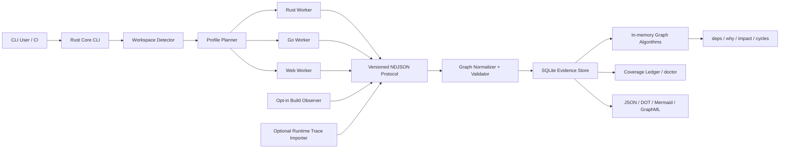

# アーキテクチャ設計: Semantic Dependency Graph CLI

## 実装ステータス

| Compatibility unit | Version |
| --- | --- |
| Product / Rust / Go / Web adapter | `0.2.0-rc.1` |
| NDJSON protocol / graph schema | `1.0` |
| Rust / Cargo baseline | `1.93.1` |
| Go baseline | `1.26.1` |
| Node.js / pnpm baseline | `24.18.0` / `10.33.0` |
| Bundled TypeScript compiler | `7.0.2` |

2026-07-22 時点で Milestone 0〜1 の MVP に加え、Milestone 2 の Go semantic vertical sliceを実装済みである。Go workerは制限付き`go/packages`、`go/types`、serial SSAからsymbol/type/generic instance、`declares`、`extends`、`implements`、`instantiates`、`type_uses`、value `references`、exact `calls`、RTA/CHA candidate `may_call`と明示profileのVTA refinementをprotocol semantic graphとして出力する。reflection、unsafe、go:linkname、assembly、plugin、cgo/native callbackは専用reason・source span・profileを持つcall-graph boundary siteと相関diagnosticへ保持し、exact/candidate targetを捏造しない。これらはSQLite evidence storeへ保存され、symbol/type selector、deps/dependents/why/cycles/unresolved、JSON/DOT/Mermaid exportの対象となる。

Milestone 2のrelease candidateは`v0.2.0-rc.1`とする。5 targetのnative package gateに加え、公開直前に全archive/checksumを再取得してmanifest、SBOM、project/third-party license、worker/runtime attestationを集約検証し、結果を`release-verification.json`としてGitHub prereleaseへ添付する。機能範囲、安全境界、完全性条件、既知制約は[release note](../releases/v0.2.0-rc.1.md)をcanonicalな配布時説明とする。

safe scanではcanonical root外へのsymlink readを拒否し、相対PATH・repository内toolchain・Node実行hookを除外する。Goは制限付き`go/packages`からparser fallbackへ移行する。Cargo metadataはpath-bearing inputのpreflight後、admitted manifest、lockfile、target discovery layoutだけを持つworker-owned confined mirrorに対してneutral cwdから`--frozen --offline --no-deps`で実行し、返却されたtemporary pathをinventory IDへ戻す。配布物はmanifest、MIT / Apache-2.0のproject license全文、core、schema、全worker/runtime artifact/component、backend attestationを検証し、欠損・変更・symlink・checked treeへの追加時にworker起動前にfail closedとする。project licenseはrelease manifestで個別にchecksum attestし、依存componentの権利情報を列挙する`THIRD_PARTY_LICENSES.txt`とは明確に分離する。

Rust は rust-analyzer `0.0.330`、upstream revision `8954b66d43225e62c92e8bbcc8500191b5cceb1e`、Salsa `0.26.1` の exact pin、neutral toolchain probe、inventory bytes 専用の in-memory HIR smoke scaffold、Cargo read-confinement preflight / mirror、safe multi-file project modelに加え、HIR definition graph、import / re-export / type-use resolution、exact / candidate call graphのvertical sliceまで実装済みである。compatibleなexact toolchain / targetとconfined Cargo DTOでは、inventory-only databaseからcanonical `symbol` / `type` node、site-less `declares` / `extends` / `implements` / `instantiates` relation、canonical `rust_use` / `rust_reexport` / `type_use` / `call` dependency siteと`imports` / `reexports` / `type_uses` / `calls` / `may_call` edgeを抽出する。静的に一意なfunction、associated function、method、generic instance、closureはexact `calls`、完全かつ有限なclosed trait / immutable local function-pointer target集合はcandidate `may_call`とし、open / incomplete dispatch、external call、macro-generated call境界を過剰にexactへ昇格しない。dependency siteは`resolved`・`candidates`・`external`・`unresolved`へ分類し、rust-analyzerのsemantic evidenceをprimary、syntax source occurrenceをsupporting evidenceとして保持する。semantic deltaはstrict validation後にsyntax graphへatomicにunionし、曖昧なsource context等でdeltaへ昇格できない認識済みtype occurrenceはsource-phaseの`external`または`unresolved`として1回だけcoverage ledgerへ残す。Issue #29で最終fallback / coverage matrixと`semantic-complete`判定を実装済みである。`syntax-complete`、exact compatible HIR、`confined-cargo-metadata`、`ready` / `import-type-call-graph-emitted`、semantic issue count `0`、skipped / unsupported / unresolved `0`をすべて満たすprofileだけが`semantic-complete`となり、`candidates` / `external`は許容する。Issue #30のpackage/release verifierも2026-07-19に完了した。source/development workerは`rust_hir_enable_gate=release-gate-pending`を維持し、manifest・全artifact/component・Rust backend attestationをcoreが検証したarchiveだけが`release-gate-verified`をworkerへ注入してrelease-readyを申告する。TypeScriptはIssue #39のbundled-only isolated Program / TypeCheckerを基盤に、Issue #41でrepository-ownedなfunction / method / constructor / class / interface / type alias / enum / local・anonymous callableとgeneric instanceをcanonical `symbol` / `type` nodeへ、`declares` / `extends` / `implements` / `instantiates`をsite-less exact relationへ昇格した。Issue #42ではTypeCheckerでESM / CJS / type-only import、re-export、path alias、package exports、named type occurrenceを意味解決し、canonical `web_import` / `web_reexport` / `type_use` siteと`imports` / `reexports` / `type_uses` edgeを追加した。Issue #43 / #47では全call occurrenceをledger化し、resolved signatureが単一repository declarationへ写像できるclosed direct dispatchをexact `call` / `calls`へ、完全に追跡できるimmutable local flowをcandidate `may_call`へ昇格した。stdlib / workspace外は`external`、open dispatch / broken sourceはreason付き`unresolved`とし、semantic deltaはworkerとcoreの両方で検証して既存syntax graphへatomic unionする。Issue #48ではpure TypeScript/JavaScript profileの完全性gateを追加し、Issue #49〜#53でNext.js、Astro、TanStack Router、TanStack Startの共通contractとsafe collectorを実装した。Issue #54では検出frameworkごとの必須capabilityを`framework-semantic-completeness-v1` ledgerへ記録し、全検出sliceとTypeScript v2 prerequisiteが揃い、かつ共通coverage gateを満たすprofileだけを`semantic-complete`へ昇格する。framework単位のfailureは成功済みsliceを上書きせず、unsupported version、dynamic/build-only境界、collector/typechecker failureをbounded reasonへ残す。Issue #64でbuild evidence protocol / store union基盤を、Issue #65〜#67でNext.js / Astro / TanStack Start固有build observerを実装済みである。Issue #71でattemptとcompleted snapshotを分離するschema v8、migration、atomic promotion、integrity / GC基盤、Issue #77でschema v10 cache storageを実装済みである。Issue #79でwatcher-driven incremental invalidationとdaemon lifecycle、Issue #80〜#82でarchitecture policyを実装済みである。Issue #83ではruntime trace v1 contractとread-only validation/matchingを実装し、store unionは後続Issue #84へ分離した。

Issue #72でsnapshot create / list / show CLIとimmutable name schema v9、Issue #73でcompleted snapshot間のcanonical graph diff engine、Issue #74でfile / symbol / type / routeのrename detection、Issue #75でhuman / JSON diff CLIとfilter、Issue #76でread-only Git changed-setとbounded reverse impact query、Issue #77でsyntax / semantic / build cache keyとschema v10 storage、Issue #78でincremental invalidation plannerとtransactional replacement、Issue #79でwatcher / daemon frontendまで実装済みである。

2026-07-23のIssue #80〜#82でarchitecture policy contract、snapshot-local evaluator、public API / runtime boundary、CI annotationまで実装済みとなった。Issue #83でruntime trace v1のformat、redaction、bounded validation、snapshot matching、read-only CLIを実装し、永続store unionはIssue #84へ分離した。

Issue #47ではTypeScript call sliceを`definition-import-type-call-graph-v2`へ進め、完全に追跡できるimmutable local `const` function-value/alias/conditional flowと、zero-argument `new Class()`だけからなるclosed finite flow（direct expressionまたはconditional）で初期化した`const` receiver flowだけを`candidates / overapprox`の`call` siteと候補ごとの`may_call` edgeへ昇格した。fresh-instanceでは各classがnon-inheriting plain class declarationであり、decorator、constructor、field、accessor、static block、other non-method memberを持たず、選択methodがdirect own methodであること、receiverのnon-declaration useが解析対象のnonoptional direct method/tag invocationの1回だけであることを証明する。candidate targetはcanonical sortし、siteとedgeのprimary evidenceへ`typescript-closed-local-call-flow-v1`または`typescript-closed-local-fresh-instance-flow-v1`を記録する。singleton candidateはexactへ昇格せず、mutable/partial flow、parameter、field、return、candidate-receiver constructor/argument、inheritance、receiver alias/property read/write/argument/return/capture/escape/second use、open/interface/overload dispatchは引き続きreason付き`unresolved`へfail closedする。

Issue #48ではpure TypeScript/JavaScript profileの最終fallback / coverage matrixを実装し、Issue #54で同じgateをframework profileへ拡張した。bundled-only isolated TypeScript `7.0.2`、worker-owned ready project model、emitted `definition-import-type-call-graph-v2`、`project_code_executed=false`、skipped / unsupported / unresolved / semantic issue / total・emitted compiler diagnosticがすべて`0`で、検出frameworkのcompleteness ledgerが全件completeの場合だけ昇格する。`candidates` / `external`は許容し、未検出frameworkのcapabilityは要求しない。compiler crash / timeout / cancelはfailed profile・exit `3`、typed late failureはsemantic deltaをatomicに破棄してsyntax graphを保持し、framework profileはbounded reason付きincompleteに留める。Issue #55ではこのWeb semantic compatibility unitをrelease manifestとworker handshakeへ固定し、抽出archiveの各framework scan/query/export、別checkout決定性、runtime fail-closed、SBOM/license closureをpackage gateへ追加した。

## 1. 目的

Rust、Go、Next.js、Astro、TanStack Router、TanStack Start のコードベースから、package、module、file、symbol、type、call、route、component、server function、asset、content、build dependency を共通の依存グラフとして抽出する CLI を設計する。

本ツールの中心価値は、単なる依存関係の可視化ではない。依存箇所ごとに、成立条件、解析根拠、解決精度、解析 profile、source span、未解決理由を保持し、変更影響や循環、アーキテクチャ違反を説明可能にする。

## 2. 背景と課題

既存ツールは、次のいずれか一層に特化することが多い。

- Cargo、Go Modules、npm workspace などの package graph
- JavaScript / TypeScript の import graph
- 特定言語の call graph
- framework 固有の route / bundle graph
- build 後に観測された artifact graph

一方、実際の変更影響はこれらの層を横断する。例えば、Next.js の route は Server Component、Client Component、Server Function、asset、environment variable に依存し、Rust の crate は feature、target、build script、proc macro によって形が変わる。単一の無条件グラフへ潰すと、依存の欠落または誤った確定が発生する。

## 3. スコープ

### 3.1 対象

- Rust
  - Cargo workspace / package / target / crate instance
  - module / import / re-export / item / type / trait / impl / call
  - feature / `cfg` / target / build dependency / build script / proc macro
- Go
  - module / workspace / package variant / file / import / symbol / type / call
  - build tags / GOOS / GOARCH / tests / generated files / cgo
- TypeScript / JavaScript
  - workspace / package locator / file / import / export / symbol / type / call
  - ESM / CommonJS / dynamic import / alias / package exports / type-only dependency
- Next.js
  - App Router / Pages Router / route handlers / metadata routes
  - layout / template / loading / error / proxy / instrumentation
  - Server / Client / Edge 境界、Server Function、route 別 asset
- Astro
  - `.astro` frontmatter / template component / island directive
  - filesystem route / endpoint / content collection / asset / integration
- TanStack Router
  - file-based / code-based / virtual route
  - generated route tree / lazy route / loader / beforeLoad / context / route mask
- TanStack Start
  - server function / client RPC stub / server route / middleware
  - client / SSR / server build environment

### 3.2 初期非対象

- 任意文字列から推測する HTTP API 間依存の自動確定
- 完全な data-flow / taint analysis
- 実行時依存の静的な完全確定
- IDE 本体や常駐 SaaS の提供
- Neo4j 等の外部 graph database を必須とする構成
- 対象 repository の build script や設定コードを無断で実行すること

OpenAPI、GraphQL、Protocol Buffers、FFI、HTTP trace を用いた cross-language edge は、後続 adapter として追加する。

## 4. 完全性の定義

### 4.1 保証するもの

解析対象として認識したすべての dependency site を、次の `resolution_status` のいずれかへ必ず分類する。

| Status | 意味 |
| --- | --- |
| `resolved` | profile 内で単一の依存先へ解決できた |
| `candidates` | 依存先候補を有限集合または条件式で表現できた |
| `external` | repository 外部への依存であり、外部 node へ正規化した |
| `unresolved` | 依存箇所は検出したが依存先を確定または列挙できなかった |

ファイル、構文、adapter、profile のスキップも coverage ledger へ記録する。未解決 edge を除外したまま成功扱いにはしない。

### 4.2 精度の表現

`resolution_status` と別に、edge の導出精度を `precision` として持つ。

| Precision | 意味 |
| --- | --- |
| `exact` | toolchain または型解決器が当該 profile で確定した |
| `overapprox` | false negative を減らすため候補を保守的に過大近似した |
| `heuristic` | framework convention、文字列、命名等から推定した |
| `observed` | build または runtime trace で実際に観測した |

`observed` は `exact` の代替ではない。ある profile / 入力で観測されなかったことは、依存が存在しないことを意味しない。

### 4.3 完全性レベル

- `syntax-complete`: 対象構文をすべて分類した
- `semantic-complete`: 選択 profile で意味解決を完了した
- `build-observed`: 選択 profile の build graph を統合した
- `runtime-observed`: 指定 trace を統合した

CLI は scan 結果にレベルと未達理由を出力する。

## 5. 設計原則

1. **Toolchain semantics first**
   package manifest や構文を独自再実装するより、Cargo、Go toolchain、TypeScript compiler、framework 公式 hook を優先する。
2. **No silent drops**
   解決不能な dependency site も node / diagnostic / ledger として残す。
3. **Profile-preserving graph**
   feature、target、build tag、environment が異なる instance を無条件に同一 node へ潰さない。
4. **Layered evidence**
   source、semantic、build、runtime の結果を上書きせず、別 evidence layer として統合する。
5. **Safe by default**
   デフォルト scan は対象 repository の任意コードを実行しない。
6. **Explainability**
   すべての edge から、抽出器、source span、condition、profile、導出根拠を辿れるようにする。
7. **Versioned boundaries**
   言語解析器を worker として分離し、変化の速い compiler API を core から隔離する。

## 6. 全体アーキテクチャ



### 6.1 Rust Core CLI

責務は次のとおり。

- repository root と workspace の検出
- toolchain と framework version の検出
- scan profile の計画
- worker lifecycle、timeout、cancel、stdout / stderr 分離
- protocol validation と stable ID 正規化
- graph storage、query、export、snapshot、diff
- coverage ledger と exit code の決定

core は各言語の詳細な AST / HIR 型を直接保持しない。

### 6.2 Language Worker

worker は独立 process とし、versioned NDJSON を stdout へ返す。ログは stderr へ出す。

- `depgraph-rust-worker`
- `depgraph-go-worker`
- `depgraph-web-worker`

worker の crash、timeout、部分失敗は diagnostic と ledger に記録し、他 worker が生成した graph を破棄しない。

### 6.3 Adapter Protocol

初期 protocol event は次を想定する。

- `scan_started`
- `profile_declared`
- `node_upsert`
- `edge_upsert`
- `dependency_site`
- `diagnostic`
- `file_completed`
- `profile_completed`
- `scan_completed`

各 event は `protocol_version`、`scan_id`、`adapter`、`adapter_version` を必須とする。未知の optional field は無視できるが、未知の event type と必須 field 欠落は protocol error とする。

## 7. 共通 Property Graph

### 7.1 Node 種別

| Node kind | 用途 |
| --- | --- |
| `workspace` | repository 内の workspace 境界 |
| `package_instance` | version、source、package manager locator を含む package |
| `build_unit` | Rust crate instance、Go package variant、Web build environment |
| `module` | 言語上の module / package namespace |
| `file` | source、generated、config、asset file |
| `symbol` | function、method、variable、export、item |
| `type` | named type、trait、interface、type alias |
| `component` | React / Astro component |
| `route` | framework route と URL pattern |
| `server_function` | RPC boundary を持つ server function |
| `middleware` | request / route / server function middleware |
| `content` | content collection、entry、remote source |
| `asset` | image、CSS、WASM、public file、build artifact |
| `env_key` | 値を保存しない環境変数 key |
| `native_library` | cgo、Rust native link、FFI library |
| `external_system` | repository 外部で詳細未解析の対象 |
| `unknown_target` | dependency site は存在するが終点が不明な sentinel |

### 7.2 Edge 種別

| Category | Edge kind |
| --- | --- |
| Structure | `contains`, `declares`, `generated_from` |
| Package | `depends_on`, `enables_feature`, `build_depends_on` |
| Module | `imports`, `reexports`, `lazy_imports`, `side_effect_imports` |
| Type | `type_uses`, `extends`, `implements`, `bounds`, `instantiates` |
| Value | `references` |
| Call | `calls`, `may_call`, `registers` |
| UI | `renders`, `hydrates`, `client_boundary`, `server_boundary` |
| Routing | `route_entry`, `parent_route`, `loads`, `before_load`, `navigates_to`, `masks_to` |
| RPC | `rpc_call`, `client_stub_for`, `handled_by`, `uses_middleware` |
| Build | `expands`, `generates`, `links`, `emits`, `bundles` |
| Resource | `reads_env`, `reads_content`, `consumes_asset` |

edge kind は追加可能とするが、既存 kind の意味を protocol version 内で変更しない。

### 7.3 必須 Property

すべての edge は次を保持する。

```json
{
  "id": "edge:sha256:...",
  "source": "symbol:sha256:...",
  "target": "route:sha256:...",
  "kind": "route_entry",
  "site_id": "site:sha256:...",
  "phase": "semantic",
  "environment": "server",
  "profile_id": "web:production:server",
  "condition": {
    "op": "all",
    "conditions": [
      { "op": "eq", "key": "mode", "value": "production" },
      { "op": "eq", "key": "runtime", "value": "server" }
    ]
  },
  "resolution_status": "resolved",
  "precision": "exact",
  "evidence": [
    {
      "kind": "semantic",
      "extractor": "next-static-adapter",
      "extractor_version": "0.1.0",
      "path": "src/app/products/[id]/page.tsx",
      "start_line": 1,
      "start_column": 1,
      "end_line": 1,
      "end_column": 42,
      "properties": {}
    }
  ],
  "generated": false
}
```

候補が複数ある場合は、dependency site と各候補 edge を同じ `site_id` で結び、候補集合を再構成できるようにする。

### 7.4 Stable ID

stable ID は表示名ではなく、言語 resolver が返す canonical identity と package instance を基にする。

- file: repository identity + normalized relative path
- Rust item: package ID + crate instance + canonical module path + item identity
- Go object: module path + version / replace + package path + object identity
- npm symbol: package manager locator + runtime file + export / symbol identity
- route: framework + router instance + canonical route pattern + environment

local variable、anonymous function、generated wrapper 等は source span と生成元 identity を用いる。ファイル移動をまたぐ完全な ID 安定性は保証せず、snapshot diff では rename detection を別途行う。

### 7.5 Semantic Graph Contract（protocol 1.0）

protocol 1.0 の node / edge kind は open vocabulary だが、Milestone 2 の worker は次の規約を共通 contract とする。`symbol` / `type` node は通常の必須 field に加え、`properties` に以下を必須とする。

後方互換性のため、protocol 1.0 の root Schema と通常の `validate_ndjson` / `validate_safe_ndjson` は kind の open vocabulary を維持する。Milestone 2 worker は Schema の `$defs.semantic_node` / `$defs.semantic_edge` / `$defs.semantic_site` と、Rust の `validate_semantic_ndjson` / `validate_safe_semantic_ndjson` を明示的に選び、この節の追加契約を検証する。

| Node kind | 必須 property | 意味 |
| --- | --- | --- |
| `symbol` | `language`, `package_locator`, `symbol_kind`, `canonical_identity` | resolver が返した function、method、variable、export、item 等の identity |
| `type` | `language`, `package_locator`, `type_kind`, `canonical_identity` | resolver が返した named type、trait、interface、type alias 等の identity |

`package_locator` は package manager / resolver が決めた package instance identity であり、version、source、replace、peer context 等を必要に応じて含める。`canonical_identity` は node ID の hash 入力そのものを JSON object で保持し、top-level の `language`、`package_locator`、`symbol_kind` / `type_kind` と同じ値を含める。symbol identity は `identity_kind` を `named / local / anonymous / generated` から必須で選ぶ。`named` は `resolver_identity` を必須とし、それ以外は `enclosing_symbol` または `generated_from`、normalized relative path、1-origin の source span を必須とする。`local_*` と `parameter`、`anonymous_*` と `closure / lambda`、`generated_*` の予約済み `symbol_kind` は、それぞれ同名の identity category と一致させる。set として扱う配列は producer が canonical sort し、generic argument 等の順序に意味がある配列は resolver order を保持する。

```text
symbol node ID = stable_id_from_value("symbol", canonical_identity)
type node ID   = stable_id_from_value("type", canonical_identity)
```

semantic dependency site と edge は次の規約に従う。

| Edge kind | source / target | 許可する resolution | 用途 |
| --- | --- | --- | --- |
| `imports` | source: Rust `module` / `symbol`、Web `file`; target: Rust `module`またはWeb `file`、`symbol`、`type`、sentinel | `resolved`, `candidates`, `external`, `unresolved` | HIR `use` leaf、またはTypeCheckerで意味解決したWeb import |
| `reexports` | source: Rust `module`、Web `file`; target: Rust `module`またはWeb `file`、`symbol`、`type`、sentinel | `resolved`, `candidates`, `external`, `unresolved` | HIR公開`use` leaf、またはTypeCheckerで意味解決したWeb re-export |
| `type_uses` | source: `symbol` / `type`、またはWeb fallbackに限る`file`; target: `type`またはsentinel | `resolved`, `candidates`, `external`, `unresolved` | signature、field、annotation、constraint 等からの型参照。`file` sourceはWebでenclosing declarationをcanonical化できない場合だけに限定し、Rust semantic contractでは許可しない |
| `references` | source: Go `symbol`; target: `symbol`またはsentinel | `resolved`, `external`, `unresolved` | `go/types.Info.Uses` / `Selections` で解決したvariable、constant、field、first-class function/method等のvalue参照 |
| `calls` | caller `symbol` / 単一 callee `symbol` または sentinel | `resolved`, `external`, `unresolved` | static direct call または認識済みだが未解決の direct call site |
| `may_call` | caller `symbol` / 候補 callee `symbol` | `candidates` のみ | interface dispatch 等の保守的 call graph |

resolution と precision、target は次の組み合わせに固定する。

- `resolved` は concrete target 1件を指し、`precision=exact` とする。Webの`namespace_import`、`side_effect_import`、`empty_import`、`import_equals`、`require_call`、`dynamic_import`、`import_type`、`namespace_reexport`、`empty_reexport`、`export_star`はmodule-level occurrenceとしてrepository `file`をtargetにし、それ以外のnamed bindingはTypeCheckerが返したcanonical `symbol` / `type`をtargetにしてcontaining fileへ弱めない。
- `candidates` は canonical sort した concrete target 1件以上を持ち、`precision=overapprox` とする。候補が1件でも動的dispatchの一意性が証明されていなければ `resolved` へ昇格しない。call site は候補ごとの `may_call` edge、type site は候補ごとの `type_uses` edgeを生成する。
- `external` は `external_system` node 1件を指す。worker が target locator を canonical external identity として確定した場合は `exact`、境界またはspecifierだけを特定した場合は `heuristic` と申告する。Webの既知Node.js builtinは`node:*`をcanonical locatorとして`external / exact`にする。明示形`node:fs`はそのまま保持し、有効なbare形`fs` / `fs/promises` / `path`は`node:fs` / `node:fs/promises` / `node:path`へ正規化する。未知の`node:*`はunresolvedへfail closedし、builtinを`npm:*@unknown`へ変換しない。共通 validator は sentinel kind と status / precision の組み合わせを検証し、locator の言語固有な正確性は各 worker の contract test で検証する。
- `unresolved` は `unknown_target` node 1件を指し、`precision=heuristic` と非空の `reason` を必須とする。

- edge は `phase=semantic` とする。edge と dependency site の `evidence[0]` は dependency occurrence を表す primary evidence とし、`kind=semantic`、extractor、extractor version、normalized relative path、完全な source span を必須とする。site ID は常にこの primary spanから作る。追加 evidence は primary の後で canonical JSON順に並べる。Rust HIR の`rust_use` / `rust_reexport` / `type_use` / `call` siteではrust-analyzer evidenceをprimary、Webの`web_import` / `web_reexport` / `type_use` siteではTypeChecker evidenceをprimaryとし、syntax collectorが記録した同一source occurrenceをsupporting evidenceとする。Web primary evidenceはboolean `properties.type_only`を必須とし、`type_use`と`import_type`は`true`、runtime-onlyなside-effect import / `require()` / dynamic importは`false`、named / default / namespace import、`import = require()`、re-exportはsyntax markerをそのまま保持する。さらにimport / re-export occurrenceは`properties.module_specifier`、named / default / namespace binding、`import = require()`、type-useは`properties.imported_name`を保持し、site specifierと相関させる。有効なquoted empty module/export nameはmissing/computed syntaxへ変換せず空文字のまま保持し、quoted `"*"` / `"="` はnamespace / import-equals sentinelではなく通常のnamed bindingとして保持する。module specifierの`binding:` prefixは予約しない。解決できないoccurrenceはreason付きunresolvedとする。TypeScriptの`resolution-mode` attributeは宣言唯一のattributeかつ宣言全体がtype-onlyの場合（JSDoc importを含む）だけmodule provenance付きの`properties.resolution_mode=import|require`として保持する。`import = require()` の暗黙CommonJS phaseは内部resolver状態に限定し、public `resolution_mode`へは出力しない。pinned compilerがTS2880を報告するlegacy `assert` syntaxは`syntax_invalid`として保持し、workerとcoreが独立にshapeをattestする。
- 例外として、Rust collectorが認識したもののHIR deltaへ昇格できない`type_use`は、source evidenceをprimaryとする`phase=source`のfallback site / edgeとして保持できる。このfallbackは`external`または`unresolved`かつ`precision=heuristic`に限定し、site / edgeのsource、condition、status、precision、primary evidence anchorを一致させる。semantic siteへのsource edgeまたはsource fallback siteへのsemantic edgeは拒否する。
- semantic `rust_use` / `web_import` siteは`imports` edge、semantic `rust_reexport` / `web_reexport` siteは`reexports` edge、`type_use` siteは`type_uses` edgeと1対1またはcandidate targetごとに結び、site / edgeのsourceとprimary evidence anchorを一致させる。Rust semantic siteとedgeのconditionは一致させる。Web source-phase runtime resolutionでconditional exportsが複数targetへ分岐する場合は、各edgeをそのtargetのbrowser / server等のbranch conditionへ絞り、site conditionを全target edge conditionのcanonical unionとする。一方、Web semantic refinementはpinned TypeScript Bundler resolverのneutral condition setだけを使い、profileのbrowser / server分岐をsemantic candidateへ持ち込まない。既存のsource phase import / re-export graphはprotocol 1.0の後方互換contractとして維持し、semantic graphで上書きしない。
- Goの`value_reference` siteは`references` edge 1件と結び、sourceは参照occurrenceを包含する`symbol`、resolved targetはrepository-owned `symbol`とする。repository外のcanonical objectは`external_system / exact`、identityを確定できないobjectはreason付き`unknown_target / heuristic`に分類する。call calleeは`call`、型名は`type_use`、package qualifierはsource import occurrenceが所有し、同一identifier occurrenceを`value_reference`へ二重計上しない。selection receiver内の独立したvalue occurrenceはこの除外対象に含めない。
- direct call は target 1件の dependency site と `calls` edge 1件で表す。
- candidate call は call site 1件につき dependency site 1件と候補ごとの `may_call` edge を生成する。全 candidate edge は同じ `site_id`、`resolution_status=candidates`、`precision=overapprox` を持つ。site と各 edge の primary evidence は、RTA、CHA、VTA 等の解析方式を非空の `evidence[0].properties.algorithm` に必須で記録する。
- Rustのfunction / associated function / inherent method / concrete trait method / generic instance / closure callは、callee identityが静的に一意な場合だけ`resolved / exact`の`calls`とする。dynamicであることを一意性の根拠に置き換えず、候補1件のclosed dispatchも`candidates / overapprox`のまま維持する。
- Rustのclosed trait dispatchは公開範囲が閉じ、全local impl targetを欠落なくcanonical化できる場合だけ`rust-analyzer-local-trait-impls-v1`候補とする。immutable local function pointerは初期化・分岐・aliasのflowを完全に追跡できる場合だけ`rust-immutable-fn-pointer-flow-v1`候補とする。open/public trait、mutable/parameter/field/return由来のfunction pointer、候補を1件でも写像できない集合は部分候補を出さず`unresolved`とする。
- declarative macro expansion内にcallがある場合は個々のgenerated callをsource callへup-mapせず、invocation spanにgeneratedな`unresolved` call boundaryを1件出力し、macro provenanceとgenerated call件数をevidenceへ保持する。callを含まないmacro invocationはcall siteを生成しない。
- site ID の canonical input は `source`、site `kind`、`profile_id`、canonical condition、normalized path、source span とする。候補 target 集合は候補増減で site identity を変えないため含めない。
- edge ID の canonical input は `site_id`、edge `kind`、`target` とする。これにより同じ site の候補を独立に追加・削除できる。
- worker は `stable_id_from_value("site", input)` と `stable_id_from_value("edge", input)` を使用する。candidate target ID は昇順にする。event は `scan_started`、`profile_declared`（ID順）、`node_upsert`（node ID順）、`dependency_site`（site ID順）、`edge_upsert`（edge ID順）、`diagnostic`（ID順）、`file_completed`（path順）、`profile_completed`（profile ID順）、`scan_completed` の順に出力する。

`crates/depgraph-protocol/tests/fixtures/protocol-v1.semantic.golden.ndjson` をこの contract の互換性 fixture とする。既存の source phase fixture は protocol 1.0 の後方互換 fixture として変更しない。

#### 7.5.1 Web framework semantic graph v1

Web framework semantic graph は protocol 1.0 の open vocabulary を狭めず、`framework-semantic-graph-v1` capability を宣言した Web profileだけがopt-inする。既存のsource-phase `route` node / `route_entry` edgeはcanonical identityを持たないlegacy vocabularyとして引き続き有効であり、semantic framework endpointとしては使用できない。

framework semantic nodeは`framework`（`next` / `astro` / `tanstack-router` / `tanstack-start`）、`package_locator`、`environment`、`profile_id`、kind固有property、`canonical_identity`を必須とする。top-level propertyはcanonical identity内の同名値と一致させる。

| Node kind | kind固有property | canonical identity追加field |
| --- | --- | --- |
| `component` | `component_kind` | `resolver_identity` |
| `route` | `route_kind` | `router_instance`, `/`から始まる`route_pattern` |
| `server_function` | `server_function_kind` | `resolver_identity` |
| `middleware` | `middleware_kind` | `resolver_identity`, `scope` |

node IDは`stable_id_from_value(node.kind, canonical_identity)`で作る。route identityはframework + package instance + router instance + canonical route pattern + environmentを含む。component / server function / middlewareは表示名やproduction RPC IDではなく、静的resolverが返したportable identityを用いる。

framework dependency siteとedgeは同じkindを使用し、semantic site 1件とtargetごとのsemantic edgeを同じ`site_id`で結ぶ。concrete endpointは次の行列に限定する。`external` / `unresolved` targetは共通contractどおり`external_system` / `unknown_target` sentinelに置き換える。

| Edge / site kind | concrete source | concrete target | `candidates` |
| --- | --- | --- | --- |
| `renders` | `component` / `route` | `component` | 可 |
| `hydrates`, `client_boundary`, `server_boundary` | `component` | `component` | 不可 |
| `route_entry` | `file` / `symbol` / `component` / `server_function` | `route` | 不可 |
| `parent_route` | `route` | `route` | 可 |
| `loads` | `component` / `route` | `file` / `symbol` / `server_function` | 可 |
| `before_load` | `route` | `symbol` / `server_function` | 可 |
| `navigates_to`, `masks_to` | `component` / `route` / `symbol` | `route` | 可 |
| `rpc_call` | `component` / `route` / `symbol` | `server_function` | 可 |
| `client_stub_for` | `symbol` | `server_function` | 不可 |
| `handled_by` | `route` / `server_function` | `symbol` | 可 |
| `uses_middleware` | `route` / `server_function` | `middleware` | 可 |

resolution / precisionは共通semantic contractと同じく、`resolved / exact`、`candidates / overapprox`、`external / exact|heuristic`、`unresolved / heuristic + reason`に固定する。candidateを許可するkindではprimary evidenceに非空の`algorithm`も必須とする。site target IDはuniqueな昇順とし、site IDはcanonical condition、kind、normalized path、profile ID、source ID、1-origin source span、edge IDはkind、site ID、target IDから作る。

primary evidenceは`kind=semantic`、完全なrelative source span、`properties.profile_id`、`framework`、`contract_version=framework-semantic-graph-v1`、`occurrence_kind`を必須とする。extractor/versionはframeworkごとに`next-static-adapter@0.1.0`、`astro-static-adapter@0.1.0`、`tanstack-router-static-adapter@0.1.0`、`tanstack-start-static-adapter@0.1.0`へ固定する。同じanchor、profile、framework、occurrence kindを持つsource supporting evidenceを最低1件付与し、それ以降のsupporting evidenceはcanonical JSON順にする。edge evidenceはsite evidenceと一致させる。

conditionは`environment`の`eq`または`in` predicateを含み、edgeのconcrete `environment`を許可しなければならない。framework siteと各edgeのconditionはcanonical化後に一致させる。異なるprofileまたはframeworkのcanonical node間をframework edgeで結ばない。

Web profileは以下を一組で宣言する。propertyの一部欠落、未知のcapability/status/extractor version、不整合なcountはcoreが拒否する。protocol 1.0の既存fixtureはsemantic capability 6 propertyすべてを省略するlegacy profileとして後方互換に扱う。

```json
{
  "web_framework_semantic_capability": "framework-semantic-graph-v1",
  "web_framework_semantic_status": "not-emitted | emitted | discarded",
  "web_framework_semantic_extractor_version": "0.1.0",
  "web_framework_semantic_node_count": "0",
  "web_framework_semantic_site_count": "0",
  "web_framework_semantic_edge_count": "0",
  "web_framework_completeness_capability": "framework-semantic-completeness-v1",
  "web_framework_completeness_status": "not-detected | complete | incomplete",
  "web_framework_completeness_issue_count": "0",
  "web_framework_completeness_ledger": "[]"
}
```

`web_framework_completeness_ledger`はcanonical JSON stringで、検出frameworkごとに`framework`、`required_capabilities`、`emitted_capabilities`、`status`、`reasons`を持つ。必須capabilityは共通の`framework-semantic-graph-v1`と`typescript-definition-import-type-call-graph-v2`に、Next.js=`next-route-component-boundary-v1`、Astro=`astro-component-render-hydration-v1`、TanStack Router=`tanstack-router-typed-route-v1`、TanStack Start=`tanstack-start-rpc-middleware-v1`を加えた3件とする。entryはframework UTF-8順、capabilityとreasonは重複なしのcanonical順とする。未検出frameworkはentryを持たず、featureなしは`not-detected`・issue count 0・空ledgerとする。検出frameworkがすべてrequired=emittedかつreasonなしの場合だけaggregate `complete`とし、それ以外は`incomplete`とする。

`not-emitted` / `discarded`は全countを0とする。workerはframeworkごとのdeltaをcloned map上で検証してからsyntax / TypeScript semantic graphへunionし、別frameworkの成功deltaを保持する。unresolved site、unsupported version、collector discard、TypeScript prerequisite failureはframework別のbounded reasonへ正規化する。coreもprofile authorization、strict protocol contract、observed count、feature/ledger一致を独立に検証する。framework deltaが失敗した場合はframework node/site/edge closureだけを破棄し、既存syntax graphとTypeScript definition/import/type/call graphを保持したうえでledgerを`core_framework_delta_discarded`付き`incomplete`へ更新する。`semantic-complete`にはaggregate `complete`に加えて従来のzero skipped / unsupported / unresolved / semantic issue / compiler diagnostic、safe execution、release gateをすべて要求するため、動的callやbuild-only boundaryはledgerがcompleteでもcoverage reasonで昇格を阻止できる。共通golden fixtureは`crates/depgraph-protocol/tests/fixtures/protocol-v1.framework-semantic.golden.ndjson`とする。

## 8. Profile と条件付き Graph

### 8.1 共通 Profile

profile は、解析結果を再現するための入力 snapshot である。

```yaml
id: rust:test:linux-x86_64:feature-set-a
toolchain: rustc 1.x
command: test
target: x86_64-unknown-linux-gnu
features:
  - feature-a
environment_allowlist:
  - CARGO_CFG_TARGET_OS
source_revision: <git-sha-or-worktree-hash>
```

### 8.2 Rust 条件

- Cargo command: check / build / test / bench / doc
- target triple
- feature set
- `cfg` expression
- normal / dev / build dependency
- lib / bin / example / test / bench / build-script / proc-macro target

`--all-features` は全構成の union ではなく一つの feature set として扱う。相互排他的 feature を含む可能性があるため、既定 matrix を自動的に「全組合せ」とはしない。

### 8.3 Go 条件

- module / workspace / replace 状態
- GOOS / GOARCH
- user build tags
- cgo enabled / disabled
- compiler / release tags
- normal / internal test / external test variant

build constraint は Boolean condition として保存し、単一 scan で非活性 file を削除しない。

### 8.4 Web 条件

- package manager と package locator
- development / production / test
- browser / server / edge / worker
- ESM / CommonJS と export conditions
- TypeScript `moduleResolution`
- bundler alias / virtual module / plugin
- framework version と framework config

TypeScript の `type_target` と runtime / bundler の `runtime_target` は別 edge として保持できるようにする。

## 9. Rust Adapter

### 9.1 現状と採用 backend

Milestone 1 の Rust worker は `syn` による syntax-only adapter である。path-bearing Cargo inputのpreflightとconfined mirror構築に成功し、`cargo metadata --format-version 1 --no-deps --frozen --offline` がmirrorに対して完了した場合は、inventory identityへremap済みのworkspace member、target、dependency declarationを利用する。preflight、mirror構築、command、DTO検証のいずれかが失敗した場合は、confinedなmanifest / lockfileの静的解析へfallbackする。`--no-deps` の出力は完全なresolve graphではなく、現在のfeature listもworkspace全体を決定的に近似した値である。この結果に`semantic-complete`を付与しない。

Cargoへ元repositoryのmanifest pathは渡さない。`members = ["../outside"]`、root外path dependency、ambiguous glob、symlink、未対応のpath-bearing field等をpreflightで一意にconfinedと証明できなければ、Cargoを起動しない。Cargoのraw DTOが含むmirror absolute pathと`path+file://` package IDはmetadata境界内だけで扱い、admitted inventory IDまたは元repository内のcanonical pathへ変換してからscannerへ渡す。temporary pathはprofile identity、node / site / edge、diagnostic、evidence、coverage ledgerへ残さない。このread-confinement gateとsafe HIRのmulti-file project modelは実装済みである。DTOは対応target・toolchain時にinventory source bytesと結合してanalysis databaseを構築し、HIR definition / import / re-export / type-use / call queryの結果をisolated semantic deltaとして検証・unionする。static manifest fallbackはcrate graph unavailableとしてledgerへ残し、semantic queryを実行しない。

Milestone 2 の HIR backend には、ADR-007 に従い、version を exact pin した rust-analyzer library 群を `depgraph-rust-worker` へ静的 link する方式を採用する。Rust worker 自体は core から独立 process として timeout、cancel、process-tree 停止、stdout / stderr 上限の管理下にあるため、library 統合でも core と HIR の障害境界は維持される。

2026-07-19 時点で rust-analyzer は `ra_ap_* = 0.0.330`、upstream revision `8954b66d43225e62c92e8bbcc8500191b5cceb1e`、Salsa dependency set `0.26.1` に exact pin 済みである。`0.0.331` は Rust `1.93.1` で `ra_ap_hir_ty` の unstable if-let guard をコンパイルできないため棄却した。worker には inventory 済み UTF-8 bytes を virtual `/lib.rs`、最小 `CrateGraph`、in-memory VFS へ投入する smoke scaffold、neutral toolchain probe、confined Cargo mirrorに加え、同じinventory-only境界をmulti-file VFS、workspace/path local `CrateGraph`、crate単位cfgへ拡張するsafe project modelを追加済みである。workspace discovery、repository fileのon-demand read、sysroot source、project config、proc-macro library、build script、子processはload・実行しない。compatibleなmodelではdefinition / import / re-export / type-use / call queryを実行し、canonical `symbol` / `type`、site-less `declares` / `extends` / `implements` / `instantiates`、canonical dependency siteとsemantic edgeをprotocol graphへ昇格する。成功profileは`analysis=syntax+hir-imports-types-calls`、`analysis_backend=static-syntax+rust-analyzer-hir`、`rust_hir_backend=rust-analyzer-hir`、`rust_hir_status=import-type-call-graph-emitted / import-type-call-graph-partial`を記録する。Issue #29でfinal fallback / coverage matrixは完了し、exactな完全性条件を満たすprofileに限り`semantic-complete`を付与する。Issue #30でpackage/release verifierも完了し、source/development実行は`rust_hir_enable_gate=release-gate-pending`、coreがarchiveとbackendをattestしたpackaged実行だけは`release-gate-verified`となる。

### 9.2 方式比較

| 方式 | 安全性 / 決定性 | graph 抽出 interface | 配布 / 障害境界 | 判定 |
| --- | --- | --- | --- | --- |
| exact pin した rust-analyzer library を Rust worker へ link | worker が crate graph、`cfg`、VFS を所有し、project config 探索と子 process 起動を API 境界で排除できる | HIR / Semantics に直接アクセスし、node / site / edge と source span を同一 transaction で構築できる | 既存 Rust worker の process 隔離と checksum を再利用できる。internal API 変更に弱いため exact pin が必須 | **採用** |
| bundled `rust-analyzer` 外部 process、LSP / private command 利用 | config、Cargo、flycheck、proc-macro 起動を個別に無効化する必要がある | LSP に bulk HIR / type / call graph の安定 contract がなく、private request 依存が残る | OS / arch ごとの別 binary、checksum、handshake、子 process 監督が必要 | **棄却** |
| system / project-local `rust-analyzer` 外部 process | PATH、rustup shim、project-local binary、自動 update で version と実行コードが変化する | 入力ごとに API と挙動が変わる | release manifest で integrity を保証できない | **safe scan で禁止** |
| `syn` のみ | project code を実行せず broken source にも部分対応しやすい | compiler の name / type / trait resolution を再現できない | 現 worker 内で利用済み | **syntax inventory / fallback に限定** |

### 9.3 Safe crate graph、`cfg`、VFS 境界

HIR backend は rust-analyzer の workspace discovery、`load_cargo`、flycheck、proc-macro server、project config loader を呼び出さない。worker が次の safe input だけから analysis database を構築する。

単一file smoke scaffoldに加え、2026-07-17に以下のmulti-file project model、definition graph、import / re-export / type-use resolution、call graphのvertical sliceを実装済みである。呼出側が渡したinventory bytesだけをcanonical順のvirtual path / file IDへ登録し、confined Cargo DTOからworkspace targetとroot内path dependencyをlocal crateへ変換する。production scannerはcompatibleなmodelへdefinition / import / re-export / type-use / call queryを実行し、canonical `symbol` / `type` node、site-less `declares` / `extends` / `implements` / `instantiates` relation、canonical `rust_use` / `rust_reexport` / `type_use` / `call` siteと`imports` / `reexports` / `type_uses` / `calls` / `may_call` edgeをisolated deltaへ出力する。module-level `use` / `extern crate` alias、glob、re-export、cross-file `self` / `crate` / `super` path、declarationおよびbodyのnamed type reference、function / associated function / method / generic instance / closure / trait / function-pointer callを対象とする。statically unique targetだけをexactとし、closed traitとimmutable local function-pointerの完全な有限集合だけをcandidateにする。外部・open/incomplete dispatchはexternal/unresolved、call-bearing declarative macro expansionはinvocation spanのgenerated unresolved boundaryとして保持する。rust-analyzerによるsemantic evidenceをprimary、syntax occurrenceをsupporting evidenceとして保持し、siteを`resolved` / `candidates` / `external` / `unresolved`へ分類する。deltaはprotocol validatorを通過した場合のみnode / site / edgeとfile coverageをsyntax graphへatomicにunionし、typed failure時は全破棄してsyntax graphを保持する。semanticへ昇格できなかったtype occurrenceはsource-primaryの`external` / `unresolved` heuristic siteとして重複なく残す。block-local external aliasと暗黙prelude名はexact HIR proofなしにexternalへ推測しない。

1. canonical scan root 内で inventory 済みの manifest、lockfile、Rust source bytes
2. Cargo がたどり得る workspace member、path dependency、`patch` / `replace` manifest path を起動前に静的検証し、すべて scan root 内の admitted file と証明できる場合に限り、worker-owned mirror、neutral cwd、`env_clear`、sanitized absolute `PATH`、`--frozen --offline --no-deps` で得てinventory identityへremapした Cargo metadata DTO
3. canonical sort / deduplicate 済みの profile target、crate ごとの edition、requested feature、worker-owned `cfg` table
4. worker が発行した VFS file ID と canonical relative path

crate graph には selected workspace target と scan root 内の path dependency だけを実 crate として追加する。registry / git dependency、`std` / `core` / `alloc`、scan root 外の path dependency は external sentinel とし、その定義が必要な resolution は `external` または `unresolved` にする。初期 HIR backend は system / project の sysroot source、Cargo registry source、`target/` artifact、`rust-project.json`、`.cargo/config*`、custom target JSON を load しない。current profile の workspace-global feature 展開を exact input とせず、package / crate ごとに feature `cfg` を再構築する。

実装済みbuilderはeffective target edition、requested feature、dependency feature forwarding、target `required-features`、supported target table、selected scan modeとCargo target `test`状態をcrate単位のcfgへ変換する。`profiles.rust_mode`は`check`（既定）/ `build` / `test`を受け付け、testではCargoが有効化するworkspaceのlib/bin unit-test harnessを`cfg(test)`付き別crateとして追加し、dev dependencyは実際に選択されたworkspace test unitにだけ接続する。dependency-only packageのtest target/dev dependency、inactive optional/非選択target/build-only path packageはlocal crateへ昇格しない。現safe cfg profileは`debug_assertions`有効・`panic="unwind"`へ正規化し、cfgに影響するCargo `dev` / `test` custom profile overrideはtyped unsupported inputへ分類する。direct `cfg` / `cfg_attr`は`all` / `any` / 単項`not`のarityを含めて保守的に検証する。それ以外のbuilt-in attributeはshape・value・配置を属性固有に検証できるまで`unsupported_attribute`としてledger化し、generic `syn::Meta`としてparseできただけでは`semantic-complete`を許可しない。declarative/builtin/procedural macroは同名のlocal/imported macroでshadow可能なため、名前だけではbuiltinと確定しない。source inventoryは未証明のbang macroをgeneric `macro_expansion`、derive/custom attributeを`proc_macro_expansion`のunresolved境界へ残し、式として解析可能な入れ子の`include!` / `env!` / `OUT_DIR`も再帰的にledger化する。name resolutionまたは展開生成cfgを安全に完全分類できない境界はunsupported / unresolvedとして`semantic-complete`を阻止する。registry / git / root外またはmodel外path / build dependencyと各crateのsysroot要求はdeterministic sidecar sentinelへ残し、custom target、unsupported target kind、build script、proc-macro target、missing crate root、local dependency cycle、static manifest fallbackはtyped failureまたはdiagnostic / coverage ledgerへ分類する。いずれの場合もsysroot source、Cargo registry source、`rust-project.json`、`.cargo/config*`、proc-macro dynamic library、build scriptをload・実行せず、VFSへ投入するsource bytesはscanner inventoryでadmit済みのものに限定する。

`rust_hir_project_model=ready`はatomicなVFS / crate graph / cfg inputの構築完了だけを意味する。definition / import / re-export / type-use / call graphの成否は`rust_hir_status=import-type-call-graph-emitted / import-type-call-graph-partial / failed`で別に表現する。Issue #29でfallback完全性判定を実装済みであり、`ready`だけでは`semantic-complete`にならない。missing module/includeはsyntax graphのunresolved siteとcoverage ledgerへ残り、完全性を阻止する。

Cargo read-confinement preflightとmirrorは実装済みである。preflightがglob、symlink、外部workspace member / path dependency、未知のCargo path-bearing keyを一意にconfinedと判定できない場合はCargo metadataを起動せず、静的manifest fallbackと`RUST_HIR_CRATE_GRAPH_UNAVAILABLE`を選ぶ。admitted manifest / lockfileとtarget auto-discoveryに必要なadmitted layoutまたはsafe placeholderだけをworker-owned temporary directoryへ複製し、Cargoにはmirror内のmanifest pathだけを渡す。既知のabsolute path-bearing fieldは対応するmirror pathへrewriteし、admitted inventoryへ一意に対応しない値はrejectする。standalone package rootにはmirror限定の空`[workspace]`境界を合成する。inventory rootにadmitted manifestがないmirrorではproject rootへvirtual guard workspaceを置き、nested workspace外のpath dependencyがCargoに拒否される場合も含め、temporary directory祖先のworkspace manifest探索をworker-owned inputで停止する。元projectの`.cargo/config*`、`rust-toolchain*`、build artifact、任意source contentsはCargo-visible inputへ追加しない。

Cargo commandはneutral cwdと`env_clear`を使用し、`HOME`、`USERPROFILE`、`CARGO_HOME`、temporary directory、`CARGO_TARGET_DIR`をworker-owned directoryへ固定する。`PATH`はscan root外のcanonical absolute directoryだけにsanitizationし、rustup proxyに必要な`RUSTUP_HOME`もscan root外のcanonical directoryに限定する。`RUSTUP_AUTO_INSTALL=0`、offline / frozen、空のcompiler wrapperを強制し、project / user Cargo config、project toolchain override、network download、project directoryへのwriteを入力へ含めない。

raw Cargo DTOはmetadata module外へ公開しない。`workspace_root`、package `manifest_path`、target `src_path`、dependency `path`はadmitted mapとの完全一致を検証してinventory IDまたは元repository内のcanonical pathへ戻す。mirror pathを含むpackage ID / workspace member IDはraw DTO内のmembership照合だけに使って破棄し、temporary `target_directory` / `build_directory`や任意metadata fieldをgraphへ伝播させない。未知、mirror外、未登録のDTO pathが1件でもあればDTO全体をrejectする。mirror directory名とabsolute pathはstable ID、profile、node / site / edge、diagnostic message / identity、evidence、file coverageの入力にしない。

rust-analyzer 側に arbitrary path を読む file loader を渡さない。`include!` 等は inventory 済みの confined file に解決できる場合だけ展開し、`OUT_DIR`、project environment、wrapper / compiler hook を注入しない。declarative macro と rust-analyzer 内の builtin macro は、追加 I/O や process を起動しない純粋な token 展開に限って利用できる。rust-analyzer / HIR phase から proc-macro dynamic library、proc-macro server、build script、Cargo check、project compilation、`RUSTC_WRAPPER`、`RUSTC_WORKSPACE_WRAPPER` を起動しない。外部 command は前段の制限済み Cargo metadata と、HIR enable gate 専用の `cargo --version --verbose` / `rustc --version --verbose` probe だけを許可する。どちらも `RUSTUP_AUTO_INSTALL=0` を必須とし、toolchain / component の download や user / project directory への write を許可しない。

`OUT_DIR` include、build script、proc macro、unverified macro expansion、unavailable external definitionはunresolvedまたはexternal dependency site、`RUST_HIR_OUT_DIR_UNAVAILABLE` / `BUILD_SCRIPT_NOT_EXECUTED` / `PROC_MACRO_NOT_EXECUTED` / `MACRO_EXPANSION_NOT_EVALUATED`等のdiagnostic、coverage reasonとして決定的にledgerへ残す。selected crate に未解決の生成出力またはmacro identityが必要な場合、HIR の一部を利用できても `semantic-complete` としない。safe scan の `project_code_executed=false` は profile / coverage / scan 全体で維持する。

### 9.4 Supported toolchain matrix

Rust の build baseline は repository、CI、doctor で固定済みの `1.93.1` とする。`Cargo.toml` の `rust-version=1.93` は MSRV declaration であり、HIR backend の exact compatibility pin の代替にはしない。rust-analyzer は必要な全 crate を同一 exact version / revision に固定し、`Cargo.lock`、worker handshake、profile metadata、release manifest へ記録する。semver range、複数 rust-analyzer revision の混在、runtime での自動選択は禁止する。

| 状態 | Rust / Cargo | edition | effective target | rust-analyzer pin | HIR 判定 |
| --- | --- | --- | --- | --- | --- |
| 現在（Issue #29 fallback / coverage、Issue #30 release gate完了） | neutral probe で検証する build / doctor baseline `1.93.1`。project declarationもbaselineと整合 | `2015` / `2018` / `2021` / `2024` をsafe modelへ投入 | `x86_64-unknown-linux-gnu`、`aarch64-unknown-linux-gnu`、`x86_64-apple-darwin`、`aarch64-apple-darwin`、`x86_64-pc-windows-msvc` | `ra_ap_* = 0.0.330`、revision `8954b66d43225e62c92e8bbcc8500191b5cceb1e`、Salsa `0.26.1` | confined Cargo metadataとsafe modelが成功し、`syntax-complete`、`ready` / `import-type-call-graph-emitted`、issue `0`、skipped / unsupported / unresolved `0`を満たす場合だけ`semantic-complete`。`candidates` / `external`は許容する。source/development gateは`release-gate-pending`、core-attested archiveは`release-gate-verified` |
| Package / release verifier（Issue #30、2026-07-19完了） | manifest、worker handshake、core attestationでexact compatibility unitを維持 | 同左 | 上記targetのTier 1 Linux/macOS archive E2EとWindows package smoke対象 | 現在のexact pin | 全artifact/component、backend version/revision、release-rootをsymlink含めfail closedに検証し、query/export/determinism、SBOM/license closure、benchmark gateを通過したarchiveだけをrelease-readyとする |
| 非対応 toolchain | observed version 不一致、unavailable、または project が別 version / `stable` / `beta` / `nightly` を pin | 任意 | 任意 | 選択しない | syntax-only fallback。対応を semver から推測しない |
| 非対応 input | baseline 一致 | 未対応 / malformed | custom target JSON、未検証 cross target | exact pin 済みでも選択しない | syntax-only fallback |
| crate model 不完全 | baseline 一致 | supported | supported | exact pin 済み | Cargo metadata fallback、manifest / lockfile 不正、crate-scoped feature / `cfg` 構築不能なら syntax-only fallback |

version probe は metadata と同じ system-command resolver、neutral cwd、`env_clear`、`RUSTUP_AUTO_INSTALL=0`、timeout / output 上限を使い、scan root、project `rust-toolchain*`、`.cargo/config*`、rustup override の影響を受けないことを armed fixture で証明する。fixture は未導入 toolchainを指定しても network request、toolchain install、user / project directory write が発生しないことも検証する。probe failure、version parse failure、rustc / Cargo の不一致時は HIR を起動しない。toolchain file は metadata として静的に読むだけとし、rustup に project channel の install / switch / download を依頼しない。floating channel が実行時に偶然 `1.93.1` を指しても reproducible pin とみなさない。`semantic-complete` は HIR enabled と同義ではない。`syntax-complete`、exact compatible HIR、`crate_graph_source=confined-cargo-metadata`、`rust_hir_project_model=ready`、`rust_hir_status=import-type-call-graph-emitted`、`rust_hir_semantic_issue_count=0`、`project_code_executed=false`、files skipped / unsupported syntax / unresolved sitesがすべて`0`の場合に限る。`candidates` / `external`は分類済みsiteとして許容する。

### 9.5 Fallback、diagnostic、coverage

| 状態 | 挙動 | diagnostic / coverage | 終了 |
| --- | --- | --- | --- |
| Issue #29 fallback / coverage matrix対応 | compatibleなconfined Cargo DTOと`src` inventoryからsafe project modelを構築し、definition / import / re-export / type-use / call queryのvalidated deltaをnode / site / edge / file coverage単位でsyntax graphへatomicにunionする。static manifest fallbackではmodel / queryを実行しない | 成功時は`analysis=syntax+hir-imports-types-calls`、`rust_hir_backend=rust-analyzer-hir`、`rust_hir_status=import-type-call-graph-emitted / import-type-call-graph-partial`、node / relation / site / call-site / issue件数を記録する。exact完全性条件をすべて満たす場合だけ`semantic-complete`。`candidates` / `external`は許容。source/developmentは`release-gate-pending`、core-attested archiveは`release-gate-verified` | coverage / strict policyに従う。release-readyはverified archiveだけが申告する |
| toolchain / edition / target が matrix 外 | HIR を起動せず syntax graph を保持 | `RUST_HIR_TOOLCHAIN_UNSUPPORTED` または `RUST_HIR_INPUT_UNSUPPORTED`、reason `rust-hir-unsupported` | non-strict は継続。`semantic-complete` なし |
| Cargo preflight 非適合 / mirror構築失敗 / safe Cargo metadataまたはDTO remap失敗 / static manifest fallback | preflight非適合ではCargoを起動せず、それ以外もraw DTOを採用しない。HIR crate graphを作らず、static manifest inventory、syntax graph、file ledgerを保持 | `CARGO_METADATA_FALLBACK` + `RUST_HIR_CRATE_GRAPH_UNAVAILABLE`、reason `rust-hir-crate-graph-unavailable`。pathはinventory-relative、reasonはstable categoryとし、temporary pathやraw Cargo stderrを含めない | non-strictは継続。`semantic-complete`なし |
| external crate / sysroot 定義が必要 | sentinel で `external` または unknown target で `unresolved` | `RUST_HIR_EXTERNAL_DEFINITION_UNAVAILABLE`、該当 site と reason を ledger へ記録 | externalだけなら継続して完全性を阻止しない。unresolvedは`semantic-complete`なし |
| `OUT_DIR` / build script / proc macro 出力が必要 | 生成物を読まず、実行 / dynamic library loadをせず影響siteをunresolvedにする | `RUST_HIR_OUT_DIR_UNAVAILABLE` / `BUILD_SCRIPT_NOT_EXECUTED` / `PROC_MACRO_NOT_EXECUTED`、`project_code_executed=false`をledgerへ記録 | 継続。`semantic-complete`なし |
| macro/derive identityをbuiltin/non-proceduralと証明できない | name-only判定をせず、bang macroはgeneric expansion、derive/custom attributeはproc-macro候補のunresolved siteとして残す。解析可能なnested macro引数も再帰inventoryする | `MACRO_EXPANSION_NOT_EVALUATED` / `PROC_MACRO_EXPANSION_NOT_EXECUTED`、reason `macro-expansion-not-evaluated` / `proc-macro-expansion-not-executed` | 継続。`semantic-complete`なし |
| HIR が typed recoverable error を返す | そのprofileのsemantic node / site / edge / file-ledger deltaをatomicに全破棄し、syntax graphを保持 | `RUST_HIR_BACKEND_FAILURE`、reason `rust-hir-backend-failure` | strict policyは必ず違反しexit `1`。non-strictはsyntax graphを保持して継続 |
| HIR の panic / OOM、worker timeout / cancel、malformed protocol | 同一 process 内で syntax success へ格下げず Rust worker を失敗とする | core `worker-failure`、Rust profile incomplete。他 worker の graph は保持 | scan `partial`、exit `3` |
| packaged Rust worker が missing / checksum不一致 | development worker、system / project rust-analyzer、syntax-only へ fallback しない | 現行 core `security-policy` | `security_failed`、exit `4` |
| packaged Rust worker の protocol / adapter / backend version不一致、release-rootまたはartifact/component内symlink、executable-tree/data-tree不整合 | manifest、全artifact/component、Rust backend attestationをworker起動前に検証し、development/project/system backendまたはsysrootへfallbackしない | Issue #30 verifier/schema contract test | `security_failed`、exit `4` |

現在のprofileはoutcomeに応じてdefinition / import / re-export / type-use / call backendの実行事実を記録する。成功時は`analysis=syntax+hir-imports-types-calls`、`analysis_backend=static-syntax+rust-analyzer-hir`、`rust_hir_backend=rust-analyzer-hir`、`rust_hir_status=import-type-call-graph-emitted / import-type-call-graph-partial`、`rust_hir_semantic_node_count`、`rust_hir_semantic_relation_count`、`rust_hir_semantic_site_count`、`rust_hir_semantic_call_site_count`、`rust_hir_semantic_issue_count`を記録する。`rust_hir_enable_gate`はsource/development成功時に`release-gate-pending`、coreがpackaged manifest・artifact/component・backend attestationを検証して起動したworkerでは`release-gate-verified`となる。typed recoverable failure時はsemantic deltaをatomicに破棄し、`rust_hir_status=failed`、`rust_hir_enable_gate=semantic-backend-failure`、`RUST_HIR_BACKEND_FAILURE`を記録してsyntax graphを保持し、strict policyを必ず失敗させる。backendを起動しないfallbackでは`analysis=syntax`、`analysis_backend=static-syntax`、`rust_hir_backend=disabled`、`rust_hir_status=not-invoked`を維持する。

全経路で`rust_hir_scaffold=available`、`rust_hir_project_model=ready / unavailable / unsupported / not-invoked`、safe VFS / local crate / external sentinelの件数、`rust_mode=check / build / test`、`rust_hir_cfg_profile=debug-unwind`、`crate_graph_source=confined-cargo-metadata / static-manifest-fallback / none`、`rust_analyzer_version=0.0.330`、`rust_analyzer_revision=8954b66d43225e62c92e8bbcc8500191b5cceb1e`、`rust_analyzer_salsa_version=0.26.1`、`cargo_metadata_input=confined-mirror`、`crate_graph_source_policy=confined-cargo-metadata-or-static-manifest`、raw system probeの`rust_toolchain_probe_status`、project declarationを合成した`rust_hir_toolchain_status`、`rust_toolchain_declaration_status`、sanitizedな`rust_toolchain_observed`をmachine-readable propertyとして記録する。malformed、読取不能、scan root外へ解決する`rust-toolchain*`は`invalid`としてfail-closedに扱う。mirror root、mirror manifest path、temporary Cargo home / target directoryはprofile propertyまたはprofile IDへ含めない。

`semantic-complete` profileもexact pinを示す`rust_analyzer_revision`、`rust_toolchain_baseline=1.93.1`、`rust_toolchain_observed`、`crate_graph_source=confined-cargo-metadata`、`proc_macro_expansion=disabled`、`build_scripts_executed=false`、`proc_macros_executed=false`を維持する。Issue #29の完全性条件とIssue #30のpackage/release verifierは実装済みである。`release-gate-pending`はdevelopment claimに留まり、release-readyの宣言はcore attestation後の`release-gate-verified` profileに限る。

### 9.6 Version pin、更新、release 要件

rust-analyzer は internal API を安定 contract とみなさない。導入 / 更新は次の atomic 手順で行う。

現在の検証済み compatibility unit は Rust / Cargo `1.93.1`、`ra_ap_* = 0.0.330`、revision `8954b66d43225e62c92e8bbcc8500191b5cceb1e`、Salsa `0.26.1` である。`0.0.331` は baseline compiler で build できなかったため、この unit へ昇格していない。

1. Rust `1.93.1` で build できる rust-analyzer candidate を選び、利用する全 crate を exact `=` version または単一 commit revision に固定する。candidate の number / revision は検証開始時にはじめて設計書へ記録する。
2. `Cargo.lock`、backend constant、worker `--version` handshake、profile metadata、supported matrix を同一 PR で更新する。rust-analyzer crate の duplicate revision を CI で拒否する。
3. edition 2015 / 2018 / 2021 / 2024、feature / target-specific dependency、workspace / path dependency、broken / newer syntax、external dependency、build script、proc macro、malicious `.cargo/config` / wrapper、metadata fallback の golden / safety fixture を実行する。2回 scan の node / site / edge / coverage と source span の決定性も比較する。
4. Tier 1 の macOS / Linux、Tier 2 の Windows package matrix で build、test、worker handshake、benchmark を実行し、SBOM / third-party license inventory を再生成する。新しい組合せはすべての gate 通過後だけ supported へ追加する。
5. Rust baseline と rust-analyzer pin を独立に更新しない。regression 時は両者と lockfile / matrix を前回検証済みの組合せへ atomic rollback する。

library 群は Rust worker binary に静的 link するため、release archive へ別の rust-analyzer executable を同梱しない。release manifest の Rust worker SHA-256 が backend code も一緒に保護する。実装済みpackage gateはmanifestとworker handshakeに記録したbackend kind / version / revision、protocol / schema / targetをcore attestationと一致させ、Cargo dependency graphの完全な`ra_ap_*` / Salsa closureをSPDX SBOMとlicense inventoryへ含める。Web workerは同様にTypeScript `7.0.2`、全versioned semantic capability、`astro-parser-wasm@4.0.0`と`typescript-native-compiler@7.0.2`のruntime component identityをmanifestへ記録し、`--version` handshakeのTypeScript/capability unitと一致させる。全artifact/componentのmissing / added tree entry / tampering / symlink / version mismatchはworker起動前にfail closedとする。

初期 HIR backend は sysroot source を release 同梱しない。実装済みrelease component schema / verifierは、実行可能entrypointを必須とする`kind=executable-tree`と、entrypointをoptionalとする`kind=data-tree`を区別し、version、canonical root、whole-tree SHA-256を検証する。将来exactなstandard-library resolutionのためにsysroot sourceを追加する場合はdata-treeとして宣言し、missing / added / tampering / symlink時にexit `4`でfail closedする。system / project `rust-src`への暗黙fallbackは行わない。

### 9.7 後続 HIR 実装の分割

| 後続 task | 期間 | 主な完了条件 | 前提 |
| --- | --- | --- | --- |
| RA pin と toolchain probe / in-memory VFS scaffold（2026-07-17 完了） | 1〜2日 | `0.0.330` / revision `8954b66d43225e62c92e8bbcc8500191b5cceb1e` / Salsa `0.26.1` の exact dependency、backend metadata / handshake、neutral version probe、inventory bytes だけを読む smoke test。HIR は graph に昇格しない | なし |
| Cargo read-confinement preflight / mirror（2026-07-17 完了） | 1〜2日 | 外部 member / path / symlink / glob / 未知fieldを起動前にrejectし、manifest / lockfile / target layoutのCargo-visible mirror、neutral environment、absolute path rewrite、raw DTOのinventory remap、temporary path非漏洩を検証する。HIRはgraphに昇格しない | なし |
| Safe crate graph / per-crate `cfg` builder（2026-07-17 完了） | 2〜3日 | inventory-only virtual VFS、workspace/path local crate、edition、crate-scoped feature、supported target、test cfgをanalysis databaseへ投入。external / sysrootはsidecar sentinel、custom target / build script / proc macro / static fallback / incomplete inputはdiagnostic・coverage ledgerへ分類。semantic query/eventは実行しない | RA scaffold + Cargo confinement |
| HIR definition graph vertical slice（Issue #26、2026-07-17 完了） | 2〜3日 | canonical `symbol` / `type`、semantic source evidence、site-less `declares` / `extends` / `implements` / `instantiates`をvalidated deltaとしてsyntax graphへatomic union。import / type-use / callは含めず`semantic-complete`なし | crate graph builder |
| HIR import / re-export / type-use resolution（Issue #27、2026-07-17 完了） | 2〜3日 | canonical `rust_use` / `rust_reexport` / `type_use` siteと`imports` / `reexports` / `type_uses` edge、declaration/body type reference、`resolved` / `candidates` / `external` / `unresolved`分類、semantic primary evidence + source supporting evidence、未refine occurrenceのsource fallback、validated deltaのatomic union | definition graph slice |
| HIR direct/candidate-call resolution（Issue #28、2026-07-17 完了） | 2〜3日 | function / associated function / method / generic instance / closureのexact `calls`、closed trait / immutable local function pointerのcandidate `may_call`、external / unresolved、macro provenance、canonical condition / evidence / ordering | import / type-use slice |
| Final fallback / coverage / semantic-complete matrix（Issue #29、2026-07-17 完了） | 1〜2日 | unsupported toolchain / input、metadata failure、broken source、`OUT_DIR` / proc macro / build script / external ledger、typed failureのatomic discardとstrict違反、worker failureのpartial exit `3`、反復scan / 別checkoutの決定性を検証。exact完全性条件を満たす場合だけ`semantic-complete` | import / type-use + call slice |
| Release schema / package E2E（Issue #30、2026-07-19完了） | 2〜3日 | worker/backend attestation、全artifact/componentとsymlinkのfail-closed、executable-tree/data-tree schema / verifier、抽出archiveのquery / export / determinism、Tier 1 Linux/macOSとWindows package、完全なSBOM / license closure、benchmark gateを検証。developmentは`release-gate-pending`、core-attested archiveだけ`release-gate-verified` | 上記すべて |

### 9.8 Compiler-precise Scan

rust-analyzer HIR backend と compiler-precise backend は別の意思決定とする。HIR safe scan は project の compiler / build hook を実行しない。将来の opt-in compiler-precise backend でのみ次を検討する。

- Cargo unit graph
- `RUSTC_WRAPPER`
- typed MIR
- monomorphized item graph

nightly / `rustc_private` への依存は version 固定した worker 内へ隔離し、MVP または HIR safe scan の必須条件にしない。project code を実行する場合は `resolve --build --allow-project-code` を明示必須とし、phase / evidence を safe HIR graph と分離する。

## 10. Go Adapter

### 10.1 Package / Type Scan（Go vertical slice実装済み）

1. worker runtimeのGo version、GOOS、GOARCH、強制された`CGO_ENABLED=0`、設定済みbuild tagsをprofileへ記録し、`go.mod` / `go.work`は静的にparseする。検証baselineはGo 1.26.1であり、差異はbest-effort diagnosticとする。
2. offline/read-only、telemetry/cgo/external driver無効、公式`x/mod`検証、repository symlink事前拒否の制約下で`go/packages.Load`を実行する。module全体のtyped loadが不完全な場合、そのmoduleのtyped結果を破棄し、parser inventoryを維持する。独立して成功したmoduleのsemantic結果は保持できる。
3. retained ASTと`go/types.Info`からnamed/local symbol、method、closure、package initializer、named type、generic function/type instanceを生成する。
4. semantic relationとして`declares`、`extends`、`implements`、`instantiates`、dependency siteを持つ`type_uses`を生成する。`go/types.Info.Uses` / `Selections`で解決したvalue occurrenceは`value_reference` site / `references` edgeとし、call/type-use/importとの所有規則で重複を除外する。
5. named objectはresolver identity、local objectはenclosing symbolとrepository-relative source spanをcanonical identityへ含める。absolute checkout rootはsemantic identityへ含めない。

### 10.2 Call Graph（Go vertical slice実装済み）

- `go/types`で静的に解決できるfunction、method、closure、generic instanceは`calls / resolved / exact`とする。
- builtinおよびworkspace外functionは`calls / external / exact`とする。
- type conversionはcall siteとして計上しない。
- interface dispatchとfunction-value dispatchは`InstantiateGenerics | BuildSerially`のSSAで解析する。
- completeなmain/test programでRTA到達可能なsiteはRTAを使用する。
- library、dependency bodyが不完全なprogram、RTAで到達しないsiteはCHAへfallbackする。
- candidate callはsiteを`candidates / overapprox`とし、候補ごとに`may_call` edgeを生成する。候補が1件でもexactへ昇格しない。
- `profiles.go_call_graph`は`rta-cha`（既定）または`vta`を受け付ける。VTAはworker-pinned `golang.org/x/tools/go/callgraph/vta@v0.48.0`を使い、明示profileでのみ、complete dependency body、`InstantiateGenerics`、serial SSAを前提としてsoundなCHA graphをrefineする。既定profile IDとcandidate topologyは維持し、VTA opt-inはprofile identityへ含める。
- VTA construction失敗、不完全program、site欠落、空candidate setは既存RTA/CHAへ明示fallbackする。canonical symbolへ写像できないcandidateが1件でもあれば部分集合を出さずunresolvedとする。profileはrequested/effective algorithm、prerequisite、status、fallback reason/countを、site/edge primary evidenceはrequested/effective algorithm、fallback reason、canonical candidate countを保持する。

`reflect.Value.Call` / `CallSlice`はそれぞれ専用の`reflection_call_target_boundary` / `reflection_call_slice_target_boundary` reasonを持つunresolved callとし、`MethodByName` / `FieldByName` / `MakeFunc`は既知APIへのexact external callを維持しつつruntime target境界をprimary evidenceへ注記する。`unsafe` / `plugin` import、`go:linkname`、bodyless Go declaration、Plan 9 assembly `TEXT` declaration、cgo import/directive/library/header、`//export` callbackもparser inventoryからboundary siteへ昇格する。unresolved境界は`unknown_target`だけを指し、native境界は`native-toolchain:` / `native-library:` / `native-header:` / `native-callback:` sentinelへ正規化する。各siteは同一profile・span・reason・`site_id`を持つ`go_callgraph_limit` diagnosticと1対1で相関し、profileの`go_callgraph_boundary_*` propertyがkind別件数と完全性policyを集約する。SSA build失敗、dependency body不足、repository symbolへ写像できないcandidateはdiagnosticを残し、exact/candidate targetを捏造しない。

### 10.3 Generated / cgo

- 標準 generated marker を検出する
- `go:generate` は generator invocation として記録するが、入出力対応を根拠なく確定しない
- cgo file、directive、native library、header reference を記録する
- C / C++ include graph や native call graph は将来の Clang adapter に委譲する

### 10.4 Completeness / Fallback / Determinism

parser inventoryはtyped loadの成否にかかわらず保持する。typed packageはmodule単位でatomicに採用し、失敗moduleのtyped packageだけを破棄する。profileの`go_packages_status`は`loaded / partial / fallback`のいずれかとする。

`semantic-complete`は、全moduleが`loaded`であり、semantic extractorと必要なSSA構築が失敗しなかった場合だけ付与する。これは全dynamic/native callの解決を意味しない。reflectionや宣言済みcall graph境界によるunresolved siteは`semantic-complete`と併存し得るため、`unresolved-sites`、diagnostic、dependency-site ledgerを別途確認する。この契約は`go_callgraph_boundary_completeness_policy=semantic-complete-allowed-with-explicit-boundaries`としてprofileへ記録する。

partial/fallback時は`go-packages-parser-fallback`、loaded後のextractor失敗時は`go-semantic-incomplete`をcoverage reasonへ記録する。safe scanでは全経路で`project_code_executed=false`を維持する。

stable IDはcanonical JSONから生成し、module/package、node/site/edge、diagnostic、file coverage、candidate target、conditionをcanonical sortする。SSAはserialにbuildする。同一source、Go toolchain、GOOS/GOARCH、build tags、およびoffline dependency snapshotを決定性の入力とする。Go profile ID v2は`go_dependency_snapshot_status`と`go_dependency_snapshot_fingerprint`を入力に含める。

offline dependency snapshotはADR-008に従う。canonical fingerprintへ含める入力は、module requirement / replace / workspace replaceのlocator、`go.sum` / `go.work.sum`のchecksum entry、存在する`vendor/modules.txt`のdigest、および実際にtyped loadが参照したdependency packageのactive / compiled / other / embed file contentである。dependency sourceはadmitted module-cache、repository内local replacement、またはmoduleごとの`vendor`配下だけを読む。module-cache / checkoutのabsolute prefixは、module path + version、`repo:`相対path、package import path、module root相対file pathへ正規化してからcanonical sortする。

標準library、build cache、temporary directory、VCS metadata、未参照のmodule-cache entry、ignored source、host absolute pathはfingerprint payloadへ含めない。読取はregular fileに限定し、symlink、admitted root外、欠損・非regular fileを拒否する。上限はdependency source 100,000 files、合計512 MiB、1 file 64 MiB、checksum/vendor manifest 1 file 8 MiBであり、上限超過を含む失敗理由は固定enumとしてprofileへ記録し、raw pathやerror textをfingerprint/profileへ保存しない。network、package manager、generator、project codeはfingerprint計算のために実行しない。

availability / fallback matrixは次のとおりとする。

| `go_dependency_snapshot_status` | 条件 | typed semantic outcome / cache規則 |
| --- | --- | --- |
| `not-applicable` | dependency declaration、checksum、vendor、参照dependency sourceがない | 空snapshotもschema付きfingerprintを持つ |
| `complete` | dependency入力をすべて安全に読み、全moduleのtyped loadが成功 | typed packageを採用し、fingerprint一致時だけ同一profileとして再利用可能 |
| `partial` | 一部moduleだけ成功、または安全に読めないsnapshot入力がある | 読取不能dependencyを観測したmoduleのtyped packageをatomicに破棄し、成功module/parser inventoryを保持する。status/reasonをfingerprintへ含める |
| `unavailable` | dependency入力はあるがtyped moduleを1件も採用できない | parser inventoryへfallbackし、availability reasonをfingerprintへ含める |

fingerprint payloadはschema、status、固定reason集合、sorted declaration、sorted observed package/file digestから生成する。同じdependency bytes / locator / availabilityならcheckoutやcacheの配置が異なっても同じfingerprintとなる。module content、checksum、vendor/replace状態、availability、fallback reasonのいずれかが変わればfingerprintとGo profile IDが変わるため、異なるcache stateを同じsemantic cache keyとして再利用しない。

## 11. Web Adapter

### 11.1 TypeScript / JavaScript Core

safe scan は、ADR-006 に従い、depgraph に同梱された checksum 検証済み TypeScript のみを解析器として使用する。現在の固定 version は `7.0.2` である。project-local TypeScript は `package.json` と lockfile から version metadata を検出するだけで、module、native compiler、標準 library を load / executeしない。Issue #39ではbundled lexical APIに加え、隔離されたnative compiler processへinventory済みsource、許可したstatic JSON/JSONCから正規化した`paths`、worker生成のneutral config、bundled stdlibだけを公開し、Program / TypeChecker smoke queryとbounded semantic diagnosticを実行するscaffoldを追加した。TypeScript 7の規則に合わせ、`paths`は宣言元config基準、子宣言は親option全体を置換し、廃止された`baseUrl`は適用しない。Issue #41ではrepository-owned declarationだけをcanonical `symbol` / `type` nodeとsite-less `declares` / `extends` / `implements` / `instantiates` relationへ昇格し、全delta検証後にsyntax graphへatomic unionするdefinition sliceを追加した。Issue #42では同じisolated Program / TypeCheckerからESM / CJS / type-only import、re-export、path alias、package exportsとsignature / field / annotation / generic constraintのnamed type occurrenceを収集し、`web_import` / `web_reexport` / `type_use` siteと`imports` / `reexports` / `type_uses` edgeを追加した。Issue #43では`CallExpression` / `NewExpression` / tagged templateを全件収集し、resolved signatureとcanonical declarationの一意性およびclosed dispatchを証明できるcallだけをexact `calls`へ昇格する。stdlib / workspace外はexternal sentinel、動的・open・overload・union・interface・broken callはreason付きunknown targetとしてledgerへ残す。既存source graphを残したままvalidated deltaをatomic unionし、candidate `may_call`と`semantic-complete`はまだ付与しない。

Issue #47ではこのcall sliceを`definition-import-type-call-graph-v2`へ更新した。immutable local `const`のdirect callable、alias、完全なconditional branchを漏れなくcanonical definitionへ写像できる場合だけ`typescript-closed-local-call-flow-v1`のcandidate `may_call`を出力する。`typescript-closed-local-fresh-instance-flow-v1`は、zero-argument `new Class()`だけのclosed finite flow（direct expressionまたはconditional）、non-inheriting plain class declaration、class上のdecorator/constructor/field/accessor/static block/non-method member不在、direct own method、解析対象のnonoptional direct method/tag invocationだけというreceiverの唯一のnon-declaration useをすべて証明できる場合だけ使う。いずれもcandidateが1件でも`resolved`へ昇格せず、partial/mutable flow、parameter、field、return、candidate-receiver constructor/argument、inheritance、receiver alias/property read/write/argument/return/capture/escape/second use、interface、open receiver、overload、broken callは部分候補を出さずunknown targetのreason付き`unresolved`に留める。`semantic-complete`は引き続き付与しない。

- import / export / re-export / type-only / `require` / literal dynamic import を抽出する
- template / computed import は有限候補または unresolved site とする
- workspace と lockfile から npm / pnpm / Yarn / Bun の package instance を生成する
- pnpm peer dependency や Yarn PnP は `name@version` ではなく locator 単位で識別する
- compiler へ渡す入力は inventory 済み source bytes、bundled stdlib、worker生成projectに限定する。projectは`moduleResolution=bundler`、`module=preserve`、`target=esnext`、`noEmit`、空の`plugins` / `types` / `typeRoots`を固定し、static JSON/JSONCの`paths`だけを宣言元config基準でvirtual-root相対mappingへ正規化する。子configが`paths`を宣言した場合は親のoption全体を置換し、TypeScript 7で廃止された`baseUrl`は適用しない。`noResolve`、`noLib`、`noCheck`は使用しない
- call sourceはenclosing callableのcanonical `symbol`、top-level occurrenceはsource `file`が宣言するdeterministicな`generated_module_initializer` symbolとする
- decorator式、class field / static block、definition graphで表現できないaccessor / computed callable bodyなど、実行時callerをcanonical `symbol`へ写像できないoccurrenceは`caller_definition_unavailable`付き`unresolved`とし、外側のcallableやmodule initializerへexact誤帰属させない

semantic import / re-exportはbinding occurrence単位でTypeCheckerのalias targetを解決し、repository-ownedなnamed bindingはcanonical `symbol` / `type`を指す。`namespace_import`、`side_effect_import`、`empty_import`、`import_equals`、`require_call`、`dynamic_import`、`import_type`、`namespace_reexport`、`empty_reexport`、`export_star`はmodule-level occurrenceとしてrepository `file`をtargetにし、それ以外のnamed bindingをcontaining fileへ弱めない。空のimport / re-export clauseもmodule-level occurrenceとして保持し、syntaxの`type_only` markerを失わない。#41のdefinition vocabularyに含まれないrepository exportをbindingとして表現できない場合は、exact symbol resolutionを捏造せずreason付きfallbackとしてledgerへ残す。

package `exports` / `imports` のcondition objectはmanifest宣言順のfirst-matchとして評価し、有効な`default`は後続keyをshadowする。semantic refinementではvalue / type-only occurrenceの双方でTypeScriptの`types`および適用可能な`types@`、occurrenceまたはresolution-modeが選ぶ`import` / `require`、`default`だけを有効化し、browser / node / node-addons / production / development / 任意custom conditionを有効化しない。source-phase runtime syntax edgeはprofileのbrowser / server分岐を維持する。type probeのmissing targetと解釈不能または非該当な`types@` rangeはpinned compilerと同様に後続branchへ継続できるが、runtime conditionでterminalとなるinvalid / blocked target、profileごとの部分解決、探索budget超過は部分候補を採用せずsite全体をunresolvedへfail closedする。

#### Compiler 選択と fallback

安全性と再現性のため、project repository に compiler の選択権を与えない。project-local compiler は project と同じ権限で読み込まれる JavaScript/native code であり、module 解決、package manager、PnP loader、plugin、config の初期化を通じて scan 時に任意コードを実行し得る。一方で bundled compiler は project 固有 version との差により新構文や意味解決の互換性が下がり得る。この差は project compiler への暗黙 fallback ではなく、diagnostic、coverage、version metadata で可視化する。

選択順序は次のとおりとする。

1. release archive では、core が release manifest に固定された component name、version、root、entrypoint、canonical whole-tree SHA-256を検証する。Web worker entryにはTypeScript version、sorted capability list、required runtime component identityも固定し、worker handshakeと照合する。欠損、追加、改変、symlink、root外escape、version/capability不一致のいずれかを検出したcomponentまたはworkerは起動しない。
2. Web worker は release-adjacent compiler のみを使用する。source checkout では build step が、worker 自身に pin された `typescript` と対応する `@typescript/typescript-{platform}-{arch}` の package identity / version を検証して `dist/typescript` へ copy する。source-mode test はその build artifact の固定 path だけを使用し、scan root、process cwd、ancestor の `node_modules` から compiler を探索しない。
3. project-local TypeScript は、bundled と同一 version でも、互換 version でも、未対応 version でも選択しない。検出した version と取得元だけを diagnostic に残す。
4. bundled compiler を使用できない場合、lexical-only、project-local compiler、system `tsc` へ fallback しない。Web profile を incomplete として非 0 で終了する。他 adapter の graph は保持できるが、Web scan または全体 scan を complete として扱わない。

| 状態 | 選択 / fallback | metadata | diagnostic と結果 |
| --- | --- | --- | --- |
| 検証済み bundled compiler が利用可能 | bundled `7.0.2`、fallback なし | 下表の固定値を記録 | 通常継続 |
| project-local TypeScript を検出（同一、互換、未対応 version を含む） | bundled のまま。project-local は metadata-only | 検出 version と manifest / lockfile の取得元を diagnostic message に記録 | `web.project_typescript_not_loaded`（info）。未対応 version でも暗黙に load せず、bundled parser が解釈できない構文は `web.unsupported_syntax` と coverage に記録 |
| source-mode の bundled JavaScript API が検証 baseline と異なる | worker-owned build artifact がある場合だけ継続。project への fallback なし | 実際の bundled version を記録 | `web.best_effort_typescript_version`（warning）。通常の build / release gate はこの状態を許可しない |
| executable / dynamic config、package-based config `extends`、plugin が必要 | 実行せず、静的に安全な literal だけを採用 | `project_code_executed=false` | `web.static_config_unresolved` または `web.static_config_runtime_ignored` と `web.executable_config_not_executed`。該当解釈を skipped / unresolved とする |
| release manifest / required component が missing、または component が version不一致、追加・改変・symlinkを含む | fallback なし、worker 起動前に拒否 | 信頼できないため Web compiler metadata を生成しない | core `security-policy`、scan `security_failed`、exit `4` |
| 開発実行で worker-local compiler が missing / identity不一致 | fallback なし、Web worker 失敗 | Web profile を complete にしない | core `worker-failure`、scan `partial`、exit `3` |
| compiler が crash、内部 30 秒 timeout、malformed response | fallback なし、当該 Web scan を破棄 | Web profile を complete にしない | core `worker-failure`、scan `partial`、exit `3` |
| core の worker timeout / cancel | process tree を停止し、fallback なし | Web profile を complete にしない | core `worker-failure`、scan `partial`、exit `3` |

Web profile は少なくとも次の properties を持つ。値は compiler 選択の監査入力であり、profile declaration と diagnostic から再現可能でなければならない。compiler version を cache key / profile identity へ組み込む変更は、cache contract と protocol compatibility を定義してから別途行う。

| Property | MVP value | 意味 |
| --- | --- | --- |
| `typescript_compiler_source` | `bundled` | project / system compiler を使用していない |
| `typescript_compiler_version` | `7.0.2` | 実際に使用した bundled compiler version |
| `typescript_compiler_selection` | `bundled-only` | project metadata によって選択を変更しない |
| `typescript_compiler_fallback` | `fail-closed` | compiler failureを別解析器の成功へ格下げしない |
| `typescript_analysis_mode` | `semantic-import-type-call-graph` | TypeCheckerの累積definition + import / re-export / type-use + exact/candidate-call sliceを出力する |
| `typescript_project_local_policy` | `metadata-only` | project-local compiler は version inventory の対象に限定する |
| `typescript_project_local_loaded` | `false` | project-local compiler module / binary / library を load していない |
| `typescript_typechecker_status` | `definition-import-type-call-graph-emitted / definition-import-type-call-graph-discarded` | 検証済み累積semantic deltaを出力、またはtyped late failureでdelta全体を破棄 |
| `typescript_definition_graph_status` | `ready / failed` | definition deltaの検証とatomic union結果 |
| `typescript_project_filesystem` | `isolated-virtual` | compiler に repository filesystem を直接公開していない |
| `project_code_executed` | `false` | project code、hook、plugin、script、executable config を実行していない |
| `typescript_project_model_status` | `ready / failed` | inventory rootとbundled stdlibだけのproject model結果 |
| `typescript_semantic_graph_emission` | `definition-import-type-call-graph-v2` | canonical definition/import/type-useに加えexact `call` / `calls`とclosed candidate `call` / `may_call`をcoreが許可する。framework profileではcompleteness ledgerの共通prerequisiteとなる |
| `typescript_semantic_node_count` | decimal string | semantic deltaが出力したrepository-owned `symbol` / `type` nodeの監査用件数。`external_system` / `unknown_target` sentinelは含めない |
| `typescript_semantic_relation_count` | decimal string | definition relationとdependency semantic edgeを合計した監査用件数 |
| `typescript_semantic_site_count` | decimal string | semantic-primaryなimport / re-export / type-use / call siteの監査用件数 |
| `typescript_semantic_call_site_count` | decimal string | 上記siteのうち`call` kindだけの監査用件数 |
| `typescript_semantic_issue_count` | decimal string | bounded semantic issueの監査用件数 |
| `typescript_release_gate` | `release-gate-pending / release-gate-verified` | verifiedはcoreがrelease whole-treeをattestしたarchive実行だけに注入する |

#### Safe scan の read / execute 境界

| 操作 | safe scan | 条件 |
| --- | --- | --- |
| canonical root 内の regular source file を読む | 許可 | inventory と realpath confinement を通過し、symlink 経由で root 外へ出ないこと |
| `package.json`、対応 lockfile、`.pnp.data.json`、`.git/config` を読む | 許可 | package / repository identity data として読み、package manager や loader を起動しないこと |
| root 内の installed-package manifest を読む | 許可 | package exports または TypeScript version metadata に限定し、module / binary を load しないこと |
| `tsconfig.json` / `jsconfig.json` と framework config source を読む | 許可 | JSON または既知 property の静的 literal だけを解釈すること。dynamic value は unresolved とする |
| project-local `node_modules/typescript/package.json` を読む | version metadata に限り許可 | compiler code、binary、standard library、package export を解決または load しないこと |
| 既存 generated file / build artifact を読む | 許可 | canonical root 内にあり、generated provenance を graph に残すこと |
| project module、project-local TypeScript、`.pnp.cjs` を `import` / `require` / `eval` する | 禁止 | 同一 version であっても禁止 |
| package manager、lifecycle script、framework / bundler command を起動する | 禁止 | `resolve --build --allow-project-code` の明示 opt-in が必要 |
| `tsconfig` plugin、custom transformer、framework integration、Vite / Webpack plugin、executable config を実行する | 禁止 | 静的 literal で表せない効果は skipped / unresolved と diagnostic に残す |

`scan_started`、profile、coverage の `project_code_executed=false` は単なる期待値ではなく safe scan の invariant である。この境界を証明できない入力や失敗を検出した場合、値を `false` のまま成功扱いせず fail closed とする。

#### TypeChecker semantic graph の昇格 gate

Milestone 2 のTypeCheckerもbundled-onlyを維持し、Issue #39で安全なproject modelとfailure / attestation contract、Issue #41でdefinition graph、Issue #42でimport / re-export / type-use graph、Issue #43でexact direct-call graph、Issue #47でclosed local candidate-call graph、Issue #54でframework completeness ledgerと最終昇格gateを実装した。以下のmatrixを継続して維持する。project-local compiler を opt-in で許可するには、compiler artifact identity と integrity、module/config/plugin 非実行、version compatibility、sandbox を扱う後続 ADR と security review を別途必須とする。

有効化済みsliceと後続sliceについて、少なくとも次の matrix を release fixture と CI で検証する。

| 軸 | 必須ケース | 期待結果 |
| --- | --- | --- |
| compiler metadata | project-localなし、bundledと同一、旧version、新version、範囲指定、壊れたmanifest | 常に bundled を選択し、検出 metadata と非load diagnostic が決定的 |
| release integrity | 正常、entrypoint欠損、file欠損、file追加、content改変、symlink、version不一致 | 正常系以外は worker 起動前に `security-policy` で fail closed |
| platform | Tier 1 の各 OS / arch と、対応 native package 不在 | 対応artifactだけが成功し、不在時にsystem/project compilerへfallbackしない |
| config / module boundary | static JSON/literal、dynamic JS/TS config、package `extends`、`.pnp.cjs`、plugin/custom transformer、悪意あるproject-local TypeScript | safe inputだけを読み、任意コードの副作用がなく、`project_code_executed=false` |
| semantic coverage | ESM/CJS、type-only、package exports、path alias、JSX、generics、direct function / method / constructor、closed local function/fresh-instance candidate、external / dynamic / open call、broken / newer syntax | import/type/call siteを `resolved / candidates / external / unresolved`へ分類し、candidate callは候補ごとの`may_call`、canonical target sort、flow algorithmを保持する。unsupported入力を黙って省略せず、singleton candidateをexactへ昇格しない |
| failure | compiler diagnostic、crash、内部timeout、core timeout、cancel、malformed output | crash/timeout系はsemantic-completeにせず非0。partial graph、ledger、diagnostic が再現可能 |
| determinism | 同一source、compiler、profileの反復scan | stable ID、edge/site、diagnostic、出力順、profile metadata が一致 |

TypeChecker backend の受け入れ条件は次のすべてを満たすこととする。

1. compiler 選択と実versionが上記 properties に記録され、semantic evidence に compiler / adapter version と profile が含まれる。
2. inventory 済み bytes と安全な static config だけから program を構築し、project module、plugin、config、package manager を load / execute しないことを副作用 fixture で検証する。
3. syntax-only graph を上書きせず semantic evidence として union し、すべての dependency site と skipped input を coverage ledger に残す。
4. missing、tampered、unsupported compiler、crash、timeout で project / system compiler または syntax-only success へ fallbackせず、該当 profile を incomplete にする。
5. `project_code_executed=false`、snapshot determinism、protocol backward compatibilityをTier 1 matrixで満たす。

### 11.2 Next.js

safe scan では、App / Pages Router の filesystem convention、special file、directive、literal config を解析する。Issue #50でNext.js sliceを実装済みであり、filesystem routeとbundled TypeScript TypeCheckerが返したcanonical definitionを、project codeを実行せず次のように相関する。

- App / Pages Routerのpage、layout、template、loading、error、special component、route handlerをcanonical `component` / `route`へ昇格する。route identityはframework、package locator、router instance、route kind、environment、canonical route patternに加え、存在するroute group、parallel slot、intercepting segmentを含める。dynamic / catch-all / optional catch-allはcanonical patternへ正規化する。
- TypeCheckerのmodule export proofとinventory AST上のexport declaration spanを照合し、表示名やファイル名だけではcomponent identityを作らない。component identityはTypeCheckerのportable resolver identityを使用する。
- `route_entry`、routeからcomponentへの`renders`、最深layoutへの`parent_route`をsemantic primary evidenceと同一anchorのsource supporting evidence付きで出力する。source-phase filesystem route graphは互換性のため別に保持する。
- source prologueの`use client` / `use server`だけをboundary evidenceとして採用し、静的importのTypeChecker targetとJSX useが一致したときだけcross-component `client_boundary` / `server_boundary`を生成する。directiveのない既定Server/Client境界を推測しない。`use cache`とliteral `runtime` exportは`next.cache` / `next.runtime` conditionへ保持する。
- `next/dynamic(() => import("literal"))`とstatic component importは既存TypeChecker import graphのcanonical targetへ相関する。完全かつ有限なtarget集合だけを`resolved`またはalgorithm付き`candidates`とし、computed specifier、unsupported callback shape、default exportを証明できないtargetはreason付き`unresolved`とdiagnosticへ残す。
- collector delta全体をframework semantic graph v1 validatorへ通してからsyntax / TypeScript graphへatomic unionし、profileのstatusとnode/site/edge countを実測値で申告する。失敗時はNext.js deltaだけを`discarded`とし、既存graphを保持する。

metadata / proxy / instrumentationはsource-phase filesystem graphで引き続き保持する。canonical framework componentへの昇格対象外のdata fileはfile-to-routeのsemantic `route_entry`を出力し、TypeChecker componentを捏造しない。

Issue #65のbuild observerはstableなNext `16.2.x`以降の16系を`next-adapter-api-16.2-v1`として許可し、prerelease、16.1以前、17以降をbuild開始前のcapability gateで拒否する。既存adapterは`name`とoptional hook shapeをpreflightで検証し、明示的にloadできる場合だけ`modifyConfig` / `onBuildComplete`を保持したcomposite adapterへchainする。load不能、hook不正、既存hook crashでは無断置換やobserver-only fallbackをせず、固定codeのbounded failureへ正規化する。

observerは既存`modifyConfig`後のfinal configから固定allowlistのboolean / enum / countだけを保持し、`onBuildComplete`のrouting phase、route、output type、runtime、artifact、asset / WASMをportable metadataへ変換する。build ID / output IDはdigest化し、config / environment / header value、route regex、host absolute path、raw errorを保存しない。artifactはrepository realpath内のregular fileだけを開いたhandleから上限付きでdigest化し、asset keyと実pathの不一致、symlink、escape、過大fileをrejectする。観測routeはsafe scanのcanonical Next routeへ相関し、output / assetと`emits` / `loads`、routing phaseと`routes_in_phase`の`phase=build`・`precision=observed` edgeへ変換する。未一致、複数一致、runtime差異は観測側を捏造・上書きせず`web.next_build_*` diagnosticと両evidenceへ残す。

### 11.3 Astro

Issue #51でAstroのsafe-scan sliceを実装済みである。`@astrojs/compiler` 4.0.0のASTとinventory済みbytesだけを使用し、project-local compiler、integration、configをload / executeせず次のgraphを生成する。

- `.astro` fileをcanonical server `component`へ昇格し、filesystem pageをcanonical `route`と双方向の`route_entry` / `renders`で結ぶ。`.ts` / `.js` endpointはbundled TypeScript TypeCheckerのmodule export proofからHTTP method symbolを選び、`handled_by`へ結ぶ。source-phase filesystem route graphは互換性のため別に保持する。
- frontmatter importは既存source import graphへ一度だけ保持する。template component tagはfrontmatterのdefault / named / namespace bindingと相関し、`.astro` / Markdown componentまたはTypeChecker-confirmed TS / JS exportをcanonical component targetにする。immutable `const`の静的なternary、`||`、`??`だけは有限な`candidates`としてalgorithm付きで保持し、open / missing / computed flowはreason付き`unresolved`とdiagnosticへ残す。
- `client:load`、`client:idle`、`client:visible`、`client:media`、`client:only`をbrowser condition付き`hydrates` / `client_boundary`として保持する。`client:only`のrender自体もbrowser environmentとし、`server:defer`はserver condition付き`server_boundary`にする。複数environment directiveや候補集合をexact hydrationへ昇格しない。
- static asset importをcomponent-to-file `loads`として保持する。`getCollection` / `getEntry`のliteral collection / entryを`src/content` inventoryへ結び、collectionは有限なfile candidate集合、entryはexact fileとする。非literal、unsafe path、missing entryはunknown targetとreasonを持つ`unresolved`にする。このためframework semantic graph v1の`loads`は`component` / `route` sourceと`file` / `symbol` / `server_function` targetを許可する。
- Astro compiler diagnostic、frontmatter parser failure、component resolution failureをcoverage / diagnostic ledgerから落とさない。collector delta全体をframework semantic graph v1 validatorへ通してからsource / TypeScript graphへatomic unionし、profileのnode / site / edge countはNext.jsを含む全emitted frameworkの実測合計を申告する。

build scan では observer integration と Vite plugin を用い、resolved config、injected route、client / SSR module graph、emitted asset を取得する。

### 11.4 TanStack Router

Issue #52でTanStack Routerのsafe-scan sliceを実装済みである。bundled TypeScript AST / TypeChecker definition graphとinventory済みbytesだけを使用し、project configやroute generatorを実行せず次のgraphを生成する。

- file-based route directoryとliteral configを解析し、`createRootRoute` / `createFileRoute` / `createLazyFileRoute`をcanonical `route`とTypeChecker-confirmed `component`へ相関する。source routeと`routeTree.gen.ts`の`fullPath`を同じroute identityのsource / generated根拠として扱い、片側だけのpatternは該当source span付き`web.tanstack_route_tree_drift`へ残す。
- code-based routeでは`createRootRoute` / `createRoute`宣言と`addChildren`登録を分離する。静的に閉じた登録から到達できるrouteだけをactual routeに昇格し、`getParentRoute`の宣言親と`addChildren`の実登録親を異なるcondition / occurrence evidenceを持つ`parent_route`として出力する。未登録宣言はroute nodeを作らずdiagnosticへ残す。
- immutableな配列要素とliteral conditionalだけをexact / finite `candidates`登録として扱う。loop、`.map`、runtime data由来のchildrenはrouteを捏造せず、unknown targetへのreason付き`unresolved parent_route`とdiagnosticへ残す。
- literal `virtualRouteConfig`をcanonical virtual root / child routeへ正規化し、configured fileを`loads`、階層を`parent_route`として保持する。config code、plugin、環境変数は実行しない。
- route optionの`component`、`loader`、`beforeLoad`、`context`をTypeChecker definitionへ相関し、`renders` / `loads` / `before_load`へ昇格する。lazy componentは専用component kindで保持する。
- `useNavigate`由来call、router `.navigate`、`Link` / `Navigate` JSX、navigation mask、`createRouteMask`のliteral targetを`navigates_to` / `masks_to`へ結ぶ。有限literal conditionalはcandidate、non-literalまたはmissing targetはreason付きunresolvedにする。
- collector delta全体をframework semantic graph v1 validatorへ通してからsource / TypeScript graphへatomic unionし、profileのnode / site / edge countはNext.js / Astroを含む全emitted frameworkの実測合計を申告する。

### 11.5 TanStack Start

Issue #53でTanStack Start v1のsafe-scan sliceを実装済みである。TanStack Router collectorをStart packageに限定して再利用し、bundled TypeScript AST / TypeChecker definition graphとinventory済みbytesだけから次のgraphを生成する。

- `createServerFn`のimmutable fluent chainをcanonical `server_function`へ正規化し、HTTP method、validator definition、handler definitionをpropertyへ保持する。handlerはserver condition付き`handled_by`、route loader / component / hook内のimport済みserver function callはbrowser condition付き`rpc_call`へ昇格し、`why`でclient componentからserver functionを経由してhandlerまで説明できる。
- `createMiddleware(...).server(...)`をcanonical `middleware`へ正規化する。server functionの`.middleware([...])`はhandler-level、route optionの`server.middleware`はroute-levelの`uses_middleware`として、それぞれ異なるcondition / occurrence evidenceを保持する。
- root route middlewareとpathless layout middlewareをdescendant routeへ継承する。`_authenticated_.public.tsx`のようなunderscore suffixによるbreak-outはsynthetic canonical middleware boundaryとして明示し、遮断されたpathless middlewareを継承させず、`tanstack.start.middleware_inheritance=break-out` conditionを持つ`uses_middleware`を残す。
- project-local declaration fileがなくTypeCheckerからframework APIの返却symbolを得られない場合でも、認識済みStart API import、immutable declaration、owner locator、source path、宣言名からcheckout非依存のstatic identityを作る。mutable declarationはdiagnosticへ残して昇格しない。handler / validator / callerは取得できたrepository TypeScript definitionと相関し、package外のsourceをcollectorへ混入させない。
- safe scanではproduction RPC ID、custom generator、collision suffix、internal virtual client stubを推測しない。server functionには`production_rpc_id=null`、`production_rpc_id_status=build-unobserved`、`tanstack_start_internal_virtual_module_unobserved` reasonを保持し、build-only境界を`web.tanstack_start_build_rpc_id_unobserved` diagnosticへ出力する。source symbolを安全に確定できる場合だけunknown targetへのreason付きunresolved `client_stub_for`を追加する。
- 対応versionはTanStack Start major v1に固定する。unsupported versionは`web.tanstack_start_version_unsupported`として明示し、server function / middlewareを捏造しない。collector delta全体をframework semantic graph v1 validatorへ通してからsource / TypeScript graphへatomic unionし、profileのnode / site / edge countはNext.js / Astro / TanStack Routerを含む全emitted frameworkの実測合計を申告する。

build scanではobserver integrationからclient / SSR / server module graphとinternal virtual moduleを取得し、build evidenceが検証できた場合だけproduction RPC IDとclient stubを確定する。

## 12. Scan Mode と Security

### 12.1 `scan`

デフォルト。対象 repository の任意コードを実行しない。

- manifest と source を読み取る
- 既存 generated file / build artifact は provenance 付きで参照可能
- executable config は静的に解析する
- 実行が必要な項目は unresolved / skipped reason として残す

### 12.2 `resolve --build`

明示 opt-in。対象 project の build tool、executable config、plugin、lifecycle script、Rust build script、proc macro、compiler / bundler extensionと、それらが起動するdescendantは任意のnative codeとして扱う。build modeはsafe scanの精度向上optionではなく、別の権限・実行・完全性境界を持つ観測modeである。

#### 12.2.1 脅威モデルと信頼境界

| Zone / input | Trust | 規範的な扱い |
| --- | --- | --- |
| `depgraph` parent、versioned protocol / schema | trusted product boundary | project moduleやdynamic libraryをparent processへloadしない |
| repository source、manifest、lockfile、config、plugin、script | untrusted input | parsing対象であると同時に、build modeでは攻撃者制御codeになり得る |
| selected system toolchain / package manager | conditionally trusted executable | canonical executable identityとversionをpreflightし、project-local wrapperやPATH shadowingを許可しない |
| supervised childと全descendant | untrusted process tree | process group / Windows Job Object相当へ閉じ、timeout / cancel / cleanupをtree全体へ適用する |
| staged build output、observer event、stdout / stderr | untrusted output | size / path / schema / identityを検証するまでgraphやstoreへ投入しない |
| SQLiteの直前completed snapshot | trusted committed state | build attemptの成否にかかわらずtransaction外で保持する |

攻撃面には、secret environmentの読取、repository / user directoryの改変、network exfiltration、descendantの残留、pipe保持、resource exhaustion、symlink / path traversal、observer event偽装、terminal escape、stdout / stderrへのsecret出力、toolchain / wrapper差し替えを含む。明示consentはこれらのriskを消去するsandbox guaranteeではない。何を制限でき、何を観測したかをauditへ残し、保証できない境界をcompleteとして申告しない。

#### 12.2.2 CLI consentと非対話UX

規範的な構文は次である。

```text
depgraph resolve --build [PATH] --allow-project-code
```

- `--build`はmode selectorであり必須。`resolve`だけ、または将来modeの暗黙選択はusage errorのexit `2`とする。
- `--allow-project-code`は呼出しごとの明示flagだけをconsent sourceとする。config、environment、`CI=true`、TTY有無、以前の同意、cache、storeから継承しない。
- flag欠落時はpathのcanonicalize、config読取、store作成、toolchain probe、child起動より先に拒否する。promptを出さず、stderrにriskと再実行方法を示しexit `4`とする。
- flagがあってもpreflight / supervisor / security policyを通過しなければ実行しない。consentは特定commandを必ず実行する指示でも、policy bypassでもない。
- safe `scan`からbuild modeへ自動昇格しない。`scan --strict`、unresolved build-only site、CI環境もimplicit executionの理由にならない。
- Issue #62時点ではconsent guardだけを有効化する。flagありでもsupervisor未実装をoperational exit `3`として返し、child / storeを作らない。Issue #63がこのfail-closed stubをsupervised executionへ置換する。

#### 12.2.3 Supervisor実行policy

Issue #63以降のsupervisorは次を満たさなければならない。

- shell文字列を評価せず、adapterがversioned planとして選んだcanonical programとargv配列だけを起動する。project-local wrapper、alias、relative PATH entryを拒否する。
- repository inventoryをrun固有のtemporary workspaceへstageし、original checkoutを観測output先にしない。build output、home、cache、temporary directoryもrun固有directoryへ向け、終了時にprocess treeを停止してからcleanupする。
- environmentは`env_clear`を基点に、adapter / toolchainごとのversioned allowlistだけを注入する。user / project environment、execution hook、credential helper、proxy、wrapper、telemetry、auto-installを暗黙継承しない。
- adapterごとのtimeoutを持ち、既定15分、hard cap 60分とする。cancelまたはtimeout時はgraceful terminationを最大5秒待ち、その後process treeを強制停止する。結果はexit `3`で、観測deltaを昇格しない。
- network policyの既定はoffline tool flag、proxy / credential除去、telemetry / download禁止を組み合わせた`deny`である。OS levelで遮断できた場合は`enforced`、platform上で保証できない場合は`best-effort`をauditする。後者をsandbox済みと表示してはならず、強制遮断が必要なCIはnetwork namespace / containerを外側の境界として要求する。
- staged outputはregular file、run root confinement、symlink不在、entry / byte上限、schema、content digest、producer identityを検証する。検証前output、raw stdout / stderr、terminal control sequenceをstoreへ入れない。

#### 12.2.4 Auditとsecret非保存

各attemptは成功 / failure / cancelのいずれでも次のmetadataをcanonical auditとして持つ。

| Field | Persisted value |
| --- | --- |
| run / adapter / profile | stable run ID、observer / adapter identityとversion、profile ID |
| command | canonical executable identity、redaction後argv、command-plan digest。shell-expanded stringは保存しない |
| cwd | staged workspace内のlogical cwdとsource-root digest。host absolute pathはportable graph identityへ入れない |
| toolchain | canonical executable digest、normalized version、target |
| environment | allowlisted non-secret key名をsortした集合とkey-set digest。valueは保存しない |
| limits / isolation | timeout、cancel outcome、network policyと`enforced` / `best-effort`、output limit |
| outcome | start / finish / duration、exit / signal / timeout / cancel、validated output digest |

environment valueはkey種別にかかわらず永続化しない。key名がcase-insensitiveで`TOKEN`、`SECRET`、`PASSWORD`、`PASSWD`、`API_KEY`、`PRIVATE_KEY`、`CREDENTIAL`、`AUTH`、`COOKIE`、`SESSION`を含む場合、そのkey自体も保存せず`redacted_secret_key_count`だけを記録する。argvの`--token` / `--password`等と、structured diagnostic propertyのsecret-like keyも同じ分類でredactする。raw stdout / stderrはboundedなephemeral bufferとしてfailure分類にだけ使い、store、graph、audit、通常JSON outputへ保存しない。observerがsecret-like propertyまたは非allowlist fieldを返した場合はevent全体を拒否する。

#### 12.2.5 Build evidence contract

validated build observationはsource / semantic graphを上書きせずunionする。build dependency siteとそれに対応するedgeは次を同時に満たす。

- edge `phase=build`
- site / edge `precision=observed`
- primary evidence `kind=build`、versioned observer / extractor identity、build run ID、profile ID、command-plan / toolchain / environment-key / output digestを持つ
- `resolved` targetはそのrunで実際にobserverが対応付けたcanonical targetだけ。観測していない候補、別profile、別toolchain、別revisionへ一般化しない
- generated outputにsource spanがないことは許容するが、producer、logical artifact path、digestを必須とする。source spanを持つsupporting evidenceがある場合もprimary build evidenceを置換しない
- `build-observed` completenessは計画した全observer、output validation、coverage conservationが成功したprofileだけへ付与する。`semantic-complete`とは独立で、build成功だけでsource / semanticのunresolvedを黙って消さない
- source / semanticと矛盾する観測は片方を削除せず、両edgeと相関diagnosticを保持する

Issue #68のRust observerは、supervisorが選んだ`cargo build --frozen --offline --message-format=json-render-diagnostics`だけをtemporary workspace / target directoryで実行する。Cargo JSONの`compiler-artifact`、`build-script-executed`、`build-finished`を全件検証し、custom-build source、OUT_DIR内regular fileのportable logical path / digest / size、generated cfg keyと値digest、non-secret environment key、native libraryとsearch-path scope、proc-macro dynamic library identityをcanonical observationへ変換する。environment value、secret-like key、cfg raw value、host absolute path、artifact bytes、raw Cargo streamは永続化しない。OUT_DIRはsymlink / escape / non-regular entryを拒否し、全体256 MiB・250,000 entry上限を適用する。

build script run / OUT_DIR / generated artifact / cfg / environment / native link / proc-macro binaryはprovenance付きgenerated nodeとなり、safe sourceでledger済みの`OUT_DIR` occurrenceと一意なdirect proc-macro dependencyだけを`reads_build_output` / `expands_with_proc_macro`の`phase=build` evidenceへ相関する。safe nodeは完全一致upsertだけを許し、source / HIR siteを置換しない。Cargo failure、timeout、cancel、出力上限、missing / duplicate completion、source / output escape、不正cfg / environment / link、proc-macro binary欠損、protocol / store rejectionではattemptを`failed`または`security_failed`で閉じ、deltaを昇格しない。

Issue #70のWeb build planは`package.json`の`depgraph.build` objectに`adapter`（`next` / `astro` / `tanstack-start`）、repository内のrelative regular-file `entrypoint`、framework `version`、optional timeoutを明示する。shellやproject-local executableを解決せずcanonical system Nodeでentrypointを起動し、checksum-attested `DEPGRAPH_OBSERVER`（Nextは同じ値を`NEXT_ADAPTER_PATH`にも設定する）を実framework lifecycleへ組み込む責務をentrypointに課す。observer artifactはsupervised outputへallowlist observationを1件だけ書き、project child終了後、別のchecksum-attested converterがsafe base graph、audit provenance、observationだけをNDJSONへ変換する。converterはproject moduleをloadせず、child buildとtrusted conversionを同一processに混在させない。

release manifestはNext adapter、Astro integration、TanStack Start plugin、Web build converterの4 artifactをexact path / SHA-256でattestする。欠損、追加、manifest omission、byte tamperはbuild preflightで全artifactを検証してproject code起動前にexit `4`とする。抽出archive gateは全Web observerとRustを個別completed snapshotへpromotionし、static / semantic / build phase union、doctor、why、JSON export、audit digest、secret非漏洩、crash / timeout後のlast-completed graph保持をLinux / macOS / Windowsで検証する。

#### 12.2.6 Phase-cross profile matrix

static / semantic / build / runtimeの各layerは個別のprofileとevidenceを保持しつつ、同じeffective inputから得られた観測を1つのprofile matrix entryへまとめる。source / semanticのroot profileはprofile IDから`effective_input_id`を決定的に導出し、build / runtimeのchild profileは`profile_phase`、base snapshot内の`parent_profile_id`、parentから導出したcanonical `effective_input_id`を宣言する。childが自己申告した別identity、存在しないparent、異なるlanguage familyはstoreでrejectする。profile ID、effective profile ID、site / edge / correlation IDはattempt IDを含めず、同じeffective inputと同じ観測の反復buildで変化しない。

matrixは宣言済みまたは実際に観測したprofileだけをentryへ追加し、phase axisのCartesian productを生成しない。parentを共有するchildは同じentryへ集約し、選択理由を`direct-effective-input` / `parent-effective-input`として公開する。target、feature、phaseを除いたenvironmentなどのeffective axisがparentと矛盾する場合はprofileを消さず、`PROFILE_MATRIX_PROFILE_CONFLICT`と両provenanceを保持する。

dependency correlation keyはeffective profile、source、dependency kind、specifierから生成する。同じkeyについてstatic prediction、semantic refinement、build observation、runtime observationをphase別に保持し、conditionはcanonical化・sort・deduplicateしたlogical ORとしてunionする。build / runtimeとの比較にはsemanticが存在すればsemanticを、なければstaticを予測layerとして選ぶ。statusは次の固定集合とする。

| Status | 意味 |
| --- | --- |
| `matched` | observed target、condition、resolutionが選択した予測と一致 |
| `additional` | build / runtimeでのみ観測したdependency |
| `conflict` | target、condition、resolutionのいずれかが予測と不一致 |
| `unobserved` | static / semantic予測だけがあり、build / runtimeでは未観測 |

`conflict`は`BUILD_EVIDENCE_CONFLICT`として予測と観測のsite / edge、condition、target、difference reason、両evidenceを保持する。`unobserved`はbuild coverage外や未実行をabsenceとして断定せず、negative evidenceには昇格しない。matrixはSQLite schemaを複製する永続tableではなく、canonical snapshotとpromoted build deltaから決定的に再構築するsnapshot viewである。`doctor`はphase別site / edge / evidence / completenessとstatus件数を、deps / dependents / why / unresolvedはeffective profile、correlation status、difference reason、phase coverageを、JSON exportはmatrix全体を公開する。DOT / Mermaidは実観測を含む`matched / additional / conflict`のedgeへobserved statusを注記し、未実行をabsenceに見せないため`unobserved`はJSON matrixだけで公開する。

#### 12.2.7 Failure、snapshot、受け入れmatrix

build attemptは新しいstaging transactionへ書き、全observerとprotocol / store validationが完了するまで既存snapshotへunionしない。tool failure、timeout、cancel、malformed / forged event、output escape、secret policy違反ではbuild deltaをatomicに破棄し、auditとbounded diagnosticだけをfailed attemptへ残す。直前のcompleted / latest-successful snapshotとそのdefault query selectionを保持する。partial attemptを調査する場合は明示attempt IDを要求し、completed snapshotとして昇格しない。

| Scenario | Project code / child | Exit | Snapshot / audit |
| --- | --- | ---: | --- |
| flagなし、TTY / CIいずれも | 起動しない | `4` | storeを作らず、stderrに明示consent方法 |
| env / configだけで許可を主張 | 起動しない | `4` | implicit consentを無視 |
| flagあり、path / config usage不正 | 起動しない | `2` | completed snapshotを保持 |
| flagあり、supervisor / toolchain operational failure | 起動前または管理下で停止 | `3` | failed audit、build deltaなし |
| child非0、timeout、cancel、descendant残留 | tree全体を停止 | `3` | failed audit、直前completedを保持 |
| forged event、path escape、secret policy違反 | tree全体を停止 | `4` | unsafe outputを保存せずsecurity diagnostic |
| 全observer / validation成功 | 管理下で完了 | `0` | atomic union、build attemptをcompletedへ昇格 |

Issue #62のunit testはconsent / exit分類を、CLI integration / E2Eは通常環境・`CI=true`・implicit env・armed JavaScript / Rust fixture・supervisor未実装時のchild / store不在を検証する。Issue #63以降はprocess tree、timeout、cancel、environment、network audit、temporary output、secret redaction、成功 / failure snapshotのmatrixを実processで追加する。

### 12.3 Runtime Trace

初期版は外部collectorが生成した単一JSON documentを`depgraph-runtime-trace-v1`として取り込む。runtime observerの常駐や自動instrumentationは後続とし、collectorのSDK、transport、vendor固有span formatをcore contractへ持ち込まない。`schema_version=1.0`、repository、session、profile、environment、strictly increasing sequenceを持つevent配列がversioned boundaryである。

repositoryはworkspace nodeのstable ID、locator、または`properties.repository_identity`と一致するidentityを宣言し、optional revisionはselected completed snapshotのsource revisionと双方に存在する場合にexact照合する。sessionはbounded ID、RFC 3339のstart/end、language/target/features/optional parent profile、environment name/runtime/regionを持つ。eventはsession内sequence、timestamp、dependency kind、source/target locator、positive count、optional durationを持ち、timestampはsession区間内でなければならない。

source/target locatorは次のいずれか1種類に限定する。

| Locator | Matching / fallback |
| --- | --- |
| `node` | selected snapshotのstable node IDとexact照合 |
| `graph_locator` | optional node kindを含めlocator一意照合 |
| `repository_path` | `/`区切りのcanonical repository-relative pathを`properties.path`またはfile locatorへ照合 |
| `external` | namespace/nameを保持し、repository nodeを捏造せず`external` |
| `unresolved` | fixed reasonを保持し、targetを捏造せず`unresolved` |

0件matchは`node_not_found`、複数matchは`node_ambiguous`としてunresolvedに残す。profileもexplicit parentまたはlanguage/target/featuresで一意にmatchし、0件/複数は`profile_not_found` / `profile_ambiguous`とする。repository identity/revision mismatchは別repositoryの観測を混ぜないためdocument全体をrejectする。canonical event IDはschema、repository、session、sequence、UTC-normalized timestamp、normalized input profile descriptor、environment、dependency kind、raw locator descriptor、count/durationから`runtime-event:sha256:<digest>`として再現し、attempt ID、host root、input file pathを含めない。

untrusted input上限は16 MiB、100,000 events、1 string 4,096 Unicode scalar values、JSON depth 32である。UTF-8、exact supported version、strict field set、timestamp、sequence、path、item countをstore access前に検証する。absolute/drive/UNC/file absolute path、file URI host、path内のdrive-like colon、`.`/`..` segment、backslash、control character、unknown property、environment/header/secret value field、Bearer/Basic token、common token/private-key formをrejectし、errorへraw valueをechoしない。environment variable、header、secretはsorted/deduplicatedなname配列とredacted countだけを許し、値用propertyはcontractに存在しない。matchingはsnapshot node indexを1回だけ構築し、eventごとの全node走査やlocator文字列生成を行わない。

`depgraph runtime validate <TRACE> [--json]`はselected completed snapshotへmatchingしたversioned resultとresolved/external/unresolved/redacted summaryを返すread-only commandであり、store mutationやruntime graph promotionを行わない。golden/malformed/secret fixture、unsupported version/encoding/size/path、schema parity、v1 optional field backward compatibility、stable event identity、CLI repeatabilityでcontractを固定する。validated eventのatomic store union、session/profile aggregation、runtime phase query/exportはIssue #84で追加する。

## 13. Storage と Incremental Update

### 13.1 永続化

SQLite を canonical local store とする。

- schema migration が容易
- evidence と source span を正規化して検索できる
- recursive CTE で小規模 query を実行できる
- 単一ファイルで cache / artifact として扱える

graph algorithm は必要な subgraph を `petgraph` 等へロードして実行する。外部 graph DB は optional exporter とする。

### 13.2 Cache Key

cache は次を含む hash で識別する。

- file content
- manifest / lockfile / config content
- adapter と protocol version
- compiler / toolchain / framework version
- profile
- generated artifact fingerprint

同じ file でも profile が異なれば semantic result を共有できない場合があるため、profile-independent syntax cache と profile-dependent semantic cache を分ける。

Issue #77のcache contract v1は`cache:sha256:<digest>`をstable keyとし、key payloadをlayer、contract version、名前順のdimension mapから生成する。dimension valueはboundedなcanonical digestまたはversion identityであり、checkout root、store path、HOME、temporary directory、worker staging pathを直接含めない。

- `syntax`: repository-relative file path / content、scan contract、adapter / protocol artifact identity。profile、toolchain、framework versionを含めず、同一syntax inputをprofile間で共有する。
- `semantic`: syntax keyにmanifest / lock / config、dependency snapshot、adapter / protocol、toolchain / framework、profile、generated artifact fingerprintを加える。Go external dependency snapshotをworker実行前に同じcontractで再導出できない場合はsyntax cacheだけを許可し、semanticは`dependency-fingerprint-requires-rescan`でfail closedとする。
- `build`: source root digest、command plan、adapter / observer version、toolchain executable / version、profile、environment key set、validated generated artifact fingerprintを含む。明示consent下でpromoteされたbuild snapshotだけを保存する。

schema v10は`syntax_cache`、`semantic_cache`、`build_cache`を別tableとし、contract version、canonical dimensions、completed snapshot、payload digest、access metadataを保持する。`cache_events`はscan/build attemptごとの`hit / miss / reject / stored`と固定reasonを記録する。semantic/build hitはcache row identity、contract version、completed snapshot identity、canonical graph payload digestを再計算し、全検証成功時だけ利用する。unknown version、tamper、stale key、payload conflictはoverwriteやbest-effort decodeをせずmiss/rejectとしてworkerへfallbackする。semantic hitもfresh scan attemptへtransactional copyした後に通常のgraph validation、strict policy、completed promotionを通す。cache eventはgraph、diagnostic、snapshot identityへ混ぜないため、`--no-cache`結果とcache hit結果のcanonical graphは一致する。

### 13.3 更新単位

- 変更 file の node / edge / site を transaction 内で置換する
- package / config / lockfile 変更時は関連 workspace profile を再計画する
- generated route tree や macro expansion の生成元変更時は dependent artifact を invalidation する
- 途中失敗では直前の completed snapshot を保持する

Issue #78の`incremental-plan-v1`はadded / modified / deleted / renamed pathをcanonicalなold / new path集合へ正規化し、node property、package manifest directory、site / edge evidenceから所有packageを求める。package間edgeをdependency方向とみなし、変更packageからreverse dependentへ推移閉包を取る。package locator / IDを明示するprofileは対応packageだけへ限定し、workspace-wide profileは同一ecosystemへ関連付けるため、通常の1 file変更は無関係なpackage/profileへ波及しない。generated node、route、generated edge targetはsource evidenceとpackage/profile ownershipからartifact scopeへ加える。

`Cargo.toml` / `go.mod` / `package.json`、各ecosystemのlock/workspace file、`.depgraph.toml`、toolchain / TypeScript / framework config変更は`workspace_replan`へ昇格する。manifestは所有packageとdependent、lockfileは対象ecosystem、global configは全workspaceを選択し、対象profile declarationとsemantic coverageを置換する。content-addressed semantic cacheはmanifest / lock / config / profile / generated artifact dimensionが異なるkeyだけを許可するため、plannerのreplan scopeとcache contractの両方でstale reuseを拒否する。

storeはcurrent completed scanをexact baseとしてfresh staging attemptへ複製し、scope所有のnode / site / edge / evidence / diagnostic / file coverageと必要なprofile / aggregate coverageを単一SQLite transactionでdelete / replaceする。通常file変更のaffected profileはcoverageだけを更新し、profile declarationとprofile全体のgraphを消さない。manifest / config / lock変更でreplannedとなったprofileだけがprofile-owned graphごと置換される。replacement batchはadapter、path、package、profile、artifact scope外の既存record変更と新規record追加を拒否し、exactly one `scan_completed`とaggregate coverageを要求する。validation後のcompleted promotionまでcurrent pointerは変化せず、途中errorはtransaction rollbackして直前completed snapshotを維持する。full scanとincremental replacementのcanonical graph同一性、rename残留除去、scope外追加拒否、rollbackをstore/core testで固定する。

Issue #79の`daemon-status-v1`はplatform推奨filesystem watcherをrepository rootへrecursive接続し、VCS・dependency・build output、store / control file、設定されたrepository-relative prefixを監視対象外とする。一方、source tree内の`generated` / `gen` / `codegen` / `artifacts`、`*.generated.*`、`*.g.rs`、`routeTree.gen.ts`はgenerated inputとして保持する。notify backendごとのrename both / tracker付きfrom-toをcanonical renameへ統合し、added / modified / deleted / rename chain、temporary replacementを決定的にcoalesceする。`[daemon].debounce_milliseconds`のquiet windowごとに1 batchだけをplannerへ渡す。

新しいevent burstは進行中scanの共有cancellation tokenを発火し、全workerがprocess group / Windows Job Objectを終了してreader taskまでreapした後、cancelされたbatchと新しい変更を再coalesceして次batchを開始する。失敗batchはbounded exponential backoffで再投入し、daemon stopまたはwatcher終了時はactive scanをcancelしたうえでpending batchを1回だけ最終flushする。cancelled attemptはsnapshotを生成・promoteせず、promotionとcancelは共通linearization gateで競合を解消する。status APIはactive、last completed / failed / cancelled、planner / watcher error、startup recoveryを返す。起動時に同repositoryのstaging scan / build attemptを`cancelled`へ回復するがcurrent completed pointerは変更しない。workerがrepository-complete protocolだけを出力する現段階では、planner scopeをstatusへ保持しつつatomic full replacementをsafe fallbackとし、planner失敗もstatusへ記録してfull scanを継続する。scoped replacement worker emissionへの移行時もdaemon contractを変えない。

### 13.4 Completed snapshot lifecycle

scan / build の実行単位はattemptとして保存し、queryの既定選択に使うcompleted snapshotとは分離する。completed snapshotはcanonical graph payload、親snapshot、source revision、canonical profile setから`completed-snapshot-v1` identityを算出し、`snapshot:sha256:<digest>`をstable IDとする。static / semantic scanの完成graphと、base graphへvalidated build deltaを重ねたgraphはそれぞれ独立したimmutable snapshotとなる。

schema v8は`completed_snapshots`、生成元attemptとの対応を保持する`snapshot_sources`、singletonの`current_completed_snapshot`を持つ。scan attemptは開始時点の親snapshotとGit HEAD（取得可能な場合）を記録し、build attemptはexact base snapshotを固定する。profile set、source revision、status、生成元scan / build attemptをsnapshot metadataへ保存する。schema v7以前のcompleted scanとpromoted build deltaはmigration transaction内で同じmodelへbackfillし、従来のscan ID queryとcurrent graph結果を維持する。

promotionはattemptのterminal status、snapshot metadata、source mapping、current pointerを同一transactionで更新する。scan validation後にmutation counterが変化した場合はconcurrent promotionを拒否する。`partial` / `failed` / `cancelled` / policy / security failureはattempt metadataとbounded diagnosticだけを残し、snapshotもcurrent pointerも作成しない。snapshot integrity APIはpersisted graphからidentityとprofile setを再計算し、明示GC APIはsnapshotに参照されないterminal attemptとauditだけを削除する。

schema v9は`COLLATE NOCASE`で一意な`snapshot_names`をcompleted snapshotへ外部キー接続し、名前のupdate / deleteをtriggerで拒否する。名前は1〜64文字のASCIIで、英数字から始まり、英数字・`.`・`_`・`-`だけを許可する。stable IDとのnamespace衝突を避けるため`current` / `latest`と`snapshot:` prefixを予約し、同名の暗黙上書きを行わない。`snapshot create`は既定でcurrent completed snapshotを、global `--scan-id`指定時はそのscanまたは最新promoted buildに対応するcompleted snapshotだけを名前付けする。failed / incomplete attemptにはsource mappingがないため作成を拒否する。`snapshot list`はbinary name順、`snapshot show`は大文字小文字を区別しない名前、exact stable ID、または`current`を解決し、revision、canonical profile set、coverage、statusをhuman / schema付きJSONで決定的に出力する。

### 13.5 Completed snapshot diff engine

Issue #73のdiff engineは2つのcompleted snapshotだけを明示入力として受け付け、partial / failed attempt IDをsnapshotとして暗黙選択しない。同一snapshot IDはpayloadを再読込せず空diffを返す。異なるsnapshotではnode、dependency site、edge、profileをstable ID、evidenceをSQLite primary keyと同じ`owner_type + owner_id + ordinal`で照合し、coverageをsingleton recordとして比較する。scan attempt ID、timestamp、checkout rootは比較対象に含めない。

各collectionは入力vectorをstable keyでin-place sortしてからlinear mergeし、added / removed / changedへ分類する。全件をBTreeMapへ複製せず、直積比較もしないため、大規模graphでも追加memoryはkeyとdiff outputに比例する。changed recordはstable identity、canonical sortしたtop-level `changed_fields`、`before`、`after`を保持する。これによりnode property、profile / profile coverage、site / edgeのcondition・precision・resolution、evidence kind / extractor / span / detail / property、aggregate coverageだけの変更も構造化して失わない。JSON schema versionは`1.0`とし、collectionと変更entryをstable key順に出力する。IDが異なるrecordをこのbase分類で暗黙に同一視せず、次節のrename layerだけがadded / removed nodeを関連付ける。

### 13.6 Snapshot rename detection

Issue #74のrename layerは`file` / `symbol` / `type` / `route` nodeだけを対象にし、base diffのadded / removedを入力としてcanonicalな候補graphを構築する。Rust / Go / Web workerは安全に読み取れたsource fileのraw bytesを`sha256:<hex>`としてnode propertyへ保存し、package locator / package pathと組み合わせる。同一package ownershipと同一content hashを持つ一意なfile pairは`exact` renameとする。semantic nodeはpackage ownershipとvolatileなresolver / path / span / route patternを除いたcanonical identity shapeを必須にし、明示`semantic_hash` / `declaration_hash`が一致する一意pairを`exact`、またはsource evidence pathから対応するfile content hashを引き、同一source content・identity shape・display nameの一意pairを`exact` moveとする。同一source path / start anchorの一意pairは`high` confidence renameとする。

local / anonymous symbolはcanonical identityのenclosing / generated origin、source path、display nameを照合し、spanだけが変化したpairを`medium` candidateとしてreasonへ残す。宣言またはcontainment edgeのsource evidenceが保存されている場合はold / new evidence recordもrename出力へ添付する。1対多、多対1、多対多、copyと区別できない組み合わせはrenameへ昇格せず、元のadded / removedを保持した`ambiguous` candidateとする。候補keyごとの直積は上限を設け、過大な曖昧集合はfail closedする。

確定した一意pairは`renames`へ移してnodeのadded / removedから除外し、未確定pairは`rename_candidates`へ出力する。各entryはkind、old / new ID、confidence、canonical reason、top-level changed fields、before / after、content / package / semantic / source evidenceを保持する。両配列はstable ID pair順であり、renameが存在しない場合はJSON field自体を省略するためIssue #73のschema `1.0` goldenをbyte-for-byte維持する。

### 13.7 Snapshot diff CLI

Issue #75の`depgraph diff <FROM> <TO>`はname、exact stable ID、`current`から2つのcompleted snapshotを解決し、partial / failed attemptや不存在selectorをexit `2`で拒否する。両selectorが同じstable IDへ解決された場合はgraph payloadを再読込せず成功かつempty diffを返す。human出力はnode / site / edge / evidence / profileのadded・removed・changed、coverage、確定rename、rename candidateを先頭で集計し、続くcanonical detailでchanged fields、before / afterの要約、site / edgeのprofile・phase・resolution status、primary source evidence、renameのold / new evidenceを表示する。

`--json`はcommand schema `1.0`のenvelopeへresolved snapshot ID、正規化済みfilter、summary、canonical diffを出力する。`--kind`、`--profile`、`--phase`、`--status`は反復可能で、各dimension内をOR、dimension間をANDとしてexact matchする。node / renameはkind、siteはkind / profile / resolution status、edgeはkind / profile / phase / resolution status、profileはprofile IDを公開し、指定dimensionを持たないrecord typeを暗黙のgraph joinで推定せず除外する。filter後も元のstable orderを保持し、残したsite / edge / nodeに所有されるevidence changeだけを保持する。aggregate coverageはfilter可能なdimensionを持たないため無filter時だけ出力する。

### 13.8 Git changed-set impact

Issue #76のchanged-set layerはsystem Gitをsanitized PATHから解決し、optional lock、pager、fsmonitor、external diff、textconv、maintenanceとrepository override環境変数を無効化したread-only commandだけを実行する。`--changed <GIT_REF>`はrefと`HEAD`をcommit objectへ厳密解決し、`merge-base(ref, HEAD)..HEAD`のcommitted差分に`HEAD`対worktreeのstaged / unstaged差分とuntracked fileをunionする。NUL区切りname-statusをlosslessにparseし、非UTF-8、absolute / traversal path、未知status、過大出力をfail closedする。scan rootがrepository subdirectoryでもrepository root基準で取得してprefixを除去するため、snapshot相対pathを維持する。

変更pathはnodeの`path` / `source_path` / `manifest_path` / canonical identityと、node / site / edge evidenceからfile / package / symbol / type / route identityへ対応付ける。rename / copyはold / new pathを別々に直接照合し、両側のidentity unionを`correlated_node_ids`として保持するため、選択snapshotに片側しか存在しないmoveも暗黙に捨てない。対応しないuntracked / excluded pathは`changed_path_unmapped`診断へ残す。

`impact <SELECTOR>`単体ではselectorを変更起点とし、incoming edgeを逆走する。`--changed`指定時はselectorからmapped changed nodeへの決定的な最短dependency pathが存在する場合だけselectorをimpactedとし、そのselectorをfocusとしてreverse traversalしたdependentsへfocus-to-change pathを連結する。各path stepはedge kind / phase / resolution / precision、rendered condition、profile correlation / phase coverage、source evidenceを既存query契約と同じ形で保持する。repeatableなprofile / conditionはexact OR-within / AND-across、depthはfocusからのreverse距離へ適用する。node / edge上限は全探索で共有し、到達時は`complete=false`とstable diagnosticを返して暗黙truncateしない。node、mapping、diagnostic、path選択はstable ID順であり、human / schema `1.0` JSONの反復出力はbyte-identicalである。

## 14. CLI UX

```text
depgraph init
depgraph scan [PATH] [--profile NAME] [--strict]
depgraph resolve --build [PATH] [--allow-project-code]
depgraph doctor [--json]
depgraph deps <SELECTOR> [--transitive]
depgraph dependents <SELECTOR> [--transitive]
depgraph why <FROM> <TO>
depgraph impact <SELECTOR> [--changed <GIT_REF>]
depgraph cycles [--level package|file|symbol|route]
depgraph unresolved [--profile NAME]
depgraph snapshot create <NAME> [--json]
depgraph snapshot list [--json]
depgraph snapshot show <NAME|STABLE_ID|current> [--json]
depgraph diff <FROM> <TO> [--json] [--kind KIND] [--profile ID] [--phase PHASE] [--status STATUS]
depgraph export --format json|dot|mermaid|graphml
```

selector は path、stable ID、package、symbol、route pattern を受け付ける。曖昧な selector は候補を返し、暗黙に先頭を選択しない。

### 14.1 `why`

最短 path だけでなく、edge ごとの condition、profile、precision、source span を表示する。複数 evidence layer がある場合はまとめて表示する。

### 14.2 `doctor`

- toolchain / worker availability
- skipped files / parser errors
- unresolved / candidates / external counts
- build code 実行有無
- profile coverage
- phase-cross profile matrix、phase coverage、observed difference
- generated source drift
- protocol / cache schema version

## 15. Coverage Ledger

scan ごとに次を保存する。

```text
profiles:               6
files discovered:       12,480
files analyzed:         12,476
files skipped:          4
dependency sites:       81,204
resolved:               78,901
candidates:             1,812
external:               431
unresolved:             60
project code executed:  no
completeness:            syntax-complete
```

`--strict` の既定失敗条件は設定可能とする。初期既定は次を想定する。

- skipped file が 1 件以上
- adapter crash / protocol error
- unsupported syntax を検出
- unresolved が policy threshold を超過

external dependency と明示された候補 edge は、それだけでは strict failure にしない。

## 16. Error Handling と Exit Code

| Exit code | 意味 |
| --- | --- |
| `0` | 要求された操作が完了し、policy 違反なし |
| `1` | graph / coverage / architecture policy 違反 |
| `2` | CLI usage / config error |
| `3` | adapter / toolchain / protocol failure |
| `4` | project code 実行許可または security policy error |

解析エラー時も、生成済み partial graph と diagnostic report を閲覧可能にする。ただし incomplete snapshot を current successful snapshot として昇格しない。

## 17. Query と Policy

MVP では専用 subcommand を優先し、独自 query language は導入しない。

後続で次を検討する。

- layer / package boundary rule
- forbidden dependency
- route から server-only / client-only への違反
- public API change impact
- dependency depth / fan-in / fan-out threshold
- package / file / symbol / route 単位の cycle policy

policy result も evidence span を持ち、CI annotation へ変換できるようにする。

Issue #80 のpolicy contract v1は`.depgraph.toml`の`[policy]`を独立した
`schema_version = "1.0"`でversioningする。各ruleは重複しないstable
rule ID、rule kind、`warning / error` severity、source / target selector、
profile / canonical condition、採用するprecision / resolution status、
必要evidence kindと最小span数を必須とする。depth / fan-in / fan-outだけが
非負の`threshold.max`を持ち、それ以外のruleにthresholdがあればconfig
errorとする。

selectorは`package / file / symbol / type / route / component`、照合field
`id / path / locator / display_name`、`exact / prefix / glob`、cardinality
`one / many`を明示する。`one`は0件と複数件をともに曖昧性errorとし、
暗黙の先頭選択を禁止する。repository path / package scopeを適用してから
excludeし、scope / excludeが元selectorを広げてはならない。suppressionは
stable ID、既存rule ID、理由、source / target / profile / conditionの
少なくとも1つへ限定したscopeを必須とする。

policy result v1はcanonical orderのstable violation ID、rule ID、
source / target、profile / condition、dependency path、
repository-relativeな1-origin evidence span、適用suppression、summaryを
保持する。unsuppressed `error`が1件以上ならexit `1`、warningまたは
suppressed violationだけならexit `0`とする。unknown schema version /
rule / property、重複ID、unbounded suppressionはfail closedなconfig error
（exit `2`）であり、JSON SchemaとRust validatorの両方で同じgolden
fixtureを検証する。

Issue #81ではcontract v1をvalidated staging graphへ接続した。selectorの
scope / exclude / cardinalityを先に確定し、profile、canonical condition、
precision、resolution status、必要evidenceを満たすedgeだけでrule固有の
subgraphを構築する。`layer_boundary` / `forbidden_dependency`はdirect
edge、`cycle`はprofileごとに既存package / file / symbol / route cycle
query、`dependency_depth`はcanonical shortest dependency path、
`fan_in` / `fan_out`はdistinct endpoint数を評価する。threshold超過の
witness、path、全edgeの1-origin evidence span、suppressionはcanonical
orderでdeduplicateされ、同一graph/configから同じviolation IDとexit codeを
返す。unsuppressed errorはattemptを`policy_failed`・exit `1`として
non-promotedで完了し、warning / suppressed-only resultはpolicy payloadを
保持したままsnapshotを昇格する。policy resultの`snapshot_id`にはmutationを
伴わず算出したprospective content-addressed snapshot identityを使用する。

Issue #82では`runtime_boundary`をvalidated framework semantic graphへ接続した。
sourceは`route / component`、targetは`component`に限定し、同一profileの
canonical shortest pathから明示的な`client_boundary / server_boundary`
edgeへ到達した場合だけ違反とする。rule conditionはboundary edgeの
environment、framework condition、`next.runtime`等へ適用し、directiveの
ない既定境界を推測しない。

`public_api_change`は`depgraph policy <FROM> <TO>`でcompleted snapshot差分を
評価する。targetは`symbol / type / route`に限定し、addedをcompatible、
removed / changedをbreakingとしてsource evidence付きで分類する。breaking
changeはFROM snapshotのconfigured sourceから旧APIへのimpact pathへ結び、
change ID、profile、condition、dependency path、宣言evidenceを同じ
violationへ保持する。`--json`はclassification、violation、annotationを含む
versioned machine-readable report、`--github-annotations`はunsuppressedな
warning / errorだけをrepository-relative pathと1-origin spanへ変換した
escaped workflow commandとして出力する。absolute scan root、environment
value、evidence detailはannotationへ含めない。severityとsuppressionは既存の
集約規則を共有し、active errorだけがexit `1`となる。

## 18. Testing Strategy

### 18.1 Golden Fixture

各 dependency site が `resolved / candidates / external / unresolved` のいずれかへ分類されることを期待 graph と比較する。

### 18.2 Rust Fixture

- workspace、renamed / optional / target-specific dependency
- lib / bin / example / test / build script / proc macro
- module file、inline module、`#[path]`、glob / alias re-export
- feature / `cfg` / target matrix
- trait dispatch、function pointer、macro-generated item
- 外部 workspace member / path dependency、`patch` / `replace`、glob、symlink、未知のpath-bearing fieldをpreflightでrejectし、armed Cargo markerが作成されないこと
- admitted manifest / lockfile / target layoutだけを持つmirrorへ元repositoryではなくCargoを向け、project `.cargo/config*`、toolchain override、build script、proc macroを実行しないこと
- raw Cargo DTOのworkspace / manifest / target / dependency pathをinventory identityへremapし、未知、mirror外、未登録pathをDTO全体としてrejectすること
- alias / glob / re-exportとsignature / field / bound / body等のtype referenceがcanonical `rust_use` / `rust_reexport` / `type_use` siteと`imports` / `reexports` / `type_uses` edgeになり、`resolved` / `candidates` / `external` / `unresolved`、condition、semantic primary evidence、source supporting evidenceを保持すること。semanticへ昇格できない認識済みtype occurrenceもsource fallbackとして1回だけledgerへ残ること
- function / associated function / inherent method / concrete trait method / generic instance / closureの静的に一意なtargetだけがexact `calls`となり、closed traitとimmutable local function pointerの完全な有限集合がcandidate `may_call`となること。singleton candidateもexactへ昇格せず、open/incomplete dispatch、external、unknown flow、call-bearing macro expansionはexternal/unresolved境界としてcondition、span、semantic/source evidence、macro provenanceを保持すること
- `syntax-complete` + exact compatible HIR + confined metadata + `ready` / `emitted` + issue `0` + skipped / unsupported / unresolved `0`だけが`semantic-complete`となり、candidates / externalだけでは阻止しないこと。source/development fixtureは`release-gate-pending`、core-attested extracted archive fixtureは`release-gate-verified`となること
- extracted archiveからdeps / dependents / why / cycles、JSON / DOT / Mermaid export、2 checkout / 2 storeの決定性を検証し、全artifact/componentとsymlinkのtamper case、Rust backend manifest/handshake、完全なrust-analyzer/Salsa SBOM・license closureをfail closedに検証すること
- unsupported toolchain / input、metadata fallback、broken source、missing module/include、`OUT_DIR`、build script、proc macro、external definitionをledgerへ残し、typed backend failureはsemantic deltaをatomicに破棄して`--strict`時exit `1`、panic / timeout / cancel / malformed outputはscan partial・exit `3`となること
- 同一sourceを異なるmirror / checkoutからscanしてprofile、node / site / edge、diagnostic、coverage、出力順を比較し、temporary pathがgraph payloadへ存在しないこと

### 18.3 Go Fixture

- go.mod / go.work / replace / vendor
- normal / internal test / external test package
- build tags、GOOS / GOARCH、cgo
- named/local symbol、type、generic instance、`declares` / `extends` / `implements` / `instantiates` / `type_uses` / value `references`
- exact direct call、external call、RTA/CHA/VTA interface/function-value candidate、reflection Call/CallSlice unresolvedとMethodByName/FieldByName/MakeFunc境界
- `expected-graph.json`は`scope=required_semantic_subgraph`としてOS / Go versionに依存しない必須node / relationだけを固定し、fixture全体の完全goldenとは扱わない
- real Go workerからSQLite store、symbol/type selector、deps/dependents/why/cycles、JSON/DOT/Mermaid exportまでのE2E
- 同一fixtureの2回scanによるnodes/sites/edges/coverageとcanonical exportの決定性
- module単位partial/fallback、ledger、`project_code_executed=false`
- generated file、embed、go:generate非実行、unsafe / plugin / go:linkname / bodyless declaration / assembly `TEXT` / cgo import・directive・library・header / native callback境界、broken/partial moduleでの境界保持

### 18.4 Web Fixture

- ESM / CJS / type-only / package exports / path alias
- npm / pnpm / Yarn workspace と peer dependency
- dynamic import、glob、virtual module、CSS / asset
- Next App / Pages Router と server / client / edge
- Astro component / island / route / content / integration
- TanStack file / code / virtual route、lazy、mask
- TanStack Start server function / server route / middleware

### 18.5 Cross-check

- toolchain / compiler output との照合
- framework build observer との照合
- snapshot determinism
- protocol backward compatibility
- adapter crash / timeout / malformed output
- broken source と部分解析
- secret redaction
- static / semantic / build profile matrixのdeduplicate、condition union、conflict provenance、反復identity

## 19. 非機能要件

### 19.1 決定性

同一source、toolchain、adapter、profile、およびadapterが参照するdependency snapshotから同一stable ID、graph、coverage summaryを生成する。出力順はcanonical sortする。scan IDはattempt identityでありgraph identityには含めず、異なるscan ID間ではgraph payloadまたはexportを比較する。

Rustのconfined Cargo mirrorのdirectory名、absolute path、temporary Cargo home / target directoryは決定性入力ではない。raw Cargo DTOはadmitted inventory identityへremapしてからgraph構築へ渡し、mirrorの`path+file://` package IDもstable package identityとして使用しない。同一source / toolchain / profileを異なるmirrorまたはcheckoutでscanした場合、profile ID、node / site / edge ID、diagnostic、evidence、coverage ledger、canonical outputは一致し、temporary pathを含まない。`scan_started.root`はscan attemptの元repository rootであり、graph identityには含めない。

Rustのconfined Cargo metadata成功とstatic manifest fallbackは、同じrequested profile IDを維持しても同一のeffective analysis outcomeではない。validated crate graphを持つ前者だけがHIR definition / import / re-export / type-use / call graphを出力し、両者のeffective crate / target modelも異なり得るため、success / fallback間ではfull graphだけでなくtarget / module syntax identityの一致も要求しない。各outcomeは同一入力での反復scanおよび別checkout間でそれぞれ決定的でなければならず、fallbackで欠落するsemantic deltaはprofile property、diagnostic、coverage reasonで明示する。HIRを含むfull graphの決定性比較は、confined dependency snapshot、toolchain、requested profile、semantic capabilityが同一のscan間で行う。Issue #29でcross-outcome fallback matrixの最終契約を固定済みであり、同じeffective outcomeの反復scanと別checkoutではprofile、node / site / edge、diagnostic、evidence、coverage ledger、canonical output順が一致する。

Go semantic scanではGOOS/GOARCH、build tags、強制されたcgo無効状態、ADR-008のoffline dependency snapshot status / fingerprintをprofile identityへ含める。module-cache / checkout absolute pathはidentity入力から除外し、同じcanonical snapshotは配置に依存せず同じprofile IDとなる。dependency content、checksum、vendor/replace状態、availability/fallbackが変化した場合は別profile IDとなる。

### 19.2 性能目標

目標値は benchmark fixture を作成後に確定する。暫定目標は次のとおり。

- 10,000 source files の safe initial scan: 開発機で 30 秒以内
- 1 file 変更の incremental semantic scan: build を除き 2 秒以内
- query latency: warm cache の file / package impact で 500 ms 以内

上記は開発機での暫定product targetであり、共有GitHub hosted Linux runnerのrelease gateは、runner contentionとprocess起動を含むraw timingを記録したうえで、10,000 files initial scanを60秒、warm queryを1.5秒のceilingとする。`v0.2.0-rc.1`の初回tag runでは同じcommitが開発機で23.127秒/481ms、hosted runnerで50.008秒/1.124秒となったためであり、機能fixture・件数・semantic completeness条件は緩和しない。Milestone 4のperformance taskで固定runner、複数sample、initial/incremental/query別のbaselineへ更新する。

性能のために dependency site を省略してはならない。

### 19.3 対応環境

- Tier 1: macOS、Linux
- Tier 2: Windows
- offline safe scan を可能にする
- worker 不在時は対応言語全体を黙って無視せず diagnostic を返す

## 20. 採用判断

### ADR-001: Rust Core + Native Worker

**採用。** 単一 tree-sitter resolver では各 toolchain の意味解決を再現できない。Rust core は graph と orchestration に集中し、Go と Web は native ecosystem の worker に委譲する。

### ADR-002: Greenfield Core

**採用。** 既存の code graph CLI は walker、watch、query、export の参考になるが、条件付き graph、source span、profile、provenance、framework semantics を第一級にするには parser / resolver / schema の大半を置換する必要がある。

### ADR-003: SQLite + In-memory Graph

**採用。** local-first、単体配布、migration、evidence query を優先し、外部 graph DB を必須にしない。

### ADR-004: Safe Scan Default

**採用。** build script、proc macro、JavaScript config、framework plugin は任意コードを実行できる。build observation は明示許可された別 mode とする。

### ADR-005: Evidence Layer Union

**採用。** build / runtime 結果で static graph を上書きしない。矛盾も evidence と diagnostic として保持する。

### ADR-006: Bundled-only TypeScript Compiler for Safe Scan

**採用。** safe scan の compiler は、release manifest で version、entrypoint、canonical whole-tree SHA-256 を検証した bundled TypeScript に限定する。project-local TypeScript は version metadata の読取だけを許可し、同一versionであっても module、native compiler、standard library、plugin、config を load / execute しない。compiler の missing、tampering、crash、timeout では project-local / system compiler や lexical-only success へ fallbackせず、Web profileをincompleteとして非0終了する。これによりproject compilerとの完全な互換性より、`project_code_executed=false`、配布物integrity、決定性を優先する。規範的な選択表、安全境界、diagnostic、将来TypeCheckerの導入gateは11.1節に定める。

### ADR-007: Pinned rust-analyzer Library in the Rust Worker

**採用。** Rust HIR は、単一 exact version / revision へ固定した rust-analyzer library 群を既存の `depgraph-rust-worker` へ静的 link し、worker-owned crate graph / `cfg` / confined in-memory VFS で実行する。bundled 外部 rust-analyzer process は安定した bulk HIR export contract を持たず、config / Cargo / proc-macro 起動と別 artifact の監督を増やすため棄却する。system / project-local rust-analyzer は version、integrity、`project_code_executed=false` を保証できないため safe scan で禁止する。library の panic / timeout は既存の worker process 境界で隔離し、同一 process 内で syntax success へ格下げない。現在は `ra_ap_* = 0.0.330`、revision `8954b66d43225e62c92e8bbcc8500191b5cceb1e`、Salsa `0.26.1` を選定し、安全な単一file scaffold、inventory-only multi-file project model、canonical definition graphに加え、canonical `rust_use` / `rust_reexport` / `type_use` / `call` siteと`imports` / `reexports` / `type_uses` / `calls` / `may_call` edgeを出力するimport / type / call vertical sliceまで実装済みである。exact callは静的に一意なtargetへ限定し、closed trait / immutable local function pointerは完全な有限集合だけをcandidateとして保持し、external / unresolved / macro boundaryを無言で欠落させない。Issue #29でfinal fallback / coverageと`semantic-complete`判定を完了し、exact条件を満たすprofileだけを昇格する。Issue #30でpackage/release verifierも完了し、manifest、全artifact/component、backend attestation、query/export/determinism、SBOM/license closure、Tier 1 / Windows、benchmark gateを検証する。source/developmentは`release-gate-pending`を維持し、core-attested archiveだけが`release-gate-verified`でrelease-readyを申告する。規範的な安全境界、fallback、配布、更新手順は9節に定める。

### ADR-008: Canonical Go Offline Dependency Snapshot

**採用。** Go safe scanが実際に参照したoffline dependency sourceと静的resolution inputを、absolute pathを除いたcanonical snapshotとしてfingerprintし、availability statusとともにGo profile ID v2へ含める。admitted inputはmodule-cache、moduleの`vendor`、repository内local replacement、module/work checksumとmanifestに限定する。stdlib、build cache、temporary/VCS/unused cache、symlinkまたはadmitted root外のsourceは除外する。部分読取moduleのtyped deltaはatomicに破棄し、固定reason付き`partial` / `unavailable` outcomeへfallbackする。この方式により、cache配置だけの差はidentityへ影響させず、dependency bytes / locator / checksum / vendor / replace / availabilityの差だけをsemantic cache invalidationへ反映する。

### ADR-009: Explicit-consent Supervised Build Observation

**採用。** build tool、config、plugin、build script、proc macroはrepository-controlled arbitrary codeであり、safe scanと同じworker trust boundaryでは扱わない。`resolve --build`は呼出しごとの`--allow-project-code`だけをconsentとし、prompt、CI、environment、config、過去の同意から推測しない。child tree、cleared environment、timeout / cancel、temporary workspace、network policy、secret-free audit、untrusted output validationをsupervisorの必須境界とする。validated resultだけを`phase=build` / `precision=observed`としてatomic unionし、failure / partialでは直前completed snapshotを保持する。Issue #62ではこのcontractとCLI refusalを実装し、実行supervisorはIssue #63へ分離する。

## 21. Roadmap

### Milestone 0: Schema and Contract

- versioned adapter protocol
- node / edge / dependency site schema
- profile schema
- coverage ledger
- golden fixture harness

### Milestone 1: Static Graph MVP

- workspace / package / file / import graph
- Rust / Go / TypeScript worker
- Next / Astro / TanStack route graph
- deps / dependents / why / cycles / unresolved
- JSON / DOT / Mermaid export

### Milestone 2: Semantic Graph

- Go types / serial SSA vertical slice: 実装済み
- Go symbol / type / value reference / direct call / RTA・CHA candidate callとCLI query/export E2E: 実装済み（value referenceはIssue #58、2026-07-21）
- Go opt-in VTA refinement: 実装済み（Issue #56、2026-07-22）
- Go reflection / unsafe / go:linkname / assembly / plugin / cgo/native callback境界台帳: 実装済み（Issue #57、2026-07-22）
- Go offline dependency snapshot fingerprint / availability profile identity: 実装済み（Issue #59、2026-07-22）
- Rust HIR exact pin / neutral probe / inventory-only scaffold: 実装済み
- Rust HIR inventory-only multi-file VFS / local crate graph / per-crate cfg: 実装済み
- Rust HIR definition graph（`symbol` / `type`、`declares` / `extends` / `implements` / `instantiates`）: 実装済み（Issue #26）
- Rust HIR import / re-export / `type_uses`: 実装済み（Issue #27）
- Rust HIR exact / candidate call resolution: 実装済み（Issue #28）
- Rust HIR final fallback / coverage / `semantic-complete`判定: 実装済み（Issue #29、2026-07-17）
- Rust HIR package/release verifier: 実装済み（Issue #30、2026-07-19）。source/developmentは`release-gate-pending`、core-attested archiveは`release-gate-verified`
- TypeScript isolated Program / TypeChecker scaffold: 実装済み（Issue #39、2026-07-19）
- TypeScript canonical symbol / type definition graph: 実装済み（Issue #41、2026-07-19）
- TypeScript import / re-export / type-use resolution: 実装済み（Issue #42、2026-07-19）
- TypeScript exact direct-call graph、closed local candidate `may_call`、external / unresolved call ledger、pure profileのfinal fallback / coverage / `semantic-complete`判定: 実装済み（Issue #43 / #47 / #48、2026-07-19 / 2026-07-21）。Web framework semantic graph v1、Next.js / Astro / TanStack Router / TanStack Start collector、framework completeness gate、package/release verifierも実装済み（Issue #49〜#55、2026-07-21 / 2026-07-22）
- 他adapterのimport / type-use / direct call / candidate call: 未実装
- component / route / server function semantic edge: Web adapterは実装済み。build観測を必要とするdynamic境界と他adapterは未実装

### Milestone 3: Build Evidence

- safe execution boundary / explicit consent contract: Issue #62で実装済み（2026-07-22）
- opt-in child-process supervisor: Issue #63で実装済み（2026-07-22）
- Next Adapter observer: Issue #65で実装済み（2026-07-22）
- Astro integration / Vite observer: Issue #66で実装済み（2026-07-22）
- TanStack Start build observer: Issue #67で実装済み（2026-07-22）
- Rust build script / proc macro opt-in: Issue #68で実装済み（2026-07-22）
- profile matrix union: Issue #69で実装済み（2026-07-22）

### Milestone 4: Incremental and CI

- watcher / daemon / debounce / cancel lifecycle: Issue #79で実装済み（2026-07-23）
- completed snapshot schema / migration / atomic promotion: Issue #71で実装済み（2026-07-23）
- snapshot create / list / show CLI: Issue #72で実装済み（2026-07-23）
- canonical snapshot diff engine: Issue #73で実装済み（2026-07-23）
- snapshot rename detection: Issue #74で実装済み（2026-07-23）
- snapshot diff CLI: Issue #75で実装済み（2026-07-23）
- git changed-set impact: Issue #76で実装済み（2026-07-23）
- syntax / semantic分離cache key、schema v10 cache storage、doctor cache診断: Issue #77で実装済み（2026-07-23）
- incremental invalidation planner / transactional graph replacement: Issue #78で実装済み（2026-07-23）
- architecture policy: Issue #80〜#82で実装済み（2026-07-23）
- public API / runtime boundary policy・CI annotations: Issue #82で実装済み（2026-07-23）
- runtime trace v1 format / redaction / bounded validation / snapshot matching: Issue #83で実装済み（2026-07-23）
- runtime trace store union / query / export

## 22. MVP 受け入れ基準

1. 対象 repository から Rust、Go、Next.js、Astro、TanStack Router / Start を自動検出できる。
2. 対応 source の静的 import / dependency site を ledger へ全件計上できる。
3. package、file、route graph を共通 schema へ格納できる。
4. 各 edge が profile、condition、precision、resolution status、evidence span を持つ。
5. `why` で二 node 間の依存 path と根拠を表示できる。
6. `doctor` で skipped / unresolved / candidate / external を報告できる。
7. `--strict` が incomplete scan を非 0 で終了できる。
8. JSON、DOT、Mermaid の export ができる。
9. safe scan では対象 project の任意コードを実行しない。
10. 同一入力と profile に対して決定的な graph を生成できる。

## 23. Open Questions

- binary / product の最終名称を `depgraph` とするか
- default profile matrix の範囲と組合せ爆発の抑制方法
- Rust compiler-precise MIR backend をどの opt-in toolchain channel で提供するか（safe HIR backend の方式は ADR-007 で決定済み）
- GraphQL / OpenAPI / Protocol Buffers / FFI adapter の優先順位
- public OSS とするか、初期は private 検証とするか
- graph query language を導入する時期

## 24. 参考資料

- Cargo metadata: https://doc.rust-lang.org/cargo/commands/cargo-metadata.html
- rust-analyzer architecture: https://rust-analyzer.github.io/book/contributing/architecture.html
- Go packages: https://pkg.go.dev/golang.org/x/tools/go/packages
- Go types: https://pkg.go.dev/go/types
- TypeScript module resolution: https://www.typescriptlang.org/docs/handbook/modules/reference
- Next.js Adapters API: https://nextjs.org/docs/app/api-reference/adapters/api-reference
- Astro compiler: https://github.com/withastro/compiler
- Astro Integration API: https://docs.astro.build/en/reference/integrations-reference/
- TanStack Router file-based routing: https://tanstack.com/router/latest/docs/routing/file-based-routing
- TanStack Start server functions: https://tanstack.com/start/latest/docs/framework/react/guide/server-functions

## 25. 関連ドキュメント

- 現時点ではなし。上流要件文書と下流テスト仕様は実装計画の確定後に追加する。

## 26. 更新履歴

- 2026-07-23: Issue #82としてpublic API change / runtime boundary policyとCI annotationを実装。`depgraph policy <FROM> <TO>`がcompleted snapshot差分のpublic `symbol / type / route`をadded / removed / changedへ分類し、breakingなremoved / changedをbaselineのcanonical impact path、change ID、profile / condition、宣言source evidenceへ関連付ける。scan側の`runtime_boundary`はroute / componentから明示的な`client_boundary / server_boundary`への同一profile pathだけを評価し、framework conditionとedge runtimeを保持する。JSON reportとGitHub Actions warning/error annotationは同じcanonical resultから生成し、repository-relative path / 1-origin spanだけを出力する。warning / error / suppressionのexit挙動、schema parity、runtime unit、snapshot diff integration、secret / absolute path非漏洩を含むCLI E2Eを追加した。
- 2026-07-23: Issue #83としてcollector-independentなruntime trace v1 import contractとread-only validatorを実装。repository/session/profile/environment/source/target locatorとredaction name/countだけをstrict JSON Schemaへ固定し、16 MiB / 100,000 event / string / nesting / UTF-8 / version / timestamp / sequence / relative pathをstore access前にbounded validationする。environment/header/secret value、absolute/root escape path、unknown field、common credential formはraw valueをerrorへ出さずfail closedとした。workspace identity/revision、profile、stable node ID/locator/repository pathをselected snapshotへ一意matchし、一致不能/ambiguous/externalをnode捏造なしでexplicit fallbackへ保持する。canonical `runtime-event:sha256` identity、golden/malformed/secret/schema/backward compatibility unit testと反復CLI E2Eを追加し、store unionはIssue #84へ分離した。
- 2026-07-23: Issue #79としてcross-platform watcher abstraction、deterministic ignore / generated rules、rename・burst coalescing、configurable debounce、daemon start / status / stopを実装。共有cancellation tokenをscanと全workerへ接続し、新event・shutdown時にprocess tree cleanupをawaitしてcancelled attemptのsnapshot promotionを禁止する。`daemon-status-v1`でactive / last completed / failed / cancelled / watcher error / recoveryを公開し、staging scan / build attemptのcrash recoveryでもcurrent completed snapshotを維持する。event storm、rename chain、delete、generated / ignore、native watcher lifecycle、shutdown cleanup、CLI E2E、crash recoveryをmacOS / Linux / Windows共通testへ追加した。
- 2026-07-23: Issue #78として`incremental-plan-v1`とtransactional graph replacementを実装。added / modified / deleted / renamed pathをpackage ownership、profile、reverse package dependency、generated route / artifactへ決定的に展開し、manifest / lock / global・ecosystem configをworkspace/profile replanへ昇格する。current completed snapshotをfresh stagingへ複製し、file/package/profile/artifact所有のnode / site / edge / evidence / diagnostic / coverageを単一transactionでdelete / replaceする。scope外の既存record変更と新規record追加を拒否し、失敗時はrollbackしてcurrent completed snapshotを保持する。無関係package/profile非選択、generated dependency、lock/global config、rename、full scan同一性、scope外追加、rollbackをcore/store testで検証した。watcher / debounce / cancel / daemon lifecycleはIssue #79へ分離した。
- 2026-07-23: Issue #77としてcache contract v1とschema v10 storageを実装。repository-relative file/content、manifest / lock / config、adapter / protocol artifact、toolchain / framework、profile、generated artifactをcanonical digestへ分離し、profile-independent syntax、profile-dependent semantic、observed build cacheを別tableへ保存する。semantic hitはkey / version / completed snapshot / canonical payloadを再検証してfresh attemptへtransactional copyし、通常validationとpromotionを通す。Go external dependency fingerprintを事前再導出できない場合、symlink / inventory上限、unknown version、tamper、stale / conflicting payloadは固定reasonでfail closedし、worker rescanへfallbackする。`--no-cache`、scan JSON/text、doctor entry count / eventを追加し、反復scan、別checkout、profile / config / content差分、corrupt / unknown cache、cache有無のgraph同一性、build cache保存をunit / CLI E2Eで検証した。
- 2026-07-23: Issue #76としてread-only Git changed-setと`depgraph impact <SELECTOR> [--changed <GIT_REF>]`を実装。merge-baseからHEADのcommitted差分とstaged / unstaged / untracked worktreeをcanonical unionし、rename / copyのold-new pathをsnapshotのfile / package / symbol / type / route identityへnode propertyとsource evidenceから相関する。selector-to-change最短pathとselectorからのbounded reverse impactをcondition / profile / source evidence付きで返し、depth / profile / condition filter、node / edge上限の`complete=false`診断、ambiguous selector拒否を追加した。committed rename、dirty worktree、untracked file、subdirectory root、polyglot kind横断path、反復byte同一性、明示的上限診断をcore unit / CLI E2Eで検証した。
- 2026-07-23: Issue #75として`depgraph diff <FROM> <TO>`を実装。name / stable ID / `current`でcompleted snapshotだけを解決し、human summaryとcanonical detail、primary source / rename evidence、schema `1.0` JSON envelopeを追加した。repeatableなkind / profile / phase / resolution status filterをexact OR-within / AND-across semanticsで適用し、filter不能recordを暗黙相関せず除外する。empty same-snapshot short-circuit、missing / failed selectorのexit `2`、filterごとのevidence ownership、2,048 nodeの完全性・順序・反復byte同一性をunit / CLI integration testで検証した。
- 2026-07-23: Issue #74としてsnapshot rename detectionを実装。Rust / Go / Web source file nodeへraw content SHA-256とpackage ownershipを保存し、一意な同一package / content file moveをexact renameへ昇格する。symbol / type / routeはcanonical identity shape、semantic fingerprint、source evidence anchorからexact / high候補を作り、local / anonymous span移動はorigin / source付きmedium候補として保持する。1対多・多対1・copy・曖昧集合はadded / removedを残してfail closedし、confidence / canonical reason / before-after / old-new evidenceを決定的に出力する。renameなしのschema `1.0` JSON互換、反復実行、SQLite completed snapshot、rename / copy / delete-add / ambiguous fixtureを検証した。
- 2026-07-23: Issue #73としてcompleted snapshot間のcanonical graph diff engineを実装。node / site / edge / profileはstable ID、evidenceはowner type / ID / ordinalで照合し、coverageを含むadded / removed / changedとcanonical `changed_fields`、before / afterをschema `1.0` JSONへ出力する。collectionをin-place sortしたlinear mergeで比較し、checkout rootとattempt metadataを除外、同一snapshot short-circuit、partial / failed ID拒否、10,000 node順序差、SQLite round-trip、condition / precision / resolution / evidence / profile / coverage-only変更、byte-identical JSON goldenを検証した。
- 2026-07-23: Issue #72としてschema v9のimmutable snapshot nameと`depgraph snapshot create / list / show`を実装。completed snapshotだけをcurrent、scan選択、またはstable IDから参照し、case-insensitiveな名前一意性、予約語・grammar、暗黙上書き禁止、update / delete triggerを固定した。revision、canonical profile set、coverage、status、source metadataをhuman / schema付きJSONで決定的に出力し、名前・stable ID・`current`解決、duplicate / missing / failed attempt、v8 migrationをstore unit / CLI integration testで検証した。
- 2026-07-23: Issue #71としてschema v8のcompleted snapshot lifecycleを実装。scan / build attemptとquery可能なcompleted snapshotを分離し、canonical graph、親snapshot、source revision、profile setからcontent-addressed stable IDを生成する。validated scanとbuild deltaは個別のimmutable snapshotとして同一transaction内でstatus / source mapping / current pointerを昇格し、validation後のconcurrent mutation、partial / failed / cancelled / policy / security failureはcurrentを置換しない。schema v7のcompleted scanとpromoted buildをbackfillして従来queryを維持し、exact snapshot restore、integrity再計算、明示的な未参照attempt GCの基盤とround-trip / rollback / migration / tamper testを追加した。
- 2026-07-22: Issue #70としてNext.js / Astro / TanStack Start / Rustのcross-adapter Build Evidence release gateを完成。Web projectは`package.json`のversioned `depgraph.build` planからsystem Node entrypointだけをsupervisor下で実行し、release-attested observer outputをproject終了後のrelease-attested converterでprotocol NDJSONへ変換する。4つのWeb build runtimeをmanifestでexact checksum attestationし、missing / unknown / tamperをproject code前にfail closedとした。polyglot fixtureで明示consent、secret redaction、network audit、crash / timeout、last-completed snapshot、static / semantic / build matrix、doctor / why / exportを抽出archiveから検証し、Linux / macOS / Windows package CIとcross-adapter benchmarkへ固定した。
- 2026-07-22: Issue #69としてstatic / semantic / build / runtimeのphase-cross profile matrixを実装。root profile IDからcanonical effective inputを導出し、build childのparent / effective identity / language familyをstoreで照合する。宣言・観測済みprofileだけを同一entryへ集約して組合せ積を作らず、conditionをcanonical ORへunionする。同一effective profile・source・kind・specifierを`matched / additional / conflict / unobserved`へ相関し、semanticをstaticより優先してbuild / runtimeと比較する。target / condition / resolution差とprofile axis差は両layerのevidence付きdiagnosticとして保持し、反復buildのprofile / graph / correlation identityを固定した。doctor、deps / dependents / why / unresolved、JSON / DOT / Mermaid exportへeffective profile、phase coverage、observed differenceを公開し、store unitとsupervised Rust build CLI E2Eで検証した。
- 2026-07-22: Issue #68としてRust Cargo build observerを実装。明示consent下のsupervisor requestをCargo JSON message modeへ固定し、build script output、OUT_DIR regular artifact、generated cfg / environment key、native library / search path、proc-macro dynamic libraryをbounded canonical observationへ変換する。environment value、secret-like key、cfg raw value、absolute path、artifact bytes、raw outputは保存しない。safe package / source nodeを上書きせず、build script run / output / configuration / native link / proc-macro binary nodeと`phase=build`・`precision=observed` edgeを生成し、safe `OUT_DIR` / proc-macro occurrenceへ一意な場合だけ相関する。Cargo / observer / protocol / storeの全検証成功時だけschema v7 build attemptをatomic promotionし、failure / timeout / cancel / tamper時はauditだけを残す。cross-platform build.rs + proc-macro + native link fixtureでoriginal checkout非変更、secret / temporary path非漏洩、safe scan状態保持を検証した。
- 2026-07-22: Issue #67としてTanStack Start v1 / Vite 7 build observerを実装。公式compilerが変換後に生成する`createClientRpc` / `createSsrRpc` / `createServerRpc`とserver-function resolver virtual moduleを固定internal contractとして観測し、production RPC IDとcollision suffixを自前計算せず保存する。client / SSR / provider module、chunk / assetをenvironment role別に正規化し、project code、artifact bytes、repository外path、raw crashを保存しない。generated client/SSR stubをobserved server function、safe server-function definition、handlerへ`client_stub_for` / `observes_definition` / `handled_by`で結び、route / middleware / server functionをemitted artifactへ相関する。既存Vite plugin順、Start core plugin、Vite environment、resolver virtual module、stub/provider ID closureをfail closedで検証し、version / conflict / crash / timeout / missing virtual module / failed buildはpartial targetを捏造せず固定diagnosticへ変換する。
- 2026-07-22: Issue #66としてAstro `5.x`〜`7.x` Integration APIとVite `6.x`〜`7.x` build observerを実装。`astro:routes:resolved` / `astro:config:done` / `astro:build:setup` / `astro:build:ssr` / `astro:build:done`とpost build pluginをversion / hook capability gate下でchainし、既存integration / Vite pluginを置換せず保持する。client / SSR別のresolved config、module import graph、chunk / asset digest、injected route、route assetをallowlist metadataへ正規化し、module source、artifact bytes、secret値、repository外absolute path、raw crash textを保存しない。safe Astro route / component / content / assetとの相関、injected / static-only / conflict / dynamic-config diagnostic、environment別`imports` / `dynamic_imports` / `renders` / `emits` / `loads` build evidenceとprotocol eventを決定的に生成する。unsupported version / hook、chain衝突、observer crash / timeoutをpartial graphへ昇格せず固定診断へfail closedする。
- 2026-07-22: Issue #65としてNext `16.2.x`以降の16系Adapter API observerを実装。version / hook shape / existing adapter loadをbuild前にfail closedで判定し、既存`modifyConfig` / `onBuildComplete`を保持する明示chainだけを許可する。final config、routing phase、route、runtime、output、asset / WASMをallowlist metadataとconfined artifact digestへ正規化し、config / environment / header value、regex、absolute path、raw crash textを保存しない。safe routeとのcanonical相関、observed-only route、runtime / multi-match drift diagnostic、`emits` / `loads` / `routes_in_phase`のbuild site / edge、supervisor provenanceを持つgenerated nodeとprotocol eventを決定的に生成する。bundled adapter fixtureは実artifactを観測してsecret非漏洩とportable pathを検証する。
- 2026-07-22: Issue #64としてbuild evidence protocolとschema v7 store unionを実装。build site / edgeは`precision=observed`、edgeは`phase=build`、primary evidenceは`kind=build`とし、run / profile / observer、command-plan / toolchain / environment-key / validated-output digestをsupervisor auditと照合する。spanなしevidenceはlogical artifact path / digestを必須にし、secret-like property、混在attempt、非canonical stable ID、未承認generated nodeをrejectする。build attemptはcompleted base scanとauditへ外部キーで結び、delta全体を単一transactionで検証・保存し、completed promotionだけをquery時にunionする。source / semanticのnode・site・edgeは上書きせず、同一targetの複数phaseを保持し、target矛盾は両provenance付きdiagnosticとして公開する。failed / partial / timeout / cancel / security failureはdeltaを破棄して直前completed unionを維持し、CLI textとJSON / DOT / Mermaidはphaseを明示する。
- 2026-07-22: Issue #62としてADR-009と`resolve --build --allow-project-code`契約を確定。build tool / config / plugin / build script / proc macroとdescendantをuntrusted codeとして分離し、呼出しごとのflag以外のimplicit consentとpromptを禁止した。flag欠落はpath/config/store/tool probe前にexit `4`、supervisor未実装中はflagありでもchildを起動せずexit `3`とする。command / logical cwd / toolchain / environment key / isolation / outcome audit、secret value非保存とsecret-like key redaction、timeout / cancel / network / temporary output、failure時のatomic discardと直前completed snapshot保持、`phase=build` / `precision=observed` union、受け入れmatrixを定義し、通常/CI/implicit env/armed fixtureのunit・CLI E2Eでguardを固定した。
- 2026-07-22: Issue #63としてversioned build execution requestとchild-process supervisorを実装。repositoryをrun固有workspaceへstageし、canonical system executable、neutral logical cwd、temporary HOME/cache/output、`env_clear`基点のallowlist、sanitized PATH、offline network policyを適用する。Unix process group / Windows Job Objectによるdescendant管理、15分default・60分hard cap、cancel / timeoutのgraceful requestと強制停止、stdout / stderr上限、regular-file output digestを共通化した。command metadata、portable logical cwd、source / executable / command / environment-key / output digest、secret-like key count、network `best-effort` diagnostic、outcomeだけをschema v6のbuild auditへ保存し、raw stream、environment value、host HOME、run temporary pathを永続化しない。
- 2026-07-22: `v0.2.0-rc.1` aggregate verifierがWindows checkout由来のCRLF project licenseを検出したため、`LICENSE-APACHE` / `LICENSE-MIT`を`.gitattributes`でLFへ固定した。xtask metadata gateもattributeとcompiled bytesのCR不在を検証し、全targetでchecksumだけでなくproject license bytesそのものを一致させる。
- 2026-07-22: `v0.2.0-rc.1`初回tag runのhosted runner性能差を記録し、開発機の暫定target 30秒/500msを維持したまま、共有Linux runnerのrelease ceilingを60秒/1.5秒として明示した。benchmark fixture、10,000 files、semantic completeness検証、raw timing出力は変更せず、runner差を閾値へ隠さない。
- 2026-07-22: Issue #61としてMilestone 2 Semantic Graph release candidate `v0.2.0-rc.1`を確定。Cargo product crates、Rust/Go/Web adapter handshake、manifest、SBOM、archive名を同期し、protocol/schema互換性は`1.0`を維持する。Go/Rust/Web/framework semantic scope、安全境界、完全性条件、既知制約をrelease noteへ整理した。release workflowはquality/benchmark後にLinux x64/arm64、macOS x64/arm64、Windows x64のnative package gateを実行し、公開前のaggregate gateで全checksum、archive layout、artifact/component digest、worker attestation、SBOM、project/third-party license分離を再検証してmachine-readable reportを添付する。
- 2026-07-22: Issue #60としてproject license・README・release metadataを整備。`LICENSE-MIT` / `LICENSE-APACHE`の全文とTamaT LLCのcopyrightを明示し、release manifestの`MIT OR Apache-2.0`宣言と両licenseの独立checksum attestationを追加した。archiveのlicense欠損・改ざん・重複・宣言不一致をworker起動前にfail closedとし、third-party inventoryと区別してdoctorへintegrityを公開する。READMEのTypeScript/JavaScriptおよびNext.js / Astro / TanStackの現行semantic graph対応範囲、未実装境界、worker/runtime versionを実装と同期し、package gateでmetadata driftを回帰検証する。
- 2026-07-22: Issue #59としてADR-008のGo offline dependency snapshotを実装。module requirement / replace、go.sum/go.work.sum checksum、vendor manifest、実際に参照したmodule-cache/vendor/local replacement sourceをcanonical fingerprintへまとめ、`complete / partial / unavailable / not-applicable` statusとともにGo profile ID v2へ組み込んだ。absolute cache/checkout path、stdlib、build/temp/VCS/unused cacheを除外し、regular file・admitted root・file/byte上限をfail closedに検証する。読取不能dependencyを観測したmoduleのtyped deltaはatomicに破棄し、固定reasonでparser fallback/cache invalidationを明示する。別checkout/cache同一性、content/availability差分、symlink拒否、path非漏洩、race、CLI E2Eで検証する。
- 2026-07-22: Issue #57としてGoのclosed-world call graph境界を強化。`reflect.Value.Call` / `CallSlice`を専用reason付きunknown targetへ、`MethodByName` / `FieldByName` / `MakeFunc`をexact external API callとruntime boundary evidenceの併存へ分類した。parser inventoryからunsafe / plugin import、`go:linkname`、bodyless declaration、assembly `TEXT`、cgo import/directive/library/header、`//export` callbackをsource-spanned siteへ昇格し、native identityをtyped sentinelへ正規化した。全boundary siteを同一span/profile/reason/`site_id`の`go_callgraph_limit`と相関し、profileへkind/count/completeness policyを集約する。semantic-completeとの併存、broken/partial module、coverage conservation、反復scan、race、CLI export/unresolved E2Eで検証する。
- 2026-07-22: Issue #56としてGo SSAへopt-in VTA refinementを実装。`profiles.go_call_graph = "vta"`だけがcomplete dependency bodyと`InstantiateGenerics | BuildSerially`のSSAへVTAを適用し、既定`rta-cha` profileのidentity/candidate topologyを維持する。VTA profileは別identityとし、soundなCHA初期graphからrefineする。construction失敗、不完全program、site欠落、空集合はRTA/CHAへ理由付きfallbackし、canonical化不能targetが1件でもあれば部分候補を出さない。profileとsite/edge evidenceへrequested/effective algorithm、fallback、candidate countを記録し、CHA/RTA/VTA比較、singleton overapprox、反復scan、race、CLI E2Eで検証する。
- 2026-07-22: Issue #55としてWeb semantic graphのpackage/release verifierを完成。Web worker manifestへTypeScript `7.0.2`、7つのversioned capability、`astro-parser-wasm@4.0.0` / `typescript-native-compiler@7.0.2` component identityをattestし、worker handshakeとcore/doctorでexact照合する。Astro WASMを`libexec/astro/astro.wasm` whole-tree componentへ移し、Web worker、Astro、TypeScript、schema/manifestのmissing / tamper / added entry / symlink / version・capability mismatchをworker起動前にexit `4`で拒否する。抽出archiveでpure TypeScript、各framework、mixed profileのscan/query/export、別checkout JSON/DOT/Mermaid決定性を検証し、Linux/macOS package gate、Windows安全性/決定性smoke、Web runtimeのSPDX SBOM/license closureをCIへ追加した。
- 2026-07-21: Issue #54としてWeb framework profileのfallback / completeness matrixを実装。検出したNext.js、Astro、TanStack Router、TanStack Startごとに共通framework graph、TypeScript v2 graph、framework固有sliceを`framework-semantic-completeness-v1` ledgerへ記録し、未検出frameworkは要求しない。unresolved site、unsupported version、collector/typechecker failure、dynamic/build-only境界をbounded reasonとdiagnosticへ正規化し、全検出entryがcompleteかつ従来のcoverage/safe/release gateを満たすprofileだけを`semantic-complete`へ昇格する。framework単位のpartial failureとcore側のlate validation failureは成功済みsyntax / TypeScript / 他framework graphを保持する。pure TypeScript、各framework、mixed profile、偽装ledger、packaged archive E2Eと反復決定性で検証する。
- 2026-07-21: Issue #50としてNext.js App / Pages Router semantic graphを実装。filesystem routeとbundled TypeScript TypeCheckerのcanonical definition / import targetを相関し、page / layout / special component / route handlerの`component`、router instance・route kind・environment・route pattern・route group / parallel / intercept情報を含む`route` identity、`route_entry` / `renders` / `parent_route`、literal directiveに根拠を限定した`client_boundary` / `server_boundary`を生成する。`use cache` / literal runtimeをconditionへ正規化し、static JSX importとliteral `next/dynamic`を既存import graphへ結び、computed / unsupported dynamic targetはreason付きunknown targetとdiagnosticへ保持する。worker integration、反復・別checkout決定性、packaged JSON exportとdeps / dependents / why E2Eで検証する。
- 2026-07-21: Issue #58としてGo value/reference semantic edgeを実装。`go/types.Info.Uses` / `Selections`からnamed/local variable、constant、field、first-class function/method occurrenceをsource-spanned `value_reference` site / `references` edgeへ昇格し、repository symbol、exact external sentinel、reason付きunknown sentinelへ分類した。call callee、type-use、package qualifierとのoccurrence所有規則、local identityのcheckout非依存性、protocol/schema validator、SQLite store、deps/dependents/why、JSON/DOT/Mermaid export、反復・別checkout・race・CLI E2Eを検証する。
- 2026-07-21: Issue #49としてWeb framework semantic graph v1の共通契約を実装。`component` / `route` / `server_function` / `middleware`のcanonical identity、UI / routing / RPC 14 edgeのendpoint・resolution・precision行列、semantic primary + source supporting evidence、framework別extractor version、profile / condition / stable IDをSchemaとRust validatorで検証する。Web workerはversioned capabilityを申告し、framework deltaをcloned map上でatomic検証する。coreはcapability/status/countを独立attestし、不正または未承認deltaのframework closureだけを破棄してsyntax graphとTypeScript semantic graphを保持する。protocol 1.0 legacy fixtureとframework golden fixture、worker/core integrationで後方互換性とfail-closed動作を検証する。
- 2026-07-21: Issue #48としてpure TypeScript/JavaScript profileのfinal fallback / coverage matrixと`semantic-complete`判定を実装。bundled-only isolated TypeScript `7.0.2`、ready project model、emitted `definition-import-type-call-graph-v2`、`project_code_executed=false`、framework featureなし、skipped / unsupported / unresolved / semantic issue / total・emitted compiler diagnosticがすべて`0`のprofileだけを昇格し、candidate / externalは許容する。compiler crash / timeout / cancelはfailed profile・exit `3`、typed late failureはsemantic deltaをatomicに破棄してsyntax graphを保持し、framework profileはstable reason付きincompleteに留める。protocol / core gate、worker、packaged release fixture、Linux/macOS/Windows CIで検証する。
- 2026-07-21: Issue #47としてTypeScript closed candidate call graphを実装。immutable local `const` function valueのdirect callable / alias / complete conditional flowと、zero-argument `new Class()`だけのclosed finite flow（direct expressionまたはconditional）、non-inheriting plain class、class上のdecorator/constructor/field/accessor/static block/non-method member不在、direct own method、解析対象のnonoptional direct method/tag invocationだけというreceiverの唯一のnon-declaration useを満たすflowだけを`candidates / overapprox`の`call` siteとcandidate targetごとの`may_call` edgeへ昇格した。候補targetはcanonical sortし、site/edge primary evidenceへ`typescript-closed-local-call-flow-v1`または`typescript-closed-local-fresh-instance-flow-v1`を必須記録する。singleton candidateはexactへ昇格せず、mutable/partial flow、parameter、field、return、candidate-receiver constructor/argument、inheritance、receiver alias/property read/write/argument/return/capture/escape/second use、interface/open/overload dispatch、broken sourceは部分候補を出さずreason付き`unknown_target`へfail closedする。profile capabilityを`semantic-import-type-call-graph` / `definition-import-type-call-graph-v2`へ更新し、protocol / core / store / query / export、packaged release fixture、Linux/Windows CI、反復・別checkout決定性を検証する。framework semantic edgeと`semantic-complete`は引き続き禁止する
- 2026-07-19: Issue #43としてTypeScript exact direct-call graphを実装。isolated TypeScript `7.0.2` Program / TypeCheckerからmodule loaderを除くcall / constructor / tagged-template occurrenceを全件収集し、resolved signatureが単一repository declarationへcanonicalに写像できるdirect function / constructorとclosed method dispatchだけをexact `call` site / `calls` edgeへ昇格した。top-level callerはsource fileが宣言する`generated_module_initializer` symbol、stdlib / workspace外は`external_system`、overload / union / interface / function-value / open dispatch / broken sourceはreason付き`unknown_target`とし、candidate `may_call`は出力しない。profile capabilityを`semantic-import-type-call-graph` / `definition-import-type-call-graph-v1`へ進め、call-site件数、atomic discard、protocol / store / query / JSON・DOT・Mermaid export、packaged release fixture、CI、反復・別checkout決定性を追加した。`semantic-complete`は引き続き禁止する
- 2026-07-19: Issue #42としてTypeScript import / re-export / type-use resolutionを実装。bundled TypeScript `7.0.2`のisolated Program / TypeCheckerでESM / CJS / type-only import、re-export、path alias、package exportsとsignature / field / annotation / generic constraintのnamed type occurrenceを収集し、canonical `web_import` / `web_reexport` / `type_use` siteと`imports` / `reexports` / `type_uses` edgeへ昇格した。repository bindingはcanonical `symbol` / `type`、stdlib / package / workspace外は`external_system`、未解決はreason付き`unknown_target`とし、module-level occurrenceだけはrepository `file`をmodule surrogateにできる。semantic primary + source supporting evidence、candidate sort、反復・別checkout決定性、syntax graphを保持するatomic discard、protocol / SQLite store / query / JSON・DOT・Mermaid export / release archive E2Eを追加した。profile capabilityは`semantic-import-type-graph` / `definition-import-type-graph-v1`、statusは`definition-import-type-graph-emitted / discarded`とし、callと`semantic-complete`は引き続き禁止する
- 2026-07-19: Issue #41としてTypeScript canonical definition graphを実装。bundled TypeScript `7.0.2`のisolated Program / TypeCheckerからrepository-ownedなfunction / method / constructor / class / interface / type alias / enum / local・anonymous callableとgeneric instanceを抽出し、compiler内部IDやcheckout絶対pathに依存しないcanonical identityで`symbol` / `type` node、site-less exact `declares` / `extends` / `implements` / `instantiates` relationを生成する。worker-side validation後のatomic unionとcore capability/count/ownership/evidence gate、protocol schema、store/query/export、反復・別checkout決定性、broken/external source非捏造、release archive E2Eを追加した。type-use / call / framework semantic edgeと`semantic-complete`は引き続き禁止する
- 2026-07-19: Issue #39としてbundled TypeScriptのsafe Program / TypeChecker scaffoldを実装。inventory source、許可したstatic JSON/JSONCの正規化済み`paths`、worker-owned neutral config、bundled stdlibだけをisolated VFSへ投入し、relative / static-alias module resolution、intrinsic TypeChecker query、bounded semantic diagnosticを追加した。Issue #42でTypeScript 7の設定継承規則（宣言元config基準、子`paths`によるoption全体の置換、`baseUrl`非適用）へ厳密化した。project / system compiler、host filesystem、plugin / transformer / executable configへのfallbackを禁止し、compiler child / JSON-RPC lifecycle、internal timeout、strict closeを監視してfailure時はfailed profileとstable reasonを残してexit `3`とする。source/direct workerは`typescript_release_gate=release-gate-pending`、coreがrelease whole-treeをattestしたarchiveだけは`release-gate-verified`となる。この時点のcoreはscaffold propertiesを必須化し、semantic node / edgeと`semantic-complete`を拒否していた。definition sliceの拒否は後続Issue #41でversioned capability gateへ置換した
- 2026-07-19: Issue #30としてRust HIR package/release verifierを実装。release build baselineをRust/Cargo `1.93.1`へ固定し、manifestのlinked backend unitをrust-analyzer `0.0.330` / revision `8954b66d43225e62c92e8bbcc8500191b5cceb1e` / Salsa `0.26.1`としてcore attestationとworker handshakeに一致させた。全artifact/componentとsymlinkをfail closedに検証し、`executable-tree` / optional-entrypoint `data-tree` schema、抽出archiveのquery/export/determinism E2E、完全なrust-analyzer/Salsa SBOM・license closure、Tier 1 Linux/macOS、Windows package smoke、Rust HIR benchmark gateを追加。sysroot / `rust-src`は同梱せずimplicit fallbackを禁止し、source/developmentは`release-gate-pending`、core-attested archiveだけを`release-gate-verified`とした
- 2026-07-17: Issue #29としてRust HIR final fallback / coverage matrixを実装。`syntax-complete` + exact compatible HIR + confined metadata + `ready` / `emitted` + semantic issue `0` + skipped / unsupported / unresolved `0`だけを`semantic-complete`とし、candidates / externalは許容する契約をprotocol validatorにも追加。unsupported toolchain / input、metadata / broken source、missing module/include、`OUT_DIR` / build / proc / external ledger、typed failureのatomic discardと`--strict`時exit `1`、worker panic / timeout / cancel / malformed outputのpartial exit `3`、反復scan / 別checkout決定性を固定。source/development成功gateは`release-gate-pending`とし、packaged release gateは後にIssue #30（2026-07-19）で完了
- 2026-07-17: Issue #28としてRust HIR exact / candidate call graphを実装し、function / associated function / method / generic instance / closureのexact `calls`、closed trait / immutable local function pointerのcandidate `may_call`、external / unresolved、call-bearing macro invocation boundary、semantic primary + source supporting evidence、canonical condition / span / provenance / orderingを追加。後続のfinal fallback / `semantic-complete`判定はIssue #29として同日完了し、package/release verifierはIssue #30として2026-07-19に完了
- 2026-07-17: Issue #27としてRust HIR import / re-export / type-use resolutionを実装し、canonical `rust_use` / `rust_reexport` / `type_use` site、`imports` / `reexports` / `type_uses` edge、module / extern crate alias、declaration/body type reference、`resolved` / `candidates` / `external` / `unresolved`分類、semantic primary evidence + source supporting evidence、未refine type occurrenceのsource fallback、validated deltaのatomic unionを追加。callはIssue #28、final fallback / `semantic-complete`判定はIssue #29として同日完了し、package/release verifierはIssue #30として2026-07-19に完了
- 2026-07-17: Issue #26としてRust HIR definition graph vertical sliceを実装し、canonical `symbol` / `type`、semantic source evidence、site-less `declares` / `extends` / `implements` / `instantiates`をsyntax graphへatomic union。import / type-useはIssue #27、callはIssue #28、final fallback / `semantic-complete`判定はIssue #29として同日完了
- 2026-07-17: Rust safe project modelを実装し、inventory-only multi-file VFS、workspace/path local crate graph、crate単位cfg、external/sysroot sidecar sentinel、custom/build/proc/static fallback ledgerを追加
- 2026-07-17: Rust `1.93.1` と互換な rust-analyzer `0.0.330` / revision `8954b66d43225e62c92e8bbcc8500191b5cceb1e` / Salsa `0.26.1` を exact pinし、neutral toolchain probeとinventory-only HIR scaffoldを追加
- 2026-07-16: Go semantic vertical sliceの実装状況、go/types relation、RTA/CHA call graph、module単位safe fallback、決定性、CLI E2E受け入れ境界を現行実装へ同期
- 2026-07-16: ADR-007としてexact pinしたrust-analyzer libraryのRust worker統合、safe crate graph / VFS、toolchain matrix、fallback、配布・更新gateを確定（revision選定まではHIR disabled）
- 2026-07-16: ADR-006としてsafe scanのbundled-only TypeScript compiler選択、fail-closed境界、diagnostic、将来TypeChecker導入gateを確定
- 2026-07-15: 初版を作成
