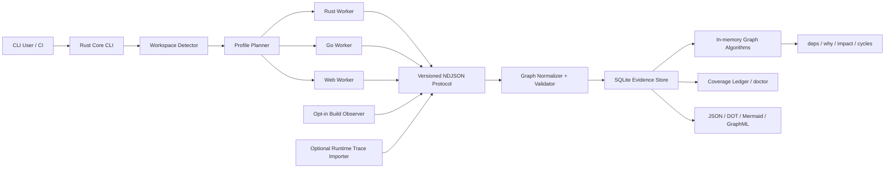

# アーキテクチャ設計: Semantic Dependency Graph CLI

## 実装ステータス

2026-07-15 時点で Milestone 0〜1 の MVP を実装済み。package/file/import/route graph、safe static scan、protocol 1.0、SQLite evidence store、query/export/doctor、Rust/Go/Web worker、native release archiveを対象とする。

safe scanではcanonical root外へのsymlink readを拒否し、相対PATH・repository内toolchain・Node実行hookを除外する。Goは制限付き`go/packages`からparser fallbackへ移行し、Cargo metadataはneutral cwdから`--frozen --offline --no-deps`で実行する。配布物はworker/runtime checksumを検証し、manifestまたは同梱layout欠損時にfail closedとする。

symbol/type/call/component/server function、build観測、incremental/watch、snapshot/diff/impact、architecture policy、runtime traceは本設計の後続Milestoneとして未実装である。

## 1. 目的

Rust、Go、Next.js、Astro、TanStack Router、TanStack Start のコードベースから、package、module、file、symbol、type、call、route、component、server function、asset、content、build dependency を共通の依存グラフとして抽出する CLI を設計する。

本ツールの中心価値は、単なる依存関係の可視化ではない。依存箇所ごとに、成立条件、解析根拠、解決精度、解析 profile、source span、未解決理由を保持し、変更影響や循環、アーキテクチャ違反を説明可能にする。

## 2. 背景と課題

既存ツールは、次のいずれか一層に特化することが多い。

- Cargo、Go Modules、npm workspace などの package graph
- JavaScript / TypeScript の import graph
- 特定言語の call graph
- framework 固有の route / bundle graph
- build 後に観測された artifact graph

一方、実際の変更影響はこれらの層を横断する。例えば、Next.js の route は Server Component、Client Component、Server Function、asset、environment variable に依存し、Rust の crate は feature、target、build script、proc macro によって形が変わる。単一の無条件グラフへ潰すと、依存の欠落または誤った確定が発生する。

## 3. スコープ

### 3.1 対象

- Rust
  - Cargo workspace / package / target / crate instance
  - module / import / re-export / item / type / trait / impl / call
  - feature / `cfg` / target / build dependency / build script / proc macro
- Go
  - module / workspace / package variant / file / import / symbol / type / call
  - build tags / GOOS / GOARCH / tests / generated files / cgo
- TypeScript / JavaScript
  - workspace / package locator / file / import / export / symbol / type / call
  - ESM / CommonJS / dynamic import / alias / package exports / type-only dependency
- Next.js
  - App Router / Pages Router / route handlers / metadata routes
  - layout / template / loading / error / proxy / instrumentation
  - Server / Client / Edge 境界、Server Function、route 別 asset
- Astro
  - `.astro` frontmatter / template component / island directive
  - filesystem route / endpoint / content collection / asset / integration
- TanStack Router
  - file-based / code-based / virtual route
  - generated route tree / lazy route / loader / beforeLoad / context / route mask
- TanStack Start
  - server function / client RPC stub / server route / middleware
  - client / SSR / server build environment

### 3.2 初期非対象

- 任意文字列から推測する HTTP API 間依存の自動確定
- 完全な data-flow / taint analysis
- 実行時依存の静的な完全確定
- IDE 本体や常駐 SaaS の提供
- Neo4j 等の外部 graph database を必須とする構成
- 対象 repository の build script や設定コードを無断で実行すること

OpenAPI、GraphQL、Protocol Buffers、FFI、HTTP trace を用いた cross-language edge は、後続 adapter として追加する。

## 4. 完全性の定義

### 4.1 保証するもの

解析対象として認識したすべての dependency site を、次の `resolution_status` のいずれかへ必ず分類する。

| Status | 意味 |
| --- | --- |
| `resolved` | profile 内で単一の依存先へ解決できた |
| `candidates` | 依存先候補を有限集合または条件式で表現できた |
| `external` | repository 外部への依存であり、外部 node へ正規化した |
| `unresolved` | 依存箇所は検出したが依存先を確定または列挙できなかった |

ファイル、構文、adapter、profile のスキップも coverage ledger へ記録する。未解決 edge を除外したまま成功扱いにはしない。

### 4.2 精度の表現

`resolution_status` と別に、edge の導出精度を `precision` として持つ。

| Precision | 意味 |
| --- | --- |
| `exact` | toolchain または型解決器が当該 profile で確定した |
| `overapprox` | false negative を減らすため候補を保守的に過大近似した |
| `heuristic` | framework convention、文字列、命名等から推定した |
| `observed` | build または runtime trace で実際に観測した |

`observed` は `exact` の代替ではない。ある profile / 入力で観測されなかったことは、依存が存在しないことを意味しない。

### 4.3 完全性レベル

- `syntax-complete`: 対象構文をすべて分類した
- `semantic-complete`: 選択 profile で意味解決を完了した
- `build-observed`: 選択 profile の build graph を統合した
- `runtime-observed`: 指定 trace を統合した

CLI は scan 結果にレベルと未達理由を出力する。

## 5. 設計原則

1. **Toolchain semantics first**
   package manifest や構文を独自再実装するより、Cargo、Go toolchain、TypeScript compiler、framework 公式 hook を優先する。
2. **No silent drops**
   解決不能な dependency site も node / diagnostic / ledger として残す。
3. **Profile-preserving graph**
   feature、target、build tag、environment が異なる instance を無条件に同一 node へ潰さない。
4. **Layered evidence**
   source、semantic、build、runtime の結果を上書きせず、別 evidence layer として統合する。
5. **Safe by default**
   デフォルト scan は対象 repository の任意コードを実行しない。
6. **Explainability**
   すべての edge から、抽出器、source span、condition、profile、導出根拠を辿れるようにする。
7. **Versioned boundaries**
   言語解析器を worker として分離し、変化の速い compiler API を core から隔離する。

## 6. 全体アーキテクチャ



### 6.1 Rust Core CLI

責務は次のとおり。

- repository root と workspace の検出
- toolchain と framework version の検出
- scan profile の計画
- worker lifecycle、timeout、cancel、stdout / stderr 分離
- protocol validation と stable ID 正規化
- graph storage、query、export、snapshot、diff
- coverage ledger と exit code の決定

core は各言語の詳細な AST / HIR 型を直接保持しない。

### 6.2 Language Worker

worker は独立 process とし、versioned NDJSON を stdout へ返す。ログは stderr へ出す。

- `depgraph-rust-worker`
- `depgraph-go-worker`
- `depgraph-web-worker`

worker の crash、timeout、部分失敗は diagnostic と ledger に記録し、他 worker が生成した graph を破棄しない。

### 6.3 Adapter Protocol

初期 protocol event は次を想定する。

- `scan_started`
- `profile_declared`
- `node_upsert`
- `edge_upsert`
- `dependency_site`
- `diagnostic`
- `file_completed`
- `profile_completed`
- `scan_completed`

各 event は `protocol_version`、`scan_id`、`adapter`、`adapter_version` を必須とする。未知の optional field は無視できるが、未知の event type と必須 field 欠落は protocol error とする。

## 7. 共通 Property Graph

### 7.1 Node 種別

| Node kind | 用途 |
| --- | --- |
| `workspace` | repository 内の workspace 境界 |
| `package_instance` | version、source、package manager locator を含む package |
| `build_unit` | Rust crate instance、Go package variant、Web build environment |
| `module` | 言語上の module / package namespace |
| `file` | source、generated、config、asset file |
| `symbol` | function、method、variable、export、item |
| `type` | named type、trait、interface、type alias |
| `component` | React / Astro component |
| `route` | framework route と URL pattern |
| `server_function` | RPC boundary を持つ server function |
| `middleware` | request / route / server function middleware |
| `content` | content collection、entry、remote source |
| `asset` | image、CSS、WASM、public file、build artifact |
| `env_key` | 値を保存しない環境変数 key |
| `native_library` | cgo、Rust native link、FFI library |
| `external_system` | repository 外部で詳細未解析の対象 |
| `unknown_target` | dependency site は存在するが終点が不明な sentinel |

### 7.2 Edge 種別

| Category | Edge kind |
| --- | --- |
| Structure | `contains`, `declares`, `generated_from` |
| Package | `depends_on`, `enables_feature`, `build_depends_on` |
| Module | `imports`, `reexports`, `lazy_imports`, `side_effect_imports` |
| Type | `type_uses`, `extends`, `implements`, `bounds`, `instantiates` |
| Call | `calls`, `may_call`, `registers` |
| UI | `renders`, `hydrates`, `client_boundary`, `server_boundary` |
| Routing | `route_entry`, `parent_route`, `loads`, `before_load`, `navigates_to`, `masks_to` |
| RPC | `rpc_call`, `client_stub_for`, `handled_by`, `uses_middleware` |
| Build | `expands`, `generates`, `links`, `emits`, `bundles` |
| Resource | `reads_env`, `reads_content`, `consumes_asset` |

edge kind は追加可能とするが、既存 kind の意味を protocol version 内で変更しない。

### 7.3 必須 Property

すべての edge は次を保持する。

```json
{
  "id": "edge:sha256:...",
  "source": "ts://workspace/app/src/page.tsx#Page",
  "target": "route://next/app/products/$id",
  "kind": "route_entry",
  "phase": "semantic",
  "environment": "server",
  "profile_id": "web:production:server",
  "condition": "mode == production && runtime == server",
  "resolution_status": "resolved",
  "precision": "exact",
  "evidence": {
    "extractor": "next-static-adapter",
    "extractor_version": "0.1.0",
    "path": "src/app/products/[id]/page.tsx",
    "start_line": 1,
    "start_column": 1,
    "end_line": 1,
    "end_column": 42
  },
  "generated": false
}
```

候補が複数ある場合は、dependency site と各候補 edge を同じ `site_id` で結び、候補集合を再構成できるようにする。

### 7.4 Stable ID

stable ID は表示名ではなく、言語 resolver が返す canonical identity と package instance を基にする。

- file: repository identity + normalized relative path
- Rust item: package ID + crate instance + canonical module path + item identity
- Go object: module path + version / replace + package path + object identity
- npm symbol: package manager locator + runtime file + export / symbol identity
- route: framework + router instance + canonical route pattern + environment

local variable、anonymous function、generated wrapper 等は source span と生成元 identity を用いる。ファイル移動をまたぐ完全な ID 安定性は保証せず、snapshot diff では rename detection を別途行う。

## 8. Profile と条件付き Graph

### 8.1 共通 Profile

profile は、解析結果を再現するための入力 snapshot である。

```yaml
id: rust:test:linux-x86_64:feature-set-a
toolchain: rustc 1.x
command: test
target: x86_64-unknown-linux-gnu
features:
  - feature-a
environment_allowlist:
  - CARGO_CFG_TARGET_OS
source_revision: <git-sha-or-worktree-hash>
```

### 8.2 Rust 条件

- Cargo command: check / build / test / bench / doc
- target triple
- feature set
- `cfg` expression
- normal / dev / build dependency
- lib / bin / example / test / bench / build-script / proc-macro target

`--all-features` は全構成の union ではなく一つの feature set として扱う。相互排他的 feature を含む可能性があるため、既定 matrix を自動的に「全組合せ」とはしない。

### 8.3 Go 条件

- module / workspace / replace 状態
- GOOS / GOARCH
- user build tags
- cgo enabled / disabled
- compiler / release tags
- normal / internal test / external test variant

build constraint は Boolean condition として保存し、単一 scan で非活性 file を削除しない。

### 8.4 Web 条件

- package manager と package locator
- development / production / test
- browser / server / edge / worker
- ESM / CommonJS と export conditions
- TypeScript `moduleResolution`
- bundler alias / virtual module / plugin
- framework version と framework config

TypeScript の `type_target` と runtime / bundler の `runtime_target` は別 edge として保持できるようにする。

## 9. Rust Adapter

### 9.1 Safe Semantic Scan

1. `cargo metadata --format-version 1` で workspace、package、target、dependency、resolved feature を取得する。
2. rust-analyzer の project model で crate graph と active `cfg` を構築する。
3. HIR / Semantics を用いて module、import、re-export、type、trait、impl、direct call を解決する。
4. macro invocation と展開結果の provenance を可能な範囲で保持する。

`syn` や tree-sitter は、toolchain を利用できない場合の syntax inventory と broken source の fallback に限定する。

### 9.2 Compiler-precise Scan

将来の opt-in backend として次を検討する。

- Cargo unit graph
- `RUSTC_WRAPPER`
- typed MIR
- monomorphized item graph

nightly / `rustc_private` への依存は version 固定した worker 内へ隔離し、MVP の必須条件にしない。

### 9.3 実行コード境界

build script と proc macro は任意コードを実行できる。safe mode では自動実行せず、未展開または既存 artifact 利用として ledger へ記録する。実行する場合は `resolve --build --allow-project-code` を明示必須とする。

## 10. Go Adapter

### 10.1 Package / Type Scan

1. `go env`、`go.work`、`go.mod` の toolchain snapshot を取得する。
2. `go/packages.Load` で source、compiled file、test variant、module、embed 情報を取得する。
3. AST と `go/types.Info` から definition、use、selection、type、method set、generic instance を生成する。
4. named object は object identity、local object は source span で stable ID を作る。

### 10.2 Call Graph

- static direct call: `exact`
- main / test program: RTA を基本候補とする
- library / partial program: CHA を保守的候補とする
- VTA: opt-in refinement とし、experimental 性を diagnostic に残す

reflection、`unsafe`、`go:linkname`、assembly、plugin、native callback は `overapprox` または `unresolved` とする。

### 10.3 Generated / cgo

- 標準 generated marker を検出する
- `go:generate` は generator invocation として記録するが、入出力対応を根拠なく確定しない
- cgo file、directive、native library、header reference を記録する
- C / C++ include graph や native call graph は将来の Clang adapter に委譲する

## 11. Web Adapter

### 11.1 TypeScript / JavaScript Core

- project local の TypeScript version を優先する
- `createProgram`、`TypeChecker`、module resolver を利用する
- import / export / re-export / type-only / `require` / literal dynamic import を抽出する
- template / computed import は有限候補または unresolved site とする
- workspace と lockfile から npm / pnpm / Yarn / Bun の package instance を生成する
- pnpm peer dependency や Yarn PnP は `name@version` ではなく locator 単位で識別する

### 11.2 Next.js

safe scan では、App / Pages Router の filesystem convention、special file、directive、literal config を解析する。

- route group / dynamic / catch-all / parallel / intercepting route
- page / layout / template / loading / error / route handler
- metadata / proxy / instrumentation
- `use client` / `use server` / `use cache`
- `next/dynamic` と literal `import()`

build scan では Next Adapter API を observer として利用し、final config、routing phase、output、asset、runtime を取得する。既存 adapter と競合する場合は無断置換せず、chain 可否を検出して失敗理由を返す。

### 11.3 Astro

- `@astrojs/compiler` で `.astro` AST を取得する
- frontmatter は TypeScript adapter へ渡す
- template tag を import symbol へ結び `renders` edge を生成する
- `client:*`、`client:only`、`server:defer` を environment edge として保持する
- filesystem route、endpoint、content collection、asset を解析する

build scan では observer integration と Vite plugin を用い、resolved config、injected route、client / SSR module graph、emitted asset を取得する。

### 11.4 TanStack Router

- file-based route directory と config を解析する
- `routeTree.gen.ts` を file-based / virtual route の最終構造を示す generated evidence として扱う
- source route と generated route tree の drift を diagnostic にする
- code-based route の `createRootRoute`、`createRoute`、`addChildren` を TypeChecker で追跡し、宣言上の親と実際に登録された子を別 edge にする
- virtual route config を解析する
- lazy route、loader、beforeLoad、context、navigation、route mask を typed edge にする

任意ループや runtime data で route を構築する場合は、確定 route として扱わず候補または unresolved とする。

### 11.5 TanStack Start

- `createServerFn` chain を server function node へ正規化する
- client import / call から `rpc_call` edge を生成する
- build が生成する RPC stub を `client_stub_for` で handler と結ぶ
- validator、handler、middleware、HTTP method、server route を保持する
- loader / component / hook から server function への依存を追跡する
- Vite の client / SSR / server graph を別 environment として保持する
- production の server function ID は自前計算せず、custom generator と collision suffix を反映した build evidence から取得する
- Start の internal virtual module を読む collector は framework version を固定し、取得できない場合は該当 site を unresolved として残す
- route-level middleware の継承、handler-level middleware、pathless layout と break-out による継承遮断を別 edge と condition で表す

## 12. Scan Mode と Security

### 12.1 `scan`

デフォルト。対象 repository の任意コードを実行しない。

- manifest と source を読み取る
- 既存 generated file / build artifact は provenance 付きで参照可能
- executable config は静的に解析する
- 実行が必要な項目は unresolved / skipped reason として残す

### 12.2 `resolve --build`

明示 opt-in。対象 project の build tool、config、plugin、build script、proc macro が実行され得る。

最低限、次を実施する。

- child process 分離
- timeout と cancel
- environment allowlist
- secret value 非保存と既知 key の redaction
- command、cwd、toolchain、environment key 名の audit log
- 一時 output directory
- 可能な環境では network 無効化を推奨

build 結果は semantic graph を上書きせず、`phase=build` / `precision=observed` の evidence として union する。

### 12.3 Runtime Trace

初期版では外部 trace の import interface のみ定義する。runtime observer の常駐や自動 instrumentation は後続とする。

## 13. Storage と Incremental Update

### 13.1 永続化

SQLite を canonical local store とする。

- schema migration が容易
- evidence と source span を正規化して検索できる
- recursive CTE で小規模 query を実行できる
- 単一ファイルで cache / artifact として扱える

graph algorithm は必要な subgraph を `petgraph` 等へロードして実行する。外部 graph DB は optional exporter とする。

### 13.2 Cache Key

cache は次を含む hash で識別する。

- file content
- manifest / lockfile / config content
- adapter と protocol version
- compiler / toolchain / framework version
- profile
- generated artifact fingerprint

同じ file でも profile が異なれば semantic result を共有できない場合があるため、profile-independent syntax cache と profile-dependent semantic cache を分ける。

### 13.3 更新単位

- 変更 file の node / edge / site を transaction 内で置換する
- package / config / lockfile 変更時は関連 workspace profile を再計画する
- generated route tree や macro expansion の生成元変更時は dependent artifact を invalidation する
- 途中失敗では直前の completed snapshot を保持する

## 14. CLI UX

```text
depgraph init
depgraph scan [PATH] [--profile NAME] [--strict]
depgraph resolve --build [PATH] [--allow-project-code]
depgraph doctor [--json]
depgraph deps <SELECTOR> [--transitive]
depgraph dependents <SELECTOR> [--transitive]
depgraph why <FROM> <TO>
depgraph impact <SELECTOR> [--changed <GIT_REF>]
depgraph cycles [--level package|file|symbol|route]
depgraph unresolved [--profile NAME]
depgraph snapshot create <NAME>
depgraph diff <FROM> <TO>
depgraph export --format json|dot|mermaid|graphml
```

selector は path、stable ID、package、symbol、route pattern を受け付ける。曖昧な selector は候補を返し、暗黙に先頭を選択しない。

### 14.1 `why`

最短 path だけでなく、edge ごとの condition、profile、precision、source span を表示する。複数 evidence layer がある場合はまとめて表示する。

### 14.2 `doctor`

- toolchain / worker availability
- skipped files / parser errors
- unresolved / candidates / external counts
- build code 実行有無
- profile coverage
- generated source drift
- protocol / cache schema version

## 15. Coverage Ledger

scan ごとに次を保存する。

```text
profiles:               6
files discovered:       12,480
files analyzed:         12,476
files skipped:          4
dependency sites:       81,204
resolved:               78,901
candidates:             1,812
external:               431
unresolved:             60
project code executed:  no
completeness:            syntax-complete
```

`--strict` の既定失敗条件は設定可能とする。初期既定は次を想定する。

- skipped file が 1 件以上
- adapter crash / protocol error
- unsupported syntax を検出
- unresolved が policy threshold を超過

external dependency と明示された候補 edge は、それだけでは strict failure にしない。

## 16. Error Handling と Exit Code

| Exit code | 意味 |
| --- | --- |
| `0` | 要求された操作が完了し、policy 違反なし |
| `1` | graph / coverage / architecture policy 違反 |
| `2` | CLI usage / config error |
| `3` | adapter / toolchain / protocol failure |
| `4` | project code 実行許可または security policy error |

解析エラー時も、生成済み partial graph と diagnostic report を閲覧可能にする。ただし incomplete snapshot を current successful snapshot として昇格しない。

## 17. Query と Policy

MVP では専用 subcommand を優先し、独自 query language は導入しない。

後続で次を検討する。

- layer / package boundary rule
- forbidden dependency
- route から server-only / client-only への違反
- public API change impact
- dependency depth / fan-in / fan-out threshold
- package / file / symbol / route 単位の cycle policy

policy result も evidence span を持ち、CI annotation へ変換できるようにする。

## 18. Testing Strategy

### 18.1 Golden Fixture

各 dependency site が `resolved / candidates / external / unresolved` のいずれかへ分類されることを期待 graph と比較する。

### 18.2 Rust Fixture

- workspace、renamed / optional / target-specific dependency
- lib / bin / example / test / build script / proc macro
- module file、inline module、`#[path]`、glob / alias re-export
- feature / `cfg` / target matrix
- trait dispatch、function pointer、macro-generated item

### 18.3 Go Fixture

- go.mod / go.work / replace / vendor
- normal / internal test / external test package
- build tags、GOOS / GOARCH、cgo
- generics、interface dispatch、reflection、generated file
- embed、go:generate、assembly boundary

### 18.4 Web Fixture

- ESM / CJS / type-only / package exports / path alias
- npm / pnpm / Yarn workspace と peer dependency
- dynamic import、glob、virtual module、CSS / asset
- Next App / Pages Router と server / client / edge
- Astro component / island / route / content / integration
- TanStack file / code / virtual route、lazy、mask
- TanStack Start server function / server route / middleware

### 18.5 Cross-check

- toolchain / compiler output との照合
- framework build observer との照合
- snapshot determinism
- protocol backward compatibility
- adapter crash / timeout / malformed output
- broken source と部分解析
- secret redaction

## 19. 非機能要件

### 19.1 決定性

同一 source、toolchain、adapter、profile から同一 stable ID、graph、coverage summary を生成する。出力順は canonical sort する。

### 19.2 性能目標

目標値は benchmark fixture を作成後に確定する。暫定目標は次のとおり。

- 10,000 source files の safe initial scan: 開発機で 30 秒以内
- 1 file 変更の incremental semantic scan: build を除き 2 秒以内
- query latency: warm cache の file / package impact で 500 ms 以内

性能のために dependency site を省略してはならない。

### 19.3 対応環境

- Tier 1: macOS、Linux
- Tier 2: Windows
- offline safe scan を可能にする
- worker 不在時は対応言語全体を黙って無視せず diagnostic を返す

## 20. 採用判断

### ADR-001: Rust Core + Native Worker

**採用。** 単一 tree-sitter resolver では各 toolchain の意味解決を再現できない。Rust core は graph と orchestration に集中し、Go と Web は native ecosystem の worker に委譲する。

### ADR-002: Greenfield Core

**採用。** 既存の code graph CLI は walker、watch、query、export の参考になるが、条件付き graph、source span、profile、provenance、framework semantics を第一級にするには parser / resolver / schema の大半を置換する必要がある。

### ADR-003: SQLite + In-memory Graph

**採用。** local-first、単体配布、migration、evidence query を優先し、外部 graph DB を必須にしない。

### ADR-004: Safe Scan Default

**採用。** build script、proc macro、JavaScript config、framework plugin は任意コードを実行できる。build observation は明示許可された別 mode とする。

### ADR-005: Evidence Layer Union

**採用。** build / runtime 結果で static graph を上書きしない。矛盾も evidence と diagnostic として保持する。

## 21. Roadmap

### Milestone 0: Schema and Contract

- versioned adapter protocol
- node / edge / dependency site schema
- profile schema
- coverage ledger
- golden fixture harness

### Milestone 1: Static Graph MVP

- workspace / package / file / import graph
- Rust / Go / TypeScript worker
- Next / Astro / TanStack route graph
- deps / dependents / why / cycles / unresolved
- JSON / DOT / Mermaid export

### Milestone 2: Semantic Graph

- Rust HIR
- Go types / SSA
- TypeScript TypeChecker
- symbol / type / direct call / candidate call
- component / route / server function edge

### Milestone 3: Build Evidence

- safe execution boundary
- Next Adapter observer
- Astro integration / Vite observer
- TanStack Start build observer
- Rust build script / proc macro opt-in
- profile matrix union

### Milestone 4: Incremental and CI

- watcher / daemon
- snapshot / diff / git impact
- architecture policy
- CI annotations
- runtime trace importer

## 22. MVP 受け入れ基準

1. 対象 repository から Rust、Go、Next.js、Astro、TanStack Router / Start を自動検出できる。
2. 対応 source の静的 import / dependency site を ledger へ全件計上できる。
3. package、file、route graph を共通 schema へ格納できる。
4. 各 edge が profile、condition、precision、resolution status、evidence span を持つ。
5. `why` で二 node 間の依存 path と根拠を表示できる。
6. `doctor` で skipped / unresolved / candidate / external を報告できる。
7. `--strict` が incomplete scan を非 0 で終了できる。
8. JSON、DOT、Mermaid の export ができる。
9. safe scan では対象 project の任意コードを実行しない。
10. 同一入力と profile に対して決定的な graph を生成できる。

## 23. Open Questions

- binary / product の最終名称を `depgraph` とするか
- Go worker と Node worker を release artifact にどう同梱するか
- project local TypeScript version と bundled fallback の優先規則
- Next.js の既存 adapter と observer を安全に chain する方法
- default profile matrix の範囲と組合せ爆発の抑制方法
- Rust compiler-precise backend をどの toolchain channel で提供するか
- GraphQL / OpenAPI / Protocol Buffers / FFI adapter の優先順位
- public OSS とするか、初期は private 検証とするか
- graph query language を導入する時期

## 24. 参考資料

- Cargo metadata: https://doc.rust-lang.org/cargo/commands/cargo-metadata.html
- rust-analyzer architecture: https://rust-analyzer.github.io/book/contributing/architecture.html
- Go packages: https://pkg.go.dev/golang.org/x/tools/go/packages
- Go types: https://pkg.go.dev/go/types
- TypeScript module resolution: https://www.typescriptlang.org/docs/handbook/modules/reference
- Next.js Adapters API: https://nextjs.org/docs/app/api-reference/adapters/api-reference
- Astro compiler: https://github.com/withastro/compiler
- Astro Integration API: https://docs.astro.build/en/reference/integrations-reference/
- TanStack Router file-based routing: https://tanstack.com/router/latest/docs/routing/file-based-routing
- TanStack Start server functions: https://tanstack.com/start/latest/docs/framework/react/guide/server-functions

## 25. 関連ドキュメント

- 現時点ではなし。上流要件文書と下流テスト仕様は実装計画の確定後に追加する。

## 26. 更新履歴

- 2026-07-15: 初版を作成
