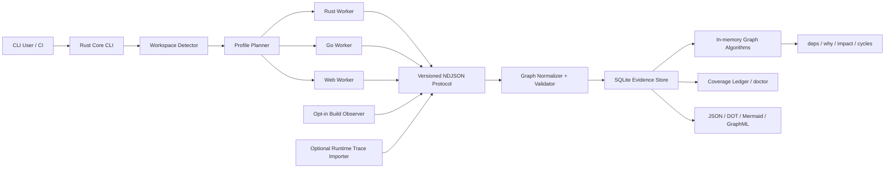

# アーキテクチャ設計: Semantic Dependency Graph CLI

## 実装ステータス

2026-07-17 時点で Milestone 0〜1 の MVP に加え、Milestone 2 の Go semantic vertical sliceを実装済みである。Go workerは制限付き`go/packages`、`go/types`、serial SSAからsymbol/type/generic instance、`declares`、`extends`、`implements`、`instantiates`、`type_uses`、exact `calls`、RTA/CHA candidate `may_call`をprotocol semantic graphとして出力する。これらはSQLite evidence storeへ保存され、symbol/type selector、deps/dependents/why/cycles、JSON/DOT/Mermaid exportの対象となる。

safe scanではcanonical root外へのsymlink readを拒否し、相対PATH・repository内toolchain・Node実行hookを除外する。Goは制限付き`go/packages`からparser fallbackへ移行する。Cargo metadataはpath-bearing inputのpreflight後、admitted manifest、lockfile、target discovery layoutだけを持つworker-owned confined mirrorに対してneutral cwdから`--frozen --offline --no-deps`で実行し、返却されたtemporary pathをinventory IDへ戻す。配布物はworker/runtime checksumを検証し、manifestまたは同梱layout欠損時にfail closedとする。

Rust は rust-analyzer `0.0.330`、upstream revision `8954b66d43225e62c92e8bbcc8500191b5cceb1e`、Salsa `0.26.1` の exact pin、neutral toolchain probe、inventory bytes 専用の in-memory HIR smoke scaffold、Cargo read-confinement preflight / mirror、safe multi-file project modelに加え、HIR definition graph vertical sliceまで実装済みである。compatibleなexact toolchain / targetとconfined Cargo DTOでは、inventory-only databaseからcanonical `symbol` / `type` node、semantic source evidence、site-less `declares` / `extends` / `implements` / `instantiates` relationを抽出し、strict validation後にsyntax graphへatomicにunionする。import / re-export / `type_uses`はIssue #27、call resolutionはIssue #28、最終fallback / coverageと`semantic-complete`判定はIssue #29、release gateはIssue #30に残るため、definition graphの成功だけで`semantic-complete`を申告しない。TypeScript TypeChecker、frameworkのcomponent/server function semantic edge、build観測、incremental/watch、snapshot/diff/impact、architecture policy、runtime traceは本設計の後続Milestoneとして未実装である。Go VTAおよびreflection/native境界の追加refinementも未実装である。

## 1. 目的

Rust、Go、Next.js、Astro、TanStack Router、TanStack Start のコードベースから、package、module、file、symbol、type、call、route、component、server function、asset、content、build dependency を共通の依存グラフとして抽出する CLI を設計する。

本ツールの中心価値は、単なる依存関係の可視化ではない。依存箇所ごとに、成立条件、解析根拠、解決精度、解析 profile、source span、未解決理由を保持し、変更影響や循環、アーキテクチャ違反を説明可能にする。

## 2. 背景と課題

既存ツールは、次のいずれか一層に特化することが多い。

- Cargo、Go Modules、npm workspace などの package graph
- JavaScript / TypeScript の import graph
- 特定言語の call graph
- framework 固有の route / bundle graph
- build 後に観測された artifact graph

一方、実際の変更影響はこれらの層を横断する。例えば、Next.js の route は Server Component、Client Component、Server Function、asset、environment variable に依存し、Rust の crate は feature、target、build script、proc macro によって形が変わる。単一の無条件グラフへ潰すと、依存の欠落または誤った確定が発生する。

## 3. スコープ

### 3.1 対象

- Rust
  - Cargo workspace / package / target / crate instance
  - module / import / re-export / item / type / trait / impl / call
  - feature / `cfg` / target / build dependency / build script / proc macro
- Go
  - module / workspace / package variant / file / import / symbol / type / call
  - build tags / GOOS / GOARCH / tests / generated files / cgo
- TypeScript / JavaScript
  - workspace / package locator / file / import / export / symbol / type / call
  - ESM / CommonJS / dynamic import / alias / package exports / type-only dependency
- Next.js
  - App Router / Pages Router / route handlers / metadata routes
  - layout / template / loading / error / proxy / instrumentation
  - Server / Client / Edge 境界、Server Function、route 別 asset
- Astro
  - `.astro` frontmatter / template component / island directive
  - filesystem route / endpoint / content collection / asset / integration
- TanStack Router
  - file-based / code-based / virtual route
  - generated route tree / lazy route / loader / beforeLoad / context / route mask
- TanStack Start
  - server function / client RPC stub / server route / middleware
  - client / SSR / server build environment

### 3.2 初期非対象

- 任意文字列から推測する HTTP API 間依存の自動確定
- 完全な data-flow / taint analysis
- 実行時依存の静的な完全確定
- IDE 本体や常駐 SaaS の提供
- Neo4j 等の外部 graph database を必須とする構成
- 対象 repository の build script や設定コードを無断で実行すること

OpenAPI、GraphQL、Protocol Buffers、FFI、HTTP trace を用いた cross-language edge は、後続 adapter として追加する。

## 4. 完全性の定義

### 4.1 保証するもの

解析対象として認識したすべての dependency site を、次の `resolution_status` のいずれかへ必ず分類する。

| Status | 意味 |
| --- | --- |
| `resolved` | profile 内で単一の依存先へ解決できた |
| `candidates` | 依存先候補を有限集合または条件式で表現できた |
| `external` | repository 外部への依存であり、外部 node へ正規化した |
| `unresolved` | 依存箇所は検出したが依存先を確定または列挙できなかった |

ファイル、構文、adapter、profile のスキップも coverage ledger へ記録する。未解決 edge を除外したまま成功扱いにはしない。

### 4.2 精度の表現

`resolution_status` と別に、edge の導出精度を `precision` として持つ。

| Precision | 意味 |
| --- | --- |
| `exact` | toolchain または型解決器が当該 profile で確定した |
| `overapprox` | false negative を減らすため候補を保守的に過大近似した |
| `heuristic` | framework convention、文字列、命名等から推定した |
| `observed` | build または runtime trace で実際に観測した |

`observed` は `exact` の代替ではない。ある profile / 入力で観測されなかったことは、依存が存在しないことを意味しない。

### 4.3 完全性レベル

- `syntax-complete`: 対象構文をすべて分類した
- `semantic-complete`: 選択 profile で意味解決を完了した
- `build-observed`: 選択 profile の build graph を統合した
- `runtime-observed`: 指定 trace を統合した

CLI は scan 結果にレベルと未達理由を出力する。

## 5. 設計原則

1. **Toolchain semantics first**
   package manifest や構文を独自再実装するより、Cargo、Go toolchain、TypeScript compiler、framework 公式 hook を優先する。
2. **No silent drops**
   解決不能な dependency site も node / diagnostic / ledger として残す。
3. **Profile-preserving graph**
   feature、target、build tag、environment が異なる instance を無条件に同一 node へ潰さない。
4. **Layered evidence**
   source、semantic、build、runtime の結果を上書きせず、別 evidence layer として統合する。
5. **Safe by default**
   デフォルト scan は対象 repository の任意コードを実行しない。
6. **Explainability**
   すべての edge から、抽出器、source span、condition、profile、導出根拠を辿れるようにする。
7. **Versioned boundaries**
   言語解析器を worker として分離し、変化の速い compiler API を core から隔離する。

## 6. 全体アーキテクチャ



### 6.1 Rust Core CLI

責務は次のとおり。

- repository root と workspace の検出
- toolchain と framework version の検出
- scan profile の計画
- worker lifecycle、timeout、cancel、stdout / stderr 分離
- protocol validation と stable ID 正規化
- graph storage、query、export、snapshot、diff
- coverage ledger と exit code の決定

core は各言語の詳細な AST / HIR 型を直接保持しない。

### 6.2 Language Worker

worker は独立 process とし、versioned NDJSON を stdout へ返す。ログは stderr へ出す。

- `depgraph-rust-worker`
- `depgraph-go-worker`
- `depgraph-web-worker`

worker の crash、timeout、部分失敗は diagnostic と ledger に記録し、他 worker が生成した graph を破棄しない。

### 6.3 Adapter Protocol

初期 protocol event は次を想定する。

- `scan_started`
- `profile_declared`
- `node_upsert`
- `edge_upsert`
- `dependency_site`
- `diagnostic`
- `file_completed`
- `profile_completed`
- `scan_completed`

各 event は `protocol_version`、`scan_id`、`adapter`、`adapter_version` を必須とする。未知の optional field は無視できるが、未知の event type と必須 field 欠落は protocol error とする。

## 7. 共通 Property Graph

### 7.1 Node 種別

| Node kind | 用途 |
| --- | --- |
| `workspace` | repository 内の workspace 境界 |
| `package_instance` | version、source、package manager locator を含む package |
| `build_unit` | Rust crate instance、Go package variant、Web build environment |
| `module` | 言語上の module / package namespace |
| `file` | source、generated、config、asset file |
| `symbol` | function、method、variable、export、item |
| `type` | named type、trait、interface、type alias |
| `component` | React / Astro component |
| `route` | framework route と URL pattern |
| `server_function` | RPC boundary を持つ server function |
| `middleware` | request / route / server function middleware |
| `content` | content collection、entry、remote source |
| `asset` | image、CSS、WASM、public file、build artifact |
| `env_key` | 値を保存しない環境変数 key |
| `native_library` | cgo、Rust native link、FFI library |
| `external_system` | repository 外部で詳細未解析の対象 |
| `unknown_target` | dependency site は存在するが終点が不明な sentinel |

### 7.2 Edge 種別

| Category | Edge kind |
| --- | --- |
| Structure | `contains`, `declares`, `generated_from` |
| Package | `depends_on`, `enables_feature`, `build_depends_on` |
| Module | `imports`, `reexports`, `lazy_imports`, `side_effect_imports` |
| Type | `type_uses`, `extends`, `implements`, `bounds`, `instantiates` |
| Call | `calls`, `may_call`, `registers` |
| UI | `renders`, `hydrates`, `client_boundary`, `server_boundary` |
| Routing | `route_entry`, `parent_route`, `loads`, `before_load`, `navigates_to`, `masks_to` |
| RPC | `rpc_call`, `client_stub_for`, `handled_by`, `uses_middleware` |
| Build | `expands`, `generates`, `links`, `emits`, `bundles` |
| Resource | `reads_env`, `reads_content`, `consumes_asset` |

edge kind は追加可能とするが、既存 kind の意味を protocol version 内で変更しない。

### 7.3 必須 Property

すべての edge は次を保持する。

```json
{
  "id": "edge:sha256:...",
  "source": "symbol:sha256:...",
  "target": "route:sha256:...",
  "kind": "route_entry",
  "site_id": "site:sha256:...",
  "phase": "semantic",
  "environment": "server",
  "profile_id": "web:production:server",
  "condition": {
    "op": "all",
    "conditions": [
      { "op": "eq", "key": "mode", "value": "production" },
      { "op": "eq", "key": "runtime", "value": "server" }
    ]
  },
  "resolution_status": "resolved",
  "precision": "exact",
  "evidence": [
    {
      "kind": "semantic",
      "extractor": "next-static-adapter",
      "extractor_version": "0.1.0",
      "path": "src/app/products/[id]/page.tsx",
      "start_line": 1,
      "start_column": 1,
      "end_line": 1,
      "end_column": 42,
      "properties": {}
    }
  ],
  "generated": false
}
```

候補が複数ある場合は、dependency site と各候補 edge を同じ `site_id` で結び、候補集合を再構成できるようにする。

### 7.4 Stable ID

stable ID は表示名ではなく、言語 resolver が返す canonical identity と package instance を基にする。

- file: repository identity + normalized relative path
- Rust item: package ID + crate instance + canonical module path + item identity
- Go object: module path + version / replace + package path + object identity
- npm symbol: package manager locator + runtime file + export / symbol identity
- route: framework + router instance + canonical route pattern + environment

local variable、anonymous function、generated wrapper 等は source span と生成元 identity を用いる。ファイル移動をまたぐ完全な ID 安定性は保証せず、snapshot diff では rename detection を別途行う。

### 7.5 Semantic Graph Contract（protocol 1.0）

protocol 1.0 の node / edge kind は open vocabulary だが、Milestone 2 の worker は次の規約を共通 contract とする。`symbol` / `type` node は通常の必須 field に加え、`properties` に以下を必須とする。

後方互換性のため、protocol 1.0 の root Schema と通常の `validate_ndjson` / `validate_safe_ndjson` は kind の open vocabulary を維持する。Milestone 2 worker は Schema の `$defs.semantic_node` / `$defs.semantic_edge` / `$defs.semantic_site` と、Rust の `validate_semantic_ndjson` / `validate_safe_semantic_ndjson` を明示的に選び、この節の追加契約を検証する。

| Node kind | 必須 property | 意味 |
| --- | --- | --- |
| `symbol` | `language`, `package_locator`, `symbol_kind`, `canonical_identity` | resolver が返した function、method、variable、export、item 等の identity |
| `type` | `language`, `package_locator`, `type_kind`, `canonical_identity` | resolver が返した named type、trait、interface、type alias 等の identity |

`package_locator` は package manager / resolver が決めた package instance identity であり、version、source、replace、peer context 等を必要に応じて含める。`canonical_identity` は node ID の hash 入力そのものを JSON object で保持し、top-level の `language`、`package_locator`、`symbol_kind` / `type_kind` と同じ値を含める。symbol identity は `identity_kind` を `named / local / anonymous / generated` から必須で選ぶ。`named` は `resolver_identity` を必須とし、それ以外は `enclosing_symbol` または `generated_from`、normalized relative path、1-origin の source span を必須とする。`local_*` と `parameter`、`anonymous_*` と `closure / lambda`、`generated_*` の予約済み `symbol_kind` は、それぞれ同名の identity category と一致させる。set として扱う配列は producer が canonical sort し、generic argument 等の順序に意味がある配列は resolver order を保持する。

```text
symbol node ID = stable_id_from_value("symbol", canonical_identity)
type node ID   = stable_id_from_value("type", canonical_identity)
```

semantic dependency site と edge は次の規約に従う。

| Edge kind | source / target | 許可する resolution | 用途 |
| --- | --- | --- | --- |
| `type_uses` | 利用元 `symbol` または `type` / `type` または sentinel | `resolved`, `candidates`, `external`, `unresolved` | signature、body、constraint 等からの型参照 |
| `calls` | caller `symbol` / 単一 callee `symbol` または sentinel | `resolved`, `external`, `unresolved` | static direct call または認識済みだが未解決の direct call site |
| `may_call` | caller `symbol` / 候補 callee `symbol` | `candidates` のみ | interface dispatch 等の保守的 call graph |

resolution と precision、target は次の組み合わせに固定する。

- `resolved` は concrete `symbol` / `type` 1件を指し、`precision=exact` とする。
- `candidates` は canonical sort した concrete target 1件以上を持ち、`precision=overapprox` とする。候補が1件でも動的dispatchの一意性が証明されていなければ `resolved` へ昇格しない。call site は候補ごとの `may_call` edge、type site は候補ごとの `type_uses` edgeを生成する。
- `external` は `external_system` node 1件を指す。worker が target locator を canonical external identity として確定した場合は `exact`、境界またはspecifierだけを特定した場合は `heuristic` と申告する。共通 validator は sentinel kind と status / precision の組み合わせを検証し、locator の言語固有な正確性は各 worker の contract test で検証する。
- `unresolved` は `unknown_target` node 1件を指し、`precision=heuristic` と非空の `reason` を必須とする。

- edge は `phase=semantic` とする。edge と dependency site の `evidence[0]` は dependency occurrence を表す primary evidence とし、`kind=semantic`、extractor、extractor version、normalized relative path、完全な source span を必須とする。site ID は常にこの primary spanから作る。追加 evidence は primary の後で canonical JSON順に並べる。
- direct call は target 1件の dependency site と `calls` edge 1件で表す。
- candidate call は call site 1件につき dependency site 1件と候補ごとの `may_call` edge を生成する。全 candidate edge は同じ `site_id`、`resolution_status=candidates`、`precision=overapprox` を持つ。site と各 edge の primary evidence は、RTA、CHA、VTA 等の解析方式を非空の `evidence[0].properties.algorithm` に必須で記録する。
- site ID の canonical input は `source`、site `kind`、`profile_id`、canonical condition、normalized path、source span とする。候補 target 集合は候補増減で site identity を変えないため含めない。
- edge ID の canonical input は `site_id`、edge `kind`、`target` とする。これにより同じ site の候補を独立に追加・削除できる。
- worker は `stable_id_from_value("site", input)` と `stable_id_from_value("edge", input)` を使用する。candidate target ID は昇順にする。event は `scan_started`、`profile_declared`（ID順）、`node_upsert`（node ID順）、`dependency_site`（site ID順）、`edge_upsert`（edge ID順）、`diagnostic`（ID順）、`file_completed`（path順）、`profile_completed`（profile ID順）、`scan_completed` の順に出力する。

`crates/depgraph-protocol/tests/fixtures/protocol-v1.semantic.golden.ndjson` をこの contract の互換性 fixture とする。既存の source phase fixture は protocol 1.0 の後方互換 fixture として変更しない。

## 8. Profile と条件付き Graph

### 8.1 共通 Profile

profile は、解析結果を再現するための入力 snapshot である。

```yaml
id: rust:test:linux-x86_64:feature-set-a
toolchain: rustc 1.x
command: test
target: x86_64-unknown-linux-gnu
features:
  - feature-a
environment_allowlist:
  - CARGO_CFG_TARGET_OS
source_revision: <git-sha-or-worktree-hash>
```

### 8.2 Rust 条件

- Cargo command: check / build / test / bench / doc
- target triple
- feature set
- `cfg` expression
- normal / dev / build dependency
- lib / bin / example / test / bench / build-script / proc-macro target

`--all-features` は全構成の union ではなく一つの feature set として扱う。相互排他的 feature を含む可能性があるため、既定 matrix を自動的に「全組合せ」とはしない。

### 8.3 Go 条件

- module / workspace / replace 状態
- GOOS / GOARCH
- user build tags
- cgo enabled / disabled
- compiler / release tags
- normal / internal test / external test variant

build constraint は Boolean condition として保存し、単一 scan で非活性 file を削除しない。

### 8.4 Web 条件

- package manager と package locator
- development / production / test
- browser / server / edge / worker
- ESM / CommonJS と export conditions
- TypeScript `moduleResolution`
- bundler alias / virtual module / plugin
- framework version と framework config

TypeScript の `type_target` と runtime / bundler の `runtime_target` は別 edge として保持できるようにする。

## 9. Rust Adapter

### 9.1 現状と採用 backend

Milestone 1 の Rust worker は `syn` による syntax-only adapter である。path-bearing Cargo inputのpreflightとconfined mirror構築に成功し、`cargo metadata --format-version 1 --no-deps --frozen --offline` がmirrorに対して完了した場合は、inventory identityへremap済みのworkspace member、target、dependency declarationを利用する。preflight、mirror構築、command、DTO検証のいずれかが失敗した場合は、confinedなmanifest / lockfileの静的解析へfallbackする。`--no-deps` の出力は完全なresolve graphではなく、現在のfeature listもworkspace全体を決定的に近似した値である。この結果に`semantic-complete`を付与しない。

Cargoへ元repositoryのmanifest pathは渡さない。`members = ["../outside"]`、root外path dependency、ambiguous glob、symlink、未対応のpath-bearing field等をpreflightで一意にconfinedと証明できなければ、Cargoを起動しない。Cargoのraw DTOが含むmirror absolute pathと`path+file://` package IDはmetadata境界内だけで扱い、admitted inventory IDまたは元repository内のcanonical pathへ変換してからscannerへ渡す。temporary pathはprofile identity、node / site / edge、diagnostic、evidence、coverage ledgerへ残さない。このread-confinement gateとsafe HIRのmulti-file project modelは実装済みである。DTOは対応target・toolchain時にinventory source bytesと結合してanalysis databaseを構築し、HIR definition queryの結果をisolated semantic deltaとして検証・unionする。static manifest fallbackはcrate graph unavailableとしてledgerへ残し、definition queryを実行しない。

Milestone 2 の HIR backend には、ADR-007 に従い、version を exact pin した rust-analyzer library 群を `depgraph-rust-worker` へ静的 link する方式を採用する。Rust worker 自体は core から独立 process として timeout、cancel、process-tree 停止、stdout / stderr 上限の管理下にあるため、library 統合でも core と HIR の障害境界は維持される。

2026-07-17 時点で rust-analyzer は `ra_ap_* = 0.0.330`、upstream revision `8954b66d43225e62c92e8bbcc8500191b5cceb1e`、Salsa dependency set `0.26.1` に exact pin 済みである。`0.0.331` は Rust `1.93.1` で `ra_ap_hir_ty` の unstable if-let guard をコンパイルできないため棄却した。worker には inventory 済み UTF-8 bytes を virtual `/lib.rs`、最小 `CrateGraph`、in-memory VFS へ投入する smoke scaffold、neutral toolchain probe、confined Cargo mirrorに加え、同じinventory-only境界をmulti-file VFS、workspace/path local `CrateGraph`、crate単位cfgへ拡張するsafe project modelを追加済みである。workspace discovery、repository fileのon-demand read、sysroot source、project config、proc-macro library、build script、子processはload・実行しない。compatibleなmodelではdefinition queryを実行し、canonical `symbol` / `type`とsite-less `declares` / `extends` / `implements` / `instantiates`をprotocol semantic graphへ昇格する。成功profileは`analysis=syntax+hir-definitions`、`analysis_backend=static-syntax+rust-analyzer-hir`、`rust_hir_backend=rust-analyzer-hir`、`rust_hir_status=definition-graph-emitted / definition-graph-partial`を記録する。import / type-use / callと最終fallback gateが未完了であるため、enabledな完全semantic matrixはまだ空であり、`semantic-complete`は付与しない。

### 9.2 方式比較

| 方式 | 安全性 / 決定性 | graph 抽出 interface | 配布 / 障害境界 | 判定 |
| --- | --- | --- | --- | --- |
| exact pin した rust-analyzer library を Rust worker へ link | worker が crate graph、`cfg`、VFS を所有し、project config 探索と子 process 起動を API 境界で排除できる | HIR / Semantics に直接アクセスし、node / site / edge と source span を同一 transaction で構築できる | 既存 Rust worker の process 隔離と checksum を再利用できる。internal API 変更に弱いため exact pin が必須 | **採用** |
| bundled `rust-analyzer` 外部 process、LSP / private command 利用 | config、Cargo、flycheck、proc-macro 起動を個別に無効化する必要がある | LSP に bulk HIR / type / call graph の安定 contract がなく、private request 依存が残る | OS / arch ごとの別 binary、checksum、handshake、子 process 監督が必要 | **棄却** |
| system / project-local `rust-analyzer` 外部 process | PATH、rustup shim、project-local binary、自動 update で version と実行コードが変化する | 入力ごとに API と挙動が変わる | release manifest で integrity を保証できない | **safe scan で禁止** |
| `syn` のみ | project code を実行せず broken source にも部分対応しやすい | compiler の name / type / trait resolution を再現できない | 現 worker 内で利用済み | **syntax inventory / fallback に限定** |

### 9.3 Safe crate graph、`cfg`、VFS 境界

HIR backend は rust-analyzer の workspace discovery、`load_cargo`、flycheck、proc-macro server、project config loader を呼び出さない。worker が次の safe input だけから analysis database を構築する。

単一file smoke scaffoldに加え、2026-07-17に以下のmulti-file project modelとdefinition graph vertical sliceを実装済みである。呼出側が渡したinventory bytesだけをcanonical順のvirtual path / file IDへ登録し、confined Cargo DTOからworkspace targetとroot内path dependencyをlocal crateへ変換する。production scannerはcompatibleなmodelへdefinition queryを実行し、canonical `symbol` / `type` node、semantic source evidence、site-less `declares` / `extends` / `implements` / `instantiates` relationだけをisolated deltaへ出力する。deltaはprotocol validatorを通過した場合のみsyntax graphへatomicにunionし、typed failure時は全破棄してsyntax graphを保持する。import / re-export / type-use / call queryはこのsliceでは実行しない。

1. canonical scan root 内で inventory 済みの manifest、lockfile、Rust source bytes
2. Cargo がたどり得る workspace member、path dependency、`patch` / `replace` manifest path を起動前に静的検証し、すべて scan root 内の admitted file と証明できる場合に限り、worker-owned mirror、neutral cwd、`env_clear`、sanitized absolute `PATH`、`--frozen --offline --no-deps` で得てinventory identityへremapした Cargo metadata DTO
3. canonical sort / deduplicate 済みの profile target、crate ごとの edition、requested feature、worker-owned `cfg` table
4. worker が発行した VFS file ID と canonical relative path

crate graph には selected workspace target と scan root 内の path dependency だけを実 crate として追加する。registry / git dependency、`std` / `core` / `alloc`、scan root 外の path dependency は external sentinel とし、その定義が必要な resolution は `external` または `unresolved` にする。初期 HIR backend は system / project の sysroot source、Cargo registry source、`target/` artifact、`rust-project.json`、`.cargo/config*`、custom target JSON を load しない。current profile の workspace-global feature 展開を exact input とせず、package / crate ごとに feature `cfg` を再構築する。

実装済みbuilderはeffective target edition、requested feature、dependency feature forwarding、target `required-features`、supported target table、selected scan modeとCargo target `test`状態をcrate単位のcfgへ変換する。`profiles.rust_mode`は`check`（既定）/ `build` / `test`を受け付け、testではCargoが有効化するworkspaceのlib/bin unit-test harnessを`cfg(test)`付き別crateとして追加し、dev dependencyは実際に選択されたworkspace test unitにだけ接続する。dependency-only packageのtest target/dev dependency、inactive optional/非選択target/build-only path packageはlocal crateへ昇格しない。現safe cfg profileは`debug_assertions`有効・`panic="unwind"`へ正規化し、cfgに影響するCargo `dev` / `test` custom profile overrideはtyped unsupported inputへ分類する。direct `cfg` / `cfg_attr`と構文上directかつunqualifiedな`cfg!`を保守的に検証するが、name resolutionおよびdeclarative macro展開が生成するcfgは後続semantic sliceまで未検証である。registry / git / root外またはmodel外path / build dependencyと各crateのsysroot要求はdeterministic sidecar sentinelへ残し、custom target、unsupported target kind、build script、proc-macro target、missing crate root、local dependency cycle、static manifest fallbackはtyped failureまたはdiagnostic / coverage ledgerへ分類する。いずれの場合もsysroot source、Cargo registry source、`rust-project.json`、`.cargo/config*`、proc-macro dynamic library、build scriptをload・実行せず、VFSへ投入するsource bytesはscanner inventoryでadmit済みのものに限定する。

`rust_hir_project_model=ready`はatomicなVFS / crate graph / cfg inputの構築完了だけを意味する。definition graphの成否は`rust_hir_status=definition-graph-emitted / definition-graph-partial / failed`で別に表現し、いずれも全module/import/type-use/call解決またはsemantic pass全体の完了を意味しない。missing module/includeはsyntax graphのunresolved siteとcoverage ledgerへ残り、Issue #27〜#29の完了前は`semantic-complete`を付与しない。

Cargo read-confinement preflightとmirrorは実装済みである。preflightがglob、symlink、外部workspace member / path dependency、未知のCargo path-bearing keyを一意にconfinedと判定できない場合はCargo metadataを起動せず、静的manifest fallbackと`RUST_HIR_CRATE_GRAPH_UNAVAILABLE`を選ぶ。admitted manifest / lockfileとtarget auto-discoveryに必要なadmitted layoutまたはsafe placeholderだけをworker-owned temporary directoryへ複製し、Cargoにはmirror内のmanifest pathだけを渡す。既知のabsolute path-bearing fieldは対応するmirror pathへrewriteし、admitted inventoryへ一意に対応しない値はrejectする。standalone package rootにはmirror限定の空`[workspace]`境界を合成する。inventory rootにadmitted manifestがないmirrorではproject rootへvirtual guard workspaceを置き、nested workspace外のpath dependencyがCargoに拒否される場合も含め、temporary directory祖先のworkspace manifest探索をworker-owned inputで停止する。元projectの`.cargo/config*`、`rust-toolchain*`、build artifact、任意source contentsはCargo-visible inputへ追加しない。

Cargo commandはneutral cwdと`env_clear`を使用し、`HOME`、`USERPROFILE`、`CARGO_HOME`、temporary directory、`CARGO_TARGET_DIR`をworker-owned directoryへ固定する。`PATH`はscan root外のcanonical absolute directoryだけにsanitizationし、rustup proxyに必要な`RUSTUP_HOME`もscan root外のcanonical directoryに限定する。`RUSTUP_AUTO_INSTALL=0`、offline / frozen、空のcompiler wrapperを強制し、project / user Cargo config、project toolchain override、network download、project directoryへのwriteを入力へ含めない。

raw Cargo DTOはmetadata module外へ公開しない。`workspace_root`、package `manifest_path`、target `src_path`、dependency `path`はadmitted mapとの完全一致を検証してinventory IDまたは元repository内のcanonical pathへ戻す。mirror pathを含むpackage ID / workspace member IDはraw DTO内のmembership照合だけに使って破棄し、temporary `target_directory` / `build_directory`や任意metadata fieldをgraphへ伝播させない。未知、mirror外、未登録のDTO pathが1件でもあればDTO全体をrejectする。mirror directory名とabsolute pathはstable ID、profile、node / site / edge、diagnostic message / identity、evidence、file coverageの入力にしない。

rust-analyzer 側に arbitrary path を読む file loader を渡さない。`include!` 等は inventory 済みの confined file に解決できる場合だけ展開し、`OUT_DIR`、project environment、wrapper / compiler hook を注入しない。declarative macro と rust-analyzer 内の builtin macro は、追加 I/O や process を起動しない純粋な token 展開に限って利用できる。rust-analyzer / HIR phase から proc-macro dynamic library、proc-macro server、build script、Cargo check、project compilation、`RUSTC_WRAPPER`、`RUSTC_WORKSPACE_WRAPPER` を起動しない。外部 command は前段の制限済み Cargo metadata と、HIR enable gate 専用の `cargo --version --verbose` / `rustc --version --verbose` probe だけを許可する。どちらも `RUSTUP_AUTO_INSTALL=0` を必須とし、toolchain / component の download や user / project directory への write を許可しない。

build script と proc macro は現行と同じく unresolved dependency site、`BUILD_SCRIPT_NOT_EXECUTED` / `PROC_MACRO_NOT_EXECUTED`、coverage reason として残す。selected crate にこれらの出力へ依存する site がある場合、HIR の一部を利用できても `semantic-complete` としない。safe scan の `project_code_executed=false` は profile / coverage / scan 全体で維持する。

### 9.4 Supported toolchain matrix

Rust の build baseline は repository、CI、doctor で固定済みの `1.93.1` とする。`Cargo.toml` の `rust-version=1.93` は MSRV declaration であり、HIR backend の exact compatibility pin の代替にはしない。rust-analyzer は必要な全 crate を同一 exact version / revision に固定し、`Cargo.lock`、worker handshake、profile metadata、release manifest へ記録する。semver range、複数 rust-analyzer revision の混在、runtime での自動選択は禁止する。

| 状態 | Rust / Cargo | edition | effective target | rust-analyzer pin | HIR 判定 |
| --- | --- | --- | --- | --- | --- |
| 現在（definition vertical slice） | neutral probe で検証する build / doctor baseline `1.93.1`。project declarationもbaselineと整合 | `2015` / `2018` / `2021` / `2024` をsafe modelへ投入 | `x86_64-unknown-linux-gnu`、`aarch64-unknown-linux-gnu`、`x86_64-apple-darwin`、`aarch64-apple-darwin`、`x86_64-pc-windows-msvc` | `ra_ap_* = 0.0.330`、revision `8954b66d43225e62c92e8bbcc8500191b5cceb1e`、Salsa `0.26.1` | confined Cargo metadataとsafe modelが成功した場合、definition graphをemitし`definition-graph-emitted / definition-graph-partial`を記録する。import / type-use / callは未実装で`semantic-complete`なし |
| 残りの semantic / release gate 完了後 | neutral cwd / cleared project environment で probe した resolved system `rustc` / `cargo` が exact `1.93.1` baseline pair。project の `rust-toolchain*` pin がないか `1.93.1` と整合 | `2015` / `2018` / `2021` / `2024` | 左記verified targetのうちsemantic fixtureとpackage gateを通過した組合せ | 現在の exact pin を compatibility unit として維持 | import / type-use / call、fallback / coverage、release gateを通過した組合せだけをfull semantic supportへ昇格し、selected profileが完全性条件を満たす場合だけ`semantic-complete`を付与 |
| 非対応 toolchain | observed version 不一致、unavailable、または project が別 version / `stable` / `beta` / `nightly` を pin | 任意 | 任意 | 選択しない | syntax-only fallback。対応を semver から推測しない |
| 非対応 input | baseline 一致 | 未対応 / malformed | custom target JSON、未検証 cross target | exact pin 済みでも選択しない | syntax-only fallback |
| crate model 不完全 | baseline 一致 | supported | supported | exact pin 済み | Cargo metadata fallback、manifest / lockfile 不正、crate-scoped feature / `cfg` 構築不能なら syntax-only fallback |

version probe は metadata と同じ system-command resolver、neutral cwd、`env_clear`、`RUSTUP_AUTO_INSTALL=0`、timeout / output 上限を使い、scan root、project `rust-toolchain*`、`.cargo/config*`、rustup override の影響を受けないことを armed fixture で証明する。fixture は未導入 toolchainを指定しても network request、toolchain install、user / project directory write が発生しないことも検証する。probe failure、version parse failure、rustc / Cargo の不一致時は HIR を起動しない。toolchain file は metadata として静的に読むだけとし、rustup に project channel の install / switch / download を依頼しない。floating channel が実行時に偶然 `1.93.1` を指しても reproducible pin とみなさない。`semantic-complete` は HIR enabled と同義ではなく、selected profile の source / crate graph / `cfg` / macro / type / dependency site がすべて分類済みで、skipped / unsupported / unresolved の理由がない場合に限る。

### 9.5 Fallback、diagnostic、coverage

| 状態 | 挙動 | diagnostic / coverage | 終了 |
| --- | --- | --- | --- |
| definition graph slice対応、残りgate未完了 | compatibleなconfined Cargo DTOと`src` inventoryからsafe project modelを構築し、definition queryのvalidated deltaをsyntax graphへatomicにunionする。static manifest fallbackではmodel / queryを実行しない | 成功時は`analysis=syntax+hir-definitions`、`rust_hir_backend=rust-analyzer-hir`、`rust_hir_status=definition-graph-emitted / definition-graph-partial`、node / relation / issue件数を記録する。import / type-use / callは未抽出で`semantic-complete`なし | syntax scan自体のpolicyに従う |
| toolchain / edition / target が matrix 外 | HIR を起動せず syntax graph を保持 | `RUST_HIR_TOOLCHAIN_UNSUPPORTED` または `RUST_HIR_INPUT_UNSUPPORTED`、reason `rust-hir-unsupported` | non-strict は継続。`semantic-complete` なし |
| Cargo preflight 非適合 / mirror構築失敗 / safe Cargo metadataまたはDTO remap失敗 / static manifest fallback | preflight非適合ではCargoを起動せず、それ以外もraw DTOを採用しない。HIR crate graphを作らず、static manifest inventory、syntax graph、file ledgerを保持 | `CARGO_METADATA_FALLBACK` + `RUST_HIR_CRATE_GRAPH_UNAVAILABLE`、reason `rust-hir-crate-graph-unavailable`。pathはinventory-relative、reasonはstable categoryとし、temporary pathやraw Cargo stderrを含めない | non-strictは継続。`semantic-complete`なし |
| external crate / sysroot 定義が必要 | sentinel で `external` または unknown target で `unresolved` | `RUST_HIR_EXTERNAL_DEFINITION_UNAVAILABLE`、該当 site と reason を ledger へ記録 | 継続。unresolved があれば `semantic-complete` なし |
| build script / proc macro が必要 | 実行 / dynamic library load をせず影響 site を unresolved にする | 既存 `BUILD_SCRIPT_NOT_EXECUTED` / `PROC_MACRO_NOT_EXECUTED`、`project_code_executed=false` | 継続。`semantic-complete` なし |
| HIR が typed recoverable error を返す | その profile の semantic event を全破棄し、syntax graph を保持 | `RUST_HIR_BACKEND_FAILURE`、reason `rust-hir-backend-failure` | partial coverage。strict policy の対象 |
| HIR の panic / OOM、worker timeout / cancel、malformed protocol | 同一 process 内で syntax success へ格下げず Rust worker を失敗とする | core `worker-failure`、Rust profile incomplete。他 worker の graph は保持 | scan `partial`、exit `3` |
| packaged Rust worker が missing / checksum不一致 | development worker、system / project rust-analyzer、syntax-only へ fallback しない | 現行 core `security-policy` | `security_failed`、exit `4` |
| packaged Rust worker の protocol / adapter / backend version不一致、release-root 内 symlink | HIR enable 前の release gate では security policy として拒否する。現行 core は adapter mismatch を worker failure、release-root 内 symlinkを許容するため、そのまま HIR 対応済みとは申告しない | 後続 task で verifier / schema を強化し contract test を追加 | gate 完了後は `security_failed`、exit `4` |

現在のprofileはoutcomeに応じてdefinition backendの実行事実を記録する。成功時は`analysis=syntax+hir-definitions`、`analysis_backend=static-syntax+rust-analyzer-hir`、`rust_hir_backend=rust-analyzer-hir`、`rust_hir_status=definition-graph-emitted / definition-graph-partial`、`rust_hir_enable_gate=import-call-and-release-gates-pending`、`rust_hir_semantic_node_count`、`rust_hir_semantic_relation_count`、`rust_hir_semantic_issue_count`を記録する。typed recoverable failure時はsemantic deltaを破棄し、`rust_hir_status=failed`、`rust_hir_enable_gate=semantic-backend-failure`、`RUST_HIR_BACKEND_FAILURE`を記録してsyntax graphを保持する。backendを起動しないfallbackでは`analysis=syntax`、`analysis_backend=static-syntax`、`rust_hir_backend=disabled`、`rust_hir_status=not-invoked`を維持する。

全経路で`rust_hir_scaffold=available`、`rust_hir_project_model=ready / unavailable / unsupported / not-invoked`、safe VFS / local crate / external sentinelの件数、`rust_mode=check / build / test`、`rust_hir_cfg_profile=debug-unwind`、`crate_graph_source=confined-cargo-metadata / static-manifest-fallback / none`、`rust_analyzer_version=0.0.330`、`rust_analyzer_revision=8954b66d43225e62c92e8bbcc8500191b5cceb1e`、`rust_analyzer_salsa_version=0.26.1`、`cargo_metadata_input=confined-mirror`、`crate_graph_source_policy=confined-cargo-metadata-or-static-manifest`、raw system probeの`rust_toolchain_probe_status`、project declarationを合成した`rust_hir_toolchain_status`、`rust_toolchain_declaration_status`、sanitizedな`rust_toolchain_observed`をmachine-readable propertyとして記録する。malformed、読取不能、scan root外へ解決する`rust-toolchain*`は`invalid`としてfail-closedに扱う。mirror root、mirror manifest path、temporary Cargo home / target directoryはprofile propertyまたはprofile IDへ含めない。

将来のfull semantic profileもexact pinを示す`rust_analyzer_revision`、`rust_toolchain_baseline=1.93.1`、`rust_toolchain_observed`、`crate_graph_source=confined-cargo-metadata`、`proc_macro_expansion=disabled`、`build_scripts_executed=false`、`proc_macros_executed=false`を維持する。Issue #27〜#29のimport / type-use / call / fallback完全性条件を満たす前に`semantic-complete`を申告してはならず、release-readyの宣言はIssue #30のgate通過後に限る。

### 9.6 Version pin、更新、release 要件

rust-analyzer は internal API を安定 contract とみなさない。導入 / 更新は次の atomic 手順で行う。

現在の検証済み compatibility unit は Rust / Cargo `1.93.1`、`ra_ap_* = 0.0.330`、revision `8954b66d43225e62c92e8bbcc8500191b5cceb1e`、Salsa `0.26.1` である。`0.0.331` は baseline compiler で build できなかったため、この unit へ昇格していない。

1. Rust `1.93.1` で build できる rust-analyzer candidate を選び、利用する全 crate を exact `=` version または単一 commit revision に固定する。candidate の number / revision は検証開始時にはじめて設計書へ記録する。
2. `Cargo.lock`、backend constant、worker `--version` handshake、profile metadata、supported matrix を同一 PR で更新する。rust-analyzer crate の duplicate revision を CI で拒否する。
3. edition 2015 / 2018 / 2021 / 2024、feature / target-specific dependency、workspace / path dependency、broken / newer syntax、external dependency、build script、proc macro、malicious `.cargo/config` / wrapper、metadata fallback の golden / safety fixture を実行する。2回 scan の node / site / edge / coverage と source span の決定性も比較する。
4. Tier 1 の macOS / Linux、Tier 2 の Windows package matrix で build、test、worker handshake、benchmark を実行し、SBOM / third-party license inventory を再生成する。新しい組合せはすべての gate 通過後だけ supported へ追加する。
5. Rust baseline と rust-analyzer pin を独立に更新しない。regression 時は両者と lockfile / matrix を前回検証済みの組合せへ atomic rollback する。

library 群は Rust worker binary に静的 link するため、release archive へ別の rust-analyzer executable を同梱しない。release manifest の Rust worker SHA-256 が backend code も一緒に保護する。package gate は handshake と manifest に記録した backend version / revision の一致を検証し、Cargo dependency graph から rust-analyzer 群を SPDX SBOM と license inventory へ含める。worker binary の missing / tampering は現行 packaged-layout verification で worker 起動前に fail closed する。

初期 HIR backend は sysroot source を release 同梱しない。将来、exact な standard-library resolution のために sysroot source を追加する場合は、現行の実行可能 `entrypoint` 必須 `runtime_component` を流用しない。`kind=data-tree` と optional entrypoint、version、canonical root、whole-tree SHA-256 を持つ release component schema / verifier を先に導入し、missing / tampering / symlink 時に exit `4` で fail closed する。system / project `rust-src` への暗黙 fallback は行わない。

### 9.7 後続 HIR 実装の分割

| 後続 task | 期間 | 主な完了条件 | 前提 |
| --- | --- | --- | --- |
| RA pin と toolchain probe / in-memory VFS scaffold（2026-07-17 完了） | 1〜2日 | `0.0.330` / revision `8954b66d43225e62c92e8bbcc8500191b5cceb1e` / Salsa `0.26.1` の exact dependency、backend metadata / handshake、neutral version probe、inventory bytes だけを読む smoke test。HIR は graph に昇格しない | なし |
| Cargo read-confinement preflight / mirror（2026-07-17 完了） | 1〜2日 | 外部 member / path / symlink / glob / 未知fieldを起動前にrejectし、manifest / lockfile / target layoutのCargo-visible mirror、neutral environment、absolute path rewrite、raw DTOのinventory remap、temporary path非漏洩を検証する。HIRはgraphに昇格しない | なし |
| Safe crate graph / per-crate `cfg` builder（2026-07-17 完了） | 2〜3日 | inventory-only virtual VFS、workspace/path local crate、edition、crate-scoped feature、supported target、test cfgをanalysis databaseへ投入。external / sysrootはsidecar sentinel、custom target / build script / proc macro / static fallback / incomplete inputはdiagnostic・coverage ledgerへ分類。semantic query/eventは実行しない | RA scaffold + Cargo confinement |
| HIR definition graph vertical slice（Issue #26、2026-07-17 完了） | 2〜3日 | canonical `symbol` / `type`、semantic source evidence、site-less `declares` / `extends` / `implements` / `instantiates`をvalidated deltaとしてsyntax graphへatomic union。import / type-use / callは含めず`semantic-complete`なし | crate graph builder |
| HIR import / re-export / type-use resolution（Issue #27） | 2〜3日 | import、re-export、`type_uses`のdependency site / edge、exact / candidate / unresolved分類、coverage ledger | definition graph slice |
| HIR direct-call resolution（Issue #28） | 2〜3日 | function / method call の `calls`、external / unresolved、macro provenance、candidate と exact の区別 | import / type-use slice |
| Final fallback / coverage / semantic-complete matrix（Issue #29） | 1〜2日 | unsupported toolchain、metadata failure、proc macro / build script、backend typed failure、`project_code_executed=false`のcontract test。selected profileの全条件を満たす場合だけ`semantic-complete` | import / type-use + call slice |
| Release schema / determinism E2E（Issue #30） | 2〜3日 | worker version / symlink fail-closed、data-tree component schema、2回 scan、query / export、Tier 1 package、SBOM / license、benchmark gate | 上記すべて |

### 9.8 Compiler-precise Scan

rust-analyzer HIR backend と compiler-precise backend は別の意思決定とする。HIR safe scan は project の compiler / build hook を実行しない。将来の opt-in compiler-precise backend でのみ次を検討する。

- Cargo unit graph
- `RUSTC_WRAPPER`
- typed MIR
- monomorphized item graph

nightly / `rustc_private` への依存は version 固定した worker 内へ隔離し、MVP または HIR safe scan の必須条件にしない。project code を実行する場合は `resolve --build --allow-project-code` を明示必須とし、phase / evidence を safe HIR graph と分離する。

## 10. Go Adapter

### 10.1 Package / Type Scan（Go vertical slice実装済み）

1. worker runtimeのGo version、GOOS、GOARCH、強制された`CGO_ENABLED=0`、設定済みbuild tagsをprofileへ記録し、`go.mod` / `go.work`は静的にparseする。検証baselineはGo 1.26.1であり、差異はbest-effort diagnosticとする。
2. offline/read-only、telemetry/cgo/external driver無効、公式`x/mod`検証、repository symlink事前拒否の制約下で`go/packages.Load`を実行する。module全体のtyped loadが不完全な場合、そのmoduleのtyped結果を破棄し、parser inventoryを維持する。独立して成功したmoduleのsemantic結果は保持できる。
3. retained ASTと`go/types.Info`からnamed/local symbol、method、closure、package initializer、named type、generic function/type instanceを生成する。
4. semantic relationとして`declares`、`extends`、`implements`、`instantiates`、dependency siteを持つ`type_uses`を生成する。一般的なvalue/reference use edgeは未実装である。
5. named objectはresolver identity、local objectはenclosing symbolとrepository-relative source spanをcanonical identityへ含める。absolute checkout rootはsemantic identityへ含めない。

### 10.2 Call Graph（Go vertical slice実装済み）

- `go/types`で静的に解決できるfunction、method、closure、generic instanceは`calls / resolved / exact`とする。
- builtinおよびworkspace外functionは`calls / external / exact`とする。
- type conversionはcall siteとして計上しない。
- interface dispatchとfunction-value dispatchは`InstantiateGenerics | BuildSerially`のSSAで解析する。
- completeなmain/test programでRTA到達可能なsiteはRTAを使用する。
- library、dependency bodyが不完全なprogram、RTAで到達しないsiteはCHAへfallbackする。
- candidate callはsiteを`candidates / overapprox`とし、候補ごとに`may_call` edgeを生成する。候補が1件でもexactへ昇格しない。
- VTAは未実装であり、将来のopt-in refinement候補とする。

`reflect.Value.Call` / `CallSlice`はunresolvedとする。`unsafe`、`go:linkname`、assembly、plugin、cgo/native callbackはclosed-world call graph外の境界として`go_callgraph_limit`を記録する。SSA build失敗、dependency body不足、repository symbolへ写像できないcandidateはdiagnosticを残し、exact targetを捏造しない。

### 10.3 Generated / cgo

- 標準 generated marker を検出する
- `go:generate` は generator invocation として記録するが、入出力対応を根拠なく確定しない
- cgo file、directive、native library、header reference を記録する
- C / C++ include graph や native call graph は将来の Clang adapter に委譲する

### 10.4 Completeness / Fallback / Determinism

parser inventoryはtyped loadの成否にかかわらず保持する。typed packageはmodule単位でatomicに採用し、失敗moduleのtyped packageだけを破棄する。profileの`go_packages_status`は`loaded / partial / fallback`のいずれかとする。

`semantic-complete`は、全moduleが`loaded`であり、semantic extractorと必要なSSA構築が失敗しなかった場合だけ付与する。これは全dynamic/native callの解決を意味しない。reflectionや宣言済みcall graph境界によるunresolved siteは`semantic-complete`と併存し得るため、`unresolved-sites`、diagnostic、dependency-site ledgerを別途確認する。

partial/fallback時は`go-packages-parser-fallback`、loaded後のextractor失敗時は`go-semantic-incomplete`をcoverage reasonへ記録する。safe scanでは全経路で`project_code_executed=false`を維持する。

stable IDはcanonical JSONから生成し、module/package、node/site/edge、diagnostic、file coverage、candidate target、conditionをcanonical sortする。SSAはserialにbuildする。同一source、Go toolchain、GOOS/GOARCH、build tags、およびoffline dependency availabilityを決定性の入力とする。offline module-cache snapshotは現時点でprofile identityへfingerprintされないため、cache availabilityが異なるrunは同一入力として扱わない。

## 11. Web Adapter

### 11.1 TypeScript / JavaScript Core

Milestone 1 の safe scan は、ADR-006 に従い、depgraph に同梱された checksum 検証済み TypeScript のみを解析器として使用する。現在の固定 version は `7.0.2` である。project-local TypeScript は `package.json` と lockfile から version metadata を検出するだけで、module、native compiler、標準 library を load / execute しない。MVP は bundled lexical API と、隔離された native compiler process による syntactic diagnostics を使用し、`createProgram` / `TypeChecker` による意味解析はまだ実行しない。

- import / export / re-export / type-only / `require` / literal dynamic import を抽出する
- template / computed import は有限候補または unresolved site とする
- workspace と lockfile から npm / pnpm / Yarn / Bun の package instance を生成する
- pnpm peer dependency や Yarn PnP は `name@version` ではなく locator 単位で識別する
- compiler へ渡す入力は inventory 済み source bytes と worker が生成した neutral project に限定し、`noResolve`、`noLib`、`noCheck`、空の `plugins` を指定した isolated virtual filesystem で解析する

#### Compiler 選択と fallback

安全性と再現性のため、project repository に compiler の選択権を与えない。project-local compiler は project と同じ権限で読み込まれる JavaScript/native code であり、module 解決、package manager、PnP loader、plugin、config の初期化を通じて scan 時に任意コードを実行し得る。一方で bundled compiler は project 固有 version との差により新構文や意味解決の互換性が下がり得る。この差は project compiler への暗黙 fallback ではなく、diagnostic、coverage、version metadata で可視化する。

選択順序は次のとおりとする。

1. release archive では、core が release manifest に固定された component name、version、root、entrypoint、canonical whole-tree SHA-256 を検証する。欠損、追加、改変、symlink、root 外 escape のいずれかを検出した component は起動しない。
2. Web worker は release-adjacent compiler のみを使用する。source checkout では build step が、worker 自身に pin された `typescript` と対応する `@typescript/typescript-{platform}-{arch}` の package identity / version を検証して `dist/typescript` へ copy する。source-mode test はその build artifact の固定 path だけを使用し、scan root、process cwd、ancestor の `node_modules` から compiler を探索しない。
3. project-local TypeScript は、bundled と同一 version でも、互換 version でも、未対応 version でも選択しない。検出した version と取得元だけを diagnostic に残す。
4. bundled compiler を使用できない場合、lexical-only、project-local compiler、system `tsc` へ fallback しない。Web profile を incomplete として非 0 で終了する。他 adapter の graph は保持できるが、Web scan または全体 scan を complete として扱わない。

| 状態 | 選択 / fallback | metadata | diagnostic と結果 |
| --- | --- | --- | --- |
| 検証済み bundled compiler が利用可能 | bundled `7.0.2`、fallback なし | 下表の固定値を記録 | 通常継続 |
| project-local TypeScript を検出（同一、互換、未対応 version を含む） | bundled のまま。project-local は metadata-only | 検出 version と manifest / lockfile の取得元を diagnostic message に記録 | `web.project_typescript_not_loaded`（info）。未対応 version でも暗黙に load せず、bundled parser が解釈できない構文は `web.unsupported_syntax` と coverage に記録 |
| source-mode の bundled JavaScript API が検証 baseline と異なる | worker-owned build artifact がある場合だけ継続。project への fallback なし | 実際の bundled version を記録 | `web.best_effort_typescript_version`（warning）。通常の build / release gate はこの状態を許可しない |
| executable / dynamic config、package-based config `extends`、plugin が必要 | 実行せず、静的に安全な literal だけを採用 | `project_code_executed=false` | `web.static_config_unresolved` または `web.static_config_runtime_ignored` と `web.executable_config_not_executed`。該当解釈を skipped / unresolved とする |
| release manifest / required component が missing、または component が version不一致、追加・改変・symlinkを含む | fallback なし、worker 起動前に拒否 | 信頼できないため Web compiler metadata を生成しない | core `security-policy`、scan `security_failed`、exit `4` |
| 開発実行で worker-local compiler が missing / identity不一致 | fallback なし、Web worker 失敗 | Web profile を complete にしない | core `worker-failure`、scan `partial`、exit `3` |
| compiler が crash、内部 30 秒 timeout、malformed response | fallback なし、当該 Web scan を破棄 | Web profile を complete にしない | core `worker-failure`、scan `partial`、exit `3` |
| core の worker timeout / cancel | process tree を停止し、fallback なし | Web profile を complete にしない | core `worker-failure`、scan `partial`、exit `3` |

Web profile は少なくとも次の properties を持つ。値は compiler 選択の監査入力であり、profile declaration と diagnostic から再現可能でなければならない。compiler version を cache key / profile identity へ組み込む変更は、cache contract と protocol compatibility を定義してから別途行う。

| Property | MVP value | 意味 |
| --- | --- | --- |
| `typescript_compiler_source` | `bundled` | project / system compiler を使用していない |
| `typescript_compiler_version` | `7.0.2` | 実際に使用した bundled compiler version |
| `typescript_compiler_selection` | `bundled-only` | project metadata によって選択を変更しない |
| `typescript_compiler_fallback` | `fail-closed` | compiler failureを別解析器の成功へ格下げしない |
| `typescript_analysis_mode` | `syntax-only` | TypeChecker の意味解決結果ではない |
| `typescript_project_local_policy` | `metadata-only` | project-local compiler は version inventory の対象に限定する |
| `typescript_project_local_loaded` | `false` | project-local compiler module / binary / library を load していない |
| `typescript_typechecker_status` | `not-invoked` | MVP では TypeChecker を呼び出していない |
| `typescript_project_filesystem` | `isolated-virtual` | compiler に repository filesystem を直接公開していない |
| `project_code_executed` | `false` | project code、hook、plugin、script、executable config を実行していない |

#### Safe scan の read / execute 境界

| 操作 | safe scan | 条件 |
| --- | --- | --- |
| canonical root 内の regular source file を読む | 許可 | inventory と realpath confinement を通過し、symlink 経由で root 外へ出ないこと |
| `package.json`、対応 lockfile、`.pnp.data.json`、`.git/config` を読む | 許可 | package / repository identity data として読み、package manager や loader を起動しないこと |
| root 内の installed-package manifest を読む | 許可 | package exports または TypeScript version metadata に限定し、module / binary を load しないこと |
| `tsconfig.json` / `jsconfig.json` と framework config source を読む | 許可 | JSON または既知 property の静的 literal だけを解釈すること。dynamic value は unresolved とする |
| project-local `node_modules/typescript/package.json` を読む | version metadata に限り許可 | compiler code、binary、standard library、package export を解決または load しないこと |
| 既存 generated file / build artifact を読む | 許可 | canonical root 内にあり、generated provenance を graph に残すこと |
| project module、project-local TypeScript、`.pnp.cjs` を `import` / `require` / `eval` する | 禁止 | 同一 version であっても禁止 |
| package manager、lifecycle script、framework / bundler command を起動する | 禁止 | `resolve --build --allow-project-code` の明示 opt-in が必要 |
| `tsconfig` plugin、custom transformer、framework integration、Vite / Webpack plugin、executable config を実行する | 禁止 | 静的 literal で表せない効果は skipped / unresolved と diagnostic に残す |

`scan_started`、profile、coverage の `project_code_executed=false` は単なる期待値ではなく safe scan の invariant である。この境界を証明できない入力や失敗を検出した場合、値を `false` のまま成功扱いせず fail closed とする。

#### 将来 TypeChecker の導入 gate

Milestone 2 の最初の TypeChecker backend も bundled-only を維持する。project-local compiler を opt-in で許可するには、compiler artifact identity と integrity、module/config/plugin 非実行、version compatibility、sandbox を扱う後続 ADR と security review を別途必須とする。

導入前に、少なくとも次の matrix を release fixture と CI で検証する。

| 軸 | 必須ケース | 期待結果 |
| --- | --- | --- |
| compiler metadata | project-localなし、bundledと同一、旧version、新version、範囲指定、壊れたmanifest | 常に bundled を選択し、検出 metadata と非load diagnostic が決定的 |
| release integrity | 正常、entrypoint欠損、file欠損、file追加、content改変、symlink、version不一致 | 正常系以外は worker 起動前に `security-policy` で fail closed |
| platform | Tier 1 の各 OS / arch と、対応 native package 不在 | 対応artifactだけが成功し、不在時にsystem/project compilerへfallbackしない |
| config / module boundary | static JSON/literal、dynamic JS/TS config、package `extends`、`.pnp.cjs`、plugin/custom transformer、悪意あるproject-local TypeScript | safe inputだけを読み、任意コードの副作用がなく、`project_code_executed=false` |
| semantic coverage | ESM/CJS、type-only、package exports、path alias、JSX、generics、broken / newer syntax | 各siteを `resolved / candidates / external / unresolved` のいずれかへ分類し、unsupported入力を黙って省略しない |
| failure | compiler diagnostic、crash、内部timeout、core timeout、cancel、malformed output | crash/timeout系はsemantic-completeにせず非0。partial graph、ledger、diagnostic が再現可能 |
| determinism | 同一source、compiler、profileの反復scan | stable ID、edge/site、diagnostic、出力順、profile metadata が一致 |

TypeChecker backend の受け入れ条件は次のすべてを満たすこととする。

1. compiler 選択と実versionが上記 properties に記録され、semantic evidence に compiler / adapter version と profile が含まれる。
2. inventory 済み bytes と安全な static config だけから program を構築し、project module、plugin、config、package manager を load / execute しないことを副作用 fixture で検証する。
3. syntax-only graph を上書きせず semantic evidence として union し、すべての dependency site と skipped input を coverage ledger に残す。
4. missing、tampered、unsupported compiler、crash、timeout で project / system compiler または syntax-only success へ fallbackせず、該当 profile を incomplete にする。
5. `project_code_executed=false`、snapshot determinism、protocol backward compatibilityをTier 1 matrixで満たす。

### 11.2 Next.js

safe scan では、App / Pages Router の filesystem convention、special file、directive、literal config を解析する。

- route group / dynamic / catch-all / parallel / intercepting route
- page / layout / template / loading / error / route handler
- metadata / proxy / instrumentation
- `use client` / `use server` / `use cache`
- `next/dynamic` と literal `import()`

build scan では Next Adapter API を observer として利用し、final config、routing phase、output、asset、runtime を取得する。既存 adapter と競合する場合は無断置換せず、chain 可否を検出して失敗理由を返す。

### 11.3 Astro

- `@astrojs/compiler` で `.astro` AST を取得する
- frontmatter は TypeScript adapter へ渡す
- template tag を import symbol へ結び `renders` edge を生成する
- `client:*`、`client:only`、`server:defer` を environment edge として保持する
- filesystem route、endpoint、content collection、asset を解析する

build scan では observer integration と Vite plugin を用い、resolved config、injected route、client / SSR module graph、emitted asset を取得する。

### 11.4 TanStack Router

- file-based route directory と config を解析する
- `routeTree.gen.ts` を file-based / virtual route の最終構造を示す generated evidence として扱う
- source route と generated route tree の drift を diagnostic にする
- code-based route の `createRootRoute`、`createRoute`、`addChildren` を TypeChecker で追跡し、宣言上の親と実際に登録された子を別 edge にする
- virtual route config を解析する
- lazy route、loader、beforeLoad、context、navigation、route mask を typed edge にする

任意ループや runtime data で route を構築する場合は、確定 route として扱わず候補または unresolved とする。

### 11.5 TanStack Start

- `createServerFn` chain を server function node へ正規化する
- client import / call から `rpc_call` edge を生成する
- build が生成する RPC stub を `client_stub_for` で handler と結ぶ
- validator、handler、middleware、HTTP method、server route を保持する
- loader / component / hook から server function への依存を追跡する
- Vite の client / SSR / server graph を別 environment として保持する
- production の server function ID は自前計算せず、custom generator と collision suffix を反映した build evidence から取得する
- Start の internal virtual module を読む collector は framework version を固定し、取得できない場合は該当 site を unresolved として残す
- route-level middleware の継承、handler-level middleware、pathless layout と break-out による継承遮断を別 edge と condition で表す

## 12. Scan Mode と Security

### 12.1 `scan`

デフォルト。対象 repository の任意コードを実行しない。

- manifest と source を読み取る
- 既存 generated file / build artifact は provenance 付きで参照可能
- executable config は静的に解析する
- 実行が必要な項目は unresolved / skipped reason として残す

### 12.2 `resolve --build`

明示 opt-in。対象 project の build tool、config、plugin、build script、proc macro が実行され得る。

最低限、次を実施する。

- child process 分離
- timeout と cancel
- environment allowlist
- secret value 非保存と既知 key の redaction
- command、cwd、toolchain、environment key 名の audit log
- 一時 output directory
- 可能な環境では network 無効化を推奨

build 結果は semantic graph を上書きせず、`phase=build` / `precision=observed` の evidence として union する。

### 12.3 Runtime Trace

初期版では外部 trace の import interface のみ定義する。runtime observer の常駐や自動 instrumentation は後続とする。

## 13. Storage と Incremental Update

### 13.1 永続化

SQLite を canonical local store とする。

- schema migration が容易
- evidence と source span を正規化して検索できる
- recursive CTE で小規模 query を実行できる
- 単一ファイルで cache / artifact として扱える

graph algorithm は必要な subgraph を `petgraph` 等へロードして実行する。外部 graph DB は optional exporter とする。

### 13.2 Cache Key

cache は次を含む hash で識別する。

- file content
- manifest / lockfile / config content
- adapter と protocol version
- compiler / toolchain / framework version
- profile
- generated artifact fingerprint

同じ file でも profile が異なれば semantic result を共有できない場合があるため、profile-independent syntax cache と profile-dependent semantic cache を分ける。

### 13.3 更新単位

- 変更 file の node / edge / site を transaction 内で置換する
- package / config / lockfile 変更時は関連 workspace profile を再計画する
- generated route tree や macro expansion の生成元変更時は dependent artifact を invalidation する
- 途中失敗では直前の completed snapshot を保持する

## 14. CLI UX

```text
depgraph init
depgraph scan [PATH] [--profile NAME] [--strict]
depgraph resolve --build [PATH] [--allow-project-code]
depgraph doctor [--json]
depgraph deps <SELECTOR> [--transitive]
depgraph dependents <SELECTOR> [--transitive]
depgraph why <FROM> <TO>
depgraph impact <SELECTOR> [--changed <GIT_REF>]
depgraph cycles [--level package|file|symbol|route]
depgraph unresolved [--profile NAME]
depgraph snapshot create <NAME>
depgraph diff <FROM> <TO>
depgraph export --format json|dot|mermaid|graphml
```

selector は path、stable ID、package、symbol、route pattern を受け付ける。曖昧な selector は候補を返し、暗黙に先頭を選択しない。

### 14.1 `why`

最短 path だけでなく、edge ごとの condition、profile、precision、source span を表示する。複数 evidence layer がある場合はまとめて表示する。

### 14.2 `doctor`

- toolchain / worker availability
- skipped files / parser errors
- unresolved / candidates / external counts
- build code 実行有無
- profile coverage
- generated source drift
- protocol / cache schema version

## 15. Coverage Ledger

scan ごとに次を保存する。

```text
profiles:               6
files discovered:       12,480
files analyzed:         12,476
files skipped:          4
dependency sites:       81,204
resolved:               78,901
candidates:             1,812
external:               431
unresolved:             60
project code executed:  no
completeness:            syntax-complete
```

`--strict` の既定失敗条件は設定可能とする。初期既定は次を想定する。

- skipped file が 1 件以上
- adapter crash / protocol error
- unsupported syntax を検出
- unresolved が policy threshold を超過

external dependency と明示された候補 edge は、それだけでは strict failure にしない。

## 16. Error Handling と Exit Code

| Exit code | 意味 |
| --- | --- |
| `0` | 要求された操作が完了し、policy 違反なし |
| `1` | graph / coverage / architecture policy 違反 |
| `2` | CLI usage / config error |
| `3` | adapter / toolchain / protocol failure |
| `4` | project code 実行許可または security policy error |

解析エラー時も、生成済み partial graph と diagnostic report を閲覧可能にする。ただし incomplete snapshot を current successful snapshot として昇格しない。

## 17. Query と Policy

MVP では専用 subcommand を優先し、独自 query language は導入しない。

後続で次を検討する。

- layer / package boundary rule
- forbidden dependency
- route から server-only / client-only への違反
- public API change impact
- dependency depth / fan-in / fan-out threshold
- package / file / symbol / route 単位の cycle policy

policy result も evidence span を持ち、CI annotation へ変換できるようにする。

## 18. Testing Strategy

### 18.1 Golden Fixture

各 dependency site が `resolved / candidates / external / unresolved` のいずれかへ分類されることを期待 graph と比較する。

### 18.2 Rust Fixture

- workspace、renamed / optional / target-specific dependency
- lib / bin / example / test / build script / proc macro
- module file、inline module、`#[path]`、glob / alias re-export
- feature / `cfg` / target matrix
- trait dispatch、function pointer、macro-generated item
- 外部 workspace member / path dependency、`patch` / `replace`、glob、symlink、未知のpath-bearing fieldをpreflightでrejectし、armed Cargo markerが作成されないこと
- admitted manifest / lockfile / target layoutだけを持つmirrorへ元repositoryではなくCargoを向け、project `.cargo/config*`、toolchain override、build script、proc macroを実行しないこと
- raw Cargo DTOのworkspace / manifest / target / dependency pathをinventory identityへremapし、未知、mirror外、未登録pathをDTO全体としてrejectすること
- 同一sourceを異なるmirror / checkoutからscanしてprofile、node / site / edge、diagnostic、coverage、出力順を比較し、temporary pathがgraph payloadへ存在しないこと

### 18.3 Go Fixture

- go.mod / go.work / replace / vendor
- normal / internal test / external test package
- build tags、GOOS / GOARCH、cgo
- named/local symbol、type、generic instance、`declares` / `extends` / `implements` / `instantiates` / `type_uses`
- exact direct call、external call、RTA/CHA interface/function-value candidate、reflection unresolved
- `expected-graph.json`は`scope=required_semantic_subgraph`としてOS / Go versionに依存しない必須node / relationだけを固定し、fixture全体の完全goldenとは扱わない
- real Go workerからSQLite store、symbol/type selector、deps/dependents/why/cycles、JSON/DOT/Mermaid exportまでのE2E
- 同一fixtureの2回scanによるnodes/sites/edges/coverageとcanonical exportの決定性
- module単位partial/fallback、ledger、`project_code_executed=false`
- generated file、embed、go:generate非実行、assembly / native call graph境界

### 18.4 Web Fixture

- ESM / CJS / type-only / package exports / path alias
- npm / pnpm / Yarn workspace と peer dependency
- dynamic import、glob、virtual module、CSS / asset
- Next App / Pages Router と server / client / edge
- Astro component / island / route / content / integration
- TanStack file / code / virtual route、lazy、mask
- TanStack Start server function / server route / middleware

### 18.5 Cross-check

- toolchain / compiler output との照合
- framework build observer との照合
- snapshot determinism
- protocol backward compatibility
- adapter crash / timeout / malformed output
- broken source と部分解析
- secret redaction

## 19. 非機能要件

### 19.1 決定性

同一source、toolchain、adapter、profile、およびadapterが参照するdependency snapshotから同一stable ID、graph、coverage summaryを生成する。出力順はcanonical sortする。scan IDはattempt identityでありgraph identityには含めず、異なるscan ID間ではgraph payloadまたはexportを比較する。

Rustのconfined Cargo mirrorのdirectory名、absolute path、temporary Cargo home / target directoryは決定性入力ではない。raw Cargo DTOはadmitted inventory identityへremapしてからgraph構築へ渡し、mirrorの`path+file://` package IDもstable package identityとして使用しない。同一source / toolchain / profileを異なるmirrorまたはcheckoutでscanした場合、profile ID、node / site / edge ID、diagnostic、evidence、coverage ledger、canonical outputは一致し、temporary pathを含まない。`scan_started.root`はscan attemptの元repository rootであり、graph identityには含めない。

Go semantic scanではGOOS/GOARCH、build tags、強制されたcgo無効状態、offline dependency availabilityを決定性の入力に含める。offline module-cache snapshotは現状profile identityへfingerprintされないため、cache stateが異なるscanを同一決定性入力として扱わない。

### 19.2 性能目標

目標値は benchmark fixture を作成後に確定する。暫定目標は次のとおり。

- 10,000 source files の safe initial scan: 開発機で 30 秒以内
- 1 file 変更の incremental semantic scan: build を除き 2 秒以内
- query latency: warm cache の file / package impact で 500 ms 以内

性能のために dependency site を省略してはならない。

### 19.3 対応環境

- Tier 1: macOS、Linux
- Tier 2: Windows
- offline safe scan を可能にする
- worker 不在時は対応言語全体を黙って無視せず diagnostic を返す

## 20. 採用判断

### ADR-001: Rust Core + Native Worker

**採用。** 単一 tree-sitter resolver では各 toolchain の意味解決を再現できない。Rust core は graph と orchestration に集中し、Go と Web は native ecosystem の worker に委譲する。

### ADR-002: Greenfield Core

**採用。** 既存の code graph CLI は walker、watch、query、export の参考になるが、条件付き graph、source span、profile、provenance、framework semantics を第一級にするには parser / resolver / schema の大半を置換する必要がある。

### ADR-003: SQLite + In-memory Graph

**採用。** local-first、単体配布、migration、evidence query を優先し、外部 graph DB を必須にしない。

### ADR-004: Safe Scan Default

**採用。** build script、proc macro、JavaScript config、framework plugin は任意コードを実行できる。build observation は明示許可された別 mode とする。

### ADR-005: Evidence Layer Union

**採用。** build / runtime 結果で static graph を上書きしない。矛盾も evidence と diagnostic として保持する。

### ADR-006: Bundled-only TypeScript Compiler for Safe Scan

**採用。** safe scan の compiler は、release manifest で version、entrypoint、canonical whole-tree SHA-256 を検証した bundled TypeScript に限定する。project-local TypeScript は version metadata の読取だけを許可し、同一versionであっても module、native compiler、standard library、plugin、config を load / execute しない。compiler の missing、tampering、crash、timeout では project-local / system compiler や lexical-only success へ fallbackせず、Web profileをincompleteとして非0終了する。これによりproject compilerとの完全な互換性より、`project_code_executed=false`、配布物integrity、決定性を優先する。規範的な選択表、安全境界、diagnostic、将来TypeCheckerの導入gateは11.1節に定める。

### ADR-007: Pinned rust-analyzer Library in the Rust Worker

**採用。** Rust HIR は、単一 exact version / revision へ固定した rust-analyzer library 群を既存の `depgraph-rust-worker` へ静的 link し、worker-owned crate graph / `cfg` / confined in-memory VFS で実行する。bundled 外部 rust-analyzer process は安定した bulk HIR export contract を持たず、config / Cargo / proc-macro 起動と別 artifact の監督を増やすため棄却する。system / project-local rust-analyzer は version、integrity、`project_code_executed=false` を保証できないため safe scan で禁止する。library の panic / timeout は既存の worker process 境界で隔離し、同一 process 内で syntax success へ格下げない。現在は `ra_ap_* = 0.0.330`、revision `8954b66d43225e62c92e8bbcc8500191b5cceb1e`、Salsa `0.26.1` を選定し、安全な単一file scaffold、inventory-only multi-file project model、canonical `symbol` / `type`とsite-less `declares` / `extends` / `implements` / `instantiates`を出力するdefinition graph vertical sliceまで実装済みである。import / type-useはIssue #27、callはIssue #28、最終fallback / `semantic-complete`判定はIssue #29、release gateはIssue #30に残るため、definition graphだけでfull semantic supportまたはsupported matrix拡張を申告しない。規範的な安全境界、fallback、配布、更新手順は9節に定める。

## 21. Roadmap

### Milestone 0: Schema and Contract

- versioned adapter protocol
- node / edge / dependency site schema
- profile schema
- coverage ledger
- golden fixture harness

### Milestone 1: Static Graph MVP

- workspace / package / file / import graph
- Rust / Go / TypeScript worker
- Next / Astro / TanStack route graph
- deps / dependents / why / cycles / unresolved
- JSON / DOT / Mermaid export

### Milestone 2: Semantic Graph

- Go types / serial SSA vertical slice: 実装済み
- Go symbol / type / direct call / RTA・CHA candidate callとCLI query/export E2E: 実装済み
- Go VTA、reflection、unsafe/native境界のrefinement: 未実装
- Rust HIR exact pin / neutral probe / inventory-only scaffold: 実装済み
- Rust HIR inventory-only multi-file VFS / local crate graph / per-crate cfg: 実装済み
- Rust HIR definition graph（`symbol` / `type`、`declares` / `extends` / `implements` / `instantiates`）: 実装済み（Issue #26）
- Rust HIR import / re-export / `type_uses`: 未実装（Issue #27）
- Rust HIR call resolution: 未実装（Issue #28）
- Rust HIR final fallback / coverage / `semantic-complete`判定: 未実装（Issue #29）
- Rust HIR release gate: 未実装（Issue #30）
- TypeScript TypeChecker: 未実装
- 他adapterのsymbol / type / direct call / candidate call: 未実装
- component / route / server function semantic edge: 未実装

### Milestone 3: Build Evidence

- safe execution boundary
- Next Adapter observer
- Astro integration / Vite observer
- TanStack Start build observer
- Rust build script / proc macro opt-in
- profile matrix union

### Milestone 4: Incremental and CI

- watcher / daemon
- snapshot / diff / git impact
- architecture policy
- CI annotations
- runtime trace importer

## 22. MVP 受け入れ基準

1. 対象 repository から Rust、Go、Next.js、Astro、TanStack Router / Start を自動検出できる。
2. 対応 source の静的 import / dependency site を ledger へ全件計上できる。
3. package、file、route graph を共通 schema へ格納できる。
4. 各 edge が profile、condition、precision、resolution status、evidence span を持つ。
5. `why` で二 node 間の依存 path と根拠を表示できる。
6. `doctor` で skipped / unresolved / candidate / external を報告できる。
7. `--strict` が incomplete scan を非 0 で終了できる。
8. JSON、DOT、Mermaid の export ができる。
9. safe scan では対象 project の任意コードを実行しない。
10. 同一入力と profile に対して決定的な graph を生成できる。

## 23. Open Questions

- binary / product の最終名称を `depgraph` とするか
- Goのoffline dependency source / module-cache snapshotをprofile identityへどうfingerprintするか
- Next.js の既存 adapter と observer を安全に chain する方法
- default profile matrix の範囲と組合せ爆発の抑制方法
- Rust compiler-precise MIR backend をどの opt-in toolchain channel で提供するか（safe HIR backend の方式は ADR-007 で決定済み）
- GraphQL / OpenAPI / Protocol Buffers / FFI adapter の優先順位
- public OSS とするか、初期は private 検証とするか
- graph query language を導入する時期

## 24. 参考資料

- Cargo metadata: https://doc.rust-lang.org/cargo/commands/cargo-metadata.html
- rust-analyzer architecture: https://rust-analyzer.github.io/book/contributing/architecture.html
- Go packages: https://pkg.go.dev/golang.org/x/tools/go/packages
- Go types: https://pkg.go.dev/go/types
- TypeScript module resolution: https://www.typescriptlang.org/docs/handbook/modules/reference
- Next.js Adapters API: https://nextjs.org/docs/app/api-reference/adapters/api-reference
- Astro compiler: https://github.com/withastro/compiler
- Astro Integration API: https://docs.astro.build/en/reference/integrations-reference/
- TanStack Router file-based routing: https://tanstack.com/router/latest/docs/routing/file-based-routing
- TanStack Start server functions: https://tanstack.com/start/latest/docs/framework/react/guide/server-functions

## 25. 関連ドキュメント

- 現時点ではなし。上流要件文書と下流テスト仕様は実装計画の確定後に追加する。

## 26. 更新履歴

- 2026-07-17: Issue #26としてRust HIR definition graph vertical sliceを実装し、canonical `symbol` / `type`、semantic source evidence、site-less `declares` / `extends` / `implements` / `instantiates`をsyntax graphへatomic union。import / type-useはIssue #27、callはIssue #28、最終fallback / `semantic-complete`判定はIssue #29に残す
- 2026-07-17: Rust safe project modelを実装し、inventory-only multi-file VFS、workspace/path local crate graph、crate単位cfg、external/sysroot sidecar sentinel、custom/build/proc/static fallback ledgerを追加
- 2026-07-17: Rust `1.93.1` と互換な rust-analyzer `0.0.330` / revision `8954b66d43225e62c92e8bbcc8500191b5cceb1e` / Salsa `0.26.1` を exact pinし、neutral toolchain probeとinventory-only HIR scaffoldを追加
- 2026-07-16: Go semantic vertical sliceの実装状況、go/types relation、RTA/CHA call graph、module単位safe fallback、決定性、CLI E2E受け入れ境界を現行実装へ同期
- 2026-07-16: ADR-007としてexact pinしたrust-analyzer libraryのRust worker統合、safe crate graph / VFS、toolchain matrix、fallback、配布・更新gateを確定（revision選定まではHIR disabled）
- 2026-07-16: ADR-006としてsafe scanのbundled-only TypeScript compiler選択、fail-closed境界、diagnostic、将来TypeChecker導入gateを確定
- 2026-07-15: 初版を作成
